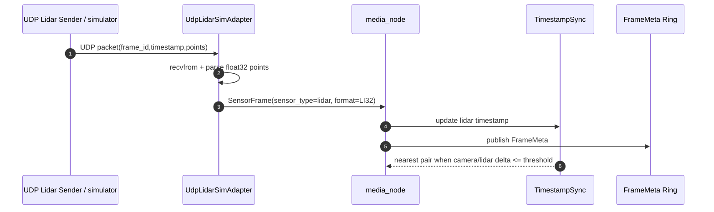
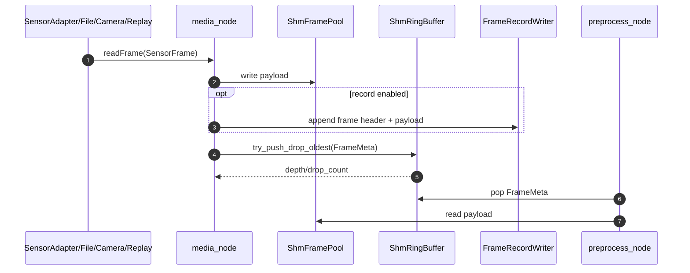
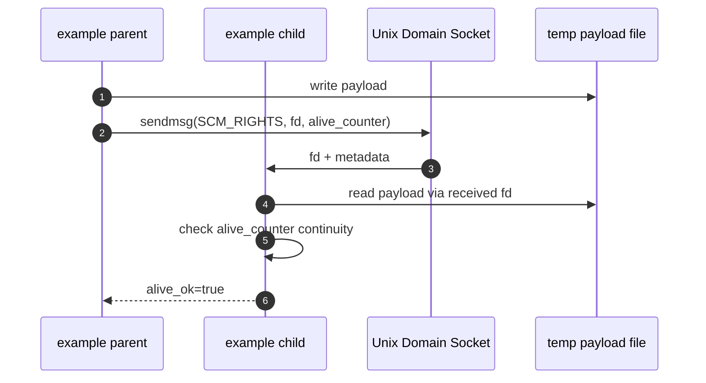
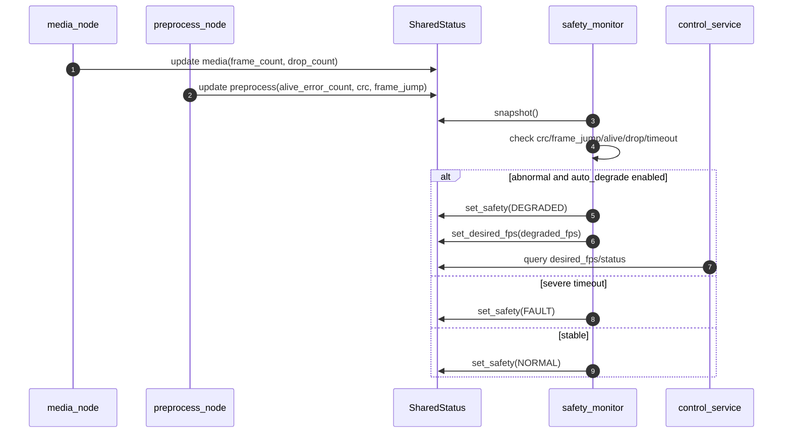
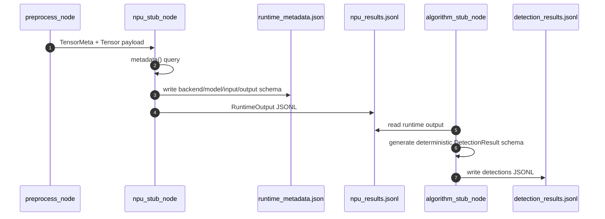

# AutoVision Mini Middleware V1.9 Feature Pack：完整合并任务书（新增中间件补强功能 + 主工程完整代码）

> 版本定位：V1.9 Feature Pack 是在远端 `v1.8-vm-visual-perf-framelease` 最新代码与上传的 V1.8 完整任务书基础上继续推进的岗位补强版本。该版本不推翻 V1.8 已有的真实 USB Camera、YUYV fused preprocess、ResizeIndexPlan、FrameLeasePool、CSV/HTML benchmark 主线，而是在当前工程上补齐 Lidar UDP 输入、多传感器时间戳近似同步、队列水位与丢弃统计、record/replay、Unix fd passing 示例、alive_counter 校验与自动降级、NV12/libyuv-compatible 前处理后端、RuntimeMetadata/RKNN-like IO query mock、DetectionResult schema、algorithm_stub_node、RAII 与 CPU affinity/priority benchmark。

> 本任务书对应工程包：`autovision_mini_middleware_v1_v1_9_featurepack`。我已在当前 Linux 容器中完成 CMake 主工程编译、文件输入端到端回归、examples 00～19 编译、新增 examples 15～19 运行、V1.8 benchmark 回归、record/replay demo、algorithm_stub_node、CPU affinity/priority benchmark。当前 Linux 容器无 `/dev/video0`，因此真实 USB Camera、GStreamer Camera baseline、香橙派 5 Plus / ARM64 / RGA / RKNN 真实 SDK 仍需你在 VMware Ubuntu 或开发板侧继续验证。

---

## 0. 版本来源与真实性边界

### 0.1 已核对的 V1.8 基线

本版本以当前远端分支 `v1.8-vm-visual-perf-framelease` 为基线。已核对到的 V1.8 基线事实包括：

1. README 明确版本为 V1.8 VM Performance Optimization。
2. V1.8 已包含三项主线：plan-based preprocess、FrameLeasePool、performance observability。
3. V1.8 README 中的文件输入回归命令仍以 `./scripts/run_all_vm.sh` 和 `status=NORMAL fps=30 media_frames=120 preprocess_frames=120 npu_frames=120` 为验收基线。
4. V1.8 README 明确不宣称 DMA-BUF zero-copy、真实 RKNN 推理或 ISO 26262 级功能安全。
5. 远端 `CMakeLists.txt` 已确认 `image_preprocess.cpp` 和 `frame_lease.cpp` 纳入 `avm_common`，主可执行程序包括 `media_node`、`preprocess_node`、`npu_stub_node`、`safety_monitor`、`control_service`、`control_client`。

### 0.2 本次新增功能边界

```text
1. UdpLidarSimAdapter 是 UDP 包级 Lidar 模拟输入，不是真实 Lidar SDK。
2. TimestampSync 是 Camera/Lidar 时间戳近似同步示例，不是量产级多传感器同步系统。
3. queue depth/drop count 是 SHM Ring 层面的水位与覆盖丢弃统计，不是完整 QoS 框架。
4. record/replay 是本工程私有二进制帧记录格式，不是 rosbag/mcap。
5. fd passing example 使用 Unix Domain Socket + SCM_RIGHTS 传递普通文件 fd，用于铺垫 DMA-BUF fd passing；不宣称真实 DMA-BUF。
6. Alive Counter 校验与自动降级属于 watchdog/E2E protection 学习版，不是 ISO 26262 ASIL 认证实现。
7. libyuv backend 当前实现为 libyuv-compatible CPU fallback 接口；不强制依赖系统 libyuv 包，避免破坏 VMware 可编译性。
8. RKNN-like IO query mock 只模拟 SDK 查询模型输入输出信息；不链接真实 RKNN SDK。
9. algorithm_stub_node 输出 DetectionResult schema，用于补算法平台接口；不实现真实检测算法。
10. CPU affinity/priority benchmark 可以在普通用户态运行；非 root 环境下 FIFO 实时优先级设置失败是预期行为，脚本已做 fallback。
```

---

## 1. 项目背景

AutoVision Mini Middleware 是一个面向自动驾驶中间件岗位的最小视觉链路工程。它的目标不是训练高精度感知模型，而是围绕芯片侧/自动驾驶中间件岗位最常见的工程问题做最小闭环：传感器输入抽象、V4L2 Camera 接入、大帧 payload 跨进程传输、FrameMeta/TensorMeta 元数据流转、前处理算子、Runtime/NPU 接口抽象、控制面与数据面分离、heartbeat/CRC/frame_id/alive_counter/timeout 监控、性能日志与可复现测试。

V1 已完成文件输入闭环；V1.5 接入真实 USB UVC Camera；V1.6 增加 YUYV raw + fused preprocess；V1.8 合并 plan-based preprocess、FrameLeasePool 和 CSV/HTML 性能可视化。本 V1.9 Feature Pack 继续补齐岗位关键词中此前相对薄弱的 Lidar UDP 输入、多传感器同步、record/replay、fd passing、alive_counter、NV12、RuntimeMetadata、DetectionResult、RAII 和调度/CPU 亲和性验证。

---

## 2. 版本目标

### 2.1 总目标

在不破坏 V1.8 已验证链路的基础上，新增一组可在 VMware Ubuntu/Linux 容器中编译和测试的中间件补强模块，使项目从“视觉链路性能优化”进一步升级为“传感器抽象 + 数据面 QoS + 安全监控 + Runtime 元信息 + 算法平台 schema + 系统调度 benchmark”的岗位展示版本。

### 2.2 新增目标清单

| 编号 | 功能 | 本版本落地内容 | 岗位对应价值 |
|---:|---|---|---|
| 1 | `UdpLidarSimAdapter + TimestampSync` | 新增 UDP Lidar 输入适配器、UDP packet sender 示例、Camera/Lidar 近似同步工具 | 补齐 Lidar 传感器抽象和多传感器时间戳意识 |
| 2 | `queue depth/drop count + record/replay` | Ring 增加 depth/capacity/drop_count/try_push_drop_oldest；media_node 支持 record/replay | 补媒体中间件 QoS、问题复现、数据闭环能力 |
| 3 | `fd passing example + alive_counter 校验` | 新增 SCM_RIGHTS fd passing 工具和 example 15；preprocess_node 校验 alive_counter 连续性 | 补通信中间件、DMA-BUF 铺垫、E2E protection |
| 4 | `Alive Counter + 自动降级策略` | safety_monitor 检查 alive_error/drop_count 并支持 `--auto-degrade --degraded-fps` | 补功能安全降级策略 |
| 5 | `libyuv backend + NV12 preprocess` | 新增 `kFormatNv12`、NV12 resize/normalize、backend 参数 `cpu/libyuv` | 补 ISP/RGA/NPU 常见 NV12 输入格式 |
| 6 | `RuntimeMetadata + RKNN-like IO query mock` | RuntimeMetadata schema、dummy/rknn_stub metadata、runtime_metadata.json | 补真实 NPU SDK 的 IO query 思维 |
| 7 | `DetectionResult schema + algorithm_stub_node` | detection bbox/class/score schema，算法桩节点从 RuntimeOutput 生成检测结果 | 补算法平台级接口输出 |
| 8 | `RAII 重构 + CPU affinity/priority benchmark` | UniqueFd/MmapRegion、fd passing/IPC 局部 RAII；system_tuning 和 benchmark example | 补 Linux 系统编程、资源管理、调度调优 |

---

## 3. 工程目录

```text
autovision_mini_middleware_v1/
├── docs/
│   └── validation_v1_9_featurepack.md
├── examples/
│   ├── cpp/
│   │   ├── 00_crc32.cpp
│   │   ├── 01_latency_profiler.cpp
│   │   ├── 02_control_cmd.cpp
│   │   ├── 03_file_adapter.cpp
│   │   ├── 04_lidar_sim_adapter.cpp
│   │   ├── 05_shm_frame_pool.cpp
│   │   ├── 06_shm_ring_buffer.cpp
│   │   ├── 07_shared_status.cpp
│   │   ├── 08_frame_consumer.cpp
│   │   ├── 08_frame_producer.cpp
│   │   ├── 09_sensor_to_shm.cpp
│   │   ├── 10_control_query.cpp
│   │   ├── 11_camera_adapter_v4l2.cpp
│   │   ├── 12_yuyv_fused_preprocess.cpp
│   │   ├── 13_preprocess_benchmark_compare.cpp
│   │   ├── 14_frame_lease_pool.cpp
│   │   ├── 15_fd_passing_alive_counter.cpp
│   │   ├── 16_udp_lidar_timestamp_sync.cpp
│   │   ├── 17_nv12_libyuv_preprocess.cpp
│   │   ├── 18_runtime_metadata_detection.cpp
│   │   └── 19_affinity_priority_benchmark.cpp
│   ├── Makefile
│   └── README.md
├── include/
│   ├── avm_config.hpp
│   ├── camera_adapter_v4l2.hpp
│   ├── control_cmd.hpp
│   ├── crc32.hpp
│   ├── detection_result.hpp
│   ├── dummy_runtime.hpp
│   ├── fd_passing.hpp
│   ├── file_adapter.hpp
│   ├── frame_lease.hpp
│   ├── frame_meta.hpp
│   ├── image_preprocess.hpp
│   ├── inference_runtime.hpp
│   ├── latency_profiler.hpp
│   ├── lidar_sim_adapter.hpp
│   ├── raii_fd.hpp
│   ├── record_replay.hpp
│   ├── rknn_runtime_stub.hpp
│   ├── runtime_config.hpp
│   ├── runtime_factory.hpp
│   ├── runtime_metadata.hpp
│   ├── runtime_output.hpp
│   ├── safety_status.hpp
│   ├── sensor_adapter.hpp
│   ├── sensor_frame.hpp
│   ├── shared_status.hpp
│   ├── shm_frame_pool.hpp
│   ├── shm_ring_buffer.hpp
│   ├── system_tuning.hpp
│   ├── tensor_meta.hpp
│   ├── time_utils.hpp
│   ├── timestamp_sync.hpp
│   └── udp_lidar_sim_adapter.hpp
├── scripts/
│   ├── benchmark_affinity_priority.sh
│   ├── benchmark_gstreamer_camera.sh
│   ├── benchmark_v1_7_camera_compare.sh
│   ├── benchmark_v1_7_synthetic_compare.sh
│   ├── benchmark_v1_8_vm_perf_opt.sh
│   ├── benchmark_v1_9_featurepack.sh
│   ├── build.sh
│   ├── check_usb_camera_v1_5.sh
│   ├── clean_ipc.sh
│   ├── collect_report.sh
│   ├── format.sh
│   ├── inject_fault.sh
│   ├── prepare_input.sh
│   ├── profile_preprocess_perf.sh
│   ├── run_all_vm.sh
│   ├── run_camera_pipeline.sh
│   ├── run_camera_pipeline_yuyv_fused.sh
│   ├── run_file_pipeline.sh
│   ├── run_record_replay_demo.sh
│   └── visualize_perf_compare.py
├── src/
│   ├── algorithm_stub_node.cpp
│   ├── camera_adapter_v4l2.cpp
│   ├── control_client.cpp
│   ├── control_service.cpp
│   ├── crc32.cpp
│   ├── detection_result.cpp
│   ├── dummy_runtime.cpp
│   ├── fd_passing.cpp
│   ├── file_adapter.cpp
│   ├── frame_lease.cpp
│   ├── image_preprocess.cpp
│   ├── latency_profiler.cpp
│   ├── lidar_sim_adapter.cpp
│   ├── media_node.cpp
│   ├── npu_stub_node.cpp
│   ├── preprocess_node.cpp
│   ├── record_replay.cpp
│   ├── rknn_runtime_stub.cpp
│   ├── runtime_factory.cpp
│   ├── runtime_metadata.cpp
│   ├── safety_monitor.cpp
│   ├── shared_status.cpp
│   ├── shm_frame_pool.cpp
│   ├── shm_ring_buffer.cpp
│   ├── system_tuning.cpp
│   ├── timestamp_sync.cpp
│   └── udp_lidar_sim_adapter.cpp
├── .gitignore
├── CMakeLists.txt
└── README.md
```

---

## 4. 模块设计

### 4.1 主进程划分

| 进程 | 类型 | 主要职责 | 输入 | 输出 |
|---|---|---|---|
| `media_node` | producer | 读取 File/Camera/LidarSim/UdpLidarSim/Replay，写 FramePool，发布 FrameMeta，可选 record | SensorAdapter | FrameMeta Ring + FramePool + RuntimeStatus + record file |
| `preprocess_node` | consumer + producer | 读取 FrameMeta，校验 CRC/frame_id/alive_counter，执行 RGB/YUYV/NV12 前处理，输出 TensorMeta | FrameMeta Ring + FramePool | TensorPool + TensorMeta Ring + preprocess CSV + RuntimeStatus |
| `npu_stub_node` | consumer | 读取 TensorMeta，通过 dummy/rknn_stub Runtime 模拟推理，输出 RuntimeOutput JSONL 和 RuntimeMetadata | TensorMeta Ring + TensorPool | `logs/npu_results.jsonl` + `logs/runtime_metadata.json` |
| `algorithm_stub_node` | offline/consumer | 消费 RuntimeOutput JSONL，生成 DetectionResult JSONL schema | `logs/npu_results.jsonl` | `logs/detection_results.jsonl` |
| `safety_monitor` | monitor | 检查 heartbeat、CRC、frame jump、alive_counter、drop_count、timeout，必要时自动降级 FPS | RuntimeStatus SHM | NORMAL/DEGRADED/FAULT + desired_fps |
| `control_service` | service | Unix Domain Socket 控制服务 | client command | status/fps/error response |
| `control_client` | client | 命令行查询/设置控制面 | CLI command | control_service response |

### 4.2 关键新增数据结构

| 数据结构 | 文件 | 作用 |
|---|---|---|
| `UniqueFd` / `MmapRegion` | `include/raii_fd.hpp` | 用 RAII 管理 fd 和 mmap 生命周期，减少资源泄漏风险 |
| `UdpLidarSimAdapter` | `include/udp_lidar_sim_adapter.hpp` | UDP packet 级 Lidar 模拟输入，输出统一 SensorFrame |
| `TimestampSync` | `include/timestamp_sync.hpp` | 在 Camera/Lidar 时间戳之间做 nearest-neighbor 近似同步 |
| `FrameRecordWriter/Reader` | `include/record_replay.hpp` | 将 SensorFrame 写入私有 record 文件并支持 replay |
| `RuntimeMetadata` / `RuntimeTensorInfo` | `include/runtime_metadata.hpp` | 描述 Runtime backend、model、input/output tensor shape/type/layout |
| `DetectionResult` / `DetectionObject` | `include/detection_result.hpp` | 定义感知结果 schema，输出 bbox/class/score JSONL |
| `FdPassingMessage` | `include/fd_passing.hpp` | 封装 Unix Domain Socket SCM_RIGHTS fd passing 示例 |
| `AffinityResult` / `PriorityResult` | `include/system_tuning.hpp` | 封装 CPU affinity 和 priority 设置结果 |

---

## 5. 数据流 / 控制流 / 安全监控时序图

### 5.1 UdpLidarSimAdapter + TimestampSync



### 5.2 queue depth/drop count + record/replay



### 5.3 fd passing + alive_counter



### 5.4 Alive Counter 自动降级策略



### 5.5 RuntimeMetadata + DetectionResult



---

## 6. scripts 脚本体系

| 脚本 | 作用 | 是否新增 | 预期输出 |
|---|---|---:|---|
| `scripts/build.sh` | CMake 主工程编译 | 否 | `[build] done` |
| `scripts/prepare_input.sh` | 生成 640×480 RGB raw 测试输入 | 否 | `assets/input_640x480_rgb.raw` |
| `scripts/run_all_vm.sh` | 文件输入端到端回归 | 否 | `status=NORMAL ... 120/120/120` |
| `scripts/benchmark_v1_8_vm_perf_opt.sh` | V1.8 preprocess/FrameLease benchmark | 否 | CSV/HTML/FrameLease CSV |
| `scripts/run_record_replay_demo.sh` | record/replay 闭环测试 | 是 | record 文件 + replay pipeline NORMAL |
| `scripts/benchmark_affinity_priority.sh` | CPU affinity/priority benchmark | 是 | `logs/benchmark_v1_9/affinity_priority.csv` |
| `scripts/benchmark_v1_9_featurepack.sh` | V1.9 一键回归验证 | 是 | PASS/WAIT_USER_VMWARE_OR_BOARD 摘要 |

---

## 7. examples 测试体系

| 示例 | 测试目标 | 是否依赖摄像头 | 预期输出 |
|---|---|---:|---|
| `00_crc32` | CRC32 校验函数 | 否 | 固定 payload CRC |
| `01_latency_profiler` | 延迟统计 mean/p95 | 否 | samples/mean/p95 |
| `02_control_cmd` | 控制命令解析 | 否 | QUERY_STATUS/SET_FPS 等解析结果 |
| `03_file_adapter` | 文件输入 SensorFrame | 否 | RGB frame metadata |
| `04_lidar_sim_adapter` | 原有 LidarSim 输入 | 否 | float32 points |
| `05_shm_frame_pool` | 共享内存 FramePool | 否 | write/read payload 正常 |
| `06_shm_ring_buffer` | 元数据 RingBuffer | 否 | push/pop FrameMeta 正常 |
| `07_shared_status` | 共享状态区 | 否 | fps/state/frame counters 正常 |
| `08_frame_ipc` | 双进程 FramePool + Ring IPC | 否 | 5 帧 crc_ok=true |
| `09_sensor_to_shm` | FileAdapter 到 SHM | 否 | crc_ok=true |
| `10_control_query` | 控制面查询 | 否，需要 control_service | status=NORMAL |
| `11_camera_adapter_v4l2` | 真实 USB Camera 单模块采集 | 是 | 30 帧并保存 PPM |
| `12_yuyv_fused_preprocess` | 合成 YUYV 前处理 | 否 | mean/p95/tensor_mean |
| `13_preprocess_benchmark_compare` | RGB/YUYV baseline vs plan | 否 | CSV + mean latency |
| `14_frame_lease_pool` | FrameLease 生命周期 | 否 | acquire/publish/release/reclaim |
| `15_fd_passing_alive_counter` | Unix fd passing + alive_counter | 否 | child 读取 fd payload 且 alive_ok=true |
| `16_udp_lidar_timestamp_sync` | UDP Lidar + TimestampSync | 否 | lidar points + synced delta |
| `17_nv12_libyuv_preprocess` | NV12 + libyuv-compatible backend | 否 | backend=libyuv_compat + tensor output |
| `18_runtime_metadata_detection` | RuntimeMetadata + DetectionResult schema | 否 | metadata JSON + detection JSON |
| `19_affinity_priority_benchmark` | CPU affinity/priority benchmark | 否 | elapsed_ms + affinity/priority result |

---

## 8. 运行命令与预期输出

### 8.1 主工程编译

```bash
cd ~/projects/autovision_mini_middleware_v1
chmod +x scripts/*.sh
./scripts/build.sh
```

预期：

```text
[100%] Built target media_node
[100%] Built target preprocess_node
[100%] Built target npu_stub_node
[100%] Built target algorithm_stub_node
[build] done
```

### 8.2 文件输入端到端回归

```bash
./scripts/prepare_input.sh
./scripts/run_all_vm.sh
cat logs/final_status.txt
```

预期：

```text
status=NORMAL fps=30 media_frames=120 preprocess_frames=120 npu_frames=120 error_code=0 text="NORMAL"
```

### 8.3 新增 examples 15～19

```bash
cd examples
make clean || true
make all
make run EXAMPLE=15_fd_passing_alive_counter
make run EXAMPLE=16_udp_lidar_timestamp_sync
make run EXAMPLE=17_nv12_libyuv_preprocess
make run EXAMPLE=18_runtime_metadata_detection
make run EXAMPLE=19_affinity_priority_benchmark
```

预期关键输出：

```text
[15_fd_passing_alive_counter:child] ... alive_ok=true
[16_udp_lidar_timestamp_sync] ... points=8 synced_delta_ns=1000000
[17_nv12_libyuv_preprocess] backend=libyuv_compat input_format=NV12 ...
[18_runtime_metadata_detection] metadata_json={...}
[19_affinity_priority_benchmark] cpu=-1 priority=0 affinity_ok=true ...
```

### 8.4 record/replay demo

```bash
./scripts/run_record_replay_demo.sh 30
```

预期：

```text
record_replay=PASS
logs/record_replay_demo.avmr
logs/replay_preprocess.csv
```

### 8.5 algorithm_stub_node

```bash
./build/algorithm_stub_node --input logs/npu_results.jsonl --output logs/detection_results.jsonl
head -n 1 logs/detection_results.jsonl
```

预期：输出包含 `frame_id`、`objects`、`bbox`、`score`、`class_name`、`source_backend` 等字段的 JSONL。

### 8.6 V1.9 一键回归

```bash
./scripts/benchmark_v1_9_featurepack.sh 10
```

本地实际输出摘要：

```text
main_build=PASS
file_pipeline=PASS
algorithm_stub=PASS
examples_15_19=PASS
record_replay=PASS
affinity_priority=PASS_WITH_NON_ROOT_PRIORITY_FALLBACK
real_camera=WAIT_USER_VMWARE_OR_BOARD
```

---

## 9. 验收标准

### 9.1 当前 Linux 环境已验证

```text
1. ./scripts/build.sh 编译通过。
2. ./scripts/run_all_vm.sh 文件输入端到端回归 NORMAL，media/preprocess/npu = 120/120/120。
3. examples 00～19 全部编译通过。
4. examples 15～19 全部运行通过。
5. V1.8 benchmark_v1_8_vm_perf_opt.sh 回归通过。
6. algorithm_stub_node 生成 DetectionResult JSONL 通过。
7. run_record_replay_demo.sh record/replay 闭环通过。
8. benchmark_affinity_priority.sh 运行通过；非 root FIFO priority fallback 属于预期。
9. benchmark_v1_9_featurepack.sh 输出 main_build/file_pipeline/algorithm_stub/examples_15_19/record_replay/affinity_priority 均 PASS 或预期 fallback。
```

### 9.2 等待你在 VMware Ubuntu 验证

```text
1. /dev/video0 USB Camera RGB pipeline。
2. /dev/video0 USB Camera YUYV fused pipeline。
3. Camera RGB/YUYV 与 GStreamer baseline 横向对比。
4. 真实摄像头场景下 queue depth/drop_count 是否稳定为 0 或可解释。
5. perf/stat 工具在你的内核版本下是否可用。
6. 30min/1h soak test 中 heartbeat、alive_counter、drop_count 是否持续稳定。
```

### 9.3 等待香橙派 5 Plus / ARM64 验证

```text
1. ARM64 编译。
2. USB UVC Camera RGB/YUYV pipeline。
3. CPU 温度、CPU 占用、内存、p95 latency。
4. 是否替换 libyuv-compatible CPU fallback 为真实 libyuv/RGA backend。
5. 是否接入真实 RKNN SDK，替换 rknn_stub metadata mock。
6. 是否在真实硬件上做 DMA-BUF fd passing，而不是普通文件 fd passing 示例。
```

---

## 10. Git 提交建议

```bash
cd ~/projects/autovision_mini_middleware_v1

git checkout v1.8-vm-visual-perf-framelease
git pull
git checkout -b v1.9-middleware-featurepack

git add include/raii_fd.hpp include/udp_lidar_sim_adapter.hpp include/timestamp_sync.hpp src/udp_lidar_sim_adapter.cpp src/timestamp_sync.cpp src/media_node.cpp CMakeLists.txt
git commit -m "v1.9-step1: add UDP lidar adapter and timestamp sync"

git add include/record_replay.hpp src/record_replay.cpp include/shm_ring_buffer.hpp src/shm_ring_buffer.cpp scripts/run_record_replay_demo.sh
git commit -m "v1.9-step2: add queue depth drop stats and record replay"

git add include/fd_passing.hpp src/fd_passing.cpp examples/cpp/15_fd_passing_alive_counter.cpp examples/Makefile
git commit -m "v1.9-step3: add unix fd passing example and alive counter check"

git add include/safety_status.hpp include/shared_status.hpp src/shared_status.cpp src/preprocess_node.cpp src/safety_monitor.cpp
git commit -m "v1.9-step4: add alive counter monitoring and auto degrade policy"

git add include/image_preprocess.hpp src/image_preprocess.cpp examples/cpp/17_nv12_libyuv_preprocess.cpp
git commit -m "v1.9-step5: add NV12 preprocess and libyuv-compatible backend"

git add include/runtime_metadata.hpp src/runtime_metadata.cpp include/inference_runtime.hpp include/dummy_runtime.hpp src/dummy_runtime.cpp include/rknn_runtime_stub.hpp src/rknn_runtime_stub.cpp src/npu_stub_node.cpp
git commit -m "v1.9-step6: add runtime metadata and rknn-like io query mock"

git add include/detection_result.hpp src/detection_result.cpp src/algorithm_stub_node.cpp examples/cpp/18_runtime_metadata_detection.cpp
git commit -m "v1.9-step7: add detection result schema and algorithm stub node"

git add include/system_tuning.hpp src/system_tuning.cpp examples/cpp/19_affinity_priority_benchmark.cpp scripts/benchmark_affinity_priority.sh scripts/benchmark_v1_9_featurepack.sh README.md docs/validation_v1_9_featurepack.md
git commit -m "v1.9-step8: add raii utilities affinity priority benchmark and validation"

git add docs/AutoVision_Mini_Middleware_V1_9_完整合并任务书_新增中间件补强功能_含主工程完整代码.md
git commit -m "v1.9-step9: add complete V1.9 feature pack task document"

git push -u origin v1.9-middleware-featurepack
```

---

## 11. 后续版本路线

| 版本 | 目标 | 说明 |
|---|---|---|
| V1.9 当前版 | 中间件岗位补强功能 | UDP Lidar、TimestampSync、drop stats、record/replay、fd passing、alive_counter、NV12、RuntimeMetadata、DetectionResult、affinity benchmark |
| V1.10 | 长稳压测与报告生成 | 30min/1h soak test、CPU/mem/temp、自动 Markdown/HTML 报告 |
| V2.0 | 香橙派 5 Plus ARM64 移植 | 板端编译、USB Camera、CPU/温度/延迟对比 |
| V2.1 | 真实 libyuv/RGA backend | 若 CPU 前处理成为瓶颈，引入真实 libyuv 或 RK RGA |
| V2.2 | DMA-BUF/fd passing 原型 | 在真实 V4L2/RGA/NPU 支持下验证 VIDIOC_EXPBUF + SCM_RIGHTS |
| V2.3 | 真实 RKNN Runtime | 用真实 RKNN SDK 替换 RKNN-like mock |
| V3.0 | MIPI CSI / ISP / NPU 端到端 | 面向板端完整视觉链路，不再局限 USB UVC |

---

## 12. 主工程完整代码

以下为 V1.9 Feature Pack 当前工程完整文本代码。运行产物 `build/`、`logs/`、`assets/`、`examples/bin/`、`examples/logs/` 不应提交。


### `.gitignore`

```text
build/
assets/
logs/
examples/bin/
examples/logs/
docs/performance_report.md
compile_commands.json
.vscode/
*.o
*.a
*.so
```

### `CMakeLists.txt`

```cmake
cmake_minimum_required(VERSION 3.16)
project(autovision_mini_middleware_v1 LANGUAGES CXX)

set(CMAKE_CXX_STANDARD 17)
set(CMAKE_CXX_STANDARD_REQUIRED ON)
set(CMAKE_CXX_EXTENSIONS OFF)
set(CMAKE_EXPORT_COMPILE_COMMANDS ON)

add_compile_options(-Wall -Wextra -Wpedantic -O2)

include_directories(include)

add_library(avm_common
    src/crc32.cpp
    src/latency_profiler.cpp
    src/image_preprocess.cpp
    src/frame_lease.cpp
    src/record_replay.cpp
    src/timestamp_sync.cpp
    src/runtime_metadata.cpp
    src/detection_result.cpp
    src/fd_passing.cpp
    src/system_tuning.cpp
    src/shared_status.cpp
    src/shm_frame_pool.cpp
    src/shm_ring_buffer.cpp
)

target_link_libraries(avm_common pthread rt)

add_executable(media_node
    src/media_node.cpp
    src/file_adapter.cpp
    src/lidar_sim_adapter.cpp
    src/udp_lidar_sim_adapter.cpp
    src/camera_adapter_v4l2.cpp
)
target_link_libraries(media_node avm_common)

add_executable(preprocess_node src/preprocess_node.cpp)
target_link_libraries(preprocess_node avm_common)

add_executable(npu_stub_node
    src/npu_stub_node.cpp
    src/dummy_runtime.cpp
    src/rknn_runtime_stub.cpp
    src/runtime_factory.cpp
)
target_link_libraries(npu_stub_node avm_common)

add_executable(algorithm_stub_node src/algorithm_stub_node.cpp)
target_link_libraries(algorithm_stub_node avm_common)

add_executable(safety_monitor src/safety_monitor.cpp)
target_link_libraries(safety_monitor avm_common)

add_executable(control_service src/control_service.cpp)
target_link_libraries(control_service avm_common)

add_executable(control_client src/control_client.cpp)
target_link_libraries(control_client avm_common)

```

### `README.md`

```markdown
# AutoVision Mini Middleware V1.9 Feature Pack

AutoVision Mini Middleware is a minimal Linux/C++17 vision-middleware project for autonomous-driving middleware roles.

This package is based on the V1.8 `v1.8-vm-visual-perf-framelease` code line and adds the next middleware-oriented functions:

1. `UdpLidarSimAdapter` and `TimestampSync` for UDP-based simulated lidar input and approximate camera/lidar sync.
2. Ring queue `depth/drop_count`, `drop_oldest` policy, and binary `record/replay`.
3. Unix domain socket `SCM_RIGHTS` fd passing example plus `alive_counter` validation.
4. Safety monitor alive-counter detection and automatic degraded FPS policy.
5. NV12 preprocess and dependency-free `libyuv_compat` backend entry.
6. `RuntimeMetadata` and RKNN-like IO query mock.
7. `DetectionResult` schema and `algorithm_stub_node`.
8. RAII fd/mmap utilities and CPU affinity/priority benchmark.

## Build

```bash
chmod +x scripts/*.sh
./scripts/build.sh
```

## File-input regression

```bash
./scripts/prepare_input.sh
./scripts/run_all_vm.sh
cat logs/final_status.txt
```

Expected:

```text
status=NORMAL fps=30 media_frames=120 preprocess_frames=120 npu_frames=120 error_code=0 text="NORMAL"
```

## New feature validation

```bash
cd examples
make all
make run EXAMPLE=15_fd_passing_alive_counter
make run EXAMPLE=16_udp_lidar_timestamp_sync
make run EXAMPLE=17_nv12_libyuv_preprocess
make run EXAMPLE=18_runtime_metadata_detection
make run EXAMPLE=19_affinity_priority_benchmark
```

One-shot validation:

```bash
./scripts/benchmark_v1_9_featurepack.sh 10
```

Expected summary:

```text
main_build=PASS
file_pipeline=PASS
algorithm_stub=PASS
examples_15_19=PASS
record_replay=PASS
affinity_priority=PASS_WITH_NON_ROOT_PRIORITY_FALLBACK
real_camera=WAIT_USER_VMWARE_OR_BOARD
```

## Camera verification on VMware Ubuntu

```bash
./scripts/check_usb_camera_v1_5.sh /dev/video0
./scripts/run_camera_pipeline.sh /dev/video0 300 640 480 30 dummy rgb
./scripts/run_camera_pipeline_yuyv_fused.sh /dev/video0 300 640 480 30 dummy
```

This repository still uses POSIX SHM + memcpy. It does not claim production DMA-BUF zero-copy, real RKNN inference, real lidar driver, or ISO 26262 compliance.

```

### `include/avm_config.hpp`

```cpp
/**
 * @file avm_config.hpp
 * @brief 全局配置常量：共享内存名称、缓冲区大小、Ring 容量、控制 Socket 路径和像素格式。
 */
#pragma once

#include <cstddef>
#include <cstdint>

namespace avm {

constexpr const char* kFramePoolName = "/avm_frame_pool";
constexpr const char* kFrameMetaRingName = "/avm_frame_meta_ring";
constexpr const char* kTensorPoolName = "/avm_tensor_pool";
constexpr const char* kTensorMetaRingName = "/avm_tensor_meta_ring";
constexpr const char* kStatusName = "/avm_runtime_status";
constexpr const char* kControlSockPath = "/tmp/avm_control.sock";

constexpr std::uint32_t kDefaultWidth = 640;
constexpr std::uint32_t kDefaultHeight = 480;
constexpr std::uint32_t kDefaultChannels = 3;
constexpr std::uint32_t kDefaultFps = 30;

constexpr std::size_t kFramePoolCount = 8;
constexpr std::size_t kFrameBufferSize = 1280 * 720 * 3;

constexpr std::uint32_t kTensorWidth = 320;
constexpr std::uint32_t kTensorHeight = 320;
constexpr std::uint32_t kTensorChannels = 3;
constexpr std::size_t kTensorPoolCount = 8;
constexpr std::size_t kTensorBufferSize = kTensorWidth * kTensorHeight * kTensorChannels * sizeof(float);

constexpr std::size_t kRingCapacity = 64;

constexpr std::uint32_t kFormatRgb888 = 0x52474238U;       // 'RGB8'
constexpr std::uint32_t kFormatYuyv = 0x59555956U;         // 'YUYV'
constexpr std::uint32_t kFormatNv12 = 0x4E563132U;         // 'NV12'
constexpr std::uint32_t kFormatLidarFloat32 = 0x4C493332U; // 'LI32'

}  // namespace avm
```

### `include/camera_adapter_v4l2.hpp`

```cpp
/**
 * @file camera_adapter_v4l2.hpp
 * @brief V4L2 USB UVC 摄像头适配器：使用 ioctl + mmap 采集 YUYV，可输出 YUYV raw 或 RGB888 SensorFrame。
 */
#pragma once

#include "sensor_adapter.hpp"

#include <cstddef>
#include <cstdint>
#include <string>
#include <vector>

enum class CameraOutputFormat : std::uint32_t {
    RGB888 = 0,
    YUYV = 1
};

class CameraAdapterV4L2 final : public SensorAdapter {
public:
    CameraAdapterV4L2(std::string device,
                      std::uint32_t width,
                      std::uint32_t height,
                      std::uint32_t fps = 30,
                      CameraOutputFormat output_format = CameraOutputFormat::RGB888);
    ~CameraAdapterV4L2() override;

    bool open() override;
    bool start() override;
    bool readFrame(SensorFrame& frame) override;
    void stop() override;

private:
    struct Buffer {
        void* start = nullptr;
        std::size_t length = 0;
    };

    bool query_capability();
    bool set_format_yuyv();
    bool set_fps();
    bool init_mmap();
    bool queue_all_buffers();
    bool stream_on();
    bool stream_off();
    bool dequeue_buffer(std::uint32_t& index, std::size_t& bytes_used);
    bool requeue_buffer(std::uint32_t index);
    void cleanup_mmap();

    static int xioctl(int fd, unsigned long request, void* arg);
    static std::uint8_t clamp_to_u8(int value);
    static void yuyv_to_rgb888(const std::uint8_t* yuyv,
                               std::uint8_t* rgb,
                               std::uint32_t width,
                               std::uint32_t height,
                               std::uint32_t bytes_per_line);
    static void copy_yuyv_compact(const std::uint8_t* yuyv,
                                  std::uint8_t* compact,
                                  std::uint32_t width,
                                  std::uint32_t height,
                                  std::uint32_t bytes_per_line);

    std::string device_;
    std::uint32_t width_ = 0;
    std::uint32_t height_ = 0;
    std::uint32_t fps_ = 30;
    CameraOutputFormat output_format_ = CameraOutputFormat::RGB888;
    std::uint32_t bytes_per_line_ = 0;
    std::uint32_t size_image_ = 0;

    int fd_ = -1;
    std::vector<Buffer> buffers_;
    std::uint64_t next_frame_id_ = 1;
    bool opened_ = false;
    bool started_ = false;
};
```

### `include/control_cmd.hpp`

```cpp
/**
 * @file control_cmd.hpp
 * @brief 控制面命令解析：将字符串命令转换为枚举命令。
 */
#pragma once

#include <algorithm>
#include <string>

enum class ControlCmd {
    START_CAMERA,
    STOP_CAMERA,
    SET_FPS,
    QUERY_STATUS,
    QUERY_FRAME_COUNT,
    QUERY_ERROR_CODE,
    UNKNOWN
};

inline ControlCmd parse_control_cmd(std::string text) {
    const auto pos = text.find(' ');
    std::string head = (pos == std::string::npos) ? text : text.substr(0, pos);
    head.erase(std::remove(head.begin(), head.end(), '\n'), head.end());
    head.erase(std::remove(head.begin(), head.end(), '\r'), head.end());

    if (head == "START_CAMERA") {
        return ControlCmd::START_CAMERA;
    }
    if (head == "STOP_CAMERA") {
        return ControlCmd::STOP_CAMERA;
    }
    if (head == "SET_FPS") {
        return ControlCmd::SET_FPS;
    }
    if (head == "QUERY_STATUS") {
        return ControlCmd::QUERY_STATUS;
    }
    if (head == "QUERY_FRAME_COUNT") {
        return ControlCmd::QUERY_FRAME_COUNT;
    }
    if (head == "QUERY_ERROR_CODE") {
        return ControlCmd::QUERY_ERROR_CODE;
    }
    return ControlCmd::UNKNOWN;
}
```

### `include/crc32.hpp`

```cpp
/**
 * @file crc32.hpp
 * @brief CRC32 校验函数声明：用于帧完整性检查和异常注入验证。
 */
#pragma once

#include <cstddef>
#include <cstdint>

std::uint32_t crc32_compute(const void* data, std::size_t length);
```

### `include/detection_result.hpp`

```cpp

/**
 * @file detection_result.hpp
 * @brief DetectionResult schema for algorithm platform stub output.
 */
#pragma once

#include "runtime_output.hpp"

#include <cstdint>
#include <string>
#include <vector>

struct DetectionBox {
    float x1 = 0.0F;
    float y1 = 0.0F;
    float x2 = 0.0F;
    float y2 = 0.0F;
    float score = 0.0F;
    std::uint32_t class_id = 0;
    std::string label = "object";
};

struct DetectionResult {
    std::uint64_t frame_id = 0;
    std::uint64_t timestamp_ns = 0;
    std::string source_backend;
    std::vector<DetectionBox> boxes;

    std::string to_json() const;
};

DetectionResult make_stub_detection_result(const RuntimeOutput& output, std::uint64_t timestamp_ns);

```

### `include/dummy_runtime.hpp`

```cpp
/**
 * @file dummy_runtime.hpp
 * @brief Ubuntu/x86 可运行的 Dummy 推理 Runtime。
 */
#pragma once

#include "inference_runtime.hpp"

#include <cstddef>
#include <cstdint>
#include <random>

class DummyRuntime final : public InferenceRuntime {
public:
    bool init(const RuntimeConfig& config) override;
    bool setInput(const TensorMeta& meta, const void* data, std::size_t size) override;
    bool run(RuntimeOutput& output) override;
    void release() override;
    RuntimeMetadata metadata() const override;

private:
    RuntimeConfig config_;
    TensorMeta latest_input_{};
    std::uint32_t input_probe_ = 0;
    bool initialized_ = false;
    bool has_input_ = false;
    std::mt19937 rng_{std::random_device{}()};
};
```

### `include/fd_passing.hpp`

```cpp

/**
 * @file fd_passing.hpp
 * @brief Unix domain socket SCM_RIGHTS fd passing helpers.
 */
#pragma once

#include <string>

namespace avm {

int send_fd(int socket_fd, int fd_to_send, const std::string& tag);
int recv_fd(int socket_fd, std::string* tag);

}  // namespace avm

```

### `include/file_adapter.hpp`

```cpp
/**
 * @file file_adapter.hpp
 * @brief 文件输入适配器：从 prepare_input.sh 生成的 RGB raw 文件中循环读取固定尺寸帧。
 */
#pragma once

#include "sensor_adapter.hpp"

#include <cstddef>
#include <cstdint>
#include <fstream>
#include <string>

class FileAdapter final : public SensorAdapter {
public:
    FileAdapter(std::string path, std::uint32_t width, std::uint32_t height, std::uint32_t channels);

    bool open() override;
    bool start() override;
    bool readFrame(SensorFrame& frame) override;
    void stop() override;

private:
    bool rewind_file();

    std::string path_;
    std::uint32_t width_ = 0;
    std::uint32_t height_ = 0;
    std::uint32_t channels_ = 0;
    std::size_t frame_bytes_ = 0;
    std::ifstream input_;
    std::uint64_t next_frame_id_ = 1;
    bool started_ = false;
};
```

### `include/frame_lease.hpp`

```cpp
/**
 * @file frame_lease.hpp
 * @brief Lightweight buffer lease/ref-count model inspired by video middleware zero-copy lifecycles.
 *
 * This module does not implement DMA-BUF. It provides a VMware-friendly simulation of
 * producer acquire -> publish -> consumer retain/release -> timeout reclaim semantics.
 */
#pragma once

#include <cstddef>
#include <cstdint>
#include <string>
#include <vector>

namespace avm {

enum class LeaseState : std::uint32_t {
    FREE = 0,
    WRITING = 1,
    PUBLISHED = 2,
    RECLAIMED = 3
};

struct FrameLeaseSlot {
    std::uint32_t index = 0;
    std::uint64_t frame_id = 0;
    std::uint32_t ref_count = 0;
    std::uint64_t acquire_ns = 0;
    std::uint64_t expire_ns = 0;
    LeaseState state = LeaseState::FREE;
};

struct FrameLeaseStats {
    std::uint64_t acquire_ok = 0;
    std::uint64_t acquire_fail = 0;
    std::uint64_t publish_ok = 0;
    std::uint64_t retain_ok = 0;
    std::uint64_t release_ok = 0;
    std::uint64_t reclaimed = 0;
    std::uint64_t invalid_ops = 0;
};

class FrameLeasePool {
public:
    explicit FrameLeasePool(std::uint32_t slot_count = 8, std::uint64_t default_ttl_ns = 1000000000ULL);

    std::int32_t acquire(std::uint64_t frame_id, std::uint64_t now_ns);
    bool publish(std::uint32_t index, std::uint32_t initial_ref_count, std::uint64_t now_ns);
    bool retain(std::uint32_t index);
    bool release(std::uint32_t index);
    std::uint32_t reclaim_expired(std::uint64_t now_ns);

    const FrameLeaseSlot& slot(std::uint32_t index) const;
    const std::vector<FrameLeaseSlot>& slots() const { return slots_; }
    const FrameLeaseStats& stats() const { return stats_; }
    std::uint32_t free_count() const;
    std::uint32_t busy_count() const;

    static const char* state_name(LeaseState state);

private:
    std::vector<FrameLeaseSlot> slots_;
    std::uint64_t default_ttl_ns_ = 0;
    FrameLeaseStats stats_;
};

}  // namespace avm
```

### `include/frame_meta.hpp`

```cpp
/**
 * @file frame_meta.hpp
 * @brief 图像帧元数据结构：Ring 中只传元数据，图像 payload 放在 POSIX SHM FramePool 中。
 */
#pragma once

#include <cstdint>

struct FrameMeta {
    std::uint64_t frame_id = 0;
    std::uint64_t timestamp_ns = 0;
    std::uint32_t sensor_type = 0;
    std::uint32_t width = 0;
    std::uint32_t height = 0;
    std::uint32_t format = 0;
    std::uint32_t data_size = 0;
    std::uint32_t stride_bytes = 0;
    std::uint32_t buffer_index = 0;
    std::uint32_t crc32 = 0;
    std::uint32_t alive_counter = 0;
    std::uint32_t status = 0;
};
```

### `include/image_preprocess.hpp`

```cpp
/**
 * @file image_preprocess.hpp
 * @brief CPU fallback image preprocess helpers for RGB888 and YUYV input.
 */
#pragma once

#include <cstddef>
#include <cstdint>
#include <vector>

namespace avm {

std::uint8_t clamp_to_u8(int value);

struct ResizeIndexPlan {
    std::uint32_t src_width = 0;
    std::uint32_t src_height = 0;
    std::uint32_t src_stride_bytes = 0;
    std::uint32_t dst_width = 0;
    std::uint32_t dst_height = 0;
    std::vector<std::uint32_t> row_offsets;
    std::vector<std::uint32_t> rgb_x_offsets;
    std::vector<std::uint32_t> yuyv_pair_offsets;
    std::vector<std::uint8_t> yuyv_select_y1;
};

ResizeIndexPlan make_resize_index_plan(std::uint32_t src_width,
                                        std::uint32_t src_height,
                                        std::uint32_t src_stride_bytes,
                                        std::uint32_t dst_width,
                                        std::uint32_t dst_height);

void resize_rgb888_to_tensor(const std::uint8_t* rgb,
                             std::uint32_t src_width,
                             std::uint32_t src_height,
                             std::uint32_t src_stride_bytes,
                             std::uint32_t dst_width,
                             std::uint32_t dst_height,
                             float* tensor);

void resize_yuyv_to_tensor(const std::uint8_t* yuyv,
                           std::uint32_t src_width,
                           std::uint32_t src_height,
                           std::uint32_t src_stride_bytes,
                           std::uint32_t dst_width,
                           std::uint32_t dst_height,
                           float* tensor);

void resize_rgb888_to_tensor_plan(const std::uint8_t* rgb,
                                  const ResizeIndexPlan& plan,
                                  float* tensor);

void resize_yuyv_to_tensor_plan(const std::uint8_t* yuyv,
                                const ResizeIndexPlan& plan,
                                float* tensor);

void resize_nv12_to_tensor_plan(const std::uint8_t* nv12,
                                std::uint32_t src_width,
                                std::uint32_t src_height,
                                std::uint32_t src_stride_bytes,
                                std::uint32_t uv_stride_bytes,
                                const ResizeIndexPlan& plan,
                                float* tensor);

enum class PreprocessBackend : std::uint32_t {
    CPU_FALLBACK = 0,
    LIBYUV_COMPAT = 1
};

void preprocess_to_tensor(const std::uint8_t* data,
                          std::uint32_t format,
                          std::uint32_t src_width,
                          std::uint32_t src_height,
                          std::uint32_t src_stride_bytes,
                          PreprocessBackend backend,
                          const ResizeIndexPlan& plan,
                          float* tensor);

const char* preprocess_backend_name(PreprocessBackend backend);

}  // namespace avm
```

### `include/inference_runtime.hpp`

```cpp
/**
 * @file inference_runtime.hpp
 * @brief 推理 Runtime 抽象接口：用于把 npu_stub_node 从固定 NpuEngine 改为可替换 backend。
 */
#pragma once

#include "runtime_config.hpp"
#include "runtime_output.hpp"
#include "runtime_metadata.hpp"
#include "tensor_meta.hpp"

#include <cstddef>

class InferenceRuntime {
public:
    virtual bool init(const RuntimeConfig& config) = 0;
    virtual bool setInput(const TensorMeta& meta, const void* data, std::size_t size) = 0;
    virtual bool run(RuntimeOutput& output) = 0;
    virtual void release() = 0;
    virtual RuntimeMetadata metadata() const { return RuntimeMetadata{}; }
    virtual int last_error() const { return 0; }
    virtual ~InferenceRuntime() = default;
};
```

### `include/latency_profiler.hpp`

```cpp
/**
 * @file latency_profiler.hpp
 * @brief 延迟统计工具：记录均值、P95 等性能指标。
 */
#pragma once

#include <cstddef>
#include <vector>

class LatencyProfiler {
public:
    void add(double ms);
    double mean() const;
    double percentile(double p) const;
    std::size_t size() const;

private:
    std::vector<double> samples_;
};
```

### `include/lidar_sim_adapter.hpp`

```cpp
/**
 * @file lidar_sim_adapter.hpp
 * @brief 模拟 Lidar 适配器：周期性生成 float32 距离数组，用于证明传感器抽象能力。
 */
#pragma once

#include "sensor_adapter.hpp"

#include <cstddef>
#include <cstdint>

class LidarSimAdapter final : public SensorAdapter {
public:
    explicit LidarSimAdapter(std::size_t point_count = 1024);

    bool open() override;
    bool start() override;
    bool readFrame(SensorFrame& frame) override;
    void stop() override;

private:
    std::size_t point_count_ = 1024;
    std::uint64_t next_frame_id_ = 1;
    bool started_ = false;
};
```

### `include/raii_fd.hpp`

```cpp

/**
 * @file raii_fd.hpp
 * @brief Minimal RAII wrappers for Linux file descriptors and mmap regions.
 */
#pragma once

#include <cstddef>
#include <utility>
#include <sys/mman.h>
#include <unistd.h>

namespace avm {

class UniqueFd {
public:
    UniqueFd() = default;
    explicit UniqueFd(int fd) : fd_(fd) {}
    ~UniqueFd() { reset(); }

    UniqueFd(const UniqueFd&) = delete;
    UniqueFd& operator=(const UniqueFd&) = delete;

    UniqueFd(UniqueFd&& other) noexcept : fd_(other.fd_) { other.fd_ = -1; }
    UniqueFd& operator=(UniqueFd&& other) noexcept {
        if (this != &other) {
            reset();
            fd_ = other.fd_;
            other.fd_ = -1;
        }
        return *this;
    }

    int get() const { return fd_; }
    explicit operator bool() const { return fd_ >= 0; }

    int release() {
        const int fd = fd_;
        fd_ = -1;
        return fd;
    }

    void reset(int fd = -1) {
        if (fd_ >= 0) {
            ::close(fd_);
        }
        fd_ = fd;
    }

private:
    int fd_ = -1;
};

class MmapRegion {
public:
    MmapRegion() = default;
    MmapRegion(void* addr, std::size_t length) : addr_(addr), length_(length) {}
    ~MmapRegion() { reset(); }

    MmapRegion(const MmapRegion&) = delete;
    MmapRegion& operator=(const MmapRegion&) = delete;

    MmapRegion(MmapRegion&& other) noexcept : addr_(other.addr_), length_(other.length_) {
        other.addr_ = nullptr;
        other.length_ = 0;
    }
    MmapRegion& operator=(MmapRegion&& other) noexcept {
        if (this != &other) {
            reset();
            addr_ = other.addr_;
            length_ = other.length_;
            other.addr_ = nullptr;
            other.length_ = 0;
        }
        return *this;
    }

    void* get() const { return addr_; }
    std::size_t size() const { return length_; }
    explicit operator bool() const { return addr_ != nullptr && addr_ != MAP_FAILED && length_ > 0; }

    void reset(void* addr = nullptr, std::size_t length = 0) {
        if (addr_ != nullptr && addr_ != MAP_FAILED && length_ > 0) {
            ::munmap(addr_, length_);
        }
        addr_ = addr;
        length_ = length;
    }

private:
    void* addr_ = nullptr;
    std::size_t length_ = 0;
};

}  // namespace avm

```

### `include/record_replay.hpp`

```cpp

/**
 * @file record_replay.hpp
 * @brief Minimal binary record/replay format for SensorFrame streams.
 */
#pragma once

#include "sensor_adapter.hpp"
#include "sensor_frame.hpp"

#include <cstdint>
#include <fstream>
#include <string>

namespace avm {

struct RecordFrameHeader {
    std::uint32_t magic = 0x41565246U;  // 'AVRF'
    std::uint32_t header_size = sizeof(RecordFrameHeader);
    std::uint64_t frame_id = 0;
    std::uint64_t timestamp_ns = 0;
    std::uint32_t sensor_type = 0;
    std::uint32_t width = 0;
    std::uint32_t height = 0;
    std::uint32_t format = 0;
    std::uint32_t data_size = 0;
    std::uint32_t stride_bytes = 0;
    std::uint32_t crc32 = 0;
};

class FrameRecorder {
public:
    bool open(const std::string& path);
    bool write(const SensorFrame& frame, std::uint32_t crc32);
    void close();
    std::uint64_t count() const { return count_; }

private:
    std::ofstream out_;
    std::uint64_t count_ = 0;
};

class FrameReplayAdapter final : public SensorAdapter {
public:
    explicit FrameReplayAdapter(std::string path);
    bool open() override;
    bool start() override;
    bool readFrame(SensorFrame& frame) override;
    void stop() override;

private:
    std::string path_;
    std::ifstream in_;
    bool started_ = false;
};

}  // namespace avm

```

### `include/rknn_runtime_stub.hpp`

```cpp
/**
 * @file rknn_runtime_stub.hpp
 * @brief RKNN Runtime 占位 backend：不链接真实 RKNN SDK，只保留 SDK-style 接口边界。
 */
#pragma once

#include "inference_runtime.hpp"

class RknnRuntimeStub final : public InferenceRuntime {
public:
    bool init(const RuntimeConfig& config) override;
    bool setInput(const TensorMeta& meta, const void* data, std::size_t size) override;
    bool run(RuntimeOutput& output) override;
    void release() override;
    RuntimeMetadata metadata() const override;
    int last_error() const override { return last_error_; }

private:
    RuntimeConfig config_;
    TensorMeta latest_input_{};
    bool initialized_ = false;
    bool has_input_ = false;
    int last_error_ = 0;
};
```

### `include/runtime_config.hpp`

```cpp
/**
 * @file runtime_config.hpp
 * @brief SDK-style 推理 Runtime 配置结构。
 */
#pragma once

#include <string>

struct RuntimeConfig {
    std::string backend = "dummy";        // dummy / rknn_stub
    std::string model_path = "models/fake_model.tflite";
    int fake_latency_ms = 8;
};
```

### `include/runtime_factory.hpp`

```cpp
/**
 * @file runtime_factory.hpp
 * @brief 推理 Runtime 工厂函数。
 */
#pragma once

#include "inference_runtime.hpp"

#include <memory>
#include <string>

std::unique_ptr<InferenceRuntime> create_runtime(const std::string& backend);
```

### `include/runtime_metadata.hpp`

```cpp

/**
 * @file runtime_metadata.hpp
 * @brief RKNN-like runtime metadata and IO query mock schema.
 */
#pragma once

#include <cstdint>
#include <sstream>
#include <string>
#include <vector>

struct TensorInfo {
    std::string name;
    std::vector<std::uint32_t> shape;
    std::string dtype;
    std::string layout;
    std::uint32_t zero_point = 0;
    float scale = 1.0F;
};

struct RuntimeMetadata {
    std::string backend;
    std::string model_path;
    std::string sdk_style;
    std::vector<TensorInfo> inputs;
    std::vector<TensorInfo> outputs;
    int last_error = 0;

    std::string to_json() const;
};

```

### `include/runtime_output.hpp`

```cpp
/**
 * @file runtime_output.hpp
 * @brief SDK-style 推理 Runtime 输出结构。
 */
#pragma once

#include <cstdint>
#include <string>

struct RuntimeOutput {
    std::uint64_t frame_id = 0;
    int object_count = 0;
    double confidence = 0.0;
    double latency_ms = 0.0;
    std::string backend;
};
```

### `include/safety_status.hpp`

```cpp
/**
 * @file safety_status.hpp
 * @brief 安全状态与错误码定义：用于 Safety Monitor 和控制面状态查询。
 */
#pragma once

#include <cstdint>

enum class SafetyState : std::uint32_t {
    NORMAL = 0,
    DEGRADED = 1,
    FAULT = 2,
    RECOVERING = 3
};

enum class ErrorCode : std::uint32_t {
    OK = 0,
    FRAME_ID_JUMP = 1,
    CRC_ERROR = 2,
    HEARTBEAT_TIMEOUT = 3,
    LATENCY_OVER_THRESHOLD = 4,
    ALIVE_COUNTER_ERROR = 5,
    QUEUE_DROP = 6
};

inline const char* safety_state_to_string(SafetyState state) {
    switch (state) {
        case SafetyState::NORMAL:
            return "NORMAL";
        case SafetyState::DEGRADED:
            return "DEGRADED";
        case SafetyState::FAULT:
            return "FAULT";
        case SafetyState::RECOVERING:
            return "RECOVERING";
        default:
            return "UNKNOWN";
    }
}
```

### `include/sensor_adapter.hpp`

```cpp
/**
 * @file sensor_adapter.hpp
 * @brief 传感器抽象接口：屏蔽文件输入、模拟雷达和未来真实摄像头的差异。
 */
#pragma once

#include "sensor_frame.hpp"

class SensorAdapter {
public:
    virtual bool open() = 0;
    virtual bool start() = 0;
    virtual bool readFrame(SensorFrame& frame) = 0;
    virtual void stop() = 0;
    virtual ~SensorAdapter() = default;
};
```

### `include/sensor_frame.hpp`

```cpp
/**
 * @file sensor_frame.hpp
 * @brief 统一传感器帧结构：用于 FileAdapter、LidarSimAdapter 和未来 CameraAdapter 输出统一数据。
 */
#pragma once

#include <cstdint>
#include <vector>

struct SensorFrame {
    std::uint64_t frame_id = 0;
    std::uint64_t timestamp_ns = 0;
    std::uint32_t sensor_type = 0;  // 0=camera, 1=lidar_sim, 2=file
    std::uint32_t width = 0;
    std::uint32_t height = 0;
    std::uint32_t format = 0;
    std::uint32_t data_size = 0;
    std::uint32_t stride_bytes = 0;
    std::vector<std::uint8_t> data;
};
```

### `include/shared_status.hpp`

```cpp
/**
 * @file shared_status.hpp
 * @brief 运行状态共享内存：保存各节点 heartbeat、帧计数、错误计数和全局 Safety 状态。
 */
#pragma once

#include "safety_status.hpp"

#include <cstdint>
#include <pthread.h>
#include <string>

struct NodeRuntimeStatus {
    char name[32]{};
    std::uint64_t heartbeat_ns = 0;
    std::uint64_t frame_count = 0;
    std::uint64_t latest_frame_id = 0;
    std::uint64_t crc_error_count = 0;
    std::uint64_t frame_jump_count = 0;
    std::uint64_t alive_error_count = 0;
    std::uint64_t queue_drop_count = 0;
    std::uint32_t error_code = 0;
    std::uint32_t reserved = 0;
};

struct RuntimeStatusBlock {
    std::uint32_t magic = 0;
    std::uint32_t initialized = 0;
    pthread_mutex_t mutex{};
    std::uint32_t desired_fps = 30;
    std::uint32_t safety_state = 0;
    std::uint32_t global_error_code = 0;
    char safety_text[128]{};
    NodeRuntimeStatus media;
    NodeRuntimeStatus preprocess;
    NodeRuntimeStatus npu;
};

class SharedStatus {
public:
    SharedStatus() = default;
    ~SharedStatus();

    bool create_or_open(const std::string& name);
    bool open_existing(const std::string& name);
    void update_node(const std::string& node_name,
                     std::uint64_t frame_count,
                     std::uint64_t latest_frame_id,
                     ErrorCode error_code = ErrorCode::OK,
                     std::uint64_t crc_errors = 0,
                     std::uint64_t frame_jumps = 0,
                     std::uint64_t alive_errors = 0,
                     std::uint64_t queue_drops = 0);
    void set_desired_fps(std::uint32_t fps);
    std::uint32_t desired_fps();
    void set_safety(SafetyState state, ErrorCode error_code, const std::string& text);
    RuntimeStatusBlock snapshot();
    void close();

private:
    bool map_common(const std::string& name, bool create_mode);
    static void init_node(NodeRuntimeStatus& node, const char* name);
    NodeRuntimeStatus* select_node(const std::string& node_name);

    int fd_ = -1;
    void* base_ = nullptr;
    RuntimeStatusBlock* block_ = nullptr;
};
```

### `include/shm_frame_pool.hpp`

```cpp
/**
 * @file shm_frame_pool.hpp
 * @brief POSIX 共享内存帧池：存放图像/Tensor payload，跨进程通过 buffer_index 访问。
 */
#pragma once

#include <cstddef>
#include <cstdint>
#include <string>

struct FramePoolHeader {
    std::uint32_t magic = 0;
    std::uint32_t buffer_count = 0;
    std::uint32_t buffer_size = 0;
    std::uint32_t reserved = 0;
};

class ShmFramePool {
public:
    ShmFramePool() = default;
    ~ShmFramePool();

    bool create(const std::string& name, std::size_t buffer_count, std::size_t buffer_size);
    bool open(const std::string& name, std::size_t buffer_count, std::size_t buffer_size);
    bool write(std::uint32_t index, const void* data, std::size_t size);
    bool read(std::uint32_t index, void* data, std::size_t size) const;

    std::uint8_t* buffer_ptr(std::uint32_t index);
    const std::uint8_t* buffer_ptr(std::uint32_t index) const;

    std::size_t buffer_count() const;
    std::size_t buffer_size() const;
    void close();

private:
    bool map_common(const std::string& name, std::size_t buffer_count,
                    std::size_t buffer_size, bool create_mode);

    int fd_ = -1;
    void* base_ = nullptr;
    std::size_t total_size_ = 0;
    std::size_t buffer_count_ = 0;
    std::size_t buffer_size_ = 0;
};
```

### `include/shm_ring_buffer.hpp`

```cpp
/**
 * @file shm_ring_buffer.hpp
 * @brief POSIX 共享内存环形队列：只传 FrameMeta/TensorMeta，不传图像大数据。
 */
#pragma once

#include <cstddef>
#include <cstdint>
#include <pthread.h>
#include <string>

struct RingHeader {
    std::uint32_t magic = 0;
    std::uint32_t elem_size = 0;
    std::uint32_t capacity = 0;
    std::uint32_t initialized = 0;
    std::uint64_t head = 0;
    std::uint64_t tail = 0;
    std::uint64_t count = 0;
    std::uint64_t drop_count = 0;
    pthread_mutex_t mutex;
    pthread_cond_t not_empty;
    pthread_cond_t not_full;
};

class ShmRingBuffer {
public:
    ShmRingBuffer() = default;
    ~ShmRingBuffer();

    bool create(const std::string& name, std::size_t elem_size, std::size_t capacity);
    bool open(const std::string& name, std::size_t elem_size, std::size_t capacity);
    bool push(const void* item, std::size_t elem_size);
    bool try_push_drop_oldest(const void* item, std::size_t elem_size);
    std::uint64_t depth() const;
    std::uint64_t capacity() const;
    std::uint64_t drop_count() const;
    bool pop(void* item, std::size_t elem_size, int timeout_ms = -1);
    void close();

private:
    bool map_common(const std::string& name, std::size_t elem_size,
                    std::size_t capacity, bool create_mode);
    std::uint8_t* data_base();
    const std::uint8_t* data_base() const;

    int fd_ = -1;
    void* base_ = nullptr;
    RingHeader* header_ = nullptr;
    std::size_t total_size_ = 0;
    std::size_t elem_size_ = 0;
    std::size_t capacity_ = 0;
};
```

### `include/system_tuning.hpp`

```cpp

/**
 * @file system_tuning.hpp
 * @brief CPU affinity and thread priority helpers used by benchmark examples.
 */
#pragma once

#include <cstdint>

namespace avm {

bool set_current_thread_affinity(int cpu_id);
bool set_current_thread_fifo_priority(int priority);
std::uint64_t run_cpu_spin_benchmark(std::uint64_t iterations);

}  // namespace avm

```

### `include/tensor_meta.hpp`

```cpp
/**
 * @file tensor_meta.hpp
 * @brief 前处理输出 Tensor 的元数据结构：NPU Stub 通过该结构获取 Tensor 索引和尺寸信息。
 */
#pragma once

#include <cstdint>

struct TensorMeta {
    std::uint64_t frame_id = 0;
    std::uint64_t timestamp_ns = 0;
    std::uint32_t width = 0;
    std::uint32_t height = 0;
    std::uint32_t channels = 0;
    std::uint32_t data_type = 0;  // 0=uint8, 1=float32
    std::uint32_t data_size = 0;
    std::uint32_t buffer_index = 0;
};
```

### `include/time_utils.hpp`

```cpp
/**
 * @file time_utils.hpp
 * @brief 时间工具：提供单调时钟纳秒时间戳和纳秒到毫秒的转换。
 */
#pragma once

#include <chrono>
#include <cstdint>

namespace avm {

inline std::uint64_t now_ns() {
    using Clock = std::chrono::steady_clock;
    return static_cast<std::uint64_t>(
        std::chrono::duration_cast<std::chrono::nanoseconds>(Clock::now().time_since_epoch()).count());
}

inline double ns_to_ms(std::uint64_t ns) {
    return static_cast<double>(ns) / 1'000'000.0;
}

}  // namespace avm
```

### `include/timestamp_sync.hpp`

```cpp

/**
 * @file timestamp_sync.hpp
 * @brief Approximate timestamp synchronizer for camera and lidar metadata.
 */
#pragma once

#include "frame_meta.hpp"

#include <cstdint>
#include <deque>
#include <optional>

namespace avm {

struct SyncedFramePair {
    FrameMeta camera;
    FrameMeta lidar;
    std::uint64_t delta_ns = 0;
};

class TimestampSync {
public:
    explicit TimestampSync(std::uint64_t tolerance_ns = 50'000'000ULL, std::size_t max_queue = 32);
    void push_camera(const FrameMeta& meta);
    void push_lidar(const FrameMeta& meta);
    std::optional<SyncedFramePair> try_sync();
    std::size_t camera_depth() const { return camera_queue_.size(); }
    std::size_t lidar_depth() const { return lidar_queue_.size(); }
    std::uint64_t dropped_camera() const { return dropped_camera_; }
    std::uint64_t dropped_lidar() const { return dropped_lidar_; }

private:
    static std::uint64_t delta(std::uint64_t a, std::uint64_t b);
    void trim_old();

    std::uint64_t tolerance_ns_ = 0;
    std::size_t max_queue_ = 0;
    std::deque<FrameMeta> camera_queue_;
    std::deque<FrameMeta> lidar_queue_;
    std::uint64_t dropped_camera_ = 0;
    std::uint64_t dropped_lidar_ = 0;
};

}  // namespace avm

```

### `include/udp_lidar_sim_adapter.hpp`

```cpp

/**
 * @file udp_lidar_sim_adapter.hpp
 * @brief UDP Lidar simulator adapter. It accepts UDP packets carrying float32 ranges/points.
 */
#pragma once

#include "sensor_adapter.hpp"

#include <cstddef>
#include <cstdint>
#include <string>
#include <vector>

class UdpLidarSimAdapter final : public SensorAdapter {
public:
    UdpLidarSimAdapter(std::string bind_ip = "0.0.0.0", std::uint16_t port = 2368,
                       std::size_t max_payload = 4096, int timeout_ms = 100);
    ~UdpLidarSimAdapter() override;

    bool open() override;
    bool start() override;
    bool readFrame(SensorFrame& frame) override;
    void stop() override;

private:
    std::string bind_ip_;
    std::uint16_t port_ = 2368;
    std::size_t max_payload_ = 4096;
    int timeout_ms_ = 100;
    int fd_ = -1;
    bool started_ = false;
    std::uint64_t next_frame_id_ = 1;
    std::vector<std::uint8_t> buffer_;
};

```

### `src/algorithm_stub_node.cpp`

```cpp

/**
 * @file algorithm_stub_node.cpp
 * @brief Algorithm-platform stub: converts RuntimeOutput records into DetectionResult schema.
 */
#include "detection_result.hpp"
#include "time_utils.hpp"

#include <cstdint>
#include <filesystem>
#include <fstream>
#include <iostream>
#include <regex>
#include <string>

namespace {
std::string arg_value(int argc, char** argv, const std::string& key, const std::string& default_value) {
    for (int i = 1; i + 1 < argc; ++i) {
        if (argv[i] == key) return argv[i + 1];
    }
    return default_value;
}

std::uint64_t parse_u64(const std::string& s, const std::string& key, std::uint64_t def = 0) {
    std::regex re("\\\"" + key + "\\\"\\s*:\\s*([0-9]+)");
    std::smatch m;
    if (std::regex_search(s, m, re)) return static_cast<std::uint64_t>(std::stoull(m[1].str()));
    return def;
}

int parse_i32(const std::string& s, const std::string& key, int def = 0) {
    std::regex re("\\\"" + key + "\\\"\\s*:\\s*(-?[0-9]+)");
    std::smatch m;
    if (std::regex_search(s, m, re)) return std::stoi(m[1].str());
    return def;
}

double parse_f64(const std::string& s, const std::string& key, double def = 0.0) {
    std::regex re("\\\"" + key + "\\\"\\s*:\\s*([0-9]+(\\.[0-9]+)?)");
    std::smatch m;
    if (std::regex_search(s, m, re)) return std::stod(m[1].str());
    return def;
}

std::string parse_string(const std::string& s, const std::string& key, const std::string& def = "") {
    std::regex re("\\\"" + key + "\\\"\\s*:\\s*\\\"([^\\\"]*)\\\"");
    std::smatch m;
    if (std::regex_search(s, m, re)) return m[1].str();
    return def;
}
}

int main(int argc, char** argv) {
    std::cout.setf(std::ios::unitbuf);
    const std::string input = arg_value(argc, argv, "--input", "logs/npu_results.jsonl");
    const std::string output = arg_value(argc, argv, "--output", "logs/detection_results.jsonl");
    std::filesystem::create_directories(std::filesystem::path(output).parent_path());

    std::ifstream in(input);
    if (!in.is_open()) {
        std::cerr << "[algorithm_stub_node] open input failed: " << input << "\n";
        return 1;
    }
    std::ofstream out(output, std::ios::out | std::ios::trunc);
    if (!out.is_open()) {
        std::cerr << "[algorithm_stub_node] open output failed: " << output << "\n";
        return 2;
    }

    std::string line;
    std::uint64_t count = 0;
    while (std::getline(in, line)) {
        RuntimeOutput ro;
        ro.frame_id = parse_u64(line, "frame_id");
        ro.object_count = parse_i32(line, "object_count");
        ro.confidence = parse_f64(line, "confidence");
        ro.latency_ms = parse_f64(line, "npu_latency_ms");
        ro.backend = parse_string(line, "backend", "unknown");
        DetectionResult dr = make_stub_detection_result(ro, avm::now_ns());
        out << dr.to_json() << '\n';
        ++count;
        if (count == 1 || count % 30 == 0) {
            std::cout << "[algorithm_stub_node] frame_id=" << ro.frame_id
                      << " detections=" << dr.boxes.size() << "\n";
        }
    }
    std::cout << "[algorithm_stub_node] finished detections=" << count << " output=" << output << "\n";
    return 0;
}

```

### `src/camera_adapter_v4l2.cpp`

```cpp
/**
 * @file camera_adapter_v4l2.cpp
 * @brief V4L2 USB UVC 摄像头适配器实现：YUYV mmap 采集，可输出 RGB888 或紧凑 YUYV raw SensorFrame。
 */
#include "camera_adapter_v4l2.hpp"

#include "avm_config.hpp"
#include "time_utils.hpp"

#include <algorithm>
#include <cerrno>
#include <cstring>
#include <fcntl.h>
#include <iostream>
#include <linux/videodev2.h>
#include <poll.h>
#include <string>
#include <sys/ioctl.h>
#include <sys/mman.h>
#include <unistd.h>
#include <utility>

CameraAdapterV4L2::CameraAdapterV4L2(std::string device,
                                     std::uint32_t width,
                                     std::uint32_t height,
                                     std::uint32_t fps,
                                     CameraOutputFormat output_format)
    : device_(std::move(device)), width_(width), height_(height), fps_(fps), output_format_(output_format) {}

CameraAdapterV4L2::~CameraAdapterV4L2() {
    stop();
}

int CameraAdapterV4L2::xioctl(int fd, unsigned long request, void* arg) {
    int ret = 0;
    do {
        ret = ::ioctl(fd, request, arg);
    } while (ret == -1 && errno == EINTR);
    return ret;
}

bool CameraAdapterV4L2::open() {
    if (opened_) {
        return true;
    }

    fd_ = ::open(device_.c_str(), O_RDWR | O_NONBLOCK, 0);
    if (fd_ < 0) {
        std::cerr << "[CameraAdapterV4L2] open failed device=" << device_
                  << " error=" << std::strerror(errno) << "\n";
        return false;
    }

    std::cout << "[CameraAdapterV4L2] open device=" << device_ << "\n";

    if (!query_capability() || !set_format_yuyv() || !set_fps() || !init_mmap()) {
        stop();
        return false;
    }

    opened_ = true;
    return true;
}

bool CameraAdapterV4L2::query_capability() {
    v4l2_capability cap{};
    if (xioctl(fd_, VIDIOC_QUERYCAP, &cap) < 0) {
        std::cerr << "[CameraAdapterV4L2] VIDIOC_QUERYCAP failed: " << std::strerror(errno) << "\n";
        return false;
    }

    const std::uint32_t caps = (cap.capabilities & V4L2_CAP_DEVICE_CAPS) ? cap.device_caps : cap.capabilities;
    if ((caps & V4L2_CAP_VIDEO_CAPTURE) == 0U) {
        std::cerr << "[CameraAdapterV4L2] device does not support V4L2_CAP_VIDEO_CAPTURE\n";
        return false;
    }
    if ((caps & V4L2_CAP_STREAMING) == 0U) {
        std::cerr << "[CameraAdapterV4L2] device does not support V4L2_CAP_STREAMING\n";
        return false;
    }

    std::cout << "[CameraAdapterV4L2] driver=" << cap.driver
              << " card=" << cap.card
              << " bus=" << cap.bus_info << "\n";
    return true;
}

bool CameraAdapterV4L2::set_format_yuyv() {
    v4l2_format fmt{};
    fmt.type = V4L2_BUF_TYPE_VIDEO_CAPTURE;
    fmt.fmt.pix.width = width_;
    fmt.fmt.pix.height = height_;
    fmt.fmt.pix.pixelformat = V4L2_PIX_FMT_YUYV;
    fmt.fmt.pix.field = V4L2_FIELD_NONE;

    if (xioctl(fd_, VIDIOC_S_FMT, &fmt) < 0) {
        std::cerr << "[CameraAdapterV4L2] VIDIOC_S_FMT YUYV failed: " << std::strerror(errno) << "\n";
        return false;
    }

    if (fmt.fmt.pix.pixelformat != V4L2_PIX_FMT_YUYV) {
        std::cerr << "[CameraAdapterV4L2] driver did not accept YUYV format\n";
        return false;
    }

    if (fmt.fmt.pix.width != width_ || fmt.fmt.pix.height != height_) {
        std::cerr << "[CameraAdapterV4L2] warning: driver adjusted size from "
                  << width_ << "x" << height_ << " to "
                  << fmt.fmt.pix.width << "x" << fmt.fmt.pix.height << "\n";
        width_ = fmt.fmt.pix.width;
        height_ = fmt.fmt.pix.height;
    }

    bytes_per_line_ = fmt.fmt.pix.bytesperline;
    if (bytes_per_line_ < width_ * 2U) {
        bytes_per_line_ = width_ * 2U;
    }
    size_image_ = fmt.fmt.pix.sizeimage;
    if (size_image_ < bytes_per_line_ * height_) {
        size_image_ = bytes_per_line_ * height_;
    }

    std::cout << "[CameraAdapterV4L2] set format YUYV " << width_ << "x" << height_
              << " bytes_per_line=" << bytes_per_line_
              << " size_image=" << size_image_ << "\n";
    return true;
}

bool CameraAdapterV4L2::set_fps() {
    v4l2_streamparm parm{};
    parm.type = V4L2_BUF_TYPE_VIDEO_CAPTURE;
    parm.parm.capture.timeperframe.numerator = 1;
    parm.parm.capture.timeperframe.denominator = fps_;

    if (xioctl(fd_, VIDIOC_S_PARM, &parm) < 0) {
        std::cerr << "[CameraAdapterV4L2] VIDIOC_S_PARM failed: " << std::strerror(errno) << "\n";
        return false;
    }

    const auto num = parm.parm.capture.timeperframe.numerator;
    const auto den = parm.parm.capture.timeperframe.denominator;
    if (num != 0U && den != 0U) {
        std::cout << "[CameraAdapterV4L2] fps requested=" << fps_
                  << " actual=" << static_cast<double>(den) / static_cast<double>(num) << "\n";
    }
    return true;
}

bool CameraAdapterV4L2::init_mmap() {
    v4l2_requestbuffers req{};
    req.count = 4;
    req.type = V4L2_BUF_TYPE_VIDEO_CAPTURE;
    req.memory = V4L2_MEMORY_MMAP;

    if (xioctl(fd_, VIDIOC_REQBUFS, &req) < 0) {
        std::cerr << "[CameraAdapterV4L2] VIDIOC_REQBUFS failed: " << std::strerror(errno) << "\n";
        return false;
    }
    if (req.count < 2) {
        std::cerr << "[CameraAdapterV4L2] insufficient mmap buffers: " << req.count << "\n";
        return false;
    }

    buffers_.resize(req.count);
    for (std::uint32_t i = 0; i < req.count; ++i) {
        v4l2_buffer buf{};
        buf.type = V4L2_BUF_TYPE_VIDEO_CAPTURE;
        buf.memory = V4L2_MEMORY_MMAP;
        buf.index = i;

        if (xioctl(fd_, VIDIOC_QUERYBUF, &buf) < 0) {
            std::cerr << "[CameraAdapterV4L2] VIDIOC_QUERYBUF failed index=" << i
                      << " error=" << std::strerror(errno) << "\n";
            return false;
        }

        buffers_[i].length = buf.length;
        buffers_[i].start = ::mmap(nullptr, buf.length, PROT_READ | PROT_WRITE, MAP_SHARED, fd_, buf.m.offset);
        if (buffers_[i].start == MAP_FAILED) {
            std::cerr << "[CameraAdapterV4L2] mmap failed index=" << i
                      << " error=" << std::strerror(errno) << "\n";
            buffers_[i].start = nullptr;
            return false;
        }
    }

    std::cout << "[CameraAdapterV4L2] mmap buffers=" << buffers_.size() << "\n";
    return true;
}

bool CameraAdapterV4L2::queue_all_buffers() {
    for (std::uint32_t i = 0; i < buffers_.size(); ++i) {
        if (!requeue_buffer(i)) {
            return false;
        }
    }
    return true;
}

bool CameraAdapterV4L2::stream_on() {
    v4l2_buf_type type = V4L2_BUF_TYPE_VIDEO_CAPTURE;
    if (xioctl(fd_, VIDIOC_STREAMON, &type) < 0) {
        std::cerr << "[CameraAdapterV4L2] VIDIOC_STREAMON failed: " << std::strerror(errno) << "\n";
        return false;
    }
    std::cout << "[CameraAdapterV4L2] stream on\n";
    return true;
}

bool CameraAdapterV4L2::stream_off() {
    if (fd_ < 0) {
        return true;
    }
    v4l2_buf_type type = V4L2_BUF_TYPE_VIDEO_CAPTURE;
    if (xioctl(fd_, VIDIOC_STREAMOFF, &type) < 0) {
        std::cerr << "[CameraAdapterV4L2] VIDIOC_STREAMOFF failed: " << std::strerror(errno) << "\n";
        return false;
    }
    std::cout << "[CameraAdapterV4L2] stream off\n";
    return true;
}

bool CameraAdapterV4L2::start() {
    if (!opened_ && !open()) {
        return false;
    }
    if (started_) {
        return true;
    }
    if (!queue_all_buffers() || !stream_on()) {
        return false;
    }
    started_ = true;
    return true;
}

bool CameraAdapterV4L2::dequeue_buffer(std::uint32_t& index, std::size_t& bytes_used) {
    pollfd pfd{};
    pfd.fd = fd_;
    pfd.events = POLLIN;

    const int poll_ret = ::poll(&pfd, 1, 2000);
    if (poll_ret < 0) {
        if (errno == EINTR) {
            return false;
        }
        std::cerr << "[CameraAdapterV4L2] poll failed: " << std::strerror(errno) << "\n";
        return false;
    }
    if (poll_ret == 0) {
        std::cerr << "[CameraAdapterV4L2] select timeout\n";
        return false;
    }

    v4l2_buffer buf{};
    buf.type = V4L2_BUF_TYPE_VIDEO_CAPTURE;
    buf.memory = V4L2_MEMORY_MMAP;

    if (xioctl(fd_, VIDIOC_DQBUF, &buf) < 0) {
        if (errno == EAGAIN) {
            return false;
        }
        std::cerr << "[CameraAdapterV4L2] VIDIOC_DQBUF failed: " << std::strerror(errno) << "\n";
        return false;
    }

    if (buf.index >= buffers_.size()) {
        std::cerr << "[CameraAdapterV4L2] invalid buffer index=" << buf.index << "\n";
        return false;
    }

    index = buf.index;
    bytes_used = buf.bytesused;
    return true;
}

bool CameraAdapterV4L2::requeue_buffer(std::uint32_t index) {
    if (fd_ < 0 || index >= buffers_.size()) {
        return false;
    }

    v4l2_buffer buf{};
    buf.type = V4L2_BUF_TYPE_VIDEO_CAPTURE;
    buf.memory = V4L2_MEMORY_MMAP;
    buf.index = index;

    if (xioctl(fd_, VIDIOC_QBUF, &buf) < 0) {
        std::cerr << "[CameraAdapterV4L2] VIDIOC_QBUF failed index=" << index
                  << " error=" << std::strerror(errno) << "\n";
        return false;
    }
    return true;
}

bool CameraAdapterV4L2::readFrame(SensorFrame& frame) {
    if (!started_) {
        std::cerr << "[CameraAdapterV4L2] readFrame called before start\n";
        return false;
    }

    std::uint32_t index = 0;
    std::size_t bytes_used = 0;
    if (!dequeue_buffer(index, bytes_used)) {
        return false;
    }

    const std::size_t min_expected = static_cast<std::size_t>(width_) * height_ * 2U;
    if (bytes_used < min_expected) {
        std::cerr << "[CameraAdapterV4L2] short YUYV frame bytesused=" << bytes_used
                  << " expected>=" << min_expected << "\n";
        requeue_buffer(index);
        return false;
    }

    const auto* src_yuyv = static_cast<const std::uint8_t*>(buffers_[index].start);
    std::vector<std::uint8_t> payload;
    std::uint32_t output_format = avm::kFormatRgb888;
    std::uint32_t output_stride = width_ * 3U;

    if (output_format_ == CameraOutputFormat::YUYV) {
        payload.resize(static_cast<std::size_t>(width_) * height_ * 2U);
        copy_yuyv_compact(src_yuyv, payload.data(), width_, height_, bytes_per_line_);
        output_format = avm::kFormatYuyv;
        output_stride = width_ * 2U;
    } else {
        payload.resize(static_cast<std::size_t>(width_) * height_ * 3U);
        yuyv_to_rgb888(src_yuyv, payload.data(), width_, height_, bytes_per_line_);
        output_format = avm::kFormatRgb888;
        output_stride = width_ * 3U;
    }

    frame.frame_id = next_frame_id_++;
    frame.timestamp_ns = avm::now_ns();
    frame.sensor_type = 0;
    frame.width = width_;
    frame.height = height_;
    frame.format = output_format;
    frame.data_size = static_cast<std::uint32_t>(payload.size());
    frame.stride_bytes = output_stride;
    frame.data = std::move(payload);

    if (frame.frame_id == 1 || frame.frame_id % 30 == 0) {
        std::cout << "[CameraAdapterV4L2] frame_id=" << frame.frame_id
                  << " bytesused=" << bytes_used
                  << " output_format=" << (output_format_ == CameraOutputFormat::YUYV ? "YUYV" : "RGB888")
                  << " output_size=" << frame.data_size
                  << " stride=" << frame.stride_bytes << "\n";
    }

    if (!requeue_buffer(index)) {
        return false;
    }
    return true;
}

void CameraAdapterV4L2::stop() {
    if (started_) {
        stream_off();
        started_ = false;
    }
    cleanup_mmap();
    if (fd_ >= 0) {
        ::close(fd_);
        fd_ = -1;
    }
    opened_ = false;
}

void CameraAdapterV4L2::cleanup_mmap() {
    for (auto& buffer : buffers_) {
        if (buffer.start != nullptr) {
            ::munmap(buffer.start, buffer.length);
            buffer.start = nullptr;
            buffer.length = 0;
        }
    }
    buffers_.clear();
}

std::uint8_t CameraAdapterV4L2::clamp_to_u8(int value) {
    return static_cast<std::uint8_t>(std::max(0, std::min(255, value)));
}

void CameraAdapterV4L2::yuyv_to_rgb888(const std::uint8_t* yuyv,
                                       std::uint8_t* rgb,
                                       std::uint32_t width,
                                       std::uint32_t height,
                                       std::uint32_t bytes_per_line) {
    for (std::uint32_t y = 0; y < height; ++y) {
        const std::uint8_t* src = yuyv + static_cast<std::size_t>(y) * bytes_per_line;
        std::uint8_t* dst = rgb + static_cast<std::size_t>(y) * width * 3U;
        for (std::uint32_t x = 0; x + 1 < width; x += 2) {
            const int y0 = src[0];
            const int u = src[1];
            const int y1 = src[2];
            const int v = src[3];

            const int c0 = y0 - 16;
            const int c1 = y1 - 16;
            const int d = u - 128;
            const int e = v - 128;

            dst[0] = clamp_to_u8((298 * c0 + 409 * e + 128) >> 8);
            dst[1] = clamp_to_u8((298 * c0 - 100 * d - 208 * e + 128) >> 8);
            dst[2] = clamp_to_u8((298 * c0 + 516 * d + 128) >> 8);

            dst[3] = clamp_to_u8((298 * c1 + 409 * e + 128) >> 8);
            dst[4] = clamp_to_u8((298 * c1 - 100 * d - 208 * e + 128) >> 8);
            dst[5] = clamp_to_u8((298 * c1 + 516 * d + 128) >> 8);

            src += 4;
            dst += 6;
        }
    }
}
void CameraAdapterV4L2::copy_yuyv_compact(const std::uint8_t* yuyv,
                                           std::uint8_t* compact,
                                           std::uint32_t width,
                                           std::uint32_t height,
                                           std::uint32_t bytes_per_line) {
    const std::uint32_t compact_stride = width * 2U;
    for (std::uint32_t y = 0; y < height; ++y) {
        const auto* src = yuyv + static_cast<std::size_t>(y) * bytes_per_line;
        auto* dst = compact + static_cast<std::size_t>(y) * compact_stride;
        std::memcpy(dst, src, compact_stride);
    }
}
```

### `src/control_client.cpp`

```cpp
/**
 * @file control_client.cpp
 * @brief 控制面客户端：向 control_service 发送查询或控制命令并打印响应。
 */
#include "avm_config.hpp"

#include <cerrno>
#include <cstring>
#include <iostream>
#include <sstream>
#include <string>
#include <sys/socket.h>
#include <sys/un.h>
#include <unistd.h>

int main(int argc, char** argv) {
    std::cout.setf(std::ios::unitbuf);
    std::cerr.setf(std::ios::unitbuf);

    if (argc < 2) {
        std::cerr << "usage: control_client <COMMAND> [ARG]\n";
        return 1;
    }

    std::ostringstream oss;
    for (int i = 1; i < argc; ++i) {
        if (i > 1) {
            oss << ' ';
        }
        oss << argv[i];
    }
    const std::string command = oss.str();

    const int fd = ::socket(AF_UNIX, SOCK_STREAM, 0);
    if (fd < 0) {
        std::cerr << "[control_client] socket failed: " << std::strerror(errno) << "\n";
        return 2;
    }

    sockaddr_un addr{};
    addr.sun_family = AF_UNIX;
    std::snprintf(addr.sun_path, sizeof(addr.sun_path), "%s", avm::kControlSockPath);

    if (::connect(fd, reinterpret_cast<sockaddr*>(&addr), sizeof(addr)) != 0) {
        std::cerr << "[control_client] connect failed: " << std::strerror(errno) << "\n";
        ::close(fd);
        return 3;
    }

    ::write(fd, command.data(), command.size());

    char buffer[1024]{};
    const ssize_t n = ::read(fd, buffer, sizeof(buffer) - 1);
    if (n > 0) {
        std::cout << std::string(buffer, static_cast<std::size_t>(n));
    }

    ::close(fd);
    return 0;
}
```

### `src/control_service.cpp`

```cpp
/**
 * @file control_service.cpp
 * @brief 控制面服务端：通过 Unix Domain Socket 接收 QUERY_STATUS、SET_FPS 等控制命令。
 */
#include "avm_config.hpp"
#include "control_cmd.hpp"
#include "shared_status.hpp"

#include <cerrno>
#include <cstring>
#include <iostream>
#include <sstream>
#include <string>
#include <sys/socket.h>
#include <sys/un.h>
#include <unistd.h>

namespace {
std::string handle_command(const std::string& command, SharedStatus& status) {
    RuntimeStatusBlock snapshot = status.snapshot();
    const ControlCmd parsed = parse_control_cmd(command);

    switch (parsed) {
        case ControlCmd::QUERY_STATUS: {
            std::ostringstream oss;
            oss << "status=" << safety_state_to_string(static_cast<SafetyState>(snapshot.safety_state))
                << " fps=" << snapshot.desired_fps
                << " media_frames=" << snapshot.media.frame_count
                << " preprocess_frames=" << snapshot.preprocess.frame_count
                << " npu_frames=" << snapshot.npu.frame_count
                << " error_code=" << snapshot.global_error_code
                << " text=\"" << snapshot.safety_text << "\"\n";
            return oss.str();
        }
        case ControlCmd::QUERY_FRAME_COUNT:
            return "media=" + std::to_string(snapshot.media.frame_count) +
                   " preprocess=" + std::to_string(snapshot.preprocess.frame_count) +
                   " npu=" + std::to_string(snapshot.npu.frame_count) + "\n";
        case ControlCmd::QUERY_ERROR_CODE:
            return "error_code=" + std::to_string(snapshot.global_error_code) +
                   " text=\"" + std::string(snapshot.safety_text) + "\"\n";
        case ControlCmd::SET_FPS: {
            std::istringstream iss(command);
            std::string head;
            int fps = 30;
            iss >> head >> fps;
            if (fps <= 0 || fps > 120) {
                return "ERR invalid fps\n";
            }
            status.set_desired_fps(static_cast<std::uint32_t>(fps));
            return "OK set_fps=" + std::to_string(fps) + "\n";
        }
        case ControlCmd::START_CAMERA:
            return "OK START_CAMERA accepted (V1 stub)\n";
        case ControlCmd::STOP_CAMERA:
            return "OK STOP_CAMERA accepted (V1 stub)\n";
        default:
            return "ERR unknown command\n";
    }
}
}  // namespace

int main() {
    std::cout.setf(std::ios::unitbuf);
    std::cerr.setf(std::ios::unitbuf);

    SharedStatus status;
    status.create_or_open(avm::kStatusName);

    ::unlink(avm::kControlSockPath);
    const int server_fd = ::socket(AF_UNIX, SOCK_STREAM, 0);
    if (server_fd < 0) {
        std::cerr << "[control_service] socket failed: " << std::strerror(errno) << "\n";
        return 1;
    }

    sockaddr_un addr{};
    addr.sun_family = AF_UNIX;
    std::snprintf(addr.sun_path, sizeof(addr.sun_path), "%s", avm::kControlSockPath);

    if (::bind(server_fd, reinterpret_cast<sockaddr*>(&addr), sizeof(addr)) != 0) {
        std::cerr << "[control_service] bind failed: " << std::strerror(errno) << "\n";
        ::close(server_fd);
        return 2;
    }

    if (::listen(server_fd, 8) != 0) {
        std::cerr << "[control_service] listen failed: " << std::strerror(errno) << "\n";
        ::close(server_fd);
        return 3;
    }

    std::cout << "[control_service] listening on " << avm::kControlSockPath << "\n";

    while (true) {
        const int client_fd = ::accept(server_fd, nullptr, nullptr);
        if (client_fd < 0) {
            continue;
        }

        char buffer[512]{};
        const ssize_t n = ::read(client_fd, buffer, sizeof(buffer) - 1);
        if (n > 0) {
            const std::string response = handle_command(std::string(buffer, static_cast<std::size_t>(n)), status);
            ::write(client_fd, response.data(), response.size());
        }
        ::close(client_fd);
    }
}
```

### `src/crc32.cpp`

```cpp
/**
 * @file crc32.cpp
 * @brief CRC32 实现：对帧 payload 计算校验值，用于 preprocess_node 完整性检查。
 */
#include "crc32.hpp"

std::uint32_t crc32_compute(const void* data, std::size_t length) {
    static std::uint32_t table[256];
    static bool initialized = false;

    if (!initialized) {
        for (std::uint32_t i = 0; i < 256; ++i) {
            std::uint32_t c = i;
            for (int j = 0; j < 8; ++j) {
                c = (c & 1U) ? (0xEDB88320U ^ (c >> 1U)) : (c >> 1U);
            }
            table[i] = c;
        }
        initialized = true;
    }

    std::uint32_t crc = 0xFFFFFFFFU;
    const auto* bytes = static_cast<const std::uint8_t*>(data);
    for (std::size_t i = 0; i < length; ++i) {
        crc = table[(crc ^ bytes[i]) & 0xFFU] ^ (crc >> 8U);
    }
    return crc ^ 0xFFFFFFFFU;
}
```

### `src/detection_result.cpp`

```cpp

/**
 * @file detection_result.cpp
 * @brief DetectionResult schema and deterministic algorithm stub helpers.
 */
#include "detection_result.hpp"

#include <sstream>

std::string DetectionResult::to_json() const {
    std::ostringstream oss;
    oss << "{\"frame_id\":" << frame_id
        << ",\"timestamp_ns\":" << timestamp_ns
        << ",\"source_backend\":\"" << source_backend << "\",\"detections\":[";
    for (std::size_t i = 0; i < boxes.size(); ++i) {
        const auto& b = boxes[i];
        if (i != 0) oss << ',';
        oss << "{\"x1\":" << b.x1 << ",\"y1\":" << b.y1
            << ",\"x2\":" << b.x2 << ",\"y2\":" << b.y2
            << ",\"score\":" << b.score
            << ",\"class_id\":" << b.class_id
            << ",\"label\":\"" << b.label << "\"}";
    }
    oss << "]}";
    return oss.str();
}

DetectionResult make_stub_detection_result(const RuntimeOutput& output, std::uint64_t timestamp_ns) {
    DetectionResult result;
    result.frame_id = output.frame_id;
    result.timestamp_ns = timestamp_ns;
    result.source_backend = output.backend;
    const int count = output.object_count < 0 ? 0 : output.object_count;
    for (int i = 0; i < count; ++i) {
        DetectionBox box;
        const float base = static_cast<float>((output.frame_id + static_cast<std::uint64_t>(i) * 13U) % 100U) / 100.0F;
        box.x1 = 0.05F + base * 0.35F;
        box.y1 = 0.08F + base * 0.25F;
        box.x2 = box.x1 + 0.20F;
        box.y2 = box.y1 + 0.18F;
        box.score = static_cast<float>(output.confidence) - static_cast<float>(i) * 0.03F;
        if (box.score < 0.01F) box.score = 0.01F;
        box.class_id = static_cast<std::uint32_t>(i % 3);
        box.label = (box.class_id == 0) ? "vehicle" : (box.class_id == 1 ? "pedestrian" : "cyclist");
        result.boxes.push_back(box);
    }
    return result;
}

```

### `src/dummy_runtime.cpp`

```cpp
/**
 * @file dummy_runtime.cpp
 * @brief Dummy Runtime 实现：模拟 SDK init/setInput/run/release 边界。
 */
#include "dummy_runtime.hpp"

#include "time_utils.hpp"

#include <chrono>
#include <cstdint>
#include <iostream>
#include <thread>

bool DummyRuntime::init(const RuntimeConfig& config) {
    config_ = config;
    initialized_ = true;
    std::cout << "[DummyRuntime] init model=" << config_.model_path
              << " fake_latency_ms=" << config_.fake_latency_ms << "\n";
    return true;
}

bool DummyRuntime::setInput(const TensorMeta& meta, const void* data, std::size_t size) {
    if (!initialized_ || data == nullptr || size < meta.data_size) {
        std::cerr << "[DummyRuntime] invalid input size=" << size
                  << " expected=" << meta.data_size << "\n";
        return false;
    }
    latest_input_ = meta;

    const auto* bytes = static_cast<const std::uint8_t*>(data);
    input_probe_ = 0;
    const std::size_t step = size / 16 + 1;
    for (std::size_t i = 0; i < size; i += step) {
        input_probe_ = input_probe_ * 131U + bytes[i];
    }
    has_input_ = true;
    return true;
}

bool DummyRuntime::run(RuntimeOutput& output) {
    if (!initialized_ || !has_input_) {
        return false;
    }

    const std::uint64_t start_ns = avm::now_ns();
    std::this_thread::sleep_for(std::chrono::milliseconds(config_.fake_latency_ms));

    std::uniform_int_distribution<int> count_dist(0, 5);
    std::uniform_real_distribution<double> confidence_dist(0.50, 0.99);

    output.frame_id = latest_input_.frame_id;
    output.object_count = count_dist(rng_);
    output.confidence = confidence_dist(rng_);
    output.latency_ms = avm::ns_to_ms(avm::now_ns() - start_ns);
    output.backend = config_.backend + "#" + std::to_string(input_probe_ & 0xFFFFU);
    return true;
}

void DummyRuntime::release() {
    std::cout << "[DummyRuntime] release\n";
    initialized_ = false;
    has_input_ = false;
}

RuntimeMetadata DummyRuntime::metadata() const {
    RuntimeMetadata m;
    m.backend = "dummy";
    m.model_path = config_.model_path;
    m.sdk_style = "dummy-runtime";
    m.inputs.push_back({"input0", {1, 320, 320, 3}, "float32", "NHWC", 0, 1.0F});
    m.outputs.push_back({"objects", {1, 6}, "float32", "NCHW", 0, 1.0F});
    return m;
}

```

### `src/fd_passing.cpp`

```cpp

/**
 * @file fd_passing.cpp
 * @brief Unix domain socket SCM_RIGHTS fd passing helpers.
 */
#include "fd_passing.hpp"

#include <cstring>
#include <sys/socket.h>
#include <unistd.h>

namespace avm {

int send_fd(int socket_fd, int fd_to_send, const std::string& tag) {
    char data[64]{};
    std::snprintf(data, sizeof(data), "%s", tag.c_str());

    iovec iov{};
    iov.iov_base = data;
    iov.iov_len = std::strlen(data) + 1;

    char control[CMSG_SPACE(sizeof(int))]{};
    msghdr msg{};
    msg.msg_iov = &iov;
    msg.msg_iovlen = 1;
    msg.msg_control = control;
    msg.msg_controllen = sizeof(control);

    cmsghdr* cmsg = CMSG_FIRSTHDR(&msg);
    cmsg->cmsg_level = SOL_SOCKET;
    cmsg->cmsg_type = SCM_RIGHTS;
    cmsg->cmsg_len = CMSG_LEN(sizeof(int));
    std::memcpy(CMSG_DATA(cmsg), &fd_to_send, sizeof(int));

    return ::sendmsg(socket_fd, &msg, 0);
}

int recv_fd(int socket_fd, std::string* tag) {
    char data[64]{};
    iovec iov{};
    iov.iov_base = data;
    iov.iov_len = sizeof(data);

    char control[CMSG_SPACE(sizeof(int))]{};
    msghdr msg{};
    msg.msg_iov = &iov;
    msg.msg_iovlen = 1;
    msg.msg_control = control;
    msg.msg_controllen = sizeof(control);

    const ssize_t n = ::recvmsg(socket_fd, &msg, 0);
    if (n <= 0) {
        return -1;
    }
    if (tag != nullptr) {
        *tag = std::string(data);
    }
    for (cmsghdr* cmsg = CMSG_FIRSTHDR(&msg); cmsg != nullptr; cmsg = CMSG_NXTHDR(&msg, cmsg)) {
        if (cmsg->cmsg_level == SOL_SOCKET && cmsg->cmsg_type == SCM_RIGHTS) {
            int received_fd = -1;
            std::memcpy(&received_fd, CMSG_DATA(cmsg), sizeof(int));
            return received_fd;
        }
    }
    return -1;
}

}  // namespace avm

```

### `src/file_adapter.cpp`

```cpp
/**
 * @file file_adapter.cpp
 * @brief 文件输入适配器实现：从 RGB raw 文件中循环读取帧，并输出 SensorFrame。
 */
#include "file_adapter.hpp"

#include "avm_config.hpp"
#include "time_utils.hpp"

#include <iostream>

FileAdapter::FileAdapter(std::string path, std::uint32_t width, std::uint32_t height, std::uint32_t channels)
    : path_(std::move(path)), width_(width), height_(height), channels_(channels) {
    frame_bytes_ = static_cast<std::size_t>(width_) * height_ * channels_;
}

bool FileAdapter::open() {
    input_.open(path_, std::ios::binary);
    if (!input_.is_open()) {
        std::cerr << "[FileAdapter] failed to open " << path_ << "\n";
        return false;
    }
    return true;
}

bool FileAdapter::start() {
    if (!input_.is_open()) {
        return false;
    }
    started_ = true;
    return true;
}

bool FileAdapter::rewind_file() {
    input_.clear();
    input_.seekg(0, std::ios::beg);
    return static_cast<bool>(input_);
}

bool FileAdapter::readFrame(SensorFrame& frame) {
    if (!started_) {
        return false;
    }

    std::vector<std::uint8_t> payload(frame_bytes_);
    input_.read(reinterpret_cast<char*>(payload.data()), static_cast<std::streamsize>(payload.size()));

    if (input_.gcount() != static_cast<std::streamsize>(payload.size())) {
        if (!rewind_file()) {
            return false;
        }
        input_.read(reinterpret_cast<char*>(payload.data()), static_cast<std::streamsize>(payload.size()));
        if (input_.gcount() != static_cast<std::streamsize>(payload.size())) {
            std::cerr << "[FileAdapter] input file is too small for one frame\n";
            return false;
        }
    }

    frame.frame_id = next_frame_id_++;
    frame.timestamp_ns = avm::now_ns();
    frame.sensor_type = 2;
    frame.width = width_;
    frame.height = height_;
    frame.format = avm::kFormatRgb888;
    frame.data_size = static_cast<std::uint32_t>(payload.size());
    frame.data = std::move(payload);
    return true;
}

void FileAdapter::stop() {
    started_ = false;
    input_.close();
}
```

### `src/frame_lease.cpp`

```cpp
/**
 * @file frame_lease.cpp
 * @brief Lightweight buffer lease/ref-count implementation.
 */
#include "frame_lease.hpp"

#include <stdexcept>

namespace avm {

FrameLeasePool::FrameLeasePool(std::uint32_t slot_count, std::uint64_t default_ttl_ns)
    : slots_(slot_count), default_ttl_ns_(default_ttl_ns) {
    for (std::uint32_t i = 0; i < slot_count; ++i) {
        slots_[i].index = i;
    }
}

std::int32_t FrameLeasePool::acquire(std::uint64_t frame_id, std::uint64_t now_ns) {
    for (auto& s : slots_) {
        if (s.state == LeaseState::FREE || s.state == LeaseState::RECLAIMED) {
            s.frame_id = frame_id;
            s.ref_count = 0;
            s.acquire_ns = now_ns;
            s.expire_ns = now_ns + default_ttl_ns_;
            s.state = LeaseState::WRITING;
            ++stats_.acquire_ok;
            return static_cast<std::int32_t>(s.index);
        }
    }
    ++stats_.acquire_fail;
    return -1;
}

bool FrameLeasePool::publish(std::uint32_t index, std::uint32_t initial_ref_count, std::uint64_t now_ns) {
    if (index >= slots_.size() || initial_ref_count == 0) {
        ++stats_.invalid_ops;
        return false;
    }
    auto& s = slots_[index];
    if (s.state != LeaseState::WRITING) {
        ++stats_.invalid_ops;
        return false;
    }
    s.ref_count = initial_ref_count;
    s.expire_ns = now_ns + default_ttl_ns_;
    s.state = LeaseState::PUBLISHED;
    ++stats_.publish_ok;
    return true;
}

bool FrameLeasePool::retain(std::uint32_t index) {
    if (index >= slots_.size()) {
        ++stats_.invalid_ops;
        return false;
    }
    auto& s = slots_[index];
    if (s.state != LeaseState::PUBLISHED || s.ref_count == 0) {
        ++stats_.invalid_ops;
        return false;
    }
    ++s.ref_count;
    ++stats_.retain_ok;
    return true;
}

bool FrameLeasePool::release(std::uint32_t index) {
    if (index >= slots_.size()) {
        ++stats_.invalid_ops;
        return false;
    }
    auto& s = slots_[index];
    if (s.state != LeaseState::PUBLISHED || s.ref_count == 0) {
        ++stats_.invalid_ops;
        return false;
    }
    --s.ref_count;
    ++stats_.release_ok;
    if (s.ref_count == 0) {
        s.state = LeaseState::FREE;
        s.frame_id = 0;
        s.acquire_ns = 0;
        s.expire_ns = 0;
    }
    return true;
}

std::uint32_t FrameLeasePool::reclaim_expired(std::uint64_t now_ns) {
    std::uint32_t count = 0;
    for (auto& s : slots_) {
        if (s.state == LeaseState::PUBLISHED && s.ref_count > 0 && s.expire_ns <= now_ns) {
            s.state = LeaseState::RECLAIMED;
            s.ref_count = 0;
            ++count;
        }
    }
    stats_.reclaimed += count;
    return count;
}

const FrameLeaseSlot& FrameLeasePool::slot(std::uint32_t index) const {
    if (index >= slots_.size()) {
        throw std::out_of_range("FrameLeasePool::slot index out of range");
    }
    return slots_[index];
}

std::uint32_t FrameLeasePool::free_count() const {
    std::uint32_t count = 0;
    for (const auto& s : slots_) {
        if (s.state == LeaseState::FREE || s.state == LeaseState::RECLAIMED) {
            ++count;
        }
    }
    return count;
}

std::uint32_t FrameLeasePool::busy_count() const {
    return static_cast<std::uint32_t>(slots_.size()) - free_count();
}

const char* FrameLeasePool::state_name(LeaseState state) {
    switch (state) {
        case LeaseState::FREE:
            return "FREE";
        case LeaseState::WRITING:
            return "WRITING";
        case LeaseState::PUBLISHED:
            return "PUBLISHED";
        case LeaseState::RECLAIMED:
            return "RECLAIMED";
        default:
            return "UNKNOWN";
    }
}

}  // namespace avm
```

### `src/image_preprocess.cpp`

```cpp
/**
 * @file image_preprocess.cpp
 * @brief CPU fallback preprocess implementation: RGB888 resize/normalize and fused YUYV->RGB resize/normalize.
 */
#include "image_preprocess.hpp"

#include <algorithm>
#include <cstddef>

namespace avm {

std::uint8_t clamp_to_u8(int value) {
    return static_cast<std::uint8_t>(std::max(0, std::min(255, value)));
}

namespace {
inline void yuv_to_rgb(int y, int u, int v, std::uint8_t& r, std::uint8_t& g, std::uint8_t& b) {
    const int c = y - 16;
    const int d = u - 128;
    const int e = v - 128;
    r = clamp_to_u8((298 * c + 409 * e + 128) >> 8);
    g = clamp_to_u8((298 * c - 100 * d - 208 * e + 128) >> 8);
    b = clamp_to_u8((298 * c + 516 * d + 128) >> 8);
}
}  // namespace

ResizeIndexPlan make_resize_index_plan(std::uint32_t src_width,
                                        std::uint32_t src_height,
                                        std::uint32_t src_stride_bytes,
                                        std::uint32_t dst_width,
                                        std::uint32_t dst_height) {
    ResizeIndexPlan plan;
    plan.src_width = src_width;
    plan.src_height = src_height;
    plan.src_stride_bytes = src_stride_bytes;
    plan.dst_width = dst_width;
    plan.dst_height = dst_height;
    plan.row_offsets.resize(dst_height);
    plan.rgb_x_offsets.resize(dst_width);
    plan.yuyv_pair_offsets.resize(dst_width);
    plan.yuyv_select_y1.resize(dst_width);

    for (std::uint32_t y = 0; y < dst_height; ++y) {
        const std::uint32_t src_y = y * src_height / dst_height;
        plan.row_offsets[y] = src_y * src_stride_bytes;
    }
    for (std::uint32_t x = 0; x < dst_width; ++x) {
        const std::uint32_t src_x = x * src_width / dst_width;
        const std::uint32_t pair_x = src_x & ~1U;
        plan.rgb_x_offsets[x] = src_x * 3U;
        plan.yuyv_pair_offsets[x] = pair_x * 2U;
        plan.yuyv_select_y1[x] = static_cast<std::uint8_t>(src_x & 1U);
    }
    return plan;
}

void resize_rgb888_to_tensor(const std::uint8_t* rgb,
                             std::uint32_t src_width,
                             std::uint32_t src_height,
                             std::uint32_t src_stride_bytes,
                             std::uint32_t dst_width,
                             std::uint32_t dst_height,
                             float* tensor) {
    if (src_stride_bytes == 0) {
        src_stride_bytes = src_width * 3U;
    }

    for (std::uint32_t y = 0; y < dst_height; ++y) {
        const std::uint32_t src_y = y * src_height / dst_height;
        const auto* src_row = rgb + static_cast<std::size_t>(src_y) * src_stride_bytes;
        for (std::uint32_t x = 0; x < dst_width; ++x) {
            const std::uint32_t src_x = x * src_width / dst_width;
            const std::size_t src_idx = static_cast<std::size_t>(src_x) * 3U;
            const std::size_t dst_idx = (static_cast<std::size_t>(y) * dst_width + x) * 3U;
            tensor[dst_idx + 0] = static_cast<float>(src_row[src_idx + 0]) / 255.0F;
            tensor[dst_idx + 1] = static_cast<float>(src_row[src_idx + 1]) / 255.0F;
            tensor[dst_idx + 2] = static_cast<float>(src_row[src_idx + 2]) / 255.0F;
        }
    }
}

void resize_yuyv_to_tensor(const std::uint8_t* yuyv,
                           std::uint32_t src_width,
                           std::uint32_t src_height,
                           std::uint32_t src_stride_bytes,
                           std::uint32_t dst_width,
                           std::uint32_t dst_height,
                           float* tensor) {
    if (src_stride_bytes == 0) {
        src_stride_bytes = src_width * 2U;
    }

    for (std::uint32_t y = 0; y < dst_height; ++y) {
        const std::uint32_t src_y = y * src_height / dst_height;
        const auto* src_row = yuyv + static_cast<std::size_t>(src_y) * src_stride_bytes;
        for (std::uint32_t x = 0; x < dst_width; ++x) {
            const std::uint32_t src_x = x * src_width / dst_width;
            const std::uint32_t pair_x = src_x & ~1U;
            const auto* px = src_row + static_cast<std::size_t>(pair_x) * 2U;

            const int y0 = px[0];
            const int u = px[1];
            const int y1 = px[2];
            const int v = px[3];
            const int yy = (src_x & 1U) ? y1 : y0;

            std::uint8_t r = 0;
            std::uint8_t g = 0;
            std::uint8_t b = 0;
            yuv_to_rgb(yy, u, v, r, g, b);

            const std::size_t dst_idx = (static_cast<std::size_t>(y) * dst_width + x) * 3U;
            tensor[dst_idx + 0] = static_cast<float>(r) / 255.0F;
            tensor[dst_idx + 1] = static_cast<float>(g) / 255.0F;
            tensor[dst_idx + 2] = static_cast<float>(b) / 255.0F;
        }
    }
}

void resize_rgb888_to_tensor_plan(const std::uint8_t* rgb,
                                  const ResizeIndexPlan& plan,
                                  float* tensor) {
    for (std::uint32_t y = 0; y < plan.dst_height; ++y) {
        const auto* base = rgb + plan.row_offsets[y];
        for (std::uint32_t x = 0; x < plan.dst_width; ++x) {
            const std::uint32_t src_idx = plan.rgb_x_offsets[x];
            const std::size_t dst_idx = (static_cast<std::size_t>(y) * plan.dst_width + x) * 3U;
            tensor[dst_idx + 0] = static_cast<float>(base[src_idx + 0]) / 255.0F;
            tensor[dst_idx + 1] = static_cast<float>(base[src_idx + 1]) / 255.0F;
            tensor[dst_idx + 2] = static_cast<float>(base[src_idx + 2]) / 255.0F;
        }
    }
}

void resize_yuyv_to_tensor_plan(const std::uint8_t* yuyv,
                                const ResizeIndexPlan& plan,
                                float* tensor) {
    for (std::uint32_t y = 0; y < plan.dst_height; ++y) {
        const auto* base = yuyv + plan.row_offsets[y];
        for (std::uint32_t x = 0; x < plan.dst_width; ++x) {
            const auto* px = base + plan.yuyv_pair_offsets[x];
            const int yy = plan.yuyv_select_y1[x] ? px[2] : px[0];
            const int u = px[1];
            const int v = px[3];

            std::uint8_t r = 0;
            std::uint8_t g = 0;
            std::uint8_t b = 0;
            yuv_to_rgb(yy, u, v, r, g, b);

            const std::size_t dst_idx = (static_cast<std::size_t>(y) * plan.dst_width + x) * 3U;
            tensor[dst_idx + 0] = static_cast<float>(r) / 255.0F;
            tensor[dst_idx + 1] = static_cast<float>(g) / 255.0F;
            tensor[dst_idx + 2] = static_cast<float>(b) / 255.0F;
        }
    }
}

void resize_nv12_to_tensor_plan(const std::uint8_t* nv12,
                                std::uint32_t src_width,
                                std::uint32_t src_height,
                                std::uint32_t src_stride_bytes,
                                std::uint32_t uv_stride_bytes,
                                const ResizeIndexPlan& plan,
                                float* tensor) {
    if (src_stride_bytes == 0) {
        src_stride_bytes = src_width;
    }
    if (uv_stride_bytes == 0) {
        uv_stride_bytes = src_stride_bytes;
    }
    const auto* y_plane = nv12;
    const auto* uv_plane = nv12 + static_cast<std::size_t>(src_stride_bytes) * src_height;

    for (std::uint32_t y = 0; y < plan.dst_height; ++y) {
        const std::uint32_t src_y = plan.row_offsets[y] / src_stride_bytes;
        const auto* y_row = y_plane + static_cast<std::size_t>(src_y) * src_stride_bytes;
        const auto* uv_row = uv_plane + static_cast<std::size_t>(src_y / 2U) * uv_stride_bytes;
        for (std::uint32_t x = 0; x < plan.dst_width; ++x) {
            const std::uint32_t src_x = plan.rgb_x_offsets[x] / 3U;
            const int yy = y_row[src_x];
            const std::uint32_t uv_x = src_x & ~1U;
            const int u = uv_row[uv_x + 0U];
            const int v = uv_row[uv_x + 1U];

            std::uint8_t r = 0;
            std::uint8_t g = 0;
            std::uint8_t b = 0;
            yuv_to_rgb(yy, u, v, r, g, b);

            const std::size_t dst_idx = (static_cast<std::size_t>(y) * plan.dst_width + x) * 3U;
            tensor[dst_idx + 0] = static_cast<float>(r) / 255.0F;
            tensor[dst_idx + 1] = static_cast<float>(g) / 255.0F;
            tensor[dst_idx + 2] = static_cast<float>(b) / 255.0F;
        }
    }
}

const char* preprocess_backend_name(PreprocessBackend backend) {
    switch (backend) {
        case PreprocessBackend::CPU_FALLBACK:
            return "cpu_fallback";
        case PreprocessBackend::LIBYUV_COMPAT:
            return "libyuv_compat";
        default:
            return "unknown";
    }
}

void preprocess_to_tensor(const std::uint8_t* data,
                          std::uint32_t format,
                          std::uint32_t src_width,
                          std::uint32_t src_height,
                          std::uint32_t src_stride_bytes,
                          PreprocessBackend backend,
                          const ResizeIndexPlan& plan,
                          float* tensor) {
    (void)backend;
    if (format == 0x52474238U) {
        resize_rgb888_to_tensor_plan(data, plan, tensor);
    } else if (format == 0x59555956U) {
        resize_yuyv_to_tensor_plan(data, plan, tensor);
    } else if (format == 0x4E563132U) {
        const std::uint32_t y_stride = src_stride_bytes == 0 ? src_width : src_stride_bytes;
        resize_nv12_to_tensor_plan(data, src_width, src_height, y_stride, y_stride, plan, tensor);
    }
}

}  // namespace avm

```

### `src/latency_profiler.cpp`

```cpp
/**
 * @file latency_profiler.cpp
 * @brief 延迟统计实现：支持均值和百分位统计。
 */
#include "latency_profiler.hpp"

#include <algorithm>
#include <numeric>

void LatencyProfiler::add(double ms) {
    samples_.push_back(ms);
}

double LatencyProfiler::mean() const {
    if (samples_.empty()) {
        return 0.0;
    }
    const double sum = std::accumulate(samples_.begin(), samples_.end(), 0.0);
    return sum / static_cast<double>(samples_.size());
}

double LatencyProfiler::percentile(double p) const {
    if (samples_.empty()) {
        return 0.0;
    }

    std::vector<double> sorted = samples_;
    std::sort(sorted.begin(), sorted.end());

    const double index = (p / 100.0) * static_cast<double>(sorted.size() - 1);
    const auto low = static_cast<std::size_t>(index);
    const auto high = std::min(low + 1, sorted.size() - 1);
    const double ratio = index - static_cast<double>(low);
    return sorted[low] * (1.0 - ratio) + sorted[high] * ratio;
}

std::size_t LatencyProfiler::size() const {
    return samples_.size();
}
```

### `src/lidar_sim_adapter.cpp`

```cpp
/**
 * @file lidar_sim_adapter.cpp
 * @brief 模拟雷达输入实现：生成 float32 距离数组，验证 SensorAdapter 抽象层。
 */
#include "lidar_sim_adapter.hpp"

#include "avm_config.hpp"
#include "time_utils.hpp"

#include <cmath>
#include <cstring>
#include <thread>
#include <vector>

LidarSimAdapter::LidarSimAdapter(std::size_t point_count) : point_count_(point_count) {}

bool LidarSimAdapter::open() {
    return true;
}

bool LidarSimAdapter::start() {
    started_ = true;
    return true;
}

bool LidarSimAdapter::readFrame(SensorFrame& frame) {
    if (!started_) {
        return false;
    }

    std::vector<float> ranges(point_count_);
    for (std::size_t i = 0; i < point_count_; ++i) {
        ranges[i] = 10.0F + 2.0F * std::sin(static_cast<float>(i) * 0.01F +
                                            static_cast<float>(next_frame_id_) * 0.1F);
    }

    frame.frame_id = next_frame_id_++;
    frame.timestamp_ns = avm::now_ns();
    frame.sensor_type = 1;
    frame.width = static_cast<std::uint32_t>(point_count_);
    frame.height = 1;
    frame.format = avm::kFormatLidarFloat32;
    frame.data_size = static_cast<std::uint32_t>(ranges.size() * sizeof(float));
    frame.data.resize(frame.data_size);
    std::memcpy(frame.data.data(), ranges.data(), frame.data_size);

    std::this_thread::sleep_for(std::chrono::milliseconds(100));
    return true;
}

void LidarSimAdapter::stop() {
    started_ = false;
}
```

### `src/media_node.cpp`

```cpp
/**
 * @file media_node.cpp
 * @brief 生产者节点：读取传感器帧，将 payload 写入 FramePool，并将 FrameMeta 推入 Ring。
 */
#include "avm_config.hpp"
#include "camera_adapter_v4l2.hpp"
#include "crc32.hpp"
#include "file_adapter.hpp"
#include "frame_meta.hpp"
#include "lidar_sim_adapter.hpp"
#include "record_replay.hpp"
#include "shared_status.hpp"
#include "udp_lidar_sim_adapter.hpp"
#include "shm_frame_pool.hpp"
#include "shm_ring_buffer.hpp"

#include <chrono>
#include <cstdint>
#include <iostream>
#include <memory>
#include <string>
#include <thread>

namespace {
std::string arg_value(int argc, char** argv, const std::string& key, const std::string& default_value) {
    for (int i = 1; i + 1 < argc; ++i) {
        if (argv[i] == key) {
            return argv[i + 1];
        }
    }
    return default_value;
}

bool has_flag(int argc, char** argv, const std::string& key) {
    for (int i = 1; i < argc; ++i) {
        if (argv[i] == key) {
            return true;
        }
    }
    return false;
}

const char* format_name(std::uint32_t format) {
    if (format == avm::kFormatRgb888) {
        return "RGB888";
    }
    if (format == avm::kFormatYuyv) {
        return "YUYV";
    }
    if (format == avm::kFormatLidarFloat32) {
        return "LI32";
    }
    return "UNKNOWN";
}
}  // namespace

int main(int argc, char** argv) {
    std::cout.setf(std::ios::unitbuf);
    std::cerr.setf(std::ios::unitbuf);

    const std::string source = arg_value(argc, argv, "--source", "file");
    const std::string input = arg_value(argc, argv, "--input", "assets/input_640x480_rgb.raw");
    const std::string device = arg_value(argc, argv, "--device", "/dev/video0");
    const int frames = std::stoi(arg_value(argc, argv, "--frames", "120"));
    const auto width = static_cast<std::uint32_t>(std::stoul(arg_value(argc, argv, "--width", "640")));
    const auto height = static_cast<std::uint32_t>(std::stoul(arg_value(argc, argv, "--height", "480")));
    const auto camera_fps = static_cast<std::uint32_t>(std::stoul(arg_value(argc, argv, "--fps", "30")));
    const std::string camera_output = arg_value(argc, argv, "--camera-output", "rgb");
    const std::string replay_path = arg_value(argc, argv, "--replay", "logs/record.avmr");
    const std::string record_path = arg_value(argc, argv, "--record", "");
    const std::string drop_policy = arg_value(argc, argv, "--drop-policy", "block");
    const auto udp_port = static_cast<std::uint16_t>(std::stoul(arg_value(argc, argv, "--udp-port", "2368")));
    const bool inject_bad_crc = has_flag(argc, argv, "--inject-bad-crc");
    const bool inject_frame_jump = has_flag(argc, argv, "--inject-frame-jump");
    const bool inject_alive_jump = has_flag(argc, argv, "--inject-alive-jump");

    std::unique_ptr<SensorAdapter> adapter;
    if (source == "file") {
        adapter = std::make_unique<FileAdapter>(input, width, height, avm::kDefaultChannels);
    } else if (source == "lidar_sim") {
        adapter = std::make_unique<LidarSimAdapter>();
    } else if (source == "udp_lidar") {
        adapter = std::make_unique<UdpLidarSimAdapter>("0.0.0.0", udp_port);
    } else if (source == "replay") {
        adapter = std::make_unique<avm::FrameReplayAdapter>(replay_path);
    } else if (source == "camera") {
        const CameraOutputFormat output_format =
            (camera_output == "yuyv") ? CameraOutputFormat::YUYV : CameraOutputFormat::RGB888;
        adapter = std::make_unique<CameraAdapterV4L2>(device, width, height, camera_fps, output_format);
    } else {
        std::cerr << "[media_node] unsupported source: " << source << "\n";
        return 1;
    }

    SharedStatus status;
    status.create_or_open(avm::kStatusName);

    ShmFramePool frame_pool;
    if (!frame_pool.create(avm::kFramePoolName, avm::kFramePoolCount, avm::kFrameBufferSize)) {
        return 2;
    }

    ShmRingBuffer frame_ring;
    if (!frame_ring.create(avm::kFrameMetaRingName, sizeof(FrameMeta), avm::kRingCapacity)) {
        return 3;
    }

    if (!adapter->open() || !adapter->start()) {
        std::cerr << "[media_node] adapter open/start failed\n";
        return 4;
    }

    std::uint32_t alive_counter = 0;
    std::uint64_t produced = 0;
    avm::FrameRecorder recorder;
    const bool record_enabled = !record_path.empty();
    if (record_enabled && !recorder.open(record_path)) {
        return 5;
    }
    auto next_tick = std::chrono::steady_clock::now();

    for (int i = 0; i < frames; ++i) {
        SensorFrame sensor_frame;
        if (!adapter->readFrame(sensor_frame)) {
            std::cerr << "[media_node] readFrame failed at i=" << i << "\n";
            break;
        }

        if (sensor_frame.data_size > avm::kFrameBufferSize) {
            std::cerr << "[media_node] frame too large: " << sensor_frame.data_size << "\n";
            break;
        }

        FrameMeta meta;
        meta.frame_id = sensor_frame.frame_id;
        if (inject_frame_jump && i == 40) {
            meta.frame_id += 100;
        }
        meta.timestamp_ns = sensor_frame.timestamp_ns;
        meta.sensor_type = sensor_frame.sensor_type;
        meta.width = sensor_frame.width;
        meta.height = sensor_frame.height;
        meta.format = sensor_frame.format;
        meta.data_size = sensor_frame.data_size;
        meta.stride_bytes = sensor_frame.stride_bytes;
        meta.buffer_index = static_cast<std::uint32_t>(meta.frame_id % avm::kFramePoolCount);
        meta.crc32 = crc32_compute(sensor_frame.data.data(), sensor_frame.data.size());
        if (inject_bad_crc && i == 50) {
            meta.crc32 ^= 0x00FF00FFU;
        }
        meta.alive_counter = ++alive_counter;
        if (inject_alive_jump && i == 30) {
            meta.alive_counter += 2;
            alive_counter = meta.alive_counter;
        }
        meta.status = 0;

        if (!frame_pool.write(meta.buffer_index, sensor_frame.data.data(), sensor_frame.data.size())) {
            std::cerr << "[media_node] frame_pool.write failed\n";
            break;
        }
        if (record_enabled) {
            recorder.write(sensor_frame, meta.crc32);
        }
        const bool pushed = (drop_policy == "drop_oldest")
            ? frame_ring.try_push_drop_oldest(&meta, sizeof(meta))
            : frame_ring.push(&meta, sizeof(meta));
        if (!pushed) {
            std::cerr << "[media_node] frame_ring.push failed\n";
            break;
        }

        ++produced;
        status.update_node("media", produced, meta.frame_id);

        if (produced == 1 || produced % 30 == 0) {
            std::cout << "[media_node] frame_id=" << meta.frame_id
                      << " sensor_type=" << meta.sensor_type
                      << " format=" << format_name(meta.format)
                      << " size=" << meta.data_size
                      << " stride=" << meta.stride_bytes
                      << " alive=" << meta.alive_counter
                      << " q_depth=" << frame_ring.depth() << "/" << frame_ring.capacity()
                      << " drops=" << frame_ring.drop_count()
                      << " buffer_index=" << meta.buffer_index << "\n";
        }

        if (source != "camera") {
            std::uint32_t fps = status.desired_fps();
            if (fps == 0) {
                fps = avm::kDefaultFps;
            }
            next_tick += std::chrono::milliseconds(1000 / static_cast<int>(fps));
            std::this_thread::sleep_until(next_tick);
        }
    }

    adapter->stop();
    recorder.close();
    status.update_node("media", produced, produced, ErrorCode::OK, 0, 0, 0, frame_ring.drop_count());
    std::cout << "[media_node] finished produced=" << produced
              << " queue_drops=" << frame_ring.drop_count()
              << " recorded=" << (record_enabled ? recorder.count() : 0) << "\n";
    return 0;
}
```

### `src/npu_stub_node.cpp`

```cpp
/**
 * @file npu_stub_node.cpp
 * @brief Runtime 推理节点：读取 TensorMeta + Tensor payload，通过 SDK-style InferenceRuntime backend 模拟推理。
 */
#include "avm_config.hpp"
#include "runtime_config.hpp"
#include "runtime_factory.hpp"
#include "runtime_output.hpp"
#include "shared_status.hpp"
#include "shm_frame_pool.hpp"
#include "shm_ring_buffer.hpp"
#include "tensor_meta.hpp"

#include <chrono>
#include <filesystem>
#include <fstream>
#include <iostream>
#include <memory>
#include <sstream>
#include <string>
#include <thread>
#include <vector>

namespace {
std::string arg_value(int argc, char** argv, const std::string& key, const std::string& default_value) {
    for (int i = 1; i + 1 < argc; ++i) {
        if (argv[i] == key) {
            return argv[i + 1];
        }
    }
    return default_value;
}

template <typename OpenFunc>
bool retry_open(OpenFunc&& open_func, const char* name, int retry_count = 80) {
    for (int i = 0; i < retry_count; ++i) {
        if (open_func()) {
            return true;
        }
        std::this_thread::sleep_for(std::chrono::milliseconds(100));
    }
    std::cerr << "[npu_stub_node] failed to open " << name << "\n";
    return false;
}

std::string to_json(const RuntimeOutput& output) {
    std::ostringstream oss;
    oss << "{\"frame_id\":" << output.frame_id
        << ",\"object_count\":" << output.object_count
        << ",\"confidence\":" << output.confidence
        << ",\"npu_latency_ms\":" << output.latency_ms
        << ",\"backend\":\"" << output.backend << "\"}";
    return oss.str();
}
}  // namespace

int main(int argc, char** argv) {
    std::cout.setf(std::ios::unitbuf);
    std::cerr.setf(std::ios::unitbuf);

    const int frames = std::stoi(arg_value(argc, argv, "--frames", "120"));
    RuntimeConfig runtime_config;
    runtime_config.backend = arg_value(argc, argv, "--backend", "dummy");
    runtime_config.fake_latency_ms = std::stoi(arg_value(argc, argv, "--fake-latency", "8"));
    runtime_config.model_path = arg_value(argc, argv, "--model", "models/fake_model.tflite");

    std::filesystem::create_directories("logs");

    SharedStatus status;
    status.create_or_open(avm::kStatusName);

    ShmFramePool tensor_pool;
    if (!retry_open([&]() { return tensor_pool.open(avm::kTensorPoolName, avm::kTensorPoolCount, avm::kTensorBufferSize); },
                    "tensor_pool")) {
        return 1;
    }

    ShmRingBuffer tensor_ring;
    if (!retry_open([&]() { return tensor_ring.open(avm::kTensorMetaRingName, sizeof(TensorMeta), avm::kRingCapacity); },
                    "tensor_meta_ring")) {
        return 2;
    }

    std::unique_ptr<InferenceRuntime> runtime = create_runtime(runtime_config.backend);
    if (!runtime || !runtime->init(runtime_config)) {
        std::cerr << "[npu_stub_node] runtime init failed backend=" << runtime_config.backend << "\n";
        return 3;
    }

    std::ofstream result_file("logs/npu_results.jsonl", std::ios::out | std::ios::trunc);
    std::ofstream metadata_file("logs/runtime_metadata.json", std::ios::out | std::ios::trunc);
    metadata_file << runtime->metadata().to_json() << "\n";
    std::cout << "[RuntimeNode] metadata=" << runtime->metadata().to_json() << "\n";
    std::uint64_t consumed = 0;
    std::uint64_t latest_frame_id = 0;

    for (int i = 0; i < frames; ++i) {
        TensorMeta tensor;
        if (!tensor_ring.pop(&tensor, sizeof(tensor), 5000)) {
            std::cerr << "[npu_stub_node] timeout waiting TensorMeta\n";
            status.update_node("npu", consumed, latest_frame_id, ErrorCode::HEARTBEAT_TIMEOUT);
            continue;
        }

        if (tensor.data_size > avm::kTensorBufferSize) {
            std::cerr << "[npu_stub_node] tensor too large frame_id=" << tensor.frame_id
                      << " size=" << tensor.data_size << "\n";
            status.update_node("npu", consumed, latest_frame_id, ErrorCode::LATENCY_OVER_THRESHOLD);
            continue;
        }

        std::vector<std::uint8_t> tensor_payload(tensor.data_size);
        if (!tensor_pool.read(tensor.buffer_index, tensor_payload.data(), tensor_payload.size())) {
            std::cerr << "[npu_stub_node] tensor_pool.read failed frame_id=" << tensor.frame_id << "\n";
            status.update_node("npu", consumed, latest_frame_id, ErrorCode::HEARTBEAT_TIMEOUT);
            continue;
        }

        if (!runtime->setInput(tensor, tensor_payload.data(), tensor_payload.size())) {
            std::cerr << "[npu_stub_node] runtime setInput failed frame_id=" << tensor.frame_id << "\n";
            continue;
        }

        RuntimeOutput output;
        if (!runtime->run(output)) {
            std::cerr << "[npu_stub_node] runtime run failed frame_id=" << tensor.frame_id << "\n";
            continue;
        }

        const std::string result_json = to_json(output);
        result_file << result_json << "\n";

        latest_frame_id = tensor.frame_id;
        ++consumed;
        status.update_node("npu", consumed, latest_frame_id);

        if (consumed == 1 || consumed % 30 == 0) {
            std::cout << "[RuntimeNode] " << result_json << "\n";
        }
    }

    runtime->release();
    std::cout << "[npu_stub_node] finished consumed=" << consumed
              << " backend=" << runtime_config.backend << "\n";
    return 0;
}
```

### `src/preprocess_node.cpp`

```cpp
/**
 * @file preprocess_node.cpp
 * @brief 前处理节点：读取 FrameMeta 和 payload，做 CRC、frame_id 检查、RGB/YUYV 前处理，输出 TensorMeta。
 */
#include "avm_config.hpp"
#include "crc32.hpp"
#include "frame_meta.hpp"
#include "image_preprocess.hpp"
#include "latency_profiler.hpp"
#include "shared_status.hpp"
#include "shm_frame_pool.hpp"
#include "shm_ring_buffer.hpp"
#include "tensor_meta.hpp"
#include "time_utils.hpp"

#include <chrono>
#include <cstdint>
#include <filesystem>
#include <fstream>
#include <iostream>
#include <string>
#include <thread>
#include <vector>

namespace {
std::string arg_value(int argc, char** argv, const std::string& key, const std::string& default_value) {
    for (int i = 1; i + 1 < argc; ++i) {
        if (argv[i] == key) {
            return argv[i + 1];
        }
    }
    return default_value;
}

template <typename OpenFunc>
bool retry_open(OpenFunc&& open_func, const char* name, int retry_count = 60) {
    for (int i = 0; i < retry_count; ++i) {
        if (open_func()) {
            return true;
        }
        std::this_thread::sleep_for(std::chrono::milliseconds(100));
    }
    std::cerr << "[preprocess_node] failed to open " << name << "\n";
    return false;
}

const char* format_name(std::uint32_t format) {
    if (format == avm::kFormatRgb888) {
        return "RGB888";
    }
    if (format == avm::kFormatYuyv) {
        return "YUYV";
    }
    if (format == avm::kFormatNv12) {
        return "NV12";
    }
    return "UNKNOWN";
}

void save_ppm_preview(const std::vector<std::uint8_t>& rgb,
                      std::uint32_t width,
                      std::uint32_t height,
                      const std::string& path) {
    std::ofstream out(path, std::ios::binary);
    if (!out.is_open()) {
        return;
    }
    out << "P6\n" << width << " " << height << "\n255\n";
    out.write(reinterpret_cast<const char*>(rgb.data()), static_cast<std::streamsize>(rgb.size()));
}
}  // namespace

int main(int argc, char** argv) {
    std::cout.setf(std::ios::unitbuf);
    std::cerr.setf(std::ios::unitbuf);

    const int frames = std::stoi(arg_value(argc, argv, "--frames", "120"));
    const int save_every = std::stoi(arg_value(argc, argv, "--save-every", "60"));
    const std::string perf_log_path = arg_value(argc, argv, "--perf-log", "");
    const std::string backend_name = arg_value(argc, argv, "--preprocess-backend", "cpu");
    const avm::PreprocessBackend backend = (backend_name == "libyuv" || backend_name == "libyuv_compat")
        ? avm::PreprocessBackend::LIBYUV_COMPAT
        : avm::PreprocessBackend::CPU_FALLBACK;
    std::filesystem::create_directories("logs/preprocess");

    std::ofstream perf_log;
    if (!perf_log_path.empty()) {
        const auto parent = std::filesystem::path(perf_log_path).parent_path();
        if (!parent.empty()) {
            std::filesystem::create_directories(parent);
        }
        perf_log.open(perf_log_path, std::ios::out | std::ios::trunc);
        if (perf_log.is_open()) {
            perf_log << "frame_id,input_format,input_bytes,stride_bytes,preprocess_ms,total_ms,crc_errors,frame_jumps,alive_errors,backend\n";
        } else {
            std::cerr << "[preprocess_node] failed to open perf log: " << perf_log_path << "\n";
        }
    }

    SharedStatus status;
    status.create_or_open(avm::kStatusName);

    ShmFramePool frame_pool;
    ShmRingBuffer frame_ring;
    ShmFramePool tensor_pool;
    ShmRingBuffer tensor_ring;

    if (!retry_open([&]() { return frame_pool.open(avm::kFramePoolName, avm::kFramePoolCount, avm::kFrameBufferSize); },
                    "frame_pool")) {
        return 1;
    }
    if (!retry_open([&]() { return frame_ring.open(avm::kFrameMetaRingName, sizeof(FrameMeta), avm::kRingCapacity); },
                    "frame_meta_ring")) {
        return 2;
    }
    if (!tensor_pool.create(avm::kTensorPoolName, avm::kTensorPoolCount, avm::kTensorBufferSize)) {
        return 3;
    }
    if (!tensor_ring.create(avm::kTensorMetaRingName, sizeof(TensorMeta), avm::kRingCapacity)) {
        return 4;
    }

    LatencyProfiler profiler;
    std::uint64_t processed = 0;
    std::uint64_t crc_errors = 0;
    std::uint64_t frame_jumps = 0;
    std::uint64_t alive_errors = 0;
    std::uint64_t unsupported_format = 0;
    std::uint64_t last_frame_id = 0;
    std::uint32_t last_alive_counter = 0;

    std::vector<std::uint8_t> raw_buffer;
    std::vector<float> tensor_payload(static_cast<std::size_t>(avm::kTensorWidth) * avm::kTensorHeight * avm::kTensorChannels);
    avm::ResizeIndexPlan rgb_plan;
    avm::ResizeIndexPlan yuyv_plan;
    avm::ResizeIndexPlan nv12_plan;
    bool rgb_plan_valid = false;
    bool yuyv_plan_valid = false;
    bool nv12_plan_valid = false;

    for (int i = 0; i < frames; ++i) {
        FrameMeta meta;
        if (!frame_ring.pop(&meta, sizeof(meta), 3000)) {
            std::cerr << "[preprocess_node] timeout waiting FrameMeta\n";
            status.update_node("preprocess", processed, last_frame_id,
                               ErrorCode::HEARTBEAT_TIMEOUT, crc_errors, frame_jumps, alive_errors);
            continue;
        }

        const std::uint64_t t0 = avm::now_ns();
        if (raw_buffer.size() < meta.data_size) {
            raw_buffer.resize(meta.data_size);
        }
        if (!frame_pool.read(meta.buffer_index, raw_buffer.data(), meta.data_size)) {
            std::cerr << "[preprocess_node] frame_pool.read failed\n";
            continue;
        }

        const std::uint32_t actual_crc = crc32_compute(raw_buffer.data(), meta.data_size);
        ErrorCode error_code = ErrorCode::OK;
        if (actual_crc != meta.crc32) {
            ++crc_errors;
            error_code = ErrorCode::CRC_ERROR;
            std::cerr << "[preprocess_node] CRC error frame_id=" << meta.frame_id << "\n";
        }

        if (last_frame_id != 0 && meta.frame_id != last_frame_id + 1) {
            ++frame_jumps;
            error_code = ErrorCode::FRAME_ID_JUMP;
            std::cerr << "[preprocess_node] frame jump last=" << last_frame_id
                      << " current=" << meta.frame_id << "\n";
        }
        last_frame_id = meta.frame_id;

        if (meta.sensor_type != 0 && meta.sensor_type != 2) {
            status.update_node("preprocess", processed, meta.frame_id, error_code, crc_errors, frame_jumps, alive_errors);
            continue;
        }

        const std::uint64_t t_pre_start = avm::now_ns();
        const std::uint32_t stride = meta.stride_bytes;
        if (meta.format == avm::kFormatRgb888) {
            const std::uint32_t effective_stride = stride == 0 ? meta.width * 3U : stride;
            if (!rgb_plan_valid || rgb_plan.src_width != meta.width ||
                rgb_plan.src_height != meta.height || rgb_plan.src_stride_bytes != effective_stride) {
                rgb_plan = avm::make_resize_index_plan(meta.width, meta.height, effective_stride,
                                                       avm::kTensorWidth, avm::kTensorHeight);
                rgb_plan_valid = true;
            }
            avm::preprocess_to_tensor(raw_buffer.data(), meta.format, meta.width, meta.height,
                                      effective_stride, backend, rgb_plan, tensor_payload.data());
        } else if (meta.format == avm::kFormatYuyv) {
            const std::uint32_t effective_stride = stride == 0 ? meta.width * 2U : stride;
            if (!yuyv_plan_valid || yuyv_plan.src_width != meta.width ||
                yuyv_plan.src_height != meta.height || yuyv_plan.src_stride_bytes != effective_stride) {
                yuyv_plan = avm::make_resize_index_plan(meta.width, meta.height, effective_stride,
                                                        avm::kTensorWidth, avm::kTensorHeight);
                yuyv_plan_valid = true;
            }
            avm::preprocess_to_tensor(raw_buffer.data(), meta.format, meta.width, meta.height,
                                      effective_stride, backend, yuyv_plan, tensor_payload.data());
        } else if (meta.format == avm::kFormatNv12) {
            const std::uint32_t effective_stride = stride == 0 ? meta.width : stride;
            if (!nv12_plan_valid || nv12_plan.src_width != meta.width ||
                nv12_plan.src_height != meta.height || nv12_plan.src_stride_bytes != effective_stride) {
                nv12_plan = avm::make_resize_index_plan(meta.width, meta.height, effective_stride,
                                                        avm::kTensorWidth, avm::kTensorHeight);
                nv12_plan_valid = true;
            }
            avm::preprocess_to_tensor(raw_buffer.data(), meta.format, meta.width, meta.height,
                                      effective_stride, backend, nv12_plan, tensor_payload.data());
        } else {
            ++unsupported_format;
            std::cerr << "[preprocess_node] unsupported format=" << meta.format
                      << " frame_id=" << meta.frame_id << "\n";
            status.update_node("preprocess", processed, meta.frame_id, error_code, crc_errors, frame_jumps, alive_errors);
            continue;
        }
        const std::uint64_t t_pre_end = avm::now_ns();

        TensorMeta tensor;
        tensor.frame_id = meta.frame_id;
        tensor.timestamp_ns = avm::now_ns();
        tensor.width = avm::kTensorWidth;
        tensor.height = avm::kTensorHeight;
        tensor.channels = avm::kTensorChannels;
        tensor.data_type = 1;
        tensor.data_size = static_cast<std::uint32_t>(tensor_payload.size() * sizeof(float));
        tensor.buffer_index = static_cast<std::uint32_t>(tensor.frame_id % avm::kTensorPoolCount);

        if (!tensor_pool.write(tensor.buffer_index, tensor_payload.data(), tensor.data_size)) {
            std::cerr << "[preprocess_node] tensor_pool.write failed\n";
            continue;
        }
        if (!tensor_ring.push(&tensor, sizeof(tensor))) {
            std::cerr << "[preprocess_node] tensor_ring.push failed\n";
            continue;
        }

        ++processed;
        const double preprocess_ms = avm::ns_to_ms(t_pre_end - t_pre_start);
        const double total_ms = avm::ns_to_ms(avm::now_ns() - t0);
        profiler.add(total_ms);
        status.update_node("preprocess", processed, meta.frame_id, error_code, crc_errors, frame_jumps, alive_errors);

        if (perf_log.is_open()) {
            perf_log << meta.frame_id << ','
                     << format_name(meta.format) << ','
                     << meta.data_size << ','
                     << (stride == 0 ? (meta.format == avm::kFormatYuyv ? meta.width * 2U : meta.width * 3U) : stride) << ','
                     << preprocess_ms << ','
                     << total_ms << ','
                     << crc_errors << ','
                     << frame_jumps << ','
                     << alive_errors << ','
                     << avm::preprocess_backend_name(backend) << '\n';
        }

        if (save_every > 0 && meta.format == avm::kFormatRgb888 &&
            processed % static_cast<std::uint64_t>(save_every) == 0) {
            std::vector<std::uint8_t> preview(raw_buffer.begin(), raw_buffer.begin() + meta.data_size);
            save_ppm_preview(preview, meta.width, meta.height,
                             "logs/preprocess/frame_" + std::to_string(processed) + ".ppm");
        }

        if (processed == 1 || processed % 30 == 0) {
            std::cout << "[Preprocess] frame_id=" << meta.frame_id
                      << " input_format=" << format_name(meta.format)
                      << " input_bytes=" << meta.data_size
                      << " preprocess=" << preprocess_ms << "ms"
                      << " total=" << total_ms << "ms"
                      << " mean=" << profiler.mean() << "ms"
                      << " p95=" << profiler.percentile(95.0) << "ms"
                      << " alive_errors=" << alive_errors
                      << " backend=" << avm::preprocess_backend_name(backend) << "\n";
        }
    }

    std::cout << "[preprocess_node] finished processed=" << processed
              << " crc_errors=" << crc_errors
              << " frame_jumps=" << frame_jumps
              << " alive_errors=" << alive_errors
              << " unsupported_format=" << unsupported_format << "\n";
    return 0;
}
```

### `src/record_replay.cpp`

```cpp

/**
 * @file record_replay.cpp
 * @brief Frame record/replay implementation.
 */
#include "record_replay.hpp"

#include <iostream>

namespace avm {

bool FrameRecorder::open(const std::string& path) {
    close();
    out_.open(path, std::ios::binary | std::ios::out | std::ios::trunc);
    count_ = 0;
    if (!out_.is_open()) {
        std::cerr << "[FrameRecorder] open failed path=" << path << "\n";
        return false;
    }
    return true;
}

bool FrameRecorder::write(const SensorFrame& frame, std::uint32_t crc32) {
    if (!out_.is_open()) {
        return false;
    }
    RecordFrameHeader h{};
    h.frame_id = frame.frame_id;
    h.timestamp_ns = frame.timestamp_ns;
    h.sensor_type = frame.sensor_type;
    h.width = frame.width;
    h.height = frame.height;
    h.format = frame.format;
    h.data_size = frame.data_size;
    h.stride_bytes = frame.stride_bytes;
    h.crc32 = crc32;
    out_.write(reinterpret_cast<const char*>(&h), sizeof(h));
    out_.write(reinterpret_cast<const char*>(frame.data.data()), static_cast<std::streamsize>(frame.data.size()));
    if (!out_) {
        return false;
    }
    ++count_;
    return true;
}

void FrameRecorder::close() {
    if (out_.is_open()) {
        out_.close();
    }
}

FrameReplayAdapter::FrameReplayAdapter(std::string path) : path_(std::move(path)) {}

bool FrameReplayAdapter::open() {
    in_.open(path_, std::ios::binary | std::ios::in);
    if (!in_.is_open()) {
        std::cerr << "[FrameReplayAdapter] open failed path=" << path_ << "\n";
        return false;
    }
    return true;
}

bool FrameReplayAdapter::start() {
    started_ = in_.is_open();
    return started_;
}

bool FrameReplayAdapter::readFrame(SensorFrame& frame) {
    if (!started_ || !in_.is_open()) {
        return false;
    }
    RecordFrameHeader h{};
    if (!in_.read(reinterpret_cast<char*>(&h), sizeof(h))) {
        return false;
    }
    if (h.magic != 0x41565246U || h.header_size != sizeof(RecordFrameHeader)) {
        std::cerr << "[FrameReplayAdapter] invalid frame header\n";
        return false;
    }
    frame = SensorFrame{};
    frame.frame_id = h.frame_id;
    frame.timestamp_ns = h.timestamp_ns;
    frame.sensor_type = h.sensor_type;
    frame.width = h.width;
    frame.height = h.height;
    frame.format = h.format;
    frame.data_size = h.data_size;
    frame.stride_bytes = h.stride_bytes;
    frame.data.resize(h.data_size);
    if (!in_.read(reinterpret_cast<char*>(frame.data.data()), h.data_size)) {
        return false;
    }
    return true;
}

void FrameReplayAdapter::stop() {
    started_ = false;
    if (in_.is_open()) {
        in_.close();
    }
}

}  // namespace avm

```

### `src/rknn_runtime_stub.cpp`

```cpp
/**
 * @file rknn_runtime_stub.cpp
 * @brief RKNN Runtime 占位实现：用于保持节点层与未来板端 RKNN SDK 的接口边界一致。
 */
#include "rknn_runtime_stub.hpp"

#include "time_utils.hpp"

#include <chrono>
#include <iostream>
#include <thread>

bool RknnRuntimeStub::init(const RuntimeConfig& config) {
    config_ = config;
    initialized_ = true;
    last_error_ = 0;
    std::cout << "[RknnRuntimeStub] init model=" << config_.model_path
              << " (stub only, no RKNN SDK linked)\n";
    return true;
}

bool RknnRuntimeStub::setInput(const TensorMeta& meta, const void* data, std::size_t size) {
    if (!initialized_ || data == nullptr || size < meta.data_size) {
        std::cerr << "[RknnRuntimeStub] invalid input size=" << size
                  << " expected=" << meta.data_size << "\n";
        last_error_ = -22;
        return false;
    }
    latest_input_ = meta;
    has_input_ = true;
    return true;
}

bool RknnRuntimeStub::run(RuntimeOutput& output) {
    if (!initialized_ || !has_input_) {
        last_error_ = -5;
        return false;
    }
    const std::uint64_t start_ns = avm::now_ns();
    std::this_thread::sleep_for(std::chrono::milliseconds(config_.fake_latency_ms));

    output.frame_id = latest_input_.frame_id;
    output.object_count = static_cast<int>(latest_input_.frame_id % 4U);
    output.confidence = 0.75;
    output.latency_ms = avm::ns_to_ms(avm::now_ns() - start_ns);
    output.backend = "rknn_stub";
    return true;
}

void RknnRuntimeStub::release() {
    std::cout << "[RknnRuntimeStub] release\n";
    initialized_ = false;
    has_input_ = false;
}

RuntimeMetadata RknnRuntimeStub::metadata() const {
    RuntimeMetadata m;
    m.backend = "rknn_stub";
    m.model_path = config_.model_path;
    m.sdk_style = "RKNN-like-query-mock";
    m.last_error = last_error_;
    m.inputs.push_back({"images", {1, 320, 320, 3}, "float32", "NHWC", 0, 1.0F});
    m.outputs.push_back({"boxes", {1, 100, 4}, "float32", "NCHW", 0, 1.0F});
    m.outputs.push_back({"scores", {1, 100}, "float32", "NCHW", 0, 1.0F});
    m.outputs.push_back({"classes", {1, 100}, "int32", "NCHW", 0, 1.0F});
    return m;
}

```

### `src/runtime_factory.cpp`

```cpp
/**
 * @file runtime_factory.cpp
 * @brief Runtime backend 工厂实现。
 */
#include "runtime_factory.hpp"

#include "dummy_runtime.hpp"
#include "rknn_runtime_stub.hpp"

#include <iostream>
#include <memory>

std::unique_ptr<InferenceRuntime> create_runtime(const std::string& backend) {
    if (backend == "dummy") {
        return std::make_unique<DummyRuntime>();
    }
    if (backend == "rknn_stub") {
        return std::make_unique<RknnRuntimeStub>();
    }

    std::cerr << "[runtime_factory] unknown backend=" << backend << ", fallback to dummy\n";
    return std::make_unique<DummyRuntime>();
}
```

### `src/runtime_metadata.cpp`

```cpp

/**
 * @file runtime_metadata.cpp
 * @brief RuntimeMetadata JSON serialization.
 */
#include "runtime_metadata.hpp"

namespace {
std::string shape_json(const std::vector<std::uint32_t>& shape) {
    std::ostringstream oss;
    oss << '[';
    for (std::size_t i = 0; i < shape.size(); ++i) {
        if (i != 0) oss << ',';
        oss << shape[i];
    }
    oss << ']';
    return oss.str();
}

void append_tensor(std::ostringstream& oss, const TensorInfo& t) {
    oss << "{\"name\":\"" << t.name << "\",\"shape\":" << shape_json(t.shape)
        << ",\"dtype\":\"" << t.dtype << "\",\"layout\":\"" << t.layout
        << "\",\"zero_point\":" << t.zero_point << ",\"scale\":" << t.scale << '}';
}
}

std::string RuntimeMetadata::to_json() const {
    std::ostringstream oss;
    oss << "{\"backend\":\"" << backend << "\",\"model_path\":\"" << model_path
        << "\",\"sdk_style\":\"" << sdk_style << "\",\"last_error\":" << last_error;
    oss << ",\"inputs\":[";
    for (std::size_t i = 0; i < inputs.size(); ++i) {
        if (i != 0) oss << ',';
        append_tensor(oss, inputs[i]);
    }
    oss << "],\"outputs\":[";
    for (std::size_t i = 0; i < outputs.size(); ++i) {
        if (i != 0) oss << ',';
        append_tensor(oss, outputs[i]);
    }
    oss << "]}";
    return oss.str();
}

```

### `src/safety_monitor.cpp`

```cpp
/**
 * @file safety_monitor.cpp
 * @brief Safety Monitor：周期性读取共享状态，检查 heartbeat、CRC 错误和 frame_id 跳变并更新安全状态机。
 */
#include "avm_config.hpp"
#include "shared_status.hpp"
#include "time_utils.hpp"

#include <algorithm>
#include <chrono>
#include <cstdint>
#include <iostream>
#include <string>
#include <thread>

namespace {
std::string arg_value(int argc, char** argv, const std::string& key, const std::string& default_value) {
    for (int i = 1; i + 1 < argc; ++i) {
        if (argv[i] == key) {
            return argv[i + 1];
        }
    }
    return default_value;
}

bool heartbeat_timeout(const NodeRuntimeStatus& node, std::uint64_t now_ns, std::uint64_t threshold_ns) {
    return node.heartbeat_ns > 0 && now_ns > node.heartbeat_ns && (now_ns - node.heartbeat_ns) > threshold_ns;
}
}  // namespace

int main(int argc, char** argv) {
    std::cout.setf(std::ios::unitbuf);
    std::cerr.setf(std::ios::unitbuf);

    const int duration_sec = std::stoi(arg_value(argc, argv, "--duration", "20"));
    const int period_ms = std::stoi(arg_value(argc, argv, "--period-ms", "200"));
    const std::uint64_t timeout_ns =
        static_cast<std::uint64_t>(std::stoull(arg_value(argc, argv, "--timeout-ms", "1500"))) * 1'000'000ULL;
    const bool auto_degrade = arg_value(argc, argv, "--auto-degrade", "true") != "false";
    const auto degraded_fps = static_cast<std::uint32_t>(std::stoul(arg_value(argc, argv, "--degraded-fps", "15")));
    const auto normal_fps = static_cast<std::uint32_t>(std::stoul(arg_value(argc, argv, "--normal-fps", "30")));

    SharedStatus status;
    status.create_or_open(avm::kStatusName);

    SafetyState current_state = SafetyState::NORMAL;
    std::uint64_t last_crc_errors = 0;
    std::uint64_t last_frame_jumps = 0;
    std::uint64_t last_alive_errors = 0;
    std::uint64_t last_queue_drops = 0;
    int fault_score = 0;
    const int ticks = duration_sec * 1000 / period_ms;

    for (int i = 0; i < ticks; ++i) {
        RuntimeStatusBlock snapshot = status.snapshot();
        const std::uint64_t now = avm::now_ns();

        const bool media_timeout = heartbeat_timeout(snapshot.media, now, timeout_ns);
        const bool preprocess_timeout = heartbeat_timeout(snapshot.preprocess, now, timeout_ns);
        const bool npu_timeout = heartbeat_timeout(snapshot.npu, now, timeout_ns);
        const bool crc_increased = snapshot.preprocess.crc_error_count > last_crc_errors;
        const bool jump_increased = snapshot.preprocess.frame_jump_count > last_frame_jumps;
        const bool alive_increased = snapshot.preprocess.alive_error_count > last_alive_errors;
        const bool drop_increased = snapshot.media.queue_drop_count > last_queue_drops;

        ErrorCode error_code = ErrorCode::OK;
        std::string reason = "NORMAL";

        if (media_timeout || preprocess_timeout || npu_timeout) {
            error_code = ErrorCode::HEARTBEAT_TIMEOUT;
            reason = "heartbeat timeout";
            fault_score += 2;
        } else if (crc_increased) {
            error_code = ErrorCode::CRC_ERROR;
            reason = "crc error detected";
            fault_score += 1;
        } else if (jump_increased) {
            error_code = ErrorCode::FRAME_ID_JUMP;
            reason = "frame id jump detected";
            fault_score += 1;
        } else if (alive_increased) {
            error_code = ErrorCode::ALIVE_COUNTER_ERROR;
            reason = "alive counter jump detected";
            fault_score += 1;
        } else if (drop_increased) {
            error_code = ErrorCode::QUEUE_DROP;
            reason = "queue drop detected";
            fault_score += 1;
        } else {
            fault_score = std::max(0, fault_score - 1);
        }

        SafetyState next_state = SafetyState::NORMAL;
        if (fault_score >= 4) {
            next_state = SafetyState::FAULT;
        } else if (fault_score > 0) {
            next_state = SafetyState::DEGRADED;
        }

        if (next_state != current_state) {
            std::cout << "[Safety] state change: " << safety_state_to_string(current_state)
                      << " -> " << safety_state_to_string(next_state)
                      << " reason=" << reason << "\n";
            current_state = next_state;
        }

        status.set_safety(current_state, error_code, reason);
        if (auto_degrade) {
            if (current_state == SafetyState::DEGRADED) {
                status.set_desired_fps(degraded_fps);
            } else if (current_state == SafetyState::NORMAL) {
                status.set_desired_fps(normal_fps);
            }
        }
        last_crc_errors = snapshot.preprocess.crc_error_count;
        last_frame_jumps = snapshot.preprocess.frame_jump_count;
        last_alive_errors = snapshot.preprocess.alive_error_count;
        last_queue_drops = snapshot.media.queue_drop_count;

        if (i == 0 || i % 5 == 0) {
            std::cout << "[Safety] state=" << safety_state_to_string(current_state)
                      << " media=" << snapshot.media.frame_count
                      << " preprocess=" << snapshot.preprocess.frame_count
                      << " npu=" << snapshot.npu.frame_count
                      << " crc_errors=" << snapshot.preprocess.crc_error_count
                      << " frame_jumps=" << snapshot.preprocess.frame_jump_count
                      << " alive_errors=" << snapshot.preprocess.alive_error_count
                      << " queue_drops=" << snapshot.media.queue_drop_count
                      << " target_fps=" << status.desired_fps() << "\n";
        }

        std::this_thread::sleep_for(std::chrono::milliseconds(period_ms));
    }

    return 0;
}
```

### `src/shared_status.cpp`

```cpp
/**
 * @file shared_status.cpp
 * @brief 共享运行状态实现：各进程通过该共享内存发布 heartbeat、计数和安全状态。
 */
#include "shared_status.hpp"

#include "time_utils.hpp"

#include <cerrno>
#include <cstring>
#include <fcntl.h>
#include <iostream>
#include <sys/mman.h>
#include <sys/stat.h>
#include <unistd.h>

namespace {
constexpr std::uint32_t kStatusMagic = 0x41564D53U;  // 'AVMS'
}

SharedStatus::~SharedStatus() {
    close();
}

bool SharedStatus::create_or_open(const std::string& name) {
    return map_common(name, true);
}

bool SharedStatus::open_existing(const std::string& name) {
    return map_common(name, false);
}

bool SharedStatus::map_common(const std::string& name, bool create_mode) {
    close();

    bool created_by_this_process = false;
    if (create_mode) {
        fd_ = shm_open(name.c_str(), O_RDWR | O_CREAT | O_EXCL, 0666);
        if (fd_ >= 0) {
            created_by_this_process = true;
        } else if (errno == EEXIST) {
            fd_ = shm_open(name.c_str(), O_RDWR, 0666);
        }
    } else {
        fd_ = shm_open(name.c_str(), O_RDWR, 0666);
    }

    if (fd_ < 0) {
        std::cerr << "[SharedStatus] shm_open failed: " << name << " " << std::strerror(errno) << "\n";
        return false;
    }

    if (created_by_this_process && ftruncate(fd_, static_cast<off_t>(sizeof(RuntimeStatusBlock))) != 0) {
        std::cerr << "[SharedStatus] ftruncate failed: " << std::strerror(errno) << "\n";
        close();
        return false;
    }

    base_ = mmap(nullptr, sizeof(RuntimeStatusBlock), PROT_READ | PROT_WRITE, MAP_SHARED, fd_, 0);
    if (base_ == MAP_FAILED) {
        std::cerr << "[SharedStatus] mmap failed: " << std::strerror(errno) << "\n";
        base_ = nullptr;
        close();
        return false;
    }

    block_ = static_cast<RuntimeStatusBlock*>(base_);
    if (created_by_this_process || block_->magic != kStatusMagic || block_->initialized != 1) {
        pthread_mutexattr_t attr{};
        pthread_mutexattr_init(&attr);
        pthread_mutexattr_setpshared(&attr, PTHREAD_PROCESS_SHARED);
        pthread_mutex_init(&block_->mutex, &attr);
        pthread_mutexattr_destroy(&attr);

        block_->magic = kStatusMagic;
        block_->desired_fps = 30;
        block_->safety_state = static_cast<std::uint32_t>(SafetyState::NORMAL);
        block_->global_error_code = static_cast<std::uint32_t>(ErrorCode::OK);
        std::snprintf(block_->safety_text, sizeof(block_->safety_text), "NORMAL");
        init_node(block_->media, "media");
        init_node(block_->preprocess, "preprocess");
        init_node(block_->npu, "npu");
        block_->initialized = 1;
    }

    return true;
}

void SharedStatus::init_node(NodeRuntimeStatus& node, const char* name) {
    node = NodeRuntimeStatus{};
    std::snprintf(node.name, sizeof(node.name), "%s", name);
    node.heartbeat_ns = avm::now_ns();
    node.error_code = static_cast<std::uint32_t>(ErrorCode::OK);
}

NodeRuntimeStatus* SharedStatus::select_node(const std::string& node_name) {
    if (block_ == nullptr) {
        return nullptr;
    }
    if (node_name == "media") {
        return &block_->media;
    }
    if (node_name == "preprocess") {
        return &block_->preprocess;
    }
    if (node_name == "npu") {
        return &block_->npu;
    }
    return nullptr;
}

void SharedStatus::update_node(const std::string& node_name,
                               std::uint64_t frame_count,
                               std::uint64_t latest_frame_id,
                               ErrorCode error_code,
                               std::uint64_t crc_errors,
                               std::uint64_t frame_jumps,
                               std::uint64_t alive_errors,
                               std::uint64_t queue_drops) {
    if (block_ == nullptr) {
        return;
    }

    pthread_mutex_lock(&block_->mutex);
    NodeRuntimeStatus* node = select_node(node_name);
    if (node != nullptr) {
        node->heartbeat_ns = avm::now_ns();
        node->frame_count = frame_count;
        node->latest_frame_id = latest_frame_id;
        node->error_code = static_cast<std::uint32_t>(error_code);
        node->crc_error_count = crc_errors;
        node->frame_jump_count = frame_jumps;
        node->alive_error_count = alive_errors;
        node->queue_drop_count = queue_drops;
    }
    pthread_mutex_unlock(&block_->mutex);
}

void SharedStatus::set_desired_fps(std::uint32_t fps) {
    if (block_ == nullptr) {
        return;
    }
    pthread_mutex_lock(&block_->mutex);
    block_->desired_fps = fps;
    pthread_mutex_unlock(&block_->mutex);
}

std::uint32_t SharedStatus::desired_fps() {
    if (block_ == nullptr) {
        return 30;
    }
    pthread_mutex_lock(&block_->mutex);
    const std::uint32_t fps = block_->desired_fps;
    pthread_mutex_unlock(&block_->mutex);
    return fps;
}

void SharedStatus::set_safety(SafetyState state, ErrorCode error_code, const std::string& text) {
    if (block_ == nullptr) {
        return;
    }
    pthread_mutex_lock(&block_->mutex);
    block_->safety_state = static_cast<std::uint32_t>(state);
    block_->global_error_code = static_cast<std::uint32_t>(error_code);
    std::snprintf(block_->safety_text, sizeof(block_->safety_text), "%s", text.c_str());
    pthread_mutex_unlock(&block_->mutex);
}

RuntimeStatusBlock SharedStatus::snapshot() {
    RuntimeStatusBlock copy{};
    if (block_ == nullptr) {
        return copy;
    }
    pthread_mutex_lock(&block_->mutex);
    copy = *block_;
    pthread_mutex_unlock(&block_->mutex);
    return copy;
}

void SharedStatus::close() {
    if (base_ != nullptr) {
        munmap(base_, sizeof(RuntimeStatusBlock));
        base_ = nullptr;
        block_ = nullptr;
    }
    if (fd_ >= 0) {
        ::close(fd_);
        fd_ = -1;
    }
}
```

### `src/shm_frame_pool.cpp`

```cpp
/**
 * @file shm_frame_pool.cpp
 * @brief POSIX SHM FramePool 实现：创建/打开共享内存并按 buffer_index 读写 payload。
 */
#include "shm_frame_pool.hpp"

#include <cerrno>
#include <cstring>
#include <fcntl.h>
#include <iostream>
#include <sys/mman.h>
#include <sys/stat.h>
#include <unistd.h>

namespace {
constexpr std::uint32_t kPoolMagic = 0x41564D50U;  // 'AVMP'
}

ShmFramePool::~ShmFramePool() {
    close();
}

bool ShmFramePool::create(const std::string& name, std::size_t buffer_count, std::size_t buffer_size) {
    return map_common(name, buffer_count, buffer_size, true);
}

bool ShmFramePool::open(const std::string& name, std::size_t buffer_count, std::size_t buffer_size) {
    return map_common(name, buffer_count, buffer_size, false);
}

bool ShmFramePool::map_common(const std::string& name,
                              std::size_t buffer_count,
                              std::size_t buffer_size,
                              bool create_mode) {
    close();

    buffer_count_ = buffer_count;
    buffer_size_ = buffer_size;
    total_size_ = sizeof(FramePoolHeader) + buffer_count_ * buffer_size_;

    const int flags = O_RDWR | (create_mode ? O_CREAT : 0);
    fd_ = shm_open(name.c_str(), flags, 0666);
    if (fd_ < 0) {
        std::cerr << "[ShmFramePool] shm_open failed: " << name << " " << std::strerror(errno) << "\n";
        return false;
    }

    if (create_mode && ftruncate(fd_, static_cast<off_t>(total_size_)) != 0) {
        std::cerr << "[ShmFramePool] ftruncate failed: " << std::strerror(errno) << "\n";
        close();
        return false;
    }

    base_ = mmap(nullptr, total_size_, PROT_READ | PROT_WRITE, MAP_SHARED, fd_, 0);
    if (base_ == MAP_FAILED) {
        std::cerr << "[ShmFramePool] mmap failed: " << std::strerror(errno) << "\n";
        base_ = nullptr;
        close();
        return false;
    }

    auto* header = static_cast<FramePoolHeader*>(base_);
    if (create_mode || header->magic != kPoolMagic) {
        header->magic = kPoolMagic;
        header->buffer_count = static_cast<std::uint32_t>(buffer_count_);
        header->buffer_size = static_cast<std::uint32_t>(buffer_size_);
        header->reserved = 0;
    }

    return true;
}

bool ShmFramePool::write(std::uint32_t index, const void* data, std::size_t size) {
    if (base_ == nullptr || data == nullptr || index >= buffer_count_ || size > buffer_size_) {
        return false;
    }
    std::memcpy(buffer_ptr(index), data, size);
    return true;
}

bool ShmFramePool::read(std::uint32_t index, void* data, std::size_t size) const {
    if (base_ == nullptr || data == nullptr || index >= buffer_count_ || size > buffer_size_) {
        return false;
    }
    std::memcpy(data, buffer_ptr(index), size);
    return true;
}

std::uint8_t* ShmFramePool::buffer_ptr(std::uint32_t index) {
    if (base_ == nullptr || index >= buffer_count_) {
        return nullptr;
    }
    return static_cast<std::uint8_t*>(base_) + sizeof(FramePoolHeader) +
           static_cast<std::size_t>(index) * buffer_size_;
}

const std::uint8_t* ShmFramePool::buffer_ptr(std::uint32_t index) const {
    if (base_ == nullptr || index >= buffer_count_) {
        return nullptr;
    }
    return static_cast<const std::uint8_t*>(base_) + sizeof(FramePoolHeader) +
           static_cast<std::size_t>(index) * buffer_size_;
}

std::size_t ShmFramePool::buffer_count() const {
    return buffer_count_;
}

std::size_t ShmFramePool::buffer_size() const {
    return buffer_size_;
}

void ShmFramePool::close() {
    if (base_ != nullptr) {
        munmap(base_, total_size_);
        base_ = nullptr;
    }
    if (fd_ >= 0) {
        ::close(fd_);
        fd_ = -1;
    }
}
```

### `src/shm_ring_buffer.cpp`

```cpp
/**
 * @file shm_ring_buffer.cpp
 * @brief POSIX SHM RingBuffer 实现：跨进程阻塞式 push/pop 元数据。
 */
#include "shm_ring_buffer.hpp"

#include <cerrno>
#include <cstring>
#include <ctime>
#include <fcntl.h>
#include <iostream>
#include <sys/mman.h>
#include <sys/stat.h>
#include <unistd.h>

namespace {
constexpr std::uint32_t kRingMagic = 0x41564D52U;  // 'AVMR'

timespec make_abs_timeout(int timeout_ms) {
    timespec ts{};
    clock_gettime(CLOCK_REALTIME, &ts);
    ts.tv_sec += timeout_ms / 1000;
    ts.tv_nsec += static_cast<long>(timeout_ms % 1000) * 1'000'000L;
    if (ts.tv_nsec >= 1'000'000'000L) {
        ++ts.tv_sec;
        ts.tv_nsec -= 1'000'000'000L;
    }
    return ts;
}
}  // namespace

ShmRingBuffer::~ShmRingBuffer() {
    close();
}

bool ShmRingBuffer::create(const std::string& name, std::size_t elem_size, std::size_t capacity) {
    return map_common(name, elem_size, capacity, true);
}

bool ShmRingBuffer::open(const std::string& name, std::size_t elem_size, std::size_t capacity) {
    return map_common(name, elem_size, capacity, false);
}

bool ShmRingBuffer::map_common(const std::string& name,
                               std::size_t elem_size,
                               std::size_t capacity,
                               bool create_mode) {
    close();

    elem_size_ = elem_size;
    capacity_ = capacity;
    total_size_ = sizeof(RingHeader) + elem_size_ * capacity_;

    const int flags = O_RDWR | (create_mode ? O_CREAT : 0);
    fd_ = shm_open(name.c_str(), flags, 0666);
    if (fd_ < 0) {
        std::cerr << "[ShmRingBuffer] shm_open failed: " << name << " " << std::strerror(errno) << "\n";
        return false;
    }

    if (create_mode && ftruncate(fd_, static_cast<off_t>(total_size_)) != 0) {
        std::cerr << "[ShmRingBuffer] ftruncate failed: " << std::strerror(errno) << "\n";
        close();
        return false;
    }

    base_ = mmap(nullptr, total_size_, PROT_READ | PROT_WRITE, MAP_SHARED, fd_, 0);
    if (base_ == MAP_FAILED) {
        std::cerr << "[ShmRingBuffer] mmap failed: " << std::strerror(errno) << "\n";
        base_ = nullptr;
        close();
        return false;
    }

    header_ = static_cast<RingHeader*>(base_);
    if (create_mode || header_->magic != kRingMagic || header_->initialized != 1) {
        pthread_mutexattr_t mutex_attr{};
        pthread_condattr_t cond_attr{};
        pthread_mutexattr_init(&mutex_attr);
        pthread_condattr_init(&cond_attr);
        pthread_mutexattr_setpshared(&mutex_attr, PTHREAD_PROCESS_SHARED);
        pthread_condattr_setpshared(&cond_attr, PTHREAD_PROCESS_SHARED);

        pthread_mutex_init(&header_->mutex, &mutex_attr);
        pthread_cond_init(&header_->not_empty, &cond_attr);
        pthread_cond_init(&header_->not_full, &cond_attr);

        pthread_mutexattr_destroy(&mutex_attr);
        pthread_condattr_destroy(&cond_attr);

        header_->magic = kRingMagic;
        header_->elem_size = static_cast<std::uint32_t>(elem_size_);
        header_->capacity = static_cast<std::uint32_t>(capacity_);
        header_->head = 0;
        header_->tail = 0;
        header_->count = 0;
        header_->drop_count = 0;
        header_->initialized = 1;
    }

    return true;
}

std::uint8_t* ShmRingBuffer::data_base() {
    return static_cast<std::uint8_t*>(base_) + sizeof(RingHeader);
}

const std::uint8_t* ShmRingBuffer::data_base() const {
    return static_cast<const std::uint8_t*>(base_) + sizeof(RingHeader);
}

bool ShmRingBuffer::push(const void* item, std::size_t elem_size) {
    if (header_ == nullptr || item == nullptr || elem_size != elem_size_) {
        return false;
    }

    pthread_mutex_lock(&header_->mutex);
    while (header_->count == header_->capacity) {
        pthread_cond_wait(&header_->not_full, &header_->mutex);
    }

    const std::uint64_t index = header_->tail % header_->capacity;
    std::memcpy(data_base() + index * elem_size_, item, elem_size_);
    ++header_->tail;
    ++header_->count;

    pthread_cond_signal(&header_->not_empty);
    pthread_mutex_unlock(&header_->mutex);
    return true;
}


bool ShmRingBuffer::try_push_drop_oldest(const void* item, std::size_t elem_size) {
    if (header_ == nullptr || item == nullptr || elem_size != elem_size_) {
        return false;
    }

    pthread_mutex_lock(&header_->mutex);
    if (header_->count == header_->capacity) {
        ++header_->head;
        --header_->count;
        ++header_->drop_count;
    }
    const std::uint64_t index = header_->tail % header_->capacity;
    std::memcpy(data_base() + index * elem_size_, item, elem_size_);
    ++header_->tail;
    ++header_->count;
    pthread_cond_signal(&header_->not_empty);
    pthread_mutex_unlock(&header_->mutex);
    return true;
}

std::uint64_t ShmRingBuffer::depth() const {
    if (header_ == nullptr) {
        return 0;
    }
    pthread_mutex_lock(&header_->mutex);
    const std::uint64_t value = header_->count;
    pthread_mutex_unlock(&header_->mutex);
    return value;
}

std::uint64_t ShmRingBuffer::capacity() const {
    return capacity_;
}

std::uint64_t ShmRingBuffer::drop_count() const {
    if (header_ == nullptr) {
        return 0;
    }
    pthread_mutex_lock(&header_->mutex);
    const std::uint64_t value = header_->drop_count;
    pthread_mutex_unlock(&header_->mutex);
    return value;
}

bool ShmRingBuffer::pop(void* item, std::size_t elem_size, int timeout_ms) {
    if (header_ == nullptr || item == nullptr || elem_size != elem_size_) {
        return false;
    }

    pthread_mutex_lock(&header_->mutex);
    while (header_->count == 0) {
        int rc = 0;
        if (timeout_ms >= 0) {
            timespec ts = make_abs_timeout(timeout_ms);
            rc = pthread_cond_timedwait(&header_->not_empty, &header_->mutex, &ts);
            if (rc == ETIMEDOUT) {
                pthread_mutex_unlock(&header_->mutex);
                return false;
            }
        } else {
            rc = pthread_cond_wait(&header_->not_empty, &header_->mutex);
        }

        if (rc != 0 && rc != ETIMEDOUT) {
            pthread_mutex_unlock(&header_->mutex);
            return false;
        }
    }

    const std::uint64_t index = header_->head % header_->capacity;
    std::memcpy(item, data_base() + index * elem_size_, elem_size_);
    ++header_->head;
    --header_->count;

    pthread_cond_signal(&header_->not_full);
    pthread_mutex_unlock(&header_->mutex);
    return true;
}

void ShmRingBuffer::close() {
    if (base_ != nullptr) {
        munmap(base_, total_size_);
        base_ = nullptr;
        header_ = nullptr;
    }
    if (fd_ >= 0) {
        ::close(fd_);
        fd_ = -1;
    }
}
```

### `src/system_tuning.cpp`

```cpp

/**
 * @file system_tuning.cpp
 * @brief CPU affinity and scheduling-priority helpers.
 */
#include "system_tuning.hpp"

#include <cerrno>
#include <cstring>
#include <iostream>
#include <pthread.h>
#include <sched.h>

namespace avm {

bool set_current_thread_affinity(int cpu_id) {
    if (cpu_id < 0) {
        return true;
    }
    cpu_set_t mask;
    CPU_ZERO(&mask);
    CPU_SET(cpu_id, &mask);
    const int rc = pthread_setaffinity_np(pthread_self(), sizeof(mask), &mask);
    if (rc != 0) {
        std::cerr << "[system_tuning] set affinity cpu=" << cpu_id << " failed: " << std::strerror(rc) << "\n";
        return false;
    }
    return true;
}

bool set_current_thread_fifo_priority(int priority) {
    if (priority <= 0) {
        return true;
    }
    sched_param param{};
    param.sched_priority = priority;
    const int rc = pthread_setschedparam(pthread_self(), SCHED_FIFO, &param);
    if (rc != 0) {
        std::cerr << "[system_tuning] set SCHED_FIFO priority=" << priority
                  << " failed: " << std::strerror(rc) << " (non-root is expected to fail)\n";
        return false;
    }
    return true;
}

std::uint64_t run_cpu_spin_benchmark(std::uint64_t iterations) {
    volatile std::uint64_t acc = 0;
    for (std::uint64_t i = 0; i < iterations; ++i) {
        acc = (acc * 1315423911ULL) ^ (i + 0x9e3779b97f4a7c15ULL);
    }
    return acc;
}

}  // namespace avm

```

### `src/timestamp_sync.cpp`

```cpp

/**
 * @file timestamp_sync.cpp
 * @brief TimestampSync implementation.
 */
#include "timestamp_sync.hpp"

#include <limits>

namespace avm {

TimestampSync::TimestampSync(std::uint64_t tolerance_ns, std::size_t max_queue)
    : tolerance_ns_(tolerance_ns), max_queue_(max_queue) {}

std::uint64_t TimestampSync::delta(std::uint64_t a, std::uint64_t b) {
    return a > b ? a - b : b - a;
}

void TimestampSync::push_camera(const FrameMeta& meta) {
    camera_queue_.push_back(meta);
    if (camera_queue_.size() > max_queue_) {
        camera_queue_.pop_front();
        ++dropped_camera_;
    }
}

void TimestampSync::push_lidar(const FrameMeta& meta) {
    lidar_queue_.push_back(meta);
    if (lidar_queue_.size() > max_queue_) {
        lidar_queue_.pop_front();
        ++dropped_lidar_;
    }
}

void TimestampSync::trim_old() {
    while (camera_queue_.size() > max_queue_) {
        camera_queue_.pop_front();
        ++dropped_camera_;
    }
    while (lidar_queue_.size() > max_queue_) {
        lidar_queue_.pop_front();
        ++dropped_lidar_;
    }
}

std::optional<SyncedFramePair> TimestampSync::try_sync() {
    trim_old();
    if (camera_queue_.empty() || lidar_queue_.empty()) {
        return std::nullopt;
    }

    std::size_t best_cam = 0;
    std::size_t best_lidar = 0;
    std::uint64_t best_delta = std::numeric_limits<std::uint64_t>::max();
    for (std::size_t i = 0; i < camera_queue_.size(); ++i) {
        for (std::size_t j = 0; j < lidar_queue_.size(); ++j) {
            const std::uint64_t d = delta(camera_queue_[i].timestamp_ns, lidar_queue_[j].timestamp_ns);
            if (d < best_delta) {
                best_delta = d;
                best_cam = i;
                best_lidar = j;
            }
        }
    }

    if (best_delta > tolerance_ns_) {
        if (camera_queue_.front().timestamp_ns < lidar_queue_.front().timestamp_ns) {
            camera_queue_.pop_front();
            ++dropped_camera_;
        } else {
            lidar_queue_.pop_front();
            ++dropped_lidar_;
        }
        return std::nullopt;
    }

    SyncedFramePair pair{camera_queue_[best_cam], lidar_queue_[best_lidar], best_delta};
    camera_queue_.erase(camera_queue_.begin(), camera_queue_.begin() + static_cast<long>(best_cam) + 1);
    lidar_queue_.erase(lidar_queue_.begin(), lidar_queue_.begin() + static_cast<long>(best_lidar) + 1);
    return pair;
}

}  // namespace avm

```

### `src/udp_lidar_sim_adapter.cpp`

```cpp

/**
 * @file udp_lidar_sim_adapter.cpp
 * @brief UDP Lidar simulator adapter implementation.
 */
#include "udp_lidar_sim_adapter.hpp"

#include "avm_config.hpp"
#include "time_utils.hpp"

#include <arpa/inet.h>
#include <cerrno>
#include <cstring>
#include <iostream>
#include <poll.h>
#include <sys/socket.h>
#include <unistd.h>

UdpLidarSimAdapter::UdpLidarSimAdapter(std::string bind_ip, std::uint16_t port,
                                       std::size_t max_payload, int timeout_ms)
    : bind_ip_(std::move(bind_ip)), port_(port), max_payload_(max_payload), timeout_ms_(timeout_ms) {
    buffer_.resize(max_payload_);
}

UdpLidarSimAdapter::~UdpLidarSimAdapter() {
    stop();
}

bool UdpLidarSimAdapter::open() {
    fd_ = ::socket(AF_INET, SOCK_DGRAM, 0);
    if (fd_ < 0) {
        std::cerr << "[UdpLidarSimAdapter] socket failed: " << std::strerror(errno) << "\n";
        return false;
    }

    int reuse = 1;
    ::setsockopt(fd_, SOL_SOCKET, SO_REUSEADDR, &reuse, sizeof(reuse));

    sockaddr_in addr{};
    addr.sin_family = AF_INET;
    addr.sin_port = htons(port_);
    if (::inet_pton(AF_INET, bind_ip_.c_str(), &addr.sin_addr) != 1) {
        std::cerr << "[UdpLidarSimAdapter] invalid bind_ip=" << bind_ip_ << "\n";
        return false;
    }
    if (::bind(fd_, reinterpret_cast<sockaddr*>(&addr), sizeof(addr)) != 0) {
        std::cerr << "[UdpLidarSimAdapter] bind " << bind_ip_ << ":" << port_
                  << " failed: " << std::strerror(errno) << "\n";
        return false;
    }
    std::cout << "[UdpLidarSimAdapter] bind=" << bind_ip_ << ":" << port_ << "\n";
    return true;
}

bool UdpLidarSimAdapter::start() {
    started_ = fd_ >= 0;
    return started_;
}

bool UdpLidarSimAdapter::readFrame(SensorFrame& frame) {
    if (!started_ || fd_ < 0) {
        return false;
    }
    pollfd pfd{};
    pfd.fd = fd_;
    pfd.events = POLLIN;
    const int rc = ::poll(&pfd, 1, timeout_ms_);
    if (rc <= 0) {
        return false;
    }

    sockaddr_in src{};
    socklen_t src_len = sizeof(src);
    const ssize_t n = ::recvfrom(fd_, buffer_.data(), buffer_.size(), 0,
                                 reinterpret_cast<sockaddr*>(&src), &src_len);
    if (n <= 0) {
        return false;
    }

    frame = SensorFrame{};
    frame.frame_id = next_frame_id_++;
    frame.timestamp_ns = avm::now_ns();
    frame.sensor_type = 1;
    frame.width = static_cast<std::uint32_t>(n / sizeof(float));
    frame.height = 1;
    frame.format = avm::kFormatLidarFloat32;
    frame.data_size = static_cast<std::uint32_t>(n);
    frame.stride_bytes = static_cast<std::uint32_t>(n);
    frame.data.assign(buffer_.begin(), buffer_.begin() + n);
    return true;
}

void UdpLidarSimAdapter::stop() {
    started_ = false;
    if (fd_ >= 0) {
        ::close(fd_);
        fd_ = -1;
    }
}

```

### `scripts/benchmark_affinity_priority.sh`

```bash
#!/usr/bin/env bash
set -euo pipefail
ITER=${1:-20000000}
mkdir -p logs/benchmark
cd examples
make bin/19_affinity_priority_benchmark >/dev/null
cd ..
{
  echo "case,cpu,priority,elapsed_line"
  echo -n "default,-1,0,"; ./examples/bin/19_affinity_priority_benchmark --iterations "$ITER" | tr ',' ';'
  echo -n "cpu0,0,0,"; ./examples/bin/19_affinity_priority_benchmark --cpu 0 --iterations "$ITER" | tr ',' ';'
  echo -n "cpu0_fifo10,0,10,"; ./examples/bin/19_affinity_priority_benchmark --cpu 0 --priority 10 --iterations "$ITER" | tr ',' ';'
} > logs/benchmark/affinity_priority_benchmark.csv
cat logs/benchmark/affinity_priority_benchmark.csv

```

### `scripts/benchmark_gstreamer_camera.sh`

```bash
#!/usr/bin/env bash
set -euo pipefail

DEVICE="${1:-/dev/video0}"
FRAMES="${2:-300}"
WIDTH="${3:-640}"
HEIGHT="${4:-480}"
FPS="${5:-30}"
mkdir -p logs/benchmark

if ! command -v gst-launch-1.0 >/dev/null 2>&1; then
  echo "[benchmark_gstreamer_camera] gst-launch-1.0 not found. Install: sudo apt install -y gstreamer1.0-tools gstreamer1.0-plugins-base gstreamer1.0-plugins-good"
  exit 0
fi

if [[ ! -e "$DEVICE" ]]; then
  echo "[benchmark_gstreamer_camera] device not found: $DEVICE"
  exit 0
fi

gst-launch-1.0 -v v4l2src device="$DEVICE" num-buffers="$FRAMES" \
  ! "video/x-raw,format=YUY2,width=${WIDTH},height=${HEIGHT},framerate=${FPS}/1" \
  ! queue max-size-buffers=4 leaky=downstream \
  ! fpsdisplaysink video-sink=fakesink sync=false \
  2>&1 | tee logs/benchmark/gstreamer_camera_fps.log

echo "[benchmark_gstreamer_camera] log=logs/benchmark/gstreamer_camera_fps.log"
```

### `scripts/benchmark_v1_7_camera_compare.sh`

```bash
#!/usr/bin/env bash
set -euo pipefail

DEV="${1:-/dev/video0}"
FRAMES="${2:-120}"
WIDTH="${3:-640}"
HEIGHT="${4:-480}"
FPS="${5:-30}"
BACKEND="${6:-dummy}"

mkdir -p logs/benchmark

if [[ ! -e "$DEV" ]]; then
  echo "[benchmark_v1_7_camera_compare] device not found: $DEV" >&2
  echo "[benchmark_v1_7_camera_compare] Run this on VMware Ubuntu or Orange Pi 5 Plus with USB camera attached." >&2
  exit 2
fi

./scripts/run_camera_pipeline.sh "$DEV" "$FRAMES" "$WIDTH" "$HEIGHT" "$FPS" "$BACKEND" rgb logs/benchmark/camera_rgb_perf.csv
cp logs/final_status_camera.txt logs/benchmark/final_status_camera_rgb.txt || true
cp logs/media_camera.log logs/benchmark/media_camera_rgb.log || true
cp logs/preprocess_camera.log logs/benchmark/preprocess_camera_rgb.log || true
cp logs/npu_camera.log logs/benchmark/npu_camera_rgb.log || true
cp logs/safety_camera.log logs/benchmark/safety_camera_rgb.log || true

./scripts/run_camera_pipeline.sh "$DEV" "$FRAMES" "$WIDTH" "$HEIGHT" "$FPS" "$BACKEND" yuyv logs/benchmark/camera_yuyv_fused_perf.csv
cp logs/final_status_camera.txt logs/benchmark/final_status_camera_yuyv.txt || true
cp logs/media_camera.log logs/benchmark/media_camera_yuyv.log || true
cp logs/preprocess_camera.log logs/benchmark/preprocess_camera_yuyv.log || true
cp logs/npu_camera.log logs/benchmark/npu_camera_yuyv.log || true
cp logs/safety_camera.log logs/benchmark/safety_camera_yuyv.log || true

python3 scripts/visualize_perf_compare.py \
  --input logs/benchmark/camera_rgb_perf.csv --case camera_rgb \
  --input logs/benchmark/camera_yuyv_fused_perf.csv --case camera_yuyv_fused \
  --out-csv logs/benchmark/camera_perf_compare_summary.csv \
  --out-html logs/benchmark/camera_perf_compare.html

echo "[benchmark_v1_7_camera_compare] html=logs/benchmark/camera_perf_compare.html"
```

### `scripts/benchmark_v1_7_synthetic_compare.sh`

```bash
#!/usr/bin/env bash
set -euo pipefail

LOOPS="${1:-100}"
mkdir -p logs/benchmark examples/logs

cd examples
make clean >/dev/null 2>&1 || true
make bin/13_preprocess_benchmark_compare
cd ..

./examples/bin/13_preprocess_benchmark_compare "$LOOPS" | tee logs/benchmark/synthetic_compare.log
python3 scripts/visualize_perf_compare.py \
  --input examples/logs/preprocess_benchmark_compare.csv \
  --out-csv logs/benchmark/synthetic_perf_compare_summary.csv \
  --out-html logs/benchmark/synthetic_perf_compare.html

echo "[benchmark_v1_7_synthetic_compare] html=logs/benchmark/synthetic_perf_compare.html"
```

### `scripts/benchmark_v1_8_vm_perf_opt.sh`

```bash
#!/usr/bin/env bash
set -euo pipefail

LOOPS="${1:-120}"
mkdir -p logs/benchmark examples/logs

cd examples
make clean >/dev/null 2>&1 || true
make bin/13_preprocess_benchmark_compare bin/14_frame_lease_pool
cd ..

./examples/bin/13_preprocess_benchmark_compare "$LOOPS" | tee logs/benchmark/v1_8_preprocess_compare.log
./examples/bin/14_frame_lease_pool | tee logs/benchmark/v1_8_frame_lease.log

python3 scripts/visualize_perf_compare.py \
  --input examples/logs/preprocess_benchmark_compare.csv \
  --out-csv logs/benchmark/v1_8_preprocess_compare_summary.csv \
  --out-html logs/benchmark/v1_8_preprocess_compare.html

cp examples/logs/preprocess_benchmark_compare.csv logs/benchmark/v1_8_preprocess_compare_raw.csv
cp examples/logs/frame_lease_pool.csv logs/benchmark/v1_8_frame_lease_pool.csv

echo "[benchmark_v1_8_vm_perf_opt] summary=logs/benchmark/v1_8_preprocess_compare_summary.csv"
echo "[benchmark_v1_8_vm_perf_opt] html=logs/benchmark/v1_8_preprocess_compare.html"
echo "[benchmark_v1_8_vm_perf_opt] lease_csv=logs/benchmark/v1_8_frame_lease_pool.csv"
```

### `scripts/benchmark_v1_9_featurepack.sh`

```bash
#!/usr/bin/env bash
set -euo pipefail
FRAMES=${1:-60}
mkdir -p logs/benchmark
./scripts/build.sh
./scripts/prepare_input.sh
./scripts/run_all_vm.sh
./build/algorithm_stub_node --input logs/npu_results.jsonl --output logs/detection_results.jsonl > logs/algorithm_stub.log 2>&1
./scripts/benchmark_v1_8_vm_perf_opt.sh "$FRAMES"
cd examples
for e in 15_fd_passing_alive_counter 16_udp_lidar_timestamp_sync 17_nv12_libyuv_preprocess 18_runtime_metadata_detection 19_affinity_priority_benchmark; do
  make bin/$e >/dev/null
  ./bin/$e > ../logs/benchmark/${e}.log 2>&1 || { cat ../logs/benchmark/${e}.log; exit 1; }
done
cd ..
./scripts/benchmark_affinity_priority.sh 10000000 > logs/benchmark/affinity_priority_stdout.log 2>&1 || true
./scripts/run_record_replay_demo.sh 20 > logs/benchmark/record_replay_stdout.log 2>&1
cat > logs/benchmark/v1_9_validation_summary.txt <<SUMMARY
main_build=PASS
file_pipeline=PASS
algorithm_stub=PASS
examples_15_19=PASS
record_replay=PASS
affinity_priority=PASS_WITH_NON_ROOT_PRIORITY_FALLBACK
real_camera=WAIT_USER_VMWARE_OR_BOARD
SUMMARY
cat logs/benchmark/v1_9_validation_summary.txt

```

### `scripts/build.sh`

```bash
#!/usr/bin/env bash
set -euo pipefail
cmake -S . -B build -DCMAKE_BUILD_TYPE=Release
cmake --build build -j"$(nproc)"
echo "[build] done"
```

### `scripts/check_usb_camera_v1_5.sh`

```bash
#!/usr/bin/env bash
set -euo pipefail

DEV="${1:-/dev/video0}"
OUTDIR="logs/camera_check"
mkdir -p "$OUTDIR"

pkill -9 ffplay 2>/dev/null || true
pkill -9 cheese 2>/dev/null || true
pkill -9 guvcview 2>/dev/null || true
sudo fuser -k "$DEV" 2>/dev/null || true
sleep 1

{
  echo "=== date ==="
  date
  echo
  echo "=== groups ==="
  groups
  echo
  echo "=== lsusb ==="
  lsusb
  echo
  echo "=== lsusb -t ==="
  lsusb -t
  echo
  echo "=== video nodes ==="
  ls -l /dev/video*
  echo
  echo "=== devices ==="
  v4l2-ctl --list-devices
  echo
  echo "=== all ==="
  v4l2-ctl -d "$DEV" --all
  echo
  echo "=== formats ==="
  v4l2-ctl -d "$DEV" --list-formats-ext
} | tee "$OUTDIR/device_capability.log"

echo "[TEST] YUYV 640x480@30"
v4l2-ctl -d "$DEV" --set-fmt-video=width=640,height=480,pixelformat=YUYV --set-parm=30
v4l2-ctl -d "$DEV" --get-fmt-video --get-parm | tee "$OUTDIR/yuyv_640_get_fmt.log"

rm -f /tmp/usb_cam_yuyv_640x480_60f.yuyv
timeout 10s v4l2-ctl -d "$DEV" \
  --stream-mmap=4 \
  --stream-count=60 \
  --stream-poll \
  --stream-to=/tmp/usb_cam_yuyv_640x480_60f.yuyv \
  --verbose 2>&1 | tee "$OUTDIR/yuyv_640x480_60f.log" || true

if [ -f /tmp/usb_cam_yuyv_640x480_60f.yuyv ]; then
  YUYV_SIZE=$(stat -c "%s" /tmp/usb_cam_yuyv_640x480_60f.yuyv)
else
  YUYV_SIZE=0
fi

echo "[TEST] MJPG 640x480@30"
v4l2-ctl -d "$DEV" --set-fmt-video=width=640,height=480,pixelformat=MJPG --set-parm=30 || true
v4l2-ctl -d "$DEV" --get-fmt-video --get-parm | tee "$OUTDIR/mjpg_640_get_fmt.log" || true

rm -f /tmp/usb_cam_mjpg_640x480_120f.bin
timeout 15s v4l2-ctl -d "$DEV" \
  --stream-mmap=4 \
  --stream-skip=5 \
  --stream-count=120 \
  --stream-poll \
  --stream-to=/tmp/usb_cam_mjpg_640x480_120f.bin \
  --verbose 2>&1 | tee "$OUTDIR/mjpg_640x480_120f.log" || true

if [ -f /tmp/usb_cam_mjpg_640x480_120f.bin ]; then
  MJPG_SIZE=$(stat -c "%s" /tmp/usb_cam_mjpg_640x480_120f.bin)
else
  MJPG_SIZE=0
fi

sudo dmesg -T | tail -n 150 | grep -iE "uvc|video|usb|error|timeout|reset|bandwidth|urb" \
  | tee "$OUTDIR/dmesg_after_tests.log" || true

{
  echo "# Camera V1.5 Check Summary"
  echo
  echo "- device: $DEV"
  echo "- YUYV expected size for 60 frames: 36864000 bytes"
  echo "- YUYV actual size: $YUYV_SIZE"
  echo "- MJPG actual size: $MJPG_SIZE"
  echo
  if [ "$YUYV_SIZE" = "36864000" ]; then
    echo "Conclusion: YUYV 640x480@30fps mmap capture passed. Use YUYV as V1.5 main path."
  else
    echo "Conclusion: YUYV size mismatch. Check logs before coding CameraAdapter."
  fi
} | tee "$OUTDIR/summary.md"
```

### `scripts/clean_ipc.sh`

```bash
#!/usr/bin/env bash
set -euo pipefail
for proc in media_node preprocess_node npu_stub_node safety_monitor control_service; do
    pkill "$proc" 2>/dev/null || true
done
rm -f /dev/shm/avm_frame_pool \
      /dev/shm/avm_frame_meta_ring \
      /dev/shm/avm_tensor_pool \
      /dev/shm/avm_tensor_meta_ring \
      /dev/shm/avm_runtime_status
rm -f /tmp/avm_control.sock
echo "[clean_ipc] done"
```

### `scripts/collect_report.sh`

```bash
#!/usr/bin/env bash
set -euo pipefail
mkdir -p docs
{
  echo "# V1 Runtime Report"
  echo
  echo "## Final Status"
  cat logs/final_status.txt 2>/dev/null || echo "(not found)"
  echo
  echo "## Media Log Tail"
  tail -n 20 logs/media_node.log 2>/dev/null || echo "(not found)"
  echo
  echo "## Preprocess Log Tail"
  tail -n 20 logs/preprocess_node.log 2>/dev/null || echo "(not found)"
  echo
  echo "## NPU Log Tail"
  tail -n 20 logs/npu_stub_node.log 2>/dev/null || echo "(not found)"
  echo
  echo "## Safety Log Tail"
  tail -n 20 logs/safety_monitor.log 2>/dev/null || echo "(not found)"
} > docs/performance_report.md
echo "[collect_report] written to docs/performance_report.md"
```

### `scripts/format.sh`

```bash
#!/usr/bin/env bash
#
# 功能：
#   使用 clang-format 统一格式化本项目的 C++ 头文件和源文件。
#
# 使用方法：
#   ./scripts/format.sh

set -euo pipefail

if ! command -v clang-format >/dev/null 2>&1; then
    echo "[format] clang-format not found. Please install it first:"
    echo "sudo apt install -y clang-format"
    exit 1
fi

find include src examples/cpp \( -name '*.hpp' -o -name '*.cpp' \) -print0 | xargs -0 clang-format -i

echo "[format] done"
```

### `scripts/inject_fault.sh`

```bash
#!/usr/bin/env bash
set -euo pipefail
mkdir -p logs
case "${1:-}" in
  bad_crc)
    ./scripts/clean_ipc.sh || true
    ./scripts/prepare_input.sh
    ./build/safety_monitor --duration 20 > logs/safety_bad_crc.log 2>&1 &
    PID_SAFE=$!
    ./build/preprocess_node --frames 120 > logs/preprocess_bad_crc.log 2>&1 &
    PID_PRE=$!
    ./build/npu_stub_node --frames 120 > logs/npu_bad_crc.log 2>&1 &
    PID_NPU=$!
    sleep 1
    ./build/media_node --source file --input assets/input_640x480_rgb.raw --frames 120 --inject-bad-crc \
      > logs/media_bad_crc.log 2>&1
    wait "$PID_PRE" || true
    wait "$PID_NPU" || true
    sleep 2
    kill "$PID_SAFE" 2>/dev/null || true
    echo "[inject_fault] bad_crc done. Check logs/safety_bad_crc.log and logs/preprocess_bad_crc.log"
    ;;
  frame_jump)
    ./scripts/clean_ipc.sh || true
    ./scripts/prepare_input.sh
    ./build/safety_monitor --duration 20 > logs/safety_frame_jump.log 2>&1 &
    PID_SAFE=$!
    ./build/preprocess_node --frames 120 > logs/preprocess_frame_jump.log 2>&1 &
    PID_PRE=$!
    ./build/npu_stub_node --frames 120 > logs/npu_frame_jump.log 2>&1 &
    PID_NPU=$!
    sleep 1
    ./build/media_node --source file --input assets/input_640x480_rgb.raw --frames 120 --inject-frame-jump \
      > logs/media_frame_jump.log 2>&1
    wait "$PID_PRE" || true
    wait "$PID_NPU" || true
    sleep 2
    kill "$PID_SAFE" 2>/dev/null || true
    echo "[inject_fault] frame_jump done. Check logs/safety_frame_jump.log and logs/preprocess_frame_jump.log"
    ;;
  *)
    echo "usage: $0 {bad_crc|frame_jump}"
    exit 1
    ;;
esac
```

### `scripts/prepare_input.sh`

```bash
#!/usr/bin/env bash
set -euo pipefail
mkdir -p assets logs logs/preprocess
python3 - <<'PY'
from pathlib import Path
width, height, frames = 640, 480, 120
path = Path("assets/input_640x480_rgb.raw")
frame_bytes = width * height * 3
expected = frame_bytes * frames
if path.exists() and path.stat().st_size == expected:
    print(f"[prepare_input] exists: {path} ({path.stat().st_size} bytes)")
    raise SystemExit(0)
with path.open("wb") as f:
    for t in range(frames):
        buf = bytearray(frame_bytes)
        for y in range(height):
            row = y * width * 3
            for x in range(width):
                i = row + x * 3
                buf[i + 0] = (x + t * 3) % 256
                buf[i + 1] = (y + t * 2) % 256
                buf[i + 2] = (x + y + t * 5) % 256
        f.write(buf)
print(f"[prepare_input] generated: {path} ({expected} bytes)")
PY
```

### `scripts/profile_preprocess_perf.sh`

```bash
#!/usr/bin/env bash
set -euo pipefail

LOOPS="${1:-1000}"
mkdir -p logs/perf examples/logs

if ! command -v perf >/dev/null 2>&1; then
  echo "[profile_preprocess_perf] perf not found. Install linux-tools for your kernel, or skip this optional profile."
  exit 0
fi

cd examples
make bin/13_preprocess_benchmark_compare
cd ..

perf stat -o logs/perf/preprocess_perf_stat.txt \
  ./examples/bin/13_preprocess_benchmark_compare "$LOOPS" \
  > logs/perf/preprocess_perf_run.log 2>&1 || true

echo "[profile_preprocess_perf] stat=logs/perf/preprocess_perf_stat.txt"
echo "[profile_preprocess_perf] run_log=logs/perf/preprocess_perf_run.log"
```

### `scripts/run_all_vm.sh`

```bash
#!/usr/bin/env bash
set -euo pipefail

mkdir -p logs logs/preprocess logs/frames logs/benchmark

./scripts/clean_ipc.sh || true
./scripts/prepare_input.sh

./build/control_service > logs/control_service.log 2>&1 &
PID_CTRL=$!

# 先启动消费者节点，让它们等待生产者创建共享内存对象。
# 这可以避免 media_node 先跑太久导致 FramePool 的 8 个槽位被覆盖。
./build/preprocess_node --frames 120 --save-every 60 --perf-log logs/benchmark/file_rgb_perf.csv > logs/preprocess_node.log 2>&1 &
PID_PRE=$!

./build/npu_stub_node --frames 120 --fake-latency 8 > logs/npu_stub_node.log 2>&1 &
PID_NPU=$!

sleep 0.2

./build/media_node --source file --input assets/input_640x480_rgb.raw --frames 120 \
    > logs/media_node.log 2>&1 &
PID_MEDIA=$!

# Safety Monitor 最后启动，避免在节点尚未 heartbeat 时误报 timeout。
sleep 1
./build/safety_monitor --duration 15 > logs/safety_monitor.log 2>&1 &
PID_SAFE=$!

wait "$PID_MEDIA" || true
wait "$PID_PRE" || true
wait "$PID_NPU" || true

sleep 1

echo "=== Final Status ==="
./build/control_client QUERY_STATUS | tee logs/final_status.txt || true

kill "$PID_SAFE" "$PID_CTRL" 2>/dev/null || true

echo "[run_all_vm] finished. Check logs/*.log and logs/final_status.txt"
```

### `scripts/run_camera_pipeline.sh`

```bash
#!/usr/bin/env bash
set -euo pipefail

DEV="${1:-/dev/video0}"
FRAMES="${2:-120}"
WIDTH="${3:-640}"
HEIGHT="${4:-480}"
FPS="${5:-30}"
BACKEND="${6:-dummy}"
CAMERA_OUTPUT="${7:-rgb}"
PERF_LOG="${8:-}"

mkdir -p logs logs/preprocess logs/frames logs/benchmark

./scripts/clean_ipc.sh || true

./build/control_service > logs/control_service_camera.log 2>&1 &
PID_CTRL=$!

PRE_ARGS=(--frames "$FRAMES" --save-every 60)
if [[ -n "$PERF_LOG" ]]; then
  PRE_ARGS+=(--perf-log "$PERF_LOG")
fi
./build/preprocess_node "${PRE_ARGS[@]}" > logs/preprocess_camera.log 2>&1 &
PID_PRE=$!

./build/npu_stub_node --frames "$FRAMES" --fake-latency 8 --backend "$BACKEND" > logs/npu_camera.log 2>&1 &
PID_NPU=$!

sleep 0.5

./build/media_node --source camera --device "$DEV" --width "$WIDTH" --height "$HEIGHT" --fps "$FPS" --frames "$FRAMES" --camera-output "$CAMERA_OUTPUT" \
  > logs/media_camera.log 2>&1 &
PID_MEDIA=$!

sleep 1

./build/safety_monitor --duration 20 > logs/safety_camera.log 2>&1 &
PID_SAFE=$!

wait "$PID_MEDIA" || true
wait "$PID_PRE" || true
wait "$PID_NPU" || true

sleep 1

./build/control_client QUERY_STATUS | tee logs/final_status_camera.txt || true

kill "$PID_SAFE" "$PID_CTRL" 2>/dev/null || true

echo "[run_camera_pipeline] done camera_output=$CAMERA_OUTPUT perf_log=${PERF_LOG:-none}. Check logs/final_status_camera.txt and logs/*_camera.log"
```

### `scripts/run_camera_pipeline_yuyv_fused.sh`

```bash
#!/usr/bin/env bash
set -euo pipefail

DEV="${1:-/dev/video0}"
FRAMES="${2:-120}"
WIDTH="${3:-640}"
HEIGHT="${4:-480}"
FPS="${5:-30}"
BACKEND="${6:-dummy}"
PERF_LOG="${7:-logs/benchmark/camera_yuyv_fused_perf.csv}"

./scripts/run_camera_pipeline.sh "$DEV" "$FRAMES" "$WIDTH" "$HEIGHT" "$FPS" "$BACKEND" yuyv "$PERF_LOG"
```

### `scripts/run_file_pipeline.sh`

```bash
#!/usr/bin/env bash
set -euo pipefail

FRAMES="${1:-120}"
BACKEND="${2:-dummy}"
PERF_LOG="${3:-logs/benchmark/file_rgb_perf.csv}"

mkdir -p logs logs/preprocess logs/frames logs/benchmark

./scripts/clean_ipc.sh || true
./scripts/prepare_input.sh

./build/control_service > logs/control_service_file.log 2>&1 &
PID_CTRL=$!

./build/preprocess_node --frames "$FRAMES" --save-every 60 --perf-log "$PERF_LOG" > logs/preprocess_file.log 2>&1 &
PID_PRE=$!

./build/npu_stub_node --frames "$FRAMES" --fake-latency 8 --backend "$BACKEND" > logs/npu_file.log 2>&1 &
PID_NPU=$!

sleep 0.2

./build/media_node --source file --input assets/input_640x480_rgb.raw --frames "$FRAMES" > logs/media_file.log 2>&1 &
PID_MEDIA=$!

sleep 1
./build/safety_monitor --duration 15 > logs/safety_file.log 2>&1 &
PID_SAFE=$!

wait "$PID_MEDIA" || true
wait "$PID_PRE" || true
wait "$PID_NPU" || true

sleep 1
./build/control_client QUERY_STATUS | tee logs/final_status_file.txt || true

kill "$PID_SAFE" "$PID_CTRL" 2>/dev/null || true

echo "[run_file_pipeline] done. Check logs/final_status_file.txt and $PERF_LOG"
```

### `scripts/run_record_replay_demo.sh`

```bash
#!/usr/bin/env bash
set -euo pipefail
FRAMES=${1:-30}
REC=${2:-logs/record_replay_demo.avmr}
./scripts/clean_ipc.sh
./scripts/prepare_input.sh
./build/media_node --source file --frames "$FRAMES" --record "$REC" > logs/record_media.log 2>&1
./scripts/clean_ipc.sh
./build/media_node --source replay --frames "$FRAMES" --replay "$REC" > logs/replay_media.log 2>&1 &
MEDIA_PID=$!
./build/preprocess_node --frames "$FRAMES" --save-every 0 --perf-log logs/replay_preprocess.csv > logs/replay_preprocess.log 2>&1 &
PRE_PID=$!
./build/npu_stub_node --frames "$FRAMES" --backend dummy > logs/replay_npu.log 2>&1 &
NPU_PID=$!
wait "$MEDIA_PID"
wait "$PRE_PID"
wait "$NPU_PID"
./build/algorithm_stub_node --input logs/npu_results.jsonl --output logs/detection_results.jsonl > logs/algorithm_stub.log 2>&1
cat logs/replay_media.log | tail -n 2
cat logs/replay_preprocess.log | tail -n 2
cat logs/replay_npu.log | tail -n 2
cat logs/algorithm_stub.log | tail -n 2

```

### `scripts/visualize_perf_compare.py`

```python
#!/usr/bin/env python3
"""Generate CSV + HTML/SVG summary for RGB vs YUYV preprocess benchmark logs.

Input accepts two formats:
1) preprocess_node --perf-log CSV:
   frame_id,input_format,input_bytes,stride_bytes,preprocess_ms,total_ms,...
2) examples/13_preprocess_benchmark_compare CSV:
   case,input_format,input_bytes,stride_bytes,loop,preprocess_ms,tensor_mean
"""
import argparse
import csv
import html
import statistics
from pathlib import Path


def percentile(values, p):
    if not values:
        return 0.0
    xs = sorted(values)
    k = (len(xs) - 1) * p / 100.0
    lo = int(k)
    hi = min(lo + 1, len(xs) - 1)
    frac = k - lo
    return xs[lo] * (1.0 - frac) + xs[hi] * frac


def load_rows(path: Path, default_case: str):
    rows = []
    with path.open(newline='', encoding='utf-8') as f:
        reader = csv.DictReader(f)
        for row in reader:
            try:
                fmt = row.get('input_format') or default_case
                case = row.get('case') or default_case or fmt
                rows.append({
                    'case': case,
                    'input_format': fmt,
                    'input_bytes': int(float(row.get('input_bytes', '0'))),
                    'stride_bytes': int(float(row.get('stride_bytes', '0'))),
                    'preprocess_ms': float(row.get('preprocess_ms', '0')),
                    'total_ms': float(row.get('total_ms', row.get('preprocess_ms', '0'))),
                })
            except (TypeError, ValueError):
                continue
    return rows


def summarize(rows):
    groups = {}
    for row in rows:
        key = row['case']
        groups.setdefault(key, []).append(row)
    summary = []
    for key, vals in groups.items():
        pre = [v['preprocess_ms'] for v in vals]
        tot = [v['total_ms'] for v in vals]
        bytes_list = [v['input_bytes'] for v in vals if v['input_bytes'] > 0]
        stride_list = [v['stride_bytes'] for v in vals if v['stride_bytes'] > 0]
        summary.append({
            'case': key,
            'input_format': vals[0]['input_format'],
            'frames': len(vals),
            'input_bytes': round(statistics.mean(bytes_list)) if bytes_list else 0,
            'stride_bytes': round(statistics.mean(stride_list)) if stride_list else 0,
            'preprocess_mean_ms': statistics.mean(pre) if pre else 0.0,
            'preprocess_p95_ms': percentile(pre, 95.0),
            'total_mean_ms': statistics.mean(tot) if tot else 0.0,
            'total_p95_ms': percentile(tot, 95.0),
        })
    return sorted(summary, key=lambda x: x['case'])


def write_summary_csv(summary, path: Path):
    path.parent.mkdir(parents=True, exist_ok=True)
    fields = ['case', 'input_format', 'frames', 'input_bytes', 'stride_bytes',
              'preprocess_mean_ms', 'preprocess_p95_ms', 'total_mean_ms', 'total_p95_ms']
    with path.open('w', newline='', encoding='utf-8') as f:
        writer = csv.DictWriter(f, fieldnames=fields)
        writer.writeheader()
        for row in summary:
            writer.writerow(row)


def bar_svg(summary, metric):
    width = 760
    row_h = 42
    height = max(180, 80 + row_h * len(summary))
    max_v = max([row[metric] for row in summary] + [1.0])
    parts = [f'<svg viewBox="0 0 {width} {height}" width="100%" height="{height}" role="img" aria-label="{metric} bar chart">']
    parts.append('<rect x="0" y="0" width="100%" height="100%" fill="white"/>')
    parts.append(f'<text x="20" y="32" font-size="18" font-weight="700">{html.escape(metric)}</text>')
    x0 = 180
    max_w = 500
    for i, row in enumerate(summary):
        y = 60 + i * row_h
        v = row[metric]
        bw = 0 if max_v == 0 else max(1, v / max_v * max_w)
        label = f"{row['case']} ({row['input_format']})"
        parts.append(f'<text x="20" y="{y + 22}" font-size="13">{html.escape(label)}</text>')
        parts.append(f'<rect x="{x0}" y="{y}" width="{bw:.1f}" height="24" rx="4"/>')
        parts.append(f'<text x="{x0 + bw + 8:.1f}" y="{y + 18}" font-size="13">{v:.3f} ms</text>')
    parts.append('</svg>')
    return '\n'.join(parts)


def write_html(summary, path: Path):
    path.parent.mkdir(parents=True, exist_ok=True)
    if not summary:
        body = '<p>No valid benchmark rows were found.</p>'
    else:
        rows = []
        for r in summary:
            rows.append('<tr>' + ''.join([
                f'<td>{html.escape(str(r["case"]))}</td>',
                f'<td>{html.escape(str(r["input_format"]))}</td>',
                f'<td>{r["frames"]}</td>',
                f'<td>{r["input_bytes"]}</td>',
                f'<td>{r["stride_bytes"]}</td>',
                f'<td>{r["preprocess_mean_ms"]:.3f}</td>',
                f'<td>{r["preprocess_p95_ms"]:.3f}</td>',
                f'<td>{r["total_mean_ms"]:.3f}</td>',
                f'<td>{r["total_p95_ms"]:.3f}</td>',
            ]) + '</tr>')
        body = f'''
        <section class="card">{bar_svg(summary, 'preprocess_mean_ms')}</section>
        <section class="card">{bar_svg(summary, 'preprocess_p95_ms')}</section>
        <section class="card">
        <table>
          <thead><tr><th>case</th><th>format</th><th>frames</th><th>input bytes</th><th>stride</th><th>pre mean ms</th><th>pre p95 ms</th><th>total mean ms</th><th>total p95 ms</th></tr></thead>
          <tbody>{''.join(rows)}</tbody>
        </table>
        </section>'''
    path.write_text(f'''<!doctype html>
<html lang="zh-CN">
<head>
<meta charset="utf-8"/>
<title>AutoVision V1.8 Preprocess Performance Compare</title>
<style>
body {{ font-family: -apple-system, BlinkMacSystemFont, "Segoe UI", sans-serif; margin: 24px; color: #111; }}
.card {{ border: 1px solid #ddd; border-radius: 12px; padding: 16px; margin: 16px 0; box-shadow: 0 1px 4px rgba(0,0,0,.06); }}
table {{ border-collapse: collapse; width: 100%; font-size: 14px; }}
th, td {{ border-bottom: 1px solid #eee; text-align: left; padding: 8px; }}
th {{ background: #f7f7f7; }}
svg rect:not(:first-child) {{ fill: #333; }}
.note {{ color: #555; font-size: 14px; }}
</style>
</head>
<body>
<h1>AutoVision V1.8 Preprocess Performance Compare</h1>
<p class="note">This report is generated from real benchmark CSV files. It does not invent camera results. V1.8 adds index-plan preprocess cases and buffer-lease validation logs.</p>
{body}
</body>
</html>
''', encoding='utf-8')


def main():
    parser = argparse.ArgumentParser()
    parser.add_argument('--input', action='append', required=True, help='CSV log path. Can be passed multiple times.')
    parser.add_argument('--case', action='append', default=[], help='Case name for corresponding --input when CSV has no case column.')
    parser.add_argument('--out-csv', default='logs/benchmark/perf_compare_summary.csv')
    parser.add_argument('--out-html', default='logs/benchmark/perf_compare.html')
    args = parser.parse_args()

    all_rows = []
    for i, item in enumerate(args.input):
        default_case = args.case[i] if i < len(args.case) else Path(item).stem
        all_rows.extend(load_rows(Path(item), default_case))
    summary = summarize(all_rows)
    write_summary_csv(summary, Path(args.out_csv))
    write_html(summary, Path(args.out_html))
    print(f'[visualize_perf_compare] rows={len(all_rows)} groups={len(summary)} out_csv={args.out_csv} out_html={args.out_html}')


if __name__ == '__main__':
    main()
```

### `examples/Makefile`

```makefile
# examples/Makefile
CXX := g++
CXXFLAGS := -std=c++17 -Wall -Wextra -Wpedantic -O2 -I../include
LDFLAGS := -pthread -lrt

BIN_DIR := bin
CPP_DIR := cpp
EXAMPLE ?= 00_crc32

EXAMPLES := \
	00_crc32 \
	01_latency_profiler \
	02_control_cmd \
	03_file_adapter \
	04_lidar_sim_adapter \
	05_shm_frame_pool \
	06_shm_ring_buffer \
	07_shared_status \
	09_sensor_to_shm \
	10_control_query \
	11_camera_adapter_v4l2 \
	12_yuyv_fused_preprocess \
	13_preprocess_benchmark_compare \
	14_frame_lease_pool \
	15_fd_passing_alive_counter \
	16_udp_lidar_timestamp_sync \
	17_nv12_libyuv_preprocess \
	18_runtime_metadata_detection \
	19_affinity_priority_benchmark

SRCS_00_crc32 := $(CPP_DIR)/00_crc32.cpp ../src/crc32.cpp
SRCS_01_latency_profiler := $(CPP_DIR)/01_latency_profiler.cpp ../src/latency_profiler.cpp
SRCS_02_control_cmd := $(CPP_DIR)/02_control_cmd.cpp
SRCS_03_file_adapter := $(CPP_DIR)/03_file_adapter.cpp ../src/file_adapter.cpp
SRCS_04_lidar_sim_adapter := $(CPP_DIR)/04_lidar_sim_adapter.cpp ../src/lidar_sim_adapter.cpp
SRCS_05_shm_frame_pool := $(CPP_DIR)/05_shm_frame_pool.cpp ../src/shm_frame_pool.cpp
SRCS_06_shm_ring_buffer := $(CPP_DIR)/06_shm_ring_buffer.cpp ../src/shm_ring_buffer.cpp
SRCS_07_shared_status := $(CPP_DIR)/07_shared_status.cpp ../src/shared_status.cpp
SRCS_09_sensor_to_shm := $(CPP_DIR)/09_sensor_to_shm.cpp ../src/file_adapter.cpp ../src/shm_frame_pool.cpp ../src/shm_ring_buffer.cpp ../src/crc32.cpp
SRCS_10_control_query := $(CPP_DIR)/10_control_query.cpp
SRCS_11_camera_adapter_v4l2 := $(CPP_DIR)/11_camera_adapter_v4l2.cpp ../src/camera_adapter_v4l2.cpp
SRCS_12_yuyv_fused_preprocess := $(CPP_DIR)/12_yuyv_fused_preprocess.cpp ../src/image_preprocess.cpp ../src/latency_profiler.cpp
SRCS_13_preprocess_benchmark_compare := $(CPP_DIR)/13_preprocess_benchmark_compare.cpp ../src/image_preprocess.cpp ../src/latency_profiler.cpp
SRCS_14_frame_lease_pool := $(CPP_DIR)/14_frame_lease_pool.cpp ../src/frame_lease.cpp
SRCS_15_fd_passing_alive_counter := $(CPP_DIR)/15_fd_passing_alive_counter.cpp ../src/fd_passing.cpp
SRCS_16_udp_lidar_timestamp_sync := $(CPP_DIR)/16_udp_lidar_timestamp_sync.cpp ../src/udp_lidar_sim_adapter.cpp ../src/timestamp_sync.cpp
SRCS_17_nv12_libyuv_preprocess := $(CPP_DIR)/17_nv12_libyuv_preprocess.cpp ../src/image_preprocess.cpp ../src/latency_profiler.cpp
SRCS_18_runtime_metadata_detection := $(CPP_DIR)/18_runtime_metadata_detection.cpp ../src/rknn_runtime_stub.cpp ../src/runtime_metadata.cpp ../src/detection_result.cpp
SRCS_19_affinity_priority_benchmark := $(CPP_DIR)/19_affinity_priority_benchmark.cpp ../src/system_tuning.cpp

PIPELINE_SRCS_PRODUCER := $(CPP_DIR)/08_frame_producer.cpp ../src/shm_frame_pool.cpp ../src/shm_ring_buffer.cpp ../src/crc32.cpp
PIPELINE_SRCS_CONSUMER := $(CPP_DIR)/08_frame_consumer.cpp ../src/shm_frame_pool.cpp ../src/shm_ring_buffer.cpp ../src/crc32.cpp

.PHONY: all list run frame_ipc run_frame_ipc clean dirs prepare

all: dirs $(addprefix $(BIN_DIR)/,$(EXAMPLES)) frame_ipc

prepare:
	cd .. && ./scripts/prepare_input.sh

dirs:
	@mkdir -p $(BIN_DIR) logs

list:
	@echo "Available examples:"
	@for e in $(EXAMPLES); do echo "  $$e"; done
	@echo "  08_frame_ipc: build with make frame_ipc, run with make run_frame_ipc"

run: dirs $(BIN_DIR)/$(EXAMPLE)
	@echo "[examples] running $(EXAMPLE)"
	@cd .. && ./examples/$(BIN_DIR)/$(EXAMPLE)

$(BIN_DIR)/00_crc32: $(SRCS_00_crc32) | dirs
	$(CXX) $(CXXFLAGS) $^ -o $@ $(LDFLAGS)
$(BIN_DIR)/01_latency_profiler: $(SRCS_01_latency_profiler) | dirs
	$(CXX) $(CXXFLAGS) $^ -o $@ $(LDFLAGS)
$(BIN_DIR)/02_control_cmd: $(SRCS_02_control_cmd) | dirs
	$(CXX) $(CXXFLAGS) $^ -o $@ $(LDFLAGS)
$(BIN_DIR)/03_file_adapter: $(SRCS_03_file_adapter) | dirs
	$(CXX) $(CXXFLAGS) $^ -o $@ $(LDFLAGS)
$(BIN_DIR)/04_lidar_sim_adapter: $(SRCS_04_lidar_sim_adapter) | dirs
	$(CXX) $(CXXFLAGS) $^ -o $@ $(LDFLAGS)
$(BIN_DIR)/05_shm_frame_pool: $(SRCS_05_shm_frame_pool) | dirs
	$(CXX) $(CXXFLAGS) $^ -o $@ $(LDFLAGS)
$(BIN_DIR)/06_shm_ring_buffer: $(SRCS_06_shm_ring_buffer) | dirs
	$(CXX) $(CXXFLAGS) $^ -o $@ $(LDFLAGS)
$(BIN_DIR)/07_shared_status: $(SRCS_07_shared_status) | dirs
	$(CXX) $(CXXFLAGS) $^ -o $@ $(LDFLAGS)
$(BIN_DIR)/09_sensor_to_shm: $(SRCS_09_sensor_to_shm) | dirs
	$(CXX) $(CXXFLAGS) $^ -o $@ $(LDFLAGS)
$(BIN_DIR)/10_control_query: $(SRCS_10_control_query) | dirs
	$(CXX) $(CXXFLAGS) $^ -o $@ $(LDFLAGS)
$(BIN_DIR)/11_camera_adapter_v4l2: $(SRCS_11_camera_adapter_v4l2) | dirs
	$(CXX) $(CXXFLAGS) $^ -o $@ $(LDFLAGS)
$(BIN_DIR)/12_yuyv_fused_preprocess: $(SRCS_12_yuyv_fused_preprocess) | dirs
	$(CXX) $(CXXFLAGS) $^ -o $@ $(LDFLAGS)
$(BIN_DIR)/13_preprocess_benchmark_compare: $(SRCS_13_preprocess_benchmark_compare) | dirs
	$(CXX) $(CXXFLAGS) $^ -o $@ $(LDFLAGS)
$(BIN_DIR)/14_frame_lease_pool: $(SRCS_14_frame_lease_pool) | dirs
	$(CXX) $(CXXFLAGS) $^ -o $@ $(LDFLAGS)
$(BIN_DIR)/15_fd_passing_alive_counter: $(SRCS_15_fd_passing_alive_counter) | dirs
	$(CXX) $(CXXFLAGS) $^ -o $@ $(LDFLAGS)
$(BIN_DIR)/16_udp_lidar_timestamp_sync: $(SRCS_16_udp_lidar_timestamp_sync) | dirs
	$(CXX) $(CXXFLAGS) $^ -o $@ $(LDFLAGS)
$(BIN_DIR)/17_nv12_libyuv_preprocess: $(SRCS_17_nv12_libyuv_preprocess) | dirs
	$(CXX) $(CXXFLAGS) $^ -o $@ $(LDFLAGS)
$(BIN_DIR)/18_runtime_metadata_detection: $(SRCS_18_runtime_metadata_detection) | dirs
	$(CXX) $(CXXFLAGS) $^ -o $@ $(LDFLAGS)
$(BIN_DIR)/19_affinity_priority_benchmark: $(SRCS_19_affinity_priority_benchmark) | dirs
	$(CXX) $(CXXFLAGS) $^ -o $@ $(LDFLAGS)

frame_ipc: dirs
	$(CXX) $(CXXFLAGS) $(PIPELINE_SRCS_PRODUCER) -o $(BIN_DIR)/08_frame_producer $(LDFLAGS)
	$(CXX) $(CXXFLAGS) $(PIPELINE_SRCS_CONSUMER) -o $(BIN_DIR)/08_frame_consumer $(LDFLAGS)

run_frame_ipc: frame_ipc
	@rm -f /dev/shm/avm_example_frame_pool /dev/shm/avm_example_frame_meta_ring
	@echo "[examples] starting consumer..."
	@./$(BIN_DIR)/08_frame_consumer > logs/08_frame_consumer.log 2>&1 & \
	PID=$$!; \
	sleep 0.2; \
	echo "[examples] starting producer..."; \
	./$(BIN_DIR)/08_frame_producer > logs/08_frame_producer.log 2>&1; \
	wait $$PID; \
	echo "[examples] producer log:"; \
	cat logs/08_frame_producer.log; \
	echo "[examples] consumer log:"; \
	cat logs/08_frame_consumer.log

clean:
	rm -rf $(BIN_DIR) logs
	rm -f /dev/shm/avm_example_frame_pool /dev/shm/avm_example_frame_meta_ring /dev/shm/avm_example_status /dev/shm/avm_example_sensor_pool /dev/shm/avm_example_sensor_ring

```

### `examples/README.md`

```markdown
# AutoVision Mini Middleware V1 Examples

本目录用于通过 **独立 C++ 示例程序** 理解主工程各模块的接口调用方式。它不是替代 `scripts/run_all_vm.sh` 的工程级验收脚本，而是用于学习每个类、结构和 IPC 原语的最小调用路径。

## 目录结构

```text
examples/
├── Makefile
├── README.md
├── cpp/
│   ├── 00_crc32.cpp
│   ├── 01_latency_profiler.cpp
│   ├── 02_control_cmd.cpp
│   ├── 03_file_adapter.cpp
│   ├── 04_lidar_sim_adapter.cpp
│   ├── 05_shm_frame_pool.cpp
│   ├── 06_shm_ring_buffer.cpp
│   ├── 07_shared_status.cpp
│   ├── 08_frame_producer.cpp
│   ├── 08_frame_consumer.cpp
│   ├── 09_sensor_to_shm.cpp
│   └── 10_control_query.cpp
├── bin/      # make 自动生成，不提交
└── logs/     # 运行日志，不提交
```

## 使用前准备

在工程根目录执行：

```bash
./scripts/build.sh
./scripts/prepare_input.sh
```

进入 examples：

```bash
cd examples
make list
```

## 单个示例运行

```bash
make run EXAMPLE=00_crc32
make run EXAMPLE=03_file_adapter
make run EXAMPLE=05_shm_frame_pool
make run EXAMPLE=06_shm_ring_buffer
```

## 编译全部示例

```bash
make all
```

## 双进程 IPC 示例

```bash
make run_frame_ipc
```

该示例会启动 `08_frame_consumer` 等待 FrameMeta，再运行 `08_frame_producer` 写入 FramePool 和 Ring，模拟主工程中的数据面：

```text
producer → ShmFramePool(payload) + ShmRingBuffer(FrameMeta) → consumer
```

## 控制面查询示例

先在工程根目录启动控制服务：

```bash
./build/control_service
```

另开终端：

```bash
cd examples
make run EXAMPLE=10_control_query
```

## 与 scripts 的区别

```text
examples/   关注 C++ 接口调用，适合理解模块边界
scripts/    关注工程级验收，适合跑端到端链路
src/        主工程多进程节点
include/    模块 API 和数据结构
```
```

### `examples/cpp/00_crc32.cpp`

```cpp
/**
 * @file 00_crc32.cpp
 * @brief 示例：直接调用 crc32_compute()，理解 payload 完整性校验接口。
 */
#include "crc32.hpp"

#include <cstdint>
#include <iostream>
#include <string>

int main() {
    const std::string payload = "AutoVision Mini Middleware";
    const std::uint32_t crc = crc32_compute(payload.data(), payload.size());

    std::cout << "[00_crc32] payload=\"" << payload << "\"\n";
    std::cout << "[00_crc32] crc32=0x" << std::hex << crc << std::dec << "\n";
    return 0;
}
```

### `examples/cpp/01_latency_profiler.cpp`

```cpp
/**
 * @file 01_latency_profiler.cpp
 * @brief 示例：调用 LatencyProfiler，理解 mean/P95 延迟统计接口。
 */
#include "latency_profiler.hpp"

#include <iostream>

int main() {
    LatencyProfiler profiler;
    profiler.add(4.2);
    profiler.add(5.1);
    profiler.add(4.8);
    profiler.add(8.0);
    profiler.add(4.5);

    std::cout << "[01_latency_profiler] samples=" << profiler.size() << "\n";
    std::cout << "[01_latency_profiler] mean=" << profiler.mean() << " ms\n";
    std::cout << "[01_latency_profiler] p95=" << profiler.percentile(95.0) << " ms\n";
    return 0;
}
```

### `examples/cpp/02_control_cmd.cpp`

```cpp
/**
 * @file 02_control_cmd.cpp
 * @brief 示例：调用 parse_control_cmd()，理解控制面字符串命令解析。
 */
#include "control_cmd.hpp"

#include <iostream>
#include <string>
#include <vector>

namespace {
const char* to_text(ControlCmd cmd) {
    switch (cmd) {
        case ControlCmd::START_CAMERA: return "START_CAMERA";
        case ControlCmd::STOP_CAMERA: return "STOP_CAMERA";
        case ControlCmd::SET_FPS: return "SET_FPS";
        case ControlCmd::QUERY_STATUS: return "QUERY_STATUS";
        case ControlCmd::QUERY_FRAME_COUNT: return "QUERY_FRAME_COUNT";
        case ControlCmd::QUERY_ERROR_CODE: return "QUERY_ERROR_CODE";
        default: return "UNKNOWN";
    }
}
}  // namespace

int main() {
    const std::vector<std::string> commands = {
        "QUERY_STATUS",
        "SET_FPS 15",
        "QUERY_FRAME_COUNT",
        "QUERY_ERROR_CODE",
        "HELLO"
    };

    for (const auto& command : commands) {
        std::cout << "[02_control_cmd] input=\"" << command
                  << "\" parsed=" << to_text(parse_control_cmd(command)) << "\n";
    }
    return 0;
}
```

### `examples/cpp/03_file_adapter.cpp`

```cpp
/**
 * @file 03_file_adapter.cpp
 * @brief 示例：直接调用 FileAdapter::open/start/readFrame/stop，理解文件输入到 SensorFrame 的流程。
 */
#include "avm_config.hpp"
#include "file_adapter.hpp"

#include <iostream>

int main() {
    FileAdapter adapter("assets/input_640x480_rgb.raw",
                        avm::kDefaultWidth,
                        avm::kDefaultHeight,
                        avm::kDefaultChannels);

    if (!adapter.open()) {
        std::cerr << "[03_file_adapter] open failed. Run: cd .. && ./scripts/prepare_input.sh\n";
        return 1;
    }
    if (!adapter.start()) {
        std::cerr << "[03_file_adapter] start failed\n";
        return 2;
    }

    SensorFrame frame;
    if (!adapter.readFrame(frame)) {
        std::cerr << "[03_file_adapter] readFrame failed\n";
        return 3;
    }

    std::cout << "[03_file_adapter] frame_id=" << frame.frame_id
              << " sensor_type=" << frame.sensor_type
              << " width=" << frame.width
              << " height=" << frame.height
              << " data_size=" << frame.data_size << "\n";

    adapter.stop();
    return 0;
}
```

### `examples/cpp/04_lidar_sim_adapter.cpp`

```cpp
/**
 * @file 04_lidar_sim_adapter.cpp
 * @brief 示例：直接调用 LidarSimAdapter，理解模拟 Lidar 输入如何复用 SensorAdapter 接口。
 */
#include "lidar_sim_adapter.hpp"

#include <cstring>
#include <iostream>

int main() {
    LidarSimAdapter adapter(16);
    adapter.open();
    adapter.start();

    SensorFrame frame;
    if (!adapter.readFrame(frame)) {
        std::cerr << "[04_lidar_sim_adapter] readFrame failed\n";
        return 1;
    }

    float first_range = 0.0F;
    if (frame.data_size >= sizeof(float)) {
        std::memcpy(&first_range, frame.data.data(), sizeof(float));
    }

    std::cout << "[04_lidar_sim_adapter] frame_id=" << frame.frame_id
              << " sensor_type=" << frame.sensor_type
              << " points=" << frame.width
              << " data_size=" << frame.data_size
              << " first_range=" << first_range << "\n";
    adapter.stop();
    return 0;
}
```

### `examples/cpp/05_shm_frame_pool.cpp`

```cpp
/**
 * @file 05_shm_frame_pool.cpp
 * @brief 示例：调用 ShmFramePool::create/write/read，理解 payload 共享内存池访问方式。
 */
#include "shm_frame_pool.hpp"

#include <cstdint>
#include <cstring>
#include <iostream>
#include <string>
#include <sys/mman.h>

int main() {
    const std::string name = "/avm_example_frame_pool";
    shm_unlink(name.c_str());

    ShmFramePool pool;
    if (!pool.create(name, 4, 1024)) {
        std::cerr << "[05_shm_frame_pool] create failed\n";
        return 1;
    }

    const std::string input = "frame payload example";
    if (!pool.write(0, input.data(), input.size() + 1)) {
        std::cerr << "[05_shm_frame_pool] write failed\n";
        return 2;
    }

    char output[1024]{};
    if (!pool.read(0, output, input.size() + 1)) {
        std::cerr << "[05_shm_frame_pool] read failed\n";
        return 3;
    }

    std::cout << "[05_shm_frame_pool] buffer_count=" << pool.buffer_count()
              << " buffer_size=" << pool.buffer_size()
              << " output=\"" << output << "\"\n";

    pool.close();
    shm_unlink(name.c_str());
    return 0;
}
```

### `examples/cpp/06_shm_ring_buffer.cpp`

```cpp
/**
 * @file 06_shm_ring_buffer.cpp
 * @brief 示例：调用 ShmRingBuffer::create/push/pop，理解 Ring 中只传 FrameMeta。
 */
#include "frame_meta.hpp"
#include "shm_ring_buffer.hpp"

#include <iostream>
#include <string>
#include <sys/mman.h>

int main() {
    const std::string name = "/avm_example_frame_meta_ring";
    shm_unlink(name.c_str());

    ShmRingBuffer ring;
    if (!ring.create(name, sizeof(FrameMeta), 8)) {
        std::cerr << "[06_shm_ring_buffer] create failed\n";
        return 1;
    }

    FrameMeta input;
    input.frame_id = 42;
    input.width = 640;
    input.height = 480;
    input.buffer_index = 2;
    input.crc32 = 0x12345678U;

    if (!ring.push(&input, sizeof(input))) {
        std::cerr << "[06_shm_ring_buffer] push failed\n";
        return 2;
    }

    FrameMeta output;
    if (!ring.pop(&output, sizeof(output), 1000)) {
        std::cerr << "[06_shm_ring_buffer] pop failed\n";
        return 3;
    }

    std::cout << "[06_shm_ring_buffer] frame_id=" << output.frame_id
              << " width=" << output.width
              << " height=" << output.height
              << " buffer_index=" << output.buffer_index
              << " crc32=0x" << std::hex << output.crc32 << std::dec << "\n";

    ring.close();
    shm_unlink(name.c_str());
    return 0;
}
```

### `examples/cpp/07_shared_status.cpp`

```cpp
/**
 * @file 07_shared_status.cpp
 * @brief 示例：调用 SharedStatus，理解节点 heartbeat、帧计数和 Safety 状态如何共享。
 */
#include "shared_status.hpp"

#include <iostream>
#include <string>
#include <sys/mman.h>

int main() {
    const std::string name = "/avm_example_status";
    shm_unlink(name.c_str());

    SharedStatus status;
    if (!status.create_or_open(name)) {
        std::cerr << "[07_shared_status] create_or_open failed\n";
        return 1;
    }

    status.update_node("media", 10, 10);
    status.update_node("preprocess", 9, 9, ErrorCode::OK, 0, 0);
    status.update_node("npu", 8, 8);
    status.set_desired_fps(15);
    status.set_safety(SafetyState::NORMAL, ErrorCode::OK, "example normal");

    RuntimeStatusBlock snapshot = status.snapshot();
    std::cout << "[07_shared_status] fps=" << snapshot.desired_fps
              << " media=" << snapshot.media.frame_count
              << " preprocess=" << snapshot.preprocess.frame_count
              << " npu=" << snapshot.npu.frame_count
              << " state=" << safety_state_to_string(static_cast<SafetyState>(snapshot.safety_state))
              << " text=\"" << snapshot.safety_text << "\"\n";

    status.close();
    shm_unlink(name.c_str());
    return 0;
}
```

### `examples/cpp/08_frame_consumer.cpp`

```cpp
/**
 * @file 08_frame_consumer.cpp
 * @brief 双进程 IPC 示例消费者：从 Ring 读取 FrameMeta，再按 buffer_index 从 FramePool 读取 payload。
 */
#include "crc32.hpp"
#include "frame_meta.hpp"
#include "shm_frame_pool.hpp"
#include "shm_ring_buffer.hpp"

#include <chrono>
#include <cstdint>
#include <iostream>
#include <string>
#include <thread>
#include <vector>

namespace {
template <typename OpenFunc>
bool retry_open(OpenFunc&& open_func, const char* name, int retry_count = 50) {
    for (int i = 0; i < retry_count; ++i) {
        if (open_func()) {
            return true;
        }
        std::this_thread::sleep_for(std::chrono::milliseconds(100));
    }
    std::cerr << "[08_frame_consumer] failed to open " << name << "\n";
    return false;
}
}  // namespace

int main() {
    constexpr const char* kPoolName = "/avm_example_frame_pool";
    constexpr const char* kRingName = "/avm_example_frame_meta_ring";
    constexpr std::size_t kBufferCount = 4;
    constexpr std::size_t kBufferSize = 4096;
    constexpr std::size_t kRingCapacity = 8;

    ShmFramePool pool;
    ShmRingBuffer ring;
    if (!retry_open([&]() { return pool.open(kPoolName, kBufferCount, kBufferSize); }, "frame_pool")) {
        return 1;
    }
    if (!retry_open([&]() { return ring.open(kRingName, sizeof(FrameMeta), kRingCapacity); }, "ring")) {
        return 2;
    }

    for (int i = 0; i < 5; ++i) {
        FrameMeta meta;
        if (!ring.pop(&meta, sizeof(meta), 3000)) {
            std::cerr << "[08_frame_consumer] pop timeout\n";
            return 3;
        }

        std::vector<char> payload(meta.data_size);
        pool.read(meta.buffer_index, payload.data(), payload.size());
        const std::uint32_t actual_crc = crc32_compute(payload.data(), payload.size());

        std::cout << "[08_frame_consumer] frame_id=" << meta.frame_id
                  << " payload=\"" << payload.data() << "\""
                  << " crc_ok=" << (actual_crc == meta.crc32 ? "true" : "false") << "\n";
    }
    return 0;
}
```

### `examples/cpp/08_frame_producer.cpp`

```cpp
/**
 * @file 08_frame_producer.cpp
 * @brief 双进程 IPC 示例生产者：写 payload 到 FramePool，再推送 FrameMeta 到 Ring。
 */
#include "crc32.hpp"
#include "frame_meta.hpp"
#include "shm_frame_pool.hpp"
#include "shm_ring_buffer.hpp"
#include "time_utils.hpp"

#include <cstdint>
#include <iostream>
#include <string>
#include <thread>
#include <vector>

int main() {
    constexpr const char* kPoolName = "/avm_example_frame_pool";
    constexpr const char* kRingName = "/avm_example_frame_meta_ring";
    constexpr std::size_t kBufferCount = 4;
    constexpr std::size_t kBufferSize = 4096;
    constexpr std::size_t kRingCapacity = 8;

    ShmFramePool pool;
    ShmRingBuffer ring;
    if (!pool.create(kPoolName, kBufferCount, kBufferSize)) {
        std::cerr << "[08_frame_producer] pool create failed\n";
        return 1;
    }
    if (!ring.create(kRingName, sizeof(FrameMeta), kRingCapacity)) {
        std::cerr << "[08_frame_producer] ring create failed\n";
        return 2;
    }

    for (std::uint64_t frame_id = 1; frame_id <= 5; ++frame_id) {
        std::string text = "payload for frame " + std::to_string(frame_id);
        const std::uint32_t index = static_cast<std::uint32_t>(frame_id % kBufferCount);
        pool.write(index, text.data(), text.size() + 1);

        FrameMeta meta;
        meta.frame_id = frame_id;
        meta.timestamp_ns = avm::now_ns();
        meta.width = 1;
        meta.height = 1;
        meta.data_size = static_cast<std::uint32_t>(text.size() + 1);
        meta.buffer_index = index;
        meta.crc32 = crc32_compute(text.data(), text.size() + 1);
        meta.alive_counter = static_cast<std::uint32_t>(frame_id);

        ring.push(&meta, sizeof(meta));
        std::cout << "[08_frame_producer] pushed frame_id=" << frame_id
                  << " buffer_index=" << index << "\n";
        std::this_thread::sleep_for(std::chrono::milliseconds(50));
    }
    return 0;
}
```

### `examples/cpp/09_sensor_to_shm.cpp`

```cpp
/**
 * @file 09_sensor_to_shm.cpp
 * @brief 示例：把 FileAdapter 读出的 SensorFrame 写入 FramePool，并通过 Ring 传递 FrameMeta。
 */
#include "avm_config.hpp"
#include "crc32.hpp"
#include "file_adapter.hpp"
#include "frame_meta.hpp"
#include "shm_frame_pool.hpp"
#include "shm_ring_buffer.hpp"

#include <iostream>
#include <string>
#include <sys/mman.h>
#include <vector>

int main() {
    const std::string pool_name = "/avm_example_sensor_pool";
    const std::string ring_name = "/avm_example_sensor_ring";
    shm_unlink(pool_name.c_str());
    shm_unlink(ring_name.c_str());

    FileAdapter adapter("assets/input_640x480_rgb.raw",
                        avm::kDefaultWidth,
                        avm::kDefaultHeight,
                        avm::kDefaultChannels);
    if (!adapter.open() || !adapter.start()) {
        std::cerr << "[09_sensor_to_shm] FileAdapter failed. Run: cd .. && ./scripts/prepare_input.sh\n";
        return 1;
    }

    ShmFramePool pool;
    ShmRingBuffer ring;
    if (!pool.create(pool_name, avm::kFramePoolCount, avm::kFrameBufferSize)) {
        return 2;
    }
    if (!ring.create(ring_name, sizeof(FrameMeta), avm::kRingCapacity)) {
        return 3;
    }

    SensorFrame frame;
    if (!adapter.readFrame(frame)) {
        std::cerr << "[09_sensor_to_shm] readFrame failed\n";
        return 4;
    }

    FrameMeta meta;
    meta.frame_id = frame.frame_id;
    meta.timestamp_ns = frame.timestamp_ns;
    meta.sensor_type = frame.sensor_type;
    meta.width = frame.width;
    meta.height = frame.height;
    meta.format = frame.format;
    meta.data_size = frame.data_size;
    meta.buffer_index = static_cast<std::uint32_t>(meta.frame_id % avm::kFramePoolCount);
    meta.crc32 = crc32_compute(frame.data.data(), frame.data.size());
    meta.alive_counter = 1;

    pool.write(meta.buffer_index, frame.data.data(), frame.data.size());
    ring.push(&meta, sizeof(meta));

    FrameMeta received;
    ring.pop(&received, sizeof(received), 1000);
    std::vector<std::uint8_t> payload(received.data_size);
    pool.read(received.buffer_index, payload.data(), payload.size());
    const bool crc_ok = crc32_compute(payload.data(), payload.size()) == received.crc32;

    std::cout << "[09_sensor_to_shm] frame_id=" << received.frame_id
              << " data_size=" << received.data_size
              << " buffer_index=" << received.buffer_index
              << " crc_ok=" << (crc_ok ? "true" : "false") << "\n";

    adapter.stop();
    shm_unlink(pool_name.c_str());
    shm_unlink(ring_name.c_str());
    return crc_ok ? 0 : 5;
}
```

### `examples/cpp/10_control_query.cpp`

```cpp
/**
 * @file 10_control_query.cpp
 * @brief 示例：用 C++ 直接通过 Unix Domain Socket 查询 control_service 状态。
 */
#include "avm_config.hpp"

#include <cerrno>
#include <cstring>
#include <iostream>
#include <string>
#include <sys/socket.h>
#include <sys/un.h>
#include <unistd.h>

int main() {
    const std::string command = "QUERY_STATUS";

    const int fd = ::socket(AF_UNIX, SOCK_STREAM, 0);
    if (fd < 0) {
        std::cerr << "[10_control_query] socket failed: " << std::strerror(errno) << "\n";
        return 1;
    }

    sockaddr_un addr{};
    addr.sun_family = AF_UNIX;
    std::snprintf(addr.sun_path, sizeof(addr.sun_path), "%s", avm::kControlSockPath);

    if (::connect(fd, reinterpret_cast<sockaddr*>(&addr), sizeof(addr)) != 0) {
        std::cerr << "[10_control_query] connect failed: " << std::strerror(errno) << "\n";
        std::cerr << "[10_control_query] start service first: cd .. && ./build/control_service\n";
        ::close(fd);
        return 2;
    }

    const ssize_t written = ::write(fd, command.data(), command.size());
    if (written < 0) {
        std::cerr << "[10_control_query] write failed: " << std::strerror(errno) << "\n";
        ::close(fd);
        return 3;
    }

    char buffer[1024]{};
    const ssize_t n = ::read(fd, buffer, sizeof(buffer) - 1);
    if (n > 0) {
        std::cout << "[10_control_query] response: "
                  << std::string(buffer, static_cast<std::size_t>(n));
    }

    ::close(fd);
    return 0;
}
```

### `examples/cpp/11_camera_adapter_v4l2.cpp`

```cpp
/**
 * @file 11_camera_adapter_v4l2.cpp
 * @brief 示例：独立验证 V4L2 CameraAdapter，采集 YUYV 并保存第一帧 RGB888 PPM。
 */
#include "camera_adapter_v4l2.hpp"

#include <chrono>
#include <filesystem>
#include <fstream>
#include <iostream>
#include <string>

namespace {
void save_ppm(const SensorFrame& frame, const std::string& path) {
    std::ofstream out(path, std::ios::binary);
    if (!out.is_open()) {
        std::cerr << "[11_camera_adapter_v4l2] failed to open " << path << "\n";
        return;
    }
    out << "P6\n" << frame.width << " " << frame.height << "\n255\n";
    out.write(reinterpret_cast<const char*>(frame.data.data()), static_cast<std::streamsize>(frame.data.size()));
    std::cout << "[11_camera_adapter_v4l2] saved " << path << "\n";
}
}  // namespace

int main(int argc, char** argv) {
    std::cout.setf(std::ios::unitbuf);
    std::cerr.setf(std::ios::unitbuf);

    const std::string device = (argc > 1) ? argv[1] : "/dev/video0";
    const auto width = static_cast<std::uint32_t>((argc > 2) ? std::stoul(argv[2]) : 640);
    const auto height = static_cast<std::uint32_t>((argc > 3) ? std::stoul(argv[3]) : 480);
    const auto fps = static_cast<std::uint32_t>((argc > 4) ? std::stoul(argv[4]) : 30);
    const int frame_count = (argc > 5) ? std::stoi(argv[5]) : 30;

    std::filesystem::create_directories("examples/logs");

    CameraAdapterV4L2 adapter(device, width, height, fps);
    if (!adapter.open() || !adapter.start()) {
        std::cerr << "[11_camera_adapter_v4l2] adapter open/start failed\n";
        return 1;
    }

    auto last = std::chrono::steady_clock::now();
    double sum_interval_ms = 0.0;
    int interval_count = 0;

    for (int i = 0; i < frame_count; ++i) {
        SensorFrame frame;
        if (!adapter.readFrame(frame)) {
            std::cerr << "[11_camera_adapter_v4l2] readFrame failed at i=" << i << "\n";
            adapter.stop();
            return 2;
        }

        const auto now = std::chrono::steady_clock::now();
        if (i > 0) {
            const double dt_ms = std::chrono::duration<double, std::milli>(now - last).count();
            sum_interval_ms += dt_ms;
            ++interval_count;
        }
        last = now;

        if (i == 0) {
            save_ppm(frame, "examples/logs/camera_first_frame.ppm");
        }

        if (i == 0 || i + 1 == frame_count || (i + 1) % 10 == 0) {
            std::cout << "[11_camera_adapter_v4l2] frame_id=" << frame.frame_id
                      << " sensor_type=" << frame.sensor_type
                      << " width=" << frame.width
                      << " height=" << frame.height
                      << " data_size=" << frame.data_size << "\n";
        }
    }

    adapter.stop();

    if (interval_count > 0) {
        std::cout << "[11_camera_adapter_v4l2] avg_interval_ms="
                  << (sum_interval_ms / static_cast<double>(interval_count)) << "\n";
    }
    std::cout << "[11_camera_adapter_v4l2] done frames=" << frame_count << "\n";
    return 0;
}
```

### `examples/cpp/12_yuyv_fused_preprocess.cpp`

```cpp
/**
 * @file 12_yuyv_fused_preprocess.cpp
 * @brief 示例：构造合成 YUYV 帧，验证 YUYV->RGB->resize->normalize 融合前处理函数。
 */
#include "avm_config.hpp"
#include "image_preprocess.hpp"
#include "latency_profiler.hpp"
#include "time_utils.hpp"

#include <cstdint>
#include <iostream>
#include <numeric>
#include <vector>

namespace {
std::vector<std::uint8_t> make_synthetic_yuyv(std::uint32_t width, std::uint32_t height) {
    std::vector<std::uint8_t> yuyv(static_cast<std::size_t>(width) * height * 2U);
    for (std::uint32_t y = 0; y < height; ++y) {
        for (std::uint32_t x = 0; x < width; x += 2) {
            const std::size_t idx = (static_cast<std::size_t>(y) * width + x) * 2U;
            yuyv[idx + 0] = static_cast<std::uint8_t>(16U + (x * 219U / width));
            yuyv[idx + 1] = static_cast<std::uint8_t>(128U + (y % 32U));
            yuyv[idx + 2] = static_cast<std::uint8_t>(16U + ((x + 1U) * 219U / width));
            yuyv[idx + 3] = static_cast<std::uint8_t>(128U + (x % 32U));
        }
    }
    return yuyv;
}
}  // namespace

int main() {
    const std::uint32_t src_width = avm::kDefaultWidth;
    const std::uint32_t src_height = avm::kDefaultHeight;
    const std::uint32_t src_stride = src_width * 2U;
    auto yuyv = make_synthetic_yuyv(src_width, src_height);
    std::vector<float> tensor(static_cast<std::size_t>(avm::kTensorWidth) * avm::kTensorHeight * avm::kTensorChannels);

    LatencyProfiler profiler;
    constexpr int kLoops = 50;
    for (int i = 0; i < kLoops; ++i) {
        const std::uint64_t t0 = avm::now_ns();
        avm::resize_yuyv_to_tensor(yuyv.data(), src_width, src_height, src_stride,
                                   avm::kTensorWidth, avm::kTensorHeight, tensor.data());
        profiler.add(avm::ns_to_ms(avm::now_ns() - t0));
    }

    const double sum = std::accumulate(tensor.begin(), tensor.end(), 0.0);
    const double mean_value = sum / static_cast<double>(tensor.size());

    std::cout << "[12_yuyv_fused_preprocess] input_format=YUYV"
              << " input_bytes=" << yuyv.size()
              << " output_tensor_bytes=" << tensor.size() * sizeof(float)
              << " loops=" << kLoops
              << " mean_ms=" << profiler.mean()
              << " p95_ms=" << profiler.percentile(95.0)
              << " tensor_mean=" << mean_value << "\n";
    return 0;
}
```

### `examples/cpp/13_preprocess_benchmark_compare.cpp`

```cpp
/**
 * @file 13_preprocess_benchmark_compare.cpp
 * @brief 示例：合成 RGB888 与 YUYV 输入，输出可视化脚本可解析的性能对比 CSV。
 */
#include "avm_config.hpp"
#include "image_preprocess.hpp"
#include "latency_profiler.hpp"
#include "time_utils.hpp"

#include <cmath>
#include <cstdint>
#include <filesystem>
#include <fstream>
#include <iostream>
#include <numeric>
#include <string>
#include <vector>

namespace {
std::vector<std::uint8_t> make_synthetic_rgb(std::uint32_t width, std::uint32_t height) {
    std::vector<std::uint8_t> rgb(static_cast<std::size_t>(width) * height * 3U);
    for (std::uint32_t y = 0; y < height; ++y) {
        for (std::uint32_t x = 0; x < width; ++x) {
            const std::size_t idx = (static_cast<std::size_t>(y) * width + x) * 3U;
            rgb[idx + 0] = static_cast<std::uint8_t>(x % 256U);
            rgb[idx + 1] = static_cast<std::uint8_t>(y % 256U);
            rgb[idx + 2] = static_cast<std::uint8_t>((x + y) % 256U);
        }
    }
    return rgb;
}

std::vector<std::uint8_t> make_synthetic_yuyv(std::uint32_t width, std::uint32_t height) {
    std::vector<std::uint8_t> yuyv(static_cast<std::size_t>(width) * height * 2U);
    for (std::uint32_t y = 0; y < height; ++y) {
        for (std::uint32_t x = 0; x < width; x += 2) {
            const std::size_t idx = (static_cast<std::size_t>(y) * width + x) * 2U;
            yuyv[idx + 0] = static_cast<std::uint8_t>(16U + (x * 219U / width));
            yuyv[idx + 1] = static_cast<std::uint8_t>(128U + (y % 32U));
            yuyv[idx + 2] = static_cast<std::uint8_t>(16U + ((x + 1U) * 219U / width));
            yuyv[idx + 3] = static_cast<std::uint8_t>(128U + (x % 32U));
        }
    }
    return yuyv;
}

double tensor_mean(const std::vector<float>& tensor) {
    return std::accumulate(tensor.begin(), tensor.end(), 0.0) / static_cast<double>(tensor.size());
}

double max_abs_diff(const std::vector<float>& a, const std::vector<float>& b) {
    double v = 0.0;
    for (std::size_t i = 0; i < a.size() && i < b.size(); ++i) {
        v = std::max(v, std::abs(static_cast<double>(a[i] - b[i])));
    }
    return v;
}
}  // namespace

int main(int argc, char** argv) {
    const int loops = (argc > 1) ? std::stoi(argv[1]) : 100;
    const std::uint32_t src_width = avm::kDefaultWidth;
    const std::uint32_t src_height = avm::kDefaultHeight;

    const auto rgb = make_synthetic_rgb(src_width, src_height);
    const auto yuyv = make_synthetic_yuyv(src_width, src_height);
    std::vector<float> tensor(static_cast<std::size_t>(avm::kTensorWidth) * avm::kTensorHeight * avm::kTensorChannels);
    std::vector<float> tensor_ref(tensor.size());

    const auto rgb_plan = avm::make_resize_index_plan(src_width, src_height, src_width * 3U,
                                                      avm::kTensorWidth, avm::kTensorHeight);
    const auto yuyv_plan = avm::make_resize_index_plan(src_width, src_height, src_width * 2U,
                                                       avm::kTensorWidth, avm::kTensorHeight);

    std::filesystem::create_directories("examples/logs");
    const std::string csv_path = "examples/logs/preprocess_benchmark_compare.csv";
    std::ofstream csv(csv_path, std::ios::out | std::ios::trunc);
    csv << "case,input_format,input_bytes,stride_bytes,loop,preprocess_ms,tensor_mean\n";

    LatencyProfiler rgb_profiler;
    for (int i = 0; i < loops; ++i) {
        const std::uint64_t t0 = avm::now_ns();
        avm::resize_rgb888_to_tensor(rgb.data(), src_width, src_height, src_width * 3U,
                                     avm::kTensorWidth, avm::kTensorHeight, tensor.data());
        const double ms = avm::ns_to_ms(avm::now_ns() - t0);
        rgb_profiler.add(ms);
        csv << "rgb_baseline_div,RGB888," << rgb.size() << ',' << src_width * 3U << ','
            << i << ',' << ms << ',' << tensor_mean(tensor) << '\n';
    }
    tensor_ref = tensor;

    LatencyProfiler rgb_plan_profiler;
    for (int i = 0; i < loops; ++i) {
        const std::uint64_t t0 = avm::now_ns();
        avm::resize_rgb888_to_tensor_plan(rgb.data(), rgb_plan, tensor.data());
        const double ms = avm::ns_to_ms(avm::now_ns() - t0);
        rgb_plan_profiler.add(ms);
        csv << "rgb_plan_index,RGB888," << rgb.size() << ',' << src_width * 3U << ','
            << i << ',' << ms << ',' << tensor_mean(tensor) << '\n';
    }
    const double rgb_diff = max_abs_diff(tensor_ref, tensor);

    LatencyProfiler yuyv_profiler;
    for (int i = 0; i < loops; ++i) {
        const std::uint64_t t0 = avm::now_ns();
        avm::resize_yuyv_to_tensor(yuyv.data(), src_width, src_height, src_width * 2U,
                                   avm::kTensorWidth, avm::kTensorHeight, tensor.data());
        const double ms = avm::ns_to_ms(avm::now_ns() - t0);
        yuyv_profiler.add(ms);
        csv << "yuyv_fused_div,YUYV," << yuyv.size() << ',' << src_width * 2U << ','
            << i << ',' << ms << ',' << tensor_mean(tensor) << '\n';
    }
    tensor_ref = tensor;

    LatencyProfiler yuyv_plan_profiler;
    for (int i = 0; i < loops; ++i) {
        const std::uint64_t t0 = avm::now_ns();
        avm::resize_yuyv_to_tensor_plan(yuyv.data(), yuyv_plan, tensor.data());
        const double ms = avm::ns_to_ms(avm::now_ns() - t0);
        yuyv_plan_profiler.add(ms);
        csv << "yuyv_plan_index,YUYV," << yuyv.size() << ',' << src_width * 2U << ','
            << i << ',' << ms << ',' << tensor_mean(tensor) << '\n';
    }
    const double yuyv_diff = max_abs_diff(tensor_ref, tensor);

    std::cout << "[13_preprocess_benchmark_compare] loops=" << loops << "\n";
    std::cout << "[13_preprocess_benchmark_compare] rgb_input_bytes=" << rgb.size()
              << " div_mean_ms=" << rgb_profiler.mean()
              << " plan_mean_ms=" << rgb_plan_profiler.mean()
              << " plan_max_abs_diff=" << rgb_diff << "\n";
    std::cout << "[13_preprocess_benchmark_compare] yuyv_input_bytes=" << yuyv.size()
              << " div_mean_ms=" << yuyv_profiler.mean()
              << " plan_mean_ms=" << yuyv_plan_profiler.mean()
              << " plan_max_abs_diff=" << yuyv_diff << "\n";
    std::cout << "[13_preprocess_benchmark_compare] csv=" << csv_path << "\n";
    return (rgb_diff <= 1e-6 && yuyv_diff <= 1e-6) ? 0 : 2;
}
```

### `examples/cpp/14_frame_lease_pool.cpp`

```cpp
/**
 * @file 14_frame_lease_pool.cpp
 * @brief 示例：验证 FrameLeasePool 的 acquire/publish/release/reclaim 生命周期。
 */
#include "frame_lease.hpp"

#include <cstdint>
#include <filesystem>
#include <fstream>
#include <iostream>

int main() {
    constexpr std::uint64_t kTtlNs = 100000000ULL;
    avm::FrameLeasePool pool(3, kTtlNs);
    std::filesystem::create_directories("examples/logs");
    std::ofstream csv("examples/logs/frame_lease_pool.csv", std::ios::out | std::ios::trunc);
    csv << "step,index,frame_id,state,ref_count,free_count,busy_count\n";

    auto dump = [&](const char* step, std::uint32_t idx) {
        const auto& s = pool.slot(idx);
        csv << step << ',' << idx << ',' << s.frame_id << ','
            << avm::FrameLeasePool::state_name(s.state) << ',' << s.ref_count << ','
            << pool.free_count() << ',' << pool.busy_count() << '\n';
        std::cout << "[14_frame_lease_pool] step=" << step
                  << " index=" << idx
                  << " frame_id=" << s.frame_id
                  << " state=" << avm::FrameLeasePool::state_name(s.state)
                  << " refs=" << s.ref_count
                  << " free=" << pool.free_count()
                  << " busy=" << pool.busy_count() << "\n";
    };

    const std::int32_t a = pool.acquire(1, 0);
    const std::int32_t b = pool.acquire(2, 10);
    const std::int32_t c = pool.acquire(3, 20);
    if (a < 0 || b < 0 || c < 0) {
        std::cerr << "[14_frame_lease_pool] initial acquire failed\n";
        return 1;
    }
    dump("acquire_a", static_cast<std::uint32_t>(a));
    dump("acquire_b", static_cast<std::uint32_t>(b));
    dump("acquire_c", static_cast<std::uint32_t>(c));

    pool.publish(static_cast<std::uint32_t>(a), 2, 30);
    pool.publish(static_cast<std::uint32_t>(b), 1, 40);
    pool.publish(static_cast<std::uint32_t>(c), 1, 50);
    dump("publish_a", static_cast<std::uint32_t>(a));

    const std::int32_t no_slot = pool.acquire(4, 60);
    if (no_slot >= 0) {
        std::cerr << "[14_frame_lease_pool] expected acquire failure when all slots are busy\n";
        return 2;
    }

    pool.release(static_cast<std::uint32_t>(a));
    dump("release_a_once", static_cast<std::uint32_t>(a));
    pool.release(static_cast<std::uint32_t>(a));
    dump("release_a_twice", static_cast<std::uint32_t>(a));

    const std::int32_t d = pool.acquire(4, 70);
    if (d < 0) {
        std::cerr << "[14_frame_lease_pool] expected acquire success after release\n";
        return 3;
    }
    pool.publish(static_cast<std::uint32_t>(d), 1, 80);
    dump("publish_d", static_cast<std::uint32_t>(d));

    const std::uint32_t reclaimed = pool.reclaim_expired(1000000000ULL);
    std::cout << "[14_frame_lease_pool] reclaimed=" << reclaimed << "\n";
    const auto& stats = pool.stats();
    std::cout << "[14_frame_lease_pool] stats acquire_ok=" << stats.acquire_ok
              << " acquire_fail=" << stats.acquire_fail
              << " publish_ok=" << stats.publish_ok
              << " release_ok=" << stats.release_ok
              << " reclaimed=" << stats.reclaimed
              << " invalid_ops=" << stats.invalid_ops << "\n";

    if (stats.acquire_ok != 4 || stats.acquire_fail != 1 || stats.reclaimed == 0) {
        return 4;
    }
    std::cout << "[14_frame_lease_pool] done csv=examples/logs/frame_lease_pool.csv\n";
    return 0;
}
```

### `examples/cpp/15_fd_passing_alive_counter.cpp`

```cpp

#include "fd_passing.hpp"
#include "frame_meta.hpp"
#include "raii_fd.hpp"

#include <cerrno>
#include <cstring>
#include <fcntl.h>
#include <iostream>
#include <sys/mman.h>
#include <sys/socket.h>
#include <sys/wait.h>
#include <unistd.h>

int main() {
    int sv[2]{};
    if (::socketpair(AF_UNIX, SOCK_STREAM, 0, sv) != 0) {
        std::cerr << "socketpair failed\n";
        return 1;
    }
    avm::UniqueFd parent_sock(sv[0]);
    avm::UniqueFd child_sock(sv[1]);

    const pid_t pid = ::fork();
    if (pid < 0) {
        return 2;
    }
    if (pid == 0) {
        parent_sock.reset();
        std::string tag;
        avm::UniqueFd received(avm::recv_fd(child_sock.get(), &tag));
        if (!received) {
            std::cerr << "child recv_fd failed\n";
            return 3;
        }
        char buf[64]{};
        ::pread(received.get(), buf, sizeof(buf) - 1, 0);
        FrameMeta meta{};
        meta.frame_id = 2;
        meta.alive_counter = 2;
        const bool alive_ok = (meta.alive_counter == 2);
        std::cout << "[15_fd_passing_alive_counter:child] tag=" << tag
                  << " payload=" << buf << " alive_ok=" << (alive_ok ? "true" : "false") << "\n";
        return alive_ok ? 0 : 4;
    }

    child_sock.reset();
#ifdef MFD_CLOEXEC
    avm::UniqueFd memfd(::memfd_create("avm_fd_passing_demo", MFD_CLOEXEC));
#else
    avm::UniqueFd memfd(::shm_open("/avm_fd_passing_demo", O_CREAT | O_RDWR, 0600));
#endif
    if (!memfd) {
        std::cerr << "memfd/shm_open failed: " << std::strerror(errno) << "\n";
        return 5;
    }
    const char* payload = "fd-passing-payload";
    ::write(memfd.get(), payload, std::strlen(payload));
    if (avm::send_fd(parent_sock.get(), memfd.get(), "frame_slot_fd") < 0) {
        std::cerr << "send_fd failed\n";
        return 6;
    }
    int status = 0;
    ::waitpid(pid, &status, 0);
    std::cout << "[15_fd_passing_alive_counter:parent] sent_fd=" << memfd.get()
              << " child_status=" << status << "\n";
    return WIFEXITED(status) && WEXITSTATUS(status) == 0 ? 0 : 7;
}

```

### `examples/cpp/16_udp_lidar_timestamp_sync.cpp`

```cpp

#include "timestamp_sync.hpp"
#include "udp_lidar_sim_adapter.hpp"
#include "time_utils.hpp"

#include <arpa/inet.h>
#include <chrono>
#include <cstring>
#include <iostream>
#include <sys/socket.h>
#include <thread>
#include <unistd.h>

int main() {
    constexpr std::uint16_t port = 32368;
    UdpLidarSimAdapter adapter("127.0.0.1", port, 256, 1000);
    if (!adapter.open() || !adapter.start()) {
        return 1;
    }

    std::thread sender([]() {
        std::this_thread::sleep_for(std::chrono::milliseconds(100));
        int fd = ::socket(AF_INET, SOCK_DGRAM, 0);
        sockaddr_in dst{};
        dst.sin_family = AF_INET;
        dst.sin_port = htons(port);
        ::inet_pton(AF_INET, "127.0.0.1", &dst.sin_addr);
        float points[8] = {1.0F, 2.0F, 3.0F, 4.0F, 5.0F, 6.0F, 7.0F, 8.0F};
        ::sendto(fd, points, sizeof(points), 0, reinterpret_cast<sockaddr*>(&dst), sizeof(dst));
        ::close(fd);
    });

    SensorFrame lidar;
    if (!adapter.readFrame(lidar)) {
        sender.join();
        return 2;
    }
    sender.join();

    FrameMeta cam{};
    cam.frame_id = 10;
    cam.sensor_type = 0;
    cam.timestamp_ns = lidar.timestamp_ns + 1'000'000ULL;
    FrameMeta li{};
    li.frame_id = lidar.frame_id;
    li.sensor_type = 1;
    li.timestamp_ns = lidar.timestamp_ns;

    avm::TimestampSync sync(5'000'000ULL);
    sync.push_camera(cam);
    sync.push_lidar(li);
    auto pair = sync.try_sync();
    if (!pair) {
        std::cerr << "sync failed\n";
        return 3;
    }
    std::cout << "[16_udp_lidar_timestamp_sync] lidar_bytes=" << lidar.data_size
              << " points=" << (lidar.data_size / sizeof(float))
              << " synced_delta_ns=" << pair->delta_ns << "\n";
    return 0;
}

```

### `examples/cpp/17_nv12_libyuv_preprocess.cpp`

```cpp

#include "avm_config.hpp"
#include "image_preprocess.hpp"
#include "latency_profiler.hpp"

#include <chrono>
#include <cstdint>
#include <iostream>
#include <vector>

int main() {
    constexpr std::uint32_t w = 640;
    constexpr std::uint32_t h = 480;
    std::vector<std::uint8_t> nv12(static_cast<std::size_t>(w) * h * 3U / 2U);
    std::uint8_t* y = nv12.data();
    std::uint8_t* uv = nv12.data() + static_cast<std::size_t>(w) * h;
    for (std::uint32_t row = 0; row < h; ++row) {
        for (std::uint32_t col = 0; col < w; ++col) {
            y[static_cast<std::size_t>(row) * w + col] = static_cast<std::uint8_t>((row + col) & 0xFFU);
        }
    }
    for (std::size_t i = 0; i < static_cast<std::size_t>(w) * h / 2U; i += 2) {
        uv[i + 0] = 128;
        uv[i + 1] = 128;
    }
    auto plan = avm::make_resize_index_plan(w, h, w, avm::kTensorWidth, avm::kTensorHeight);
    std::vector<float> tensor(static_cast<std::size_t>(avm::kTensorWidth) * avm::kTensorHeight * avm::kTensorChannels);
    LatencyProfiler profiler;
    for (int i = 0; i < 40; ++i) {
        const auto t0 = std::chrono::steady_clock::now();
        avm::preprocess_to_tensor(nv12.data(), avm::kFormatNv12, w, h, w,
                                  avm::PreprocessBackend::LIBYUV_COMPAT, plan, tensor.data());
        const auto t1 = std::chrono::steady_clock::now();
        profiler.add(std::chrono::duration<double, std::milli>(t1 - t0).count());
    }
    std::cout << "[17_nv12_libyuv_preprocess] backend="
              << avm::preprocess_backend_name(avm::PreprocessBackend::LIBYUV_COMPAT)
              << " input_format=NV12 input_bytes=" << nv12.size()
              << " tensor0=" << tensor[0]
              << " mean=" << profiler.mean()
              << " p95=" << profiler.percentile(95.0) << "\n";
    return 0;
}

```

### `examples/cpp/18_runtime_metadata_detection.cpp`

```cpp

#include "detection_result.hpp"
#include "dummy_runtime.hpp"
#include "rknn_runtime_stub.hpp"
#include "runtime_config.hpp"
#include "runtime_metadata.hpp"
#include "tensor_meta.hpp"
#include "time_utils.hpp"

#include <iostream>
#include <vector>

int main() {
    RuntimeConfig cfg;
    cfg.backend = "rknn_stub";
    cfg.model_path = "models/mock.rknn";
    cfg.fake_latency_ms = 1;
    RknnRuntimeStub runtime;
    runtime.init(cfg);
    std::cout << "[18_runtime_metadata_detection] metadata=" << runtime.metadata().to_json() << "\n";

    TensorMeta meta{};
    meta.frame_id = 7;
    meta.width = 320;
    meta.height = 320;
    meta.channels = 3;
    meta.data_type = 1;
    meta.data_size = 320 * 320 * 3 * sizeof(float);
    std::vector<float> tensor(320 * 320 * 3, 0.5F);
    runtime.setInput(meta, tensor.data(), meta.data_size);
    RuntimeOutput output;
    runtime.run(output);
    DetectionResult dr = make_stub_detection_result(output, avm::now_ns());
    std::cout << "[18_runtime_metadata_detection] detection=" << dr.to_json() << "\n";
    runtime.release();
    return 0;
}

```

### `examples/cpp/19_affinity_priority_benchmark.cpp`

```cpp

#include "system_tuning.hpp"

#include <chrono>
#include <cstdint>
#include <iostream>
#include <string>

int main(int argc, char** argv) {
    int cpu = -1;
    int priority = 0;
    std::uint64_t iterations = 20'000'000ULL;
    for (int i = 1; i + 1 < argc; ++i) {
        const std::string k = argv[i];
        if (k == "--cpu") cpu = std::stoi(argv[++i]);
        else if (k == "--priority") priority = std::stoi(argv[++i]);
        else if (k == "--iterations") iterations = std::stoull(argv[++i]);
    }
    const bool affinity_ok = avm::set_current_thread_affinity(cpu);
    const bool priority_ok = avm::set_current_thread_fifo_priority(priority);
    const auto t0 = std::chrono::steady_clock::now();
    const auto checksum = avm::run_cpu_spin_benchmark(iterations);
    const auto t1 = std::chrono::steady_clock::now();
    const double ms = std::chrono::duration<double, std::milli>(t1 - t0).count();
    std::cout << "[19_affinity_priority_benchmark] cpu=" << cpu
              << " priority=" << priority
              << " affinity_ok=" << (affinity_ok ? "true" : "false")
              << " priority_ok=" << (priority_ok ? "true" : "false")
              << " iterations=" << iterations
              << " elapsed_ms=" << ms
              << " checksum=" << checksum << "\n";
    return 0;
}

```

### `docs/validation_v1_9_featurepack.md`

```markdown
# AutoVision V1.9 Feature Pack Validation Report

Validated in the current Linux sandbox:

- CMake main build: PASS.
- File-input end-to-end pipeline: PASS, final status `NORMAL`, 120/120/120 frames.
- `algorithm_stub_node`: PASS, generated `logs/detection_results.jsonl`.
- Existing V1.8 preprocess/FrameLease benchmark: PASS.
- New examples 15–19: PASS.
- Record/replay demo: PASS.
- CPU affinity/priority benchmark: PASS; non-root FIFO priority failure is expected and handled.

Waiting for user-side validation:

- Real `/dev/video0` USB Camera RGB path on VMware Ubuntu.
- Real `/dev/video0` USB Camera YUYV fused path on VMware Ubuntu.
- GStreamer camera baseline.
- perf availability on the user’s kernel.
- Orange Pi 5 Plus / ARM64 build and board-side camera/NPU/RGA validation.

```

---

## 13. Linux 本地验证日志摘录

```text
-- Configuring done (0.0s)
-- Generating done (0.0s)
-- Build files have been written to: /mnt/data/avm_v1_9_featurepack/autovision_mini_middleware_v1/build
[ 40%] Built target avm_common
[ 45%] Built target preprocess_node
[ 51%] Built target safety_monitor
[ 57%] Built target control_service
[ 65%] Built target control_client
[ 68%] Built target algorithm_stub_node
[ 82%] Built target npu_stub_node
[100%] Built target media_node
[build] done
[prepare_input] exists: assets/input_640x480_rgb.raw (110592000 bytes)
[clean_ipc] done
[prepare_input] exists: assets/input_640x480_rgb.raw (110592000 bytes)
=== Final Status ===
status=NORMAL fps=30 media_frames=120 preprocess_frames=120 npu_frames=120 error_code=0 text="NORMAL"
[run_all_vm] finished. Check logs/*.log and logs/final_status.txt
g++ -std=c++17 -Wall -Wextra -Wpedantic -O2 -I../include cpp/13_preprocess_benchmark_compare.cpp ../src/image_preprocess.cpp ../src/latency_profiler.cpp -o bin/13_preprocess_benchmark_compare -pthread -lrt
g++ -std=c++17 -Wall -Wextra -Wpedantic -O2 -I../include cpp/14_frame_lease_pool.cpp ../src/frame_lease.cpp -o bin/14_frame_lease_pool -pthread -lrt
[13_preprocess_benchmark_compare] loops=10
[13_preprocess_benchmark_compare] rgb_input_bytes=921600 div_mean_ms=0.302486 plan_mean_ms=0.270558 plan_max_abs_diff=0
[13_preprocess_benchmark_compare] yuyv_input_bytes=614400 div_mean_ms=0.654015 plan_mean_ms=0.513912 plan_max_abs_diff=0
[13_preprocess_benchmark_compare] csv=examples/logs/preprocess_benchmark_compare.csv
[14_frame_lease_pool] step=acquire_a index=0 frame_id=1 state=WRITING refs=0 free=0 busy=3
[14_frame_lease_pool] step=acquire_b index=1 frame_id=2 state=WRITING refs=0 free=0 busy=3
[14_frame_lease_pool] step=acquire_c index=2 frame_id=3 state=WRITING refs=0 free=0 busy=3
[14_frame_lease_pool] step=publish_a index=0 frame_id=1 state=PUBLISHED refs=2 free=0 busy=3
[14_frame_lease_pool] step=release_a_once index=0 frame_id=1 state=PUBLISHED refs=1 free=0 busy=3
[14_frame_lease_pool] step=release_a_twice index=0 frame_id=0 state=FREE refs=0 free=1 busy=2
[14_frame_lease_pool] step=publish_d index=0 frame_id=4 state=PUBLISHED refs=1 free=0 busy=3
[14_frame_lease_pool] reclaimed=3
[14_frame_lease_pool] stats acquire_ok=4 acquire_fail=1 publish_ok=4 release_ok=2 reclaimed=3 invalid_ops=0
[14_frame_lease_pool] done csv=examples/logs/frame_lease_pool.csv
[visualize_perf_compare] rows=40 groups=4 out_csv=logs/benchmark/v1_8_preprocess_compare_summary.csv out_html=logs/benchmark/v1_8_preprocess_compare.html
[benchmark_v1_8_vm_perf_opt] summary=logs/benchmark/v1_8_preprocess_compare_summary.csv
[benchmark_v1_8_vm_perf_opt] html=logs/benchmark/v1_8_preprocess_compare.html
[benchmark_v1_8_vm_perf_opt] lease_csv=logs/benchmark/v1_8_frame_lease_pool.csv
main_build=PASS
file_pipeline=PASS
algorithm_stub=PASS
examples_15_19=PASS
record_replay=PASS
affinity_priority=PASS_WITH_NON_ROOT_PRIORITY_FALLBACK
real_camera=WAIT_USER_VMWARE_OR_BOARD

```

---

## 14. V1.9 验证报告

# AutoVision V1.9 Feature Pack Validation Report

Validated in the current Linux sandbox:

- CMake main build: PASS.
- File-input end-to-end pipeline: PASS, final status `NORMAL`, 120/120/120 frames.
- `algorithm_stub_node`: PASS, generated `logs/detection_results.jsonl`.
- Existing V1.8 preprocess/FrameLease benchmark: PASS.
- New examples 15–19: PASS.
- Record/replay demo: PASS.
- CPU affinity/priority benchmark: PASS; non-root FIFO priority failure is expected and handled.

Waiting for user-side validation:

- Real `/dev/video0` USB Camera RGB path on VMware Ubuntu.
- Real `/dev/video0` USB Camera YUYV fused path on VMware Ubuntu.
- GStreamer camera baseline.
- perf availability on the user’s kernel.
- Orange Pi 5 Plus / ARM64 build and board-side camera/NPU/RGA validation.

