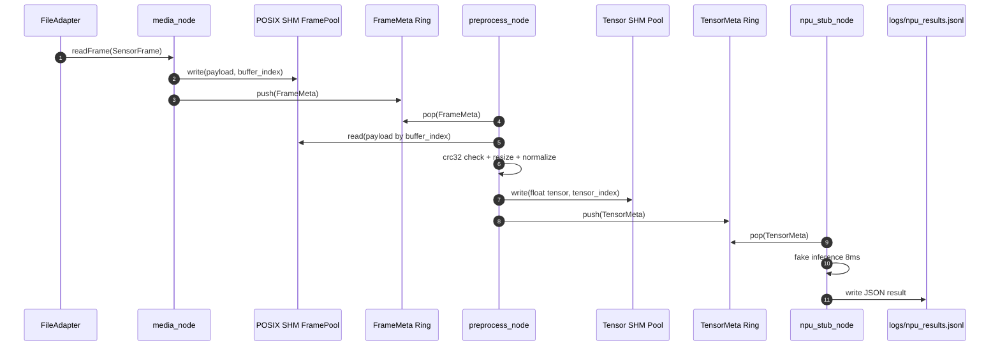
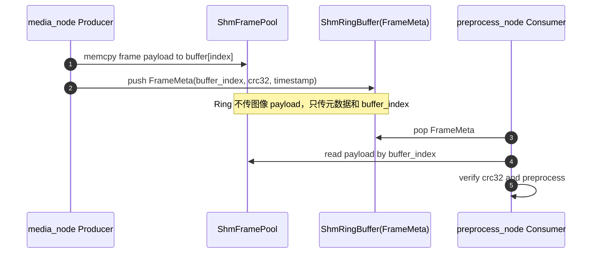
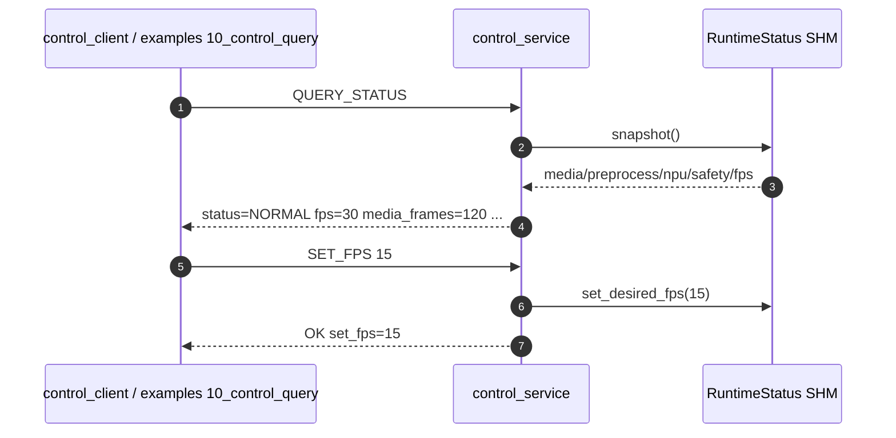
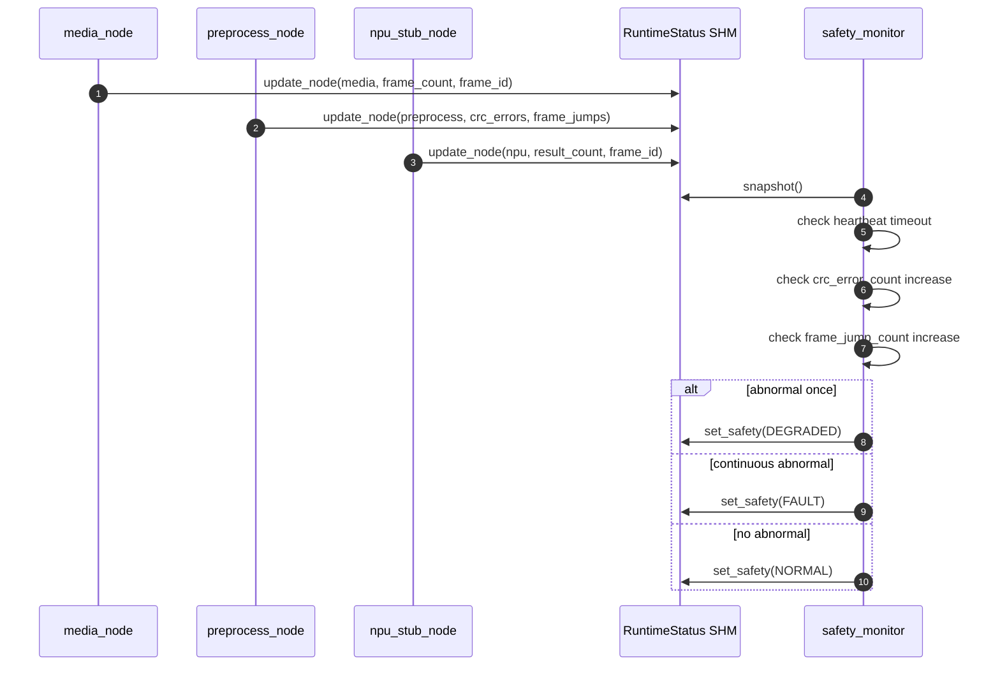
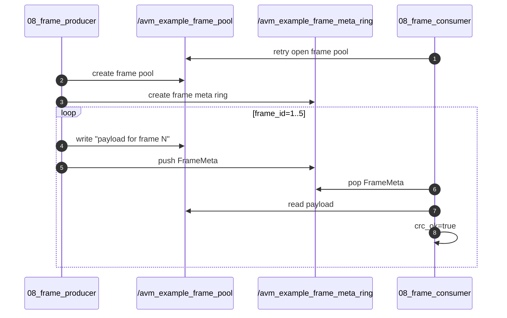

# AutoVision Mini Middleware V1：完整合并任务书（主工程代码 + C++ examples 测试）

> 版本定位：第一阶段 V1，仅用于 VMware / Ubuntu 22.04 环境的软件闭环验证。第二阶段开发板实践中的真实 V4L2 mmap、DMA-BUF、硬件编码、真实 NPU SDK 不进入本任务书。
>
> 当前状态：主工程已完成分阶段 Git 提交并通过 SSH 推送到 `git@github.com:charlie279/autovision_mini_middleware_v1.git`；主链路已验证 `media_node / preprocess_node / npu_stub_node` 均完成 120 帧，`crc_errors=0`，`frame_jumps=0`，Safety 状态为 `NORMAL`；`examples/` C++ 接口级测试也已验证通过。

---

## 1. 项目目标与边界

### 1.1 项目目标

本项目用于以最低工作量跑通一条车载视觉中间件最小闭环，重点不是算法精度，而是理解芯片侧/自动驾驶中间件工程中的核心问题：

```text
传感器输入如何抽象
图像帧大数据如何跨进程传输
FrameMeta / TensorMeta 如何作为小元数据流转
前处理和 NPU 接口如何解耦
控制面和数据面如何分离
运行时如何监控 heartbeat / CRC / frame_id / timeout
```

V1 要跑通的主链路：

```text
FileAdapter / LidarSimAdapter
        ↓
media_node
        ↓
POSIX SHM FramePool
        ↓
FrameMeta Ring
        ↓
preprocess_node
        ↓
TensorMeta Ring
        ↓
npu_stub_node
        ↓
shared_status
        ↓
safety_monitor + control_service + control_client
```

### 1.2 V1 明确边界

V1 是 Ubuntu/x86_64 fallback 学习版，必须明确以下边界：

```text
1. POSIX SHM + memcpy 不是 DMA zero-copy。
2. CameraAdapterV4L2 在 V1 中仅保留接口占位，V2 再实现真实 ioctl + mmap。
3. npu_stub_node 只模拟 NPU SDK 的 init/run/release 接口，不部署真实模型。
4. safety_monitor 是 watchdog / E2E protection 学习版，不是 ISO 26262 / ASIL 级功能安全实现。
5. examples/ 关注接口级学习，scripts/ 关注工程级验收。
```

---

## 2. 工业对标说明

本项目借鉴 EdgeFirstAI / VideoStream / HAL / Model Service 的工程边界，但不复制其源码、不引入 Rust/Zenoh/Yocto/NXP 专用依赖。V1 的对标关系如下：

| 本项目模块 | 工业对标方向 | V1 实现方式 | V2 演进方向 |
|---|---|---|---|
| `SensorAdapter` | Camera / Lidar 抽象层 | FileAdapter + LidarSimAdapter + Camera stub | 真实 V4L2 Camera / Lidar SDK |
| `media_node` | Camera/Video producer | 读取 SensorFrame，写入 FramePool，发布 FrameMeta | V4L2 mmap / DMABUF producer |
| `ShmFramePool` | 大帧 payload buffer pool | POSIX SHM + memcpy | DmaBuf / fd passing / 引用计数 |
| `ShmRingBuffer` | 元数据 IPC | FrameMeta / TensorMeta ring | Zenoh / CDR / 更规范的 pub-sub |
| `preprocess_node` | HAL CPU fallback | 最近邻 resize + normalize | G2D / OpenCL / NPU 前处理 |
| `npu_stub_node` | Model Service | fake latency + JSON result | 真实 NPU SDK runtime |
| `control_service` | 控制面服务 | Unix Domain Socket | Zenoh service / SOME/IP / 车载服务接口 |
| `safety_monitor` | watchdog / E2E protection | heartbeat + CRC + frame jump + timeout | 更完整的健康监控和降级策略 |

---

## 3. 当前工程目录

```text
autovision_mini_middleware_v1/
├── CMakeLists.txt
├── README.md
├── .gitignore
├── include/
│   ├── avm_config.hpp
│   ├── time_utils.hpp
│   ├── sensor_frame.hpp
│   ├── frame_meta.hpp
│   ├── tensor_meta.hpp
│   ├── safety_status.hpp
│   ├── sensor_adapter.hpp
│   ├── file_adapter.hpp
│   ├── lidar_sim_adapter.hpp
│   ├── camera_adapter_v4l2.hpp
│   ├── crc32.hpp
│   ├── latency_profiler.hpp
│   ├── shm_frame_pool.hpp
│   ├── shm_ring_buffer.hpp
│   ├── shared_status.hpp
│   └── control_cmd.hpp
├── src/
│   ├── crc32.cpp
│   ├── latency_profiler.cpp
│   ├── file_adapter.cpp
│   ├── lidar_sim_adapter.cpp
│   ├── camera_adapter_v4l2.cpp
│   ├── shm_frame_pool.cpp
│   ├── shm_ring_buffer.cpp
│   ├── shared_status.cpp
│   ├── media_node.cpp
│   ├── preprocess_node.cpp
│   ├── npu_stub_node.cpp
│   ├── safety_monitor.cpp
│   ├── control_service.cpp
│   └── control_client.cpp
├── scripts/
│   ├── build.sh
│   ├── prepare_input.sh
│   ├── clean_ipc.sh
│   ├── run_all_vm.sh
│   ├── run_file_pipeline.sh
│   ├── inject_fault.sh
│   ├── collect_report.sh
│   └── format.sh
├── docs/
│   ├── design.md
│   ├── edgefirst_mapping.md
│   ├── performance_report_template.md
│   └── interview_summary.md
├── examples/
│   ├── Makefile
│   ├── README.md
│   ├── cpp/
│   │   ├── 00_crc32.cpp
│   │   ├── 01_latency_profiler.cpp
│   │   ├── 02_control_cmd.cpp
│   │   ├── 03_file_adapter.cpp
│   │   ├── 04_lidar_sim_adapter.cpp
│   │   ├── 05_shm_frame_pool.cpp
│   │   ├── 06_shm_ring_buffer.cpp
│   │   ├── 07_shared_status.cpp
│   │   ├── 08_frame_producer.cpp
│   │   ├── 08_frame_consumer.cpp
│   │   ├── 09_sensor_to_shm.cpp
│   │   └── 10_control_query.cpp
│   ├── bin/       # Makefile 自动生成，不提交
│   └── logs/      # Makefile 自动生成，不提交
├── assets/        # scripts/prepare_input.sh 自动生成，不提交
└── logs/          # 主工程运行日志，不提交
```

---

## 4. 项目设计

### 4.1 进程划分

| 进程 | 类型 | 主要职责 | 输入 | 输出 |
|---|---|---|---|---|
| `media_node` | producer | 读取 SensorFrame，写入 FramePool，发布 FrameMeta | FileAdapter / LidarSimAdapter | FrameMeta Ring + RuntimeStatus |
| `preprocess_node` | consumer + producer | 读取 FrameMeta，校验 CRC，resize + normalize，输出 TensorMeta | FrameMeta Ring + FramePool | TensorMeta Ring + RuntimeStatus |
| `npu_stub_node` | consumer | 模拟 NPU 推理耗时并输出 JSONL | TensorMeta Ring | `logs/npu_results.jsonl` + RuntimeStatus |
| `safety_monitor` | monitor | 读取共享状态，监测 heartbeat、CRC、frame jump、timeout | RuntimeStatus SHM | SafetyState / ErrorCode |
| `control_service` | service | Unix Domain Socket 控制服务 | client command | status / fps / error code |
| `control_client` | client | 命令行查询控制面 | CLI command | control_service response |

### 4.2 数据结构边界

| 数据结构 | 作用 |
|---|---|
| `SensorFrame` | 传感器抽象层输出，统一 file / lidar / camera |
| `FrameMeta` | 图像帧元数据，Ring 中传递，不携带 payload |
| `TensorMeta` | 前处理后 Tensor 元数据，供 NPU Stub 消费 |
| `RuntimeStatusBlock` | 共享运行状态，供 control 和 safety 读取 |
| `SafetyState / ErrorCode` | 安全状态和错误码定义 |

---

## 5. 数据流时序图

### 5.1 主数据链路：FileAdapter → media → preprocess → npu_stub



### 5.2 数据面：大数据走 SHM，小元数据走 Ring



### 5.3 控制面：Unix Domain Socket 查询



### 5.4 安全面：heartbeat / CRC / frame jump / timeout



### 5.5 examples/08_frame_ipc 双进程示例



---

## 6. 环境准备

```bash
sudo apt update
sudo apt install -y build-essential cmake git python3 tree htop clang-format
```

检查：

```bash
g++ --version
cmake --version
python3 --version
git --version
```

---

## 7. 主工程编译、运行与验收

### 7.1 编译

```bash
cd ~/projects/autovision_mini_middleware_v1
chmod +x scripts/*.sh
./scripts/build.sh
```

### 7.2 生成输入数据

```bash
./scripts/prepare_input.sh
```

预期生成：

```text
assets/input_640x480_rgb.raw
size = 640 × 480 × 3 × 120 = 110592000 bytes
```

### 7.3 正常端到端运行

```bash
./scripts/run_all_vm.sh
./scripts/collect_report.sh
cat docs/performance_report.md
```

预期状态：

```text
status=NORMAL fps=30 media_frames=120 preprocess_frames=120 npu_frames=120 error_code=0 text="NORMAL"
```

### 7.4 异常注入：CRC 错误

```bash
./scripts/inject_fault.sh bad_crc
grep -E "CRC error|state change" logs/preprocess_bad_crc.log logs/safety_bad_crc.log
```

预期：

```text
[preprocess_node] CRC error frame_id=...
[Safety] state change: NORMAL -> DEGRADED reason=crc error detected
```

### 7.5 异常注入：frame_id 跳变

```bash
./scripts/inject_fault.sh frame_jump
grep -E "frame jump|state change" logs/preprocess_frame_jump.log logs/safety_frame_jump.log
```

预期：

```text
[preprocess_node] frame jump last=... current=...
[Safety] state change: NORMAL -> DEGRADED reason=frame id jump detected
```

---

## 8. examples C++ 接口级测试

### 8.1 examples 设计目的

`scripts/` 是工程级验收，主要看链路是否跑通。`examples/` 是接口级学习，主要看每个模块具体调用了哪些 C++ 类和函数。

### 8.2 examples 测试矩阵

| 示例 | 测试目标 | 主要接口 | 预期输出 |
|---|---|---|---|
| `00_crc32` | CRC32 校验 | `crc32_compute()` | 打印固定 payload 的 CRC |
| `01_latency_profiler` | 延迟统计 | `add / mean / percentile` | samples、mean、p95 |
| `02_control_cmd` | 控制命令解析 | `parse_control_cmd()` | QUERY_STATUS / SET_FPS 等解析结果 |
| `03_file_adapter` | 文件输入 | `FileAdapter::open/start/readFrame/stop` | 640×480×3, data_size=921600 |
| `04_lidar_sim_adapter` | 模拟 Lidar | `LidarSimAdapter::readFrame()` | sensor_type=1, points=16 |
| `05_shm_frame_pool` | 共享内存 payload | `create / write / read` | output="frame payload example" |
| `06_shm_ring_buffer` | 元数据 Ring | `create / push / pop` | frame_id=42, buffer_index=2 |
| `07_shared_status` | 共享状态 | `update_node / set_safety / snapshot` | fps=15, state=NORMAL |
| `08_frame_ipc` | 双进程 IPC | FramePool + Ring + CRC | 5 帧 crc_ok=true |
| `09_sensor_to_shm` | SensorFrame 到 SHM | FileAdapter + FramePool + Ring | crc_ok=true |
| `10_control_query` | 控制面查询 | Unix Socket connect/write/read | status=NORMAL ... |

### 8.3 examples 编译与运行

```bash
cd ~/projects/autovision_mini_middleware_v1
./scripts/build.sh
./scripts/prepare_input.sh
cd examples
make list
make all
```

运行单个示例：

```bash
make run EXAMPLE=00_crc32
make run EXAMPLE=03_file_adapter
make run EXAMPLE=05_shm_frame_pool
make run EXAMPLE=06_shm_ring_buffer
make run EXAMPLE=09_sensor_to_shm
```

运行双进程 IPC：

```bash
make run_frame_ipc
```

控制面示例需要两个终端。

终端 1：

```bash
cd ~/projects/autovision_mini_middleware_v1
./scripts/clean_ipc.sh
./build/control_service
```

终端 2：

```bash
cd ~/projects/autovision_mini_middleware_v1/examples
make run EXAMPLE=10_control_query
```

### 8.4 已验证 examples 输出

你当前已验证：

```text
00_crc32: crc32=0xc5fe8fd1
01_latency_profiler: mean / p95 正常输出
02_control_cmd: QUERY_STATUS / SET_FPS / QUERY_FRAME_COUNT / QUERY_ERROR_CODE / UNKNOWN 正常解析
03_file_adapter: frame_id=1 sensor_type=2 width=640 height=480 data_size=921600
04_lidar_sim_adapter: frame_id=1 sensor_type=1 points=16 data_size=64
05_shm_frame_pool: output="frame payload example"
06_shm_ring_buffer: frame_id=42 width=640 height=480 buffer_index=2
07_shared_status: fps=15 media=10 preprocess=9 npu=8 state=NORMAL
08_frame_ipc: frame_id=1..5 crc_ok=true
09_sensor_to_shm: frame_id=1 data_size=921600 buffer_index=1 crc_ok=true
10_control_query: response status=NORMAL fps=30 ...
```

---

## 9. Git 使用建议

当前你已经完成到 `stage12` 并推送到 GitHub。新增 examples 后建议提交：

```bash
cd ~/projects/autovision_mini_middleware_v1

git status
git add .gitignore examples
git commit -m "stage13: add cpp module examples with shared makefile"
git push
```

可选：增加 examples 测试报告：

```bash
cat > docs/examples_test_report.md <<'EOF'
# Examples Test Report

V1 examples module tests verified on Ubuntu 22.04 / VMware.

Verified examples:

- 00_crc32: passed
- 01_latency_profiler: passed
- 02_control_cmd: passed
- 03_file_adapter: passed
- 04_lidar_sim_adapter: passed
- 05_shm_frame_pool: passed
- 06_shm_ring_buffer: passed
- 07_shared_status: passed
- 08_frame_ipc: passed
- 09_sensor_to_shm: passed
- 10_control_query: passed

Notes:

- control_service is a foreground server and waits for Unix Domain Socket clients. This is expected behavior.
- Early shm_open failed messages in 08_frame_ipc are retry logs from the consumer waiting for the producer to create shared memory.
EOF

git add docs/examples_test_report.md
git commit -m "stage14: add examples test report"
git push
```

---

## 10. 面试表达主线

可以这样讲：

```text
我做的是一个车载视觉中间件最小闭环 Demo，不是单纯算法实验。第一版先在 Ubuntu 22.04 中验证软件链路，避免一开始被开发板驱动、摄像头和 NPU SDK 阻塞。

架构上，我把输入抽象为 SensorAdapter，当前支持 FileAdapter 和 LidarSimAdapter；media_node 把图像 payload 写入 POSIX SHM FramePool，跨进程只通过 Ring 传 FrameMeta；preprocess_node 读取 FrameMeta 后从 FramePool 取 payload，完成 CRC 校验、resize 和 normalize，并输出 TensorMeta；npu_stub_node 模拟 NPU SDK 的 init/run/release 边界；control_service 通过 Unix Domain Socket 提供控制面；safety_monitor 通过共享状态区检查 heartbeat、CRC、frame_id 连续性和 timeout。

为了避免只会跑脚本，我又在 examples/ 下写了 C++ 接口级测试，用公共 Makefile 单独编译运行。examples 让我能直接看到 FileAdapter、ShmFramePool、ShmRingBuffer、SharedStatus、Unix Socket 控制面分别调用了哪些接口。scripts/ 用于工程级端到端验收，examples/ 用于模块级理解和测试。
```

---

## 11. 后续 V2 演进计划

| V1 | V2 目标 |
|---|---|
| FileAdapter raw RGB | V4L2 CameraAdapter ioctl + mmap |
| POSIX SHM + memcpy | DMA-BUF / fd passing / 引用计数 |
| CPU resize + normalize | G2D / OpenCL / NPU 前处理 |
| NPU Stub | 真实 NPU SDK runtime |
| Unix Socket control | Zenoh service / SOME-IP / 车载服务接口 |
| Safety Monitor 学习版 | 更完整的 health monitor / degraded mode |
| examples 接口级测试 | 板端 Camera / NPU / 编码模块测试 |

---

## 12. 完整文件代码

以下为当前建议版本的完整文件代码。按路径复制即可；脚本复制后执行 `chmod +x scripts/*.sh`。


### `.gitignore`

~~~~gitignore
build/
assets/
logs/
examples/bin/
examples/logs/
docs/performance_report.md
compile_commands.json
.vscode/
*.o
*.a
*.so
~~~~


### `CMakeLists.txt`

~~~~cmake
cmake_minimum_required(VERSION 3.16)
project(autovision_mini_middleware_v1 LANGUAGES CXX)

set(CMAKE_CXX_STANDARD 17)
set(CMAKE_CXX_STANDARD_REQUIRED ON)
set(CMAKE_CXX_EXTENSIONS OFF)
set(CMAKE_EXPORT_COMPILE_COMMANDS ON)

add_compile_options(-Wall -Wextra -Wpedantic -O2)

include_directories(include)

add_library(avm_common
    src/crc32.cpp
    src/latency_profiler.cpp
    src/shared_status.cpp
    src/shm_frame_pool.cpp
    src/shm_ring_buffer.cpp
)

target_link_libraries(avm_common pthread rt)

add_executable(media_node
    src/media_node.cpp
    src/file_adapter.cpp
    src/lidar_sim_adapter.cpp
    src/camera_adapter_v4l2.cpp
)
target_link_libraries(media_node avm_common)

add_executable(preprocess_node src/preprocess_node.cpp)
target_link_libraries(preprocess_node avm_common)

add_executable(npu_stub_node src/npu_stub_node.cpp)
target_link_libraries(npu_stub_node avm_common)

add_executable(safety_monitor src/safety_monitor.cpp)
target_link_libraries(safety_monitor avm_common)

add_executable(control_service src/control_service.cpp)
target_link_libraries(control_service avm_common)

add_executable(control_client src/control_client.cpp)
target_link_libraries(control_client avm_common)
~~~~


### `README.md`

~~~~markdown
# AutoVision Mini Middleware V1

Ubuntu 22.04 / VMware 上的车载视觉中间件最小闭环 Demo。

本版本只依赖 C++17、CMake、POSIX SHM、pthread 和 Python3 生成测试输入，不依赖 OpenCV。目标是先跑通：

```text
FileAdapter / LidarSimAdapter
        -> media_node
        -> POSIX SHM FramePool
        -> FrameMeta Ring
        -> preprocess_node
        -> TensorMeta Ring
        -> npu_stub_node
        -> safety_monitor + control_service
```

## Quick Start

```bash
sudo apt update
sudo apt install -y build-essential cmake git python3 tree htop
chmod +x scripts/*.sh
./scripts/build.sh
./scripts/run_all_vm.sh
./build/control_client QUERY_STATUS
./scripts/collect_report.sh
```

## 异常注入

```bash
./scripts/inject_fault.sh bad_crc
./scripts/inject_fault.sh frame_jump
```

## V1 边界

- POSIX SHM 路径是 Ubuntu/x86_64 学习版，不是真正 DMA zero-copy。
- CameraAdapterV4L2 在 V1 中为占位实现；第二阶段开发板再实现真实 V4L2 ioctl + mmap。
- Safety Monitor 是 watchdog / E2E protection 学习版，不是 ISO 26262 / ASIL 级实现。

## C++ examples

```bash
cd examples
make list
make all
make run EXAMPLE=03_file_adapter
make run EXAMPLE=09_sensor_to_shm
make run_frame_ipc
```
~~~~


### `include/avm_config.hpp`

~~~~cpp
/**
 * @file avm_config.hpp
 * @brief 全局配置常量：共享内存名称、缓冲区大小、Ring 容量、控制 Socket 路径和像素格式。
 */
#pragma once

#include <cstddef>
#include <cstdint>

namespace avm {

constexpr const char* kFramePoolName = "/avm_frame_pool";
constexpr const char* kFrameMetaRingName = "/avm_frame_meta_ring";
constexpr const char* kTensorPoolName = "/avm_tensor_pool";
constexpr const char* kTensorMetaRingName = "/avm_tensor_meta_ring";
constexpr const char* kStatusName = "/avm_runtime_status";
constexpr const char* kControlSockPath = "/tmp/avm_control.sock";

constexpr std::uint32_t kDefaultWidth = 640;
constexpr std::uint32_t kDefaultHeight = 480;
constexpr std::uint32_t kDefaultChannels = 3;
constexpr std::uint32_t kDefaultFps = 30;

constexpr std::size_t kFramePoolCount = 8;
constexpr std::size_t kFrameBufferSize = 1280 * 720 * 3;

constexpr std::uint32_t kTensorWidth = 320;
constexpr std::uint32_t kTensorHeight = 320;
constexpr std::uint32_t kTensorChannels = 3;
constexpr std::size_t kTensorPoolCount = 8;
constexpr std::size_t kTensorBufferSize = kTensorWidth * kTensorHeight * kTensorChannels * sizeof(float);

constexpr std::size_t kRingCapacity = 64;

constexpr std::uint32_t kFormatRgb888 = 0x52474238U;       // 'RGB8'
constexpr std::uint32_t kFormatLidarFloat32 = 0x4C493332U; // 'LI32'

}  // namespace avm
~~~~


### `include/time_utils.hpp`

~~~~cpp
/**
 * @file time_utils.hpp
 * @brief 时间工具：提供单调时钟纳秒时间戳和纳秒到毫秒的转换。
 */
#pragma once

#include <chrono>
#include <cstdint>

namespace avm {

inline std::uint64_t now_ns() {
    using Clock = std::chrono::steady_clock;
    return static_cast<std::uint64_t>(
        std::chrono::duration_cast<std::chrono::nanoseconds>(Clock::now().time_since_epoch()).count());
}

inline double ns_to_ms(std::uint64_t ns) {
    return static_cast<double>(ns) / 1'000'000.0;
}

}  // namespace avm
~~~~


### `include/sensor_frame.hpp`

~~~~cpp
/**
 * @file sensor_frame.hpp
 * @brief 统一传感器帧结构：用于 FileAdapter、LidarSimAdapter 和未来 CameraAdapter 输出统一数据。
 */
#pragma once

#include <cstdint>
#include <vector>

struct SensorFrame {
    std::uint64_t frame_id = 0;
    std::uint64_t timestamp_ns = 0;
    std::uint32_t sensor_type = 0;  // 0=camera, 1=lidar_sim, 2=file
    std::uint32_t width = 0;
    std::uint32_t height = 0;
    std::uint32_t format = 0;
    std::uint32_t data_size = 0;
    std::vector<std::uint8_t> data;
};
~~~~


### `include/frame_meta.hpp`

~~~~cpp
/**
 * @file frame_meta.hpp
 * @brief 图像帧元数据结构：Ring 中只传元数据，图像 payload 放在 POSIX SHM FramePool 中。
 */
#pragma once

#include <cstdint>

struct FrameMeta {
    std::uint64_t frame_id = 0;
    std::uint64_t timestamp_ns = 0;
    std::uint32_t sensor_type = 0;
    std::uint32_t width = 0;
    std::uint32_t height = 0;
    std::uint32_t format = 0;
    std::uint32_t data_size = 0;
    std::uint32_t buffer_index = 0;
    std::uint32_t crc32 = 0;
    std::uint32_t alive_counter = 0;
    std::uint32_t status = 0;
};
~~~~


### `include/tensor_meta.hpp`

~~~~cpp
/**
 * @file tensor_meta.hpp
 * @brief 前处理输出 Tensor 的元数据结构：NPU Stub 通过该结构获取 Tensor 索引和尺寸信息。
 */
#pragma once

#include <cstdint>

struct TensorMeta {
    std::uint64_t frame_id = 0;
    std::uint64_t timestamp_ns = 0;
    std::uint32_t width = 0;
    std::uint32_t height = 0;
    std::uint32_t channels = 0;
    std::uint32_t data_type = 0;  // 0=uint8, 1=float32
    std::uint32_t data_size = 0;
    std::uint32_t buffer_index = 0;
};
~~~~


### `include/safety_status.hpp`

~~~~cpp
/**
 * @file safety_status.hpp
 * @brief 安全状态与错误码定义：用于 Safety Monitor 和控制面状态查询。
 */
#pragma once

#include <cstdint>

enum class SafetyState : std::uint32_t {
    NORMAL = 0,
    DEGRADED = 1,
    FAULT = 2,
    RECOVERING = 3
};

enum class ErrorCode : std::uint32_t {
    OK = 0,
    FRAME_ID_JUMP = 1,
    CRC_ERROR = 2,
    HEARTBEAT_TIMEOUT = 3,
    LATENCY_OVER_THRESHOLD = 4
};

inline const char* safety_state_to_string(SafetyState state) {
    switch (state) {
        case SafetyState::NORMAL:
            return "NORMAL";
        case SafetyState::DEGRADED:
            return "DEGRADED";
        case SafetyState::FAULT:
            return "FAULT";
        case SafetyState::RECOVERING:
            return "RECOVERING";
        default:
            return "UNKNOWN";
    }
}
~~~~


### `include/sensor_adapter.hpp`

~~~~cpp
/**
 * @file sensor_adapter.hpp
 * @brief 传感器抽象接口：屏蔽文件输入、模拟雷达和未来真实摄像头的差异。
 */
#pragma once

#include "sensor_frame.hpp"

class SensorAdapter {
public:
    virtual bool open() = 0;
    virtual bool start() = 0;
    virtual bool readFrame(SensorFrame& frame) = 0;
    virtual void stop() = 0;
    virtual ~SensorAdapter() = default;
};
~~~~


### `include/file_adapter.hpp`

~~~~cpp
/**
 * @file file_adapter.hpp
 * @brief 文件输入适配器：从 prepare_input.sh 生成的 RGB raw 文件中循环读取固定尺寸帧。
 */
#pragma once

#include "sensor_adapter.hpp"

#include <cstddef>
#include <cstdint>
#include <fstream>
#include <string>

class FileAdapter final : public SensorAdapter {
public:
    FileAdapter(std::string path, std::uint32_t width, std::uint32_t height, std::uint32_t channels);

    bool open() override;
    bool start() override;
    bool readFrame(SensorFrame& frame) override;
    void stop() override;

private:
    bool rewind_file();

    std::string path_;
    std::uint32_t width_ = 0;
    std::uint32_t height_ = 0;
    std::uint32_t channels_ = 0;
    std::size_t frame_bytes_ = 0;
    std::ifstream input_;
    std::uint64_t next_frame_id_ = 1;
    bool started_ = false;
};
~~~~


### `include/lidar_sim_adapter.hpp`

~~~~cpp
/**
 * @file lidar_sim_adapter.hpp
 * @brief 模拟 Lidar 适配器：周期性生成 float32 距离数组，用于证明传感器抽象能力。
 */
#pragma once

#include "sensor_adapter.hpp"

#include <cstddef>
#include <cstdint>

class LidarSimAdapter final : public SensorAdapter {
public:
    explicit LidarSimAdapter(std::size_t point_count = 1024);

    bool open() override;
    bool start() override;
    bool readFrame(SensorFrame& frame) override;
    void stop() override;

private:
    std::size_t point_count_ = 1024;
    std::uint64_t next_frame_id_ = 1;
    bool started_ = false;
};
~~~~


### `include/camera_adapter_v4l2.hpp`

~~~~cpp
/**
 * @file camera_adapter_v4l2.hpp
 * @brief V4L2 摄像头适配器占位文件：V1 仅保留接口，V2 在开发板上实现 ioctl + mmap。
 */
#pragma once

#include "sensor_adapter.hpp"

#include <cstdint>
#include <string>

class CameraAdapterV4L2 final : public SensorAdapter {
public:
    CameraAdapterV4L2(std::string device, std::uint32_t width, std::uint32_t height);

    bool open() override;
    bool start() override;
    bool readFrame(SensorFrame& frame) override;
    void stop() override;

private:
    std::string device_;
    std::uint32_t width_ = 0;
    std::uint32_t height_ = 0;
};
~~~~


### `include/crc32.hpp`

~~~~cpp
/**
 * @file crc32.hpp
 * @brief CRC32 校验函数声明：用于帧完整性检查和异常注入验证。
 */
#pragma once

#include <cstddef>
#include <cstdint>

std::uint32_t crc32_compute(const void* data, std::size_t length);
~~~~


### `include/latency_profiler.hpp`

~~~~cpp
/**
 * @file latency_profiler.hpp
 * @brief 延迟统计工具：记录均值、P95 等性能指标。
 */
#pragma once

#include <cstddef>
#include <vector>

class LatencyProfiler {
public:
    void add(double ms);
    double mean() const;
    double percentile(double p) const;
    std::size_t size() const;

private:
    std::vector<double> samples_;
};
~~~~


### `include/shm_frame_pool.hpp`

~~~~cpp
/**
 * @file shm_frame_pool.hpp
 * @brief POSIX 共享内存帧池：存放图像/Tensor payload，跨进程通过 buffer_index 访问。
 */
#pragma once

#include <cstddef>
#include <cstdint>
#include <string>

struct FramePoolHeader {
    std::uint32_t magic = 0;
    std::uint32_t buffer_count = 0;
    std::uint32_t buffer_size = 0;
    std::uint32_t reserved = 0;
};

class ShmFramePool {
public:
    ShmFramePool() = default;
    ~ShmFramePool();

    bool create(const std::string& name, std::size_t buffer_count, std::size_t buffer_size);
    bool open(const std::string& name, std::size_t buffer_count, std::size_t buffer_size);
    bool write(std::uint32_t index, const void* data, std::size_t size);
    bool read(std::uint32_t index, void* data, std::size_t size) const;

    std::uint8_t* buffer_ptr(std::uint32_t index);
    const std::uint8_t* buffer_ptr(std::uint32_t index) const;

    std::size_t buffer_count() const;
    std::size_t buffer_size() const;
    void close();

private:
    bool map_common(const std::string& name, std::size_t buffer_count,
                    std::size_t buffer_size, bool create_mode);

    int fd_ = -1;
    void* base_ = nullptr;
    std::size_t total_size_ = 0;
    std::size_t buffer_count_ = 0;
    std::size_t buffer_size_ = 0;
};
~~~~


### `include/shm_ring_buffer.hpp`

~~~~cpp
/**
 * @file shm_ring_buffer.hpp
 * @brief POSIX 共享内存环形队列：只传 FrameMeta/TensorMeta，不传图像大数据。
 */
#pragma once

#include <cstddef>
#include <cstdint>
#include <pthread.h>
#include <string>

struct RingHeader {
    std::uint32_t magic = 0;
    std::uint32_t elem_size = 0;
    std::uint32_t capacity = 0;
    std::uint32_t initialized = 0;
    std::uint64_t head = 0;
    std::uint64_t tail = 0;
    std::uint64_t count = 0;
    pthread_mutex_t mutex;
    pthread_cond_t not_empty;
    pthread_cond_t not_full;
};

class ShmRingBuffer {
public:
    ShmRingBuffer() = default;
    ~ShmRingBuffer();

    bool create(const std::string& name, std::size_t elem_size, std::size_t capacity);
    bool open(const std::string& name, std::size_t elem_size, std::size_t capacity);
    bool push(const void* item, std::size_t elem_size);
    bool pop(void* item, std::size_t elem_size, int timeout_ms = -1);
    void close();

private:
    bool map_common(const std::string& name, std::size_t elem_size,
                    std::size_t capacity, bool create_mode);
    std::uint8_t* data_base();

    int fd_ = -1;
    void* base_ = nullptr;
    RingHeader* header_ = nullptr;
    std::size_t total_size_ = 0;
    std::size_t elem_size_ = 0;
    std::size_t capacity_ = 0;
};
~~~~


### `include/shared_status.hpp`

~~~~cpp
/**
 * @file shared_status.hpp
 * @brief 运行状态共享内存：保存各节点 heartbeat、帧计数、错误计数和全局 Safety 状态。
 */
#pragma once

#include "safety_status.hpp"

#include <cstdint>
#include <pthread.h>
#include <string>

struct NodeRuntimeStatus {
    char name[32]{};
    std::uint64_t heartbeat_ns = 0;
    std::uint64_t frame_count = 0;
    std::uint64_t latest_frame_id = 0;
    std::uint64_t crc_error_count = 0;
    std::uint64_t frame_jump_count = 0;
    std::uint32_t error_code = 0;
    std::uint32_t reserved = 0;
};

struct RuntimeStatusBlock {
    std::uint32_t magic = 0;
    std::uint32_t initialized = 0;
    pthread_mutex_t mutex{};
    std::uint32_t desired_fps = 30;
    std::uint32_t safety_state = 0;
    std::uint32_t global_error_code = 0;
    char safety_text[128]{};
    NodeRuntimeStatus media;
    NodeRuntimeStatus preprocess;
    NodeRuntimeStatus npu;
};

class SharedStatus {
public:
    SharedStatus() = default;
    ~SharedStatus();

    bool create_or_open(const std::string& name);
    bool open_existing(const std::string& name);
    void update_node(const std::string& node_name,
                     std::uint64_t frame_count,
                     std::uint64_t latest_frame_id,
                     ErrorCode error_code = ErrorCode::OK,
                     std::uint64_t crc_errors = 0,
                     std::uint64_t frame_jumps = 0);
    void set_desired_fps(std::uint32_t fps);
    std::uint32_t desired_fps();
    void set_safety(SafetyState state, ErrorCode error_code, const std::string& text);
    RuntimeStatusBlock snapshot();
    void close();

private:
    bool map_common(const std::string& name, bool create_mode);
    static void init_node(NodeRuntimeStatus& node, const char* name);
    NodeRuntimeStatus* select_node(const std::string& node_name);

    int fd_ = -1;
    void* base_ = nullptr;
    RuntimeStatusBlock* block_ = nullptr;
};
~~~~


### `include/control_cmd.hpp`

~~~~cpp
/**
 * @file control_cmd.hpp
 * @brief 控制面命令解析：将字符串命令转换为枚举命令。
 */
#pragma once

#include <algorithm>
#include <string>

enum class ControlCmd {
    START_CAMERA,
    STOP_CAMERA,
    SET_FPS,
    QUERY_STATUS,
    QUERY_FRAME_COUNT,
    QUERY_ERROR_CODE,
    UNKNOWN
};

inline ControlCmd parse_control_cmd(std::string text) {
    const auto pos = text.find(' ');
    std::string head = (pos == std::string::npos) ? text : text.substr(0, pos);
    head.erase(std::remove(head.begin(), head.end(), '\n'), head.end());
    head.erase(std::remove(head.begin(), head.end(), '\r'), head.end());

    if (head == "START_CAMERA") {
        return ControlCmd::START_CAMERA;
    }
    if (head == "STOP_CAMERA") {
        return ControlCmd::STOP_CAMERA;
    }
    if (head == "SET_FPS") {
        return ControlCmd::SET_FPS;
    }
    if (head == "QUERY_STATUS") {
        return ControlCmd::QUERY_STATUS;
    }
    if (head == "QUERY_FRAME_COUNT") {
        return ControlCmd::QUERY_FRAME_COUNT;
    }
    if (head == "QUERY_ERROR_CODE") {
        return ControlCmd::QUERY_ERROR_CODE;
    }
    return ControlCmd::UNKNOWN;
}
~~~~


### `src/crc32.cpp`

~~~~cpp
/**
 * @file crc32.cpp
 * @brief CRC32 实现：对帧 payload 计算校验值，用于 preprocess_node 完整性检查。
 */
#include "crc32.hpp"

std::uint32_t crc32_compute(const void* data, std::size_t length) {
    static std::uint32_t table[256];
    static bool initialized = false;

    if (!initialized) {
        for (std::uint32_t i = 0; i < 256; ++i) {
            std::uint32_t c = i;
            for (int j = 0; j < 8; ++j) {
                c = (c & 1U) ? (0xEDB88320U ^ (c >> 1U)) : (c >> 1U);
            }
            table[i] = c;
        }
        initialized = true;
    }

    std::uint32_t crc = 0xFFFFFFFFU;
    const auto* bytes = static_cast<const std::uint8_t*>(data);
    for (std::size_t i = 0; i < length; ++i) {
        crc = table[(crc ^ bytes[i]) & 0xFFU] ^ (crc >> 8U);
    }
    return crc ^ 0xFFFFFFFFU;
}
~~~~


### `src/latency_profiler.cpp`

~~~~cpp
/**
 * @file latency_profiler.cpp
 * @brief 延迟统计实现：支持均值和百分位统计。
 */
#include "latency_profiler.hpp"

#include <algorithm>
#include <numeric>

void LatencyProfiler::add(double ms) {
    samples_.push_back(ms);
}

double LatencyProfiler::mean() const {
    if (samples_.empty()) {
        return 0.0;
    }
    const double sum = std::accumulate(samples_.begin(), samples_.end(), 0.0);
    return sum / static_cast<double>(samples_.size());
}

double LatencyProfiler::percentile(double p) const {
    if (samples_.empty()) {
        return 0.0;
    }

    std::vector<double> sorted = samples_;
    std::sort(sorted.begin(), sorted.end());

    const double index = (p / 100.0) * static_cast<double>(sorted.size() - 1);
    const auto low = static_cast<std::size_t>(index);
    const auto high = std::min(low + 1, sorted.size() - 1);
    const double ratio = index - static_cast<double>(low);
    return sorted[low] * (1.0 - ratio) + sorted[high] * ratio;
}

std::size_t LatencyProfiler::size() const {
    return samples_.size();
}
~~~~


### `src/file_adapter.cpp`

~~~~cpp
/**
 * @file file_adapter.cpp
 * @brief 文件输入适配器实现：从 RGB raw 文件中循环读取帧，并输出 SensorFrame。
 */
#include "file_adapter.hpp"

#include "avm_config.hpp"
#include "time_utils.hpp"

#include <iostream>

FileAdapter::FileAdapter(std::string path, std::uint32_t width, std::uint32_t height, std::uint32_t channels)
    : path_(std::move(path)), width_(width), height_(height), channels_(channels) {
    frame_bytes_ = static_cast<std::size_t>(width_) * height_ * channels_;
}

bool FileAdapter::open() {
    input_.open(path_, std::ios::binary);
    if (!input_.is_open()) {
        std::cerr << "[FileAdapter] failed to open " << path_ << "\n";
        return false;
    }
    return true;
}

bool FileAdapter::start() {
    if (!input_.is_open()) {
        return false;
    }
    started_ = true;
    return true;
}

bool FileAdapter::rewind_file() {
    input_.clear();
    input_.seekg(0, std::ios::beg);
    return static_cast<bool>(input_);
}

bool FileAdapter::readFrame(SensorFrame& frame) {
    if (!started_) {
        return false;
    }

    std::vector<std::uint8_t> payload(frame_bytes_);
    input_.read(reinterpret_cast<char*>(payload.data()), static_cast<std::streamsize>(payload.size()));

    if (input_.gcount() != static_cast<std::streamsize>(payload.size())) {
        if (!rewind_file()) {
            return false;
        }
        input_.read(reinterpret_cast<char*>(payload.data()), static_cast<std::streamsize>(payload.size()));
        if (input_.gcount() != static_cast<std::streamsize>(payload.size())) {
            std::cerr << "[FileAdapter] input file is too small for one frame\n";
            return false;
        }
    }

    frame.frame_id = next_frame_id_++;
    frame.timestamp_ns = avm::now_ns();
    frame.sensor_type = 2;
    frame.width = width_;
    frame.height = height_;
    frame.format = avm::kFormatRgb888;
    frame.data_size = static_cast<std::uint32_t>(payload.size());
    frame.data = std::move(payload);
    return true;
}

void FileAdapter::stop() {
    started_ = false;
    input_.close();
}
~~~~


### `src/lidar_sim_adapter.cpp`

~~~~cpp
/**
 * @file lidar_sim_adapter.cpp
 * @brief 模拟雷达输入实现：生成 float32 距离数组，验证 SensorAdapter 抽象层。
 */
#include "lidar_sim_adapter.hpp"

#include "avm_config.hpp"
#include "time_utils.hpp"

#include <cmath>
#include <cstring>
#include <thread>
#include <vector>

LidarSimAdapter::LidarSimAdapter(std::size_t point_count) : point_count_(point_count) {}

bool LidarSimAdapter::open() {
    return true;
}

bool LidarSimAdapter::start() {
    started_ = true;
    return true;
}

bool LidarSimAdapter::readFrame(SensorFrame& frame) {
    if (!started_) {
        return false;
    }

    std::vector<float> ranges(point_count_);
    for (std::size_t i = 0; i < point_count_; ++i) {
        ranges[i] = 10.0F + 2.0F * std::sin(static_cast<float>(i) * 0.01F +
                                            static_cast<float>(next_frame_id_) * 0.1F);
    }

    frame.frame_id = next_frame_id_++;
    frame.timestamp_ns = avm::now_ns();
    frame.sensor_type = 1;
    frame.width = static_cast<std::uint32_t>(point_count_);
    frame.height = 1;
    frame.format = avm::kFormatLidarFloat32;
    frame.data_size = static_cast<std::uint32_t>(ranges.size() * sizeof(float));
    frame.data.resize(frame.data_size);
    std::memcpy(frame.data.data(), ranges.data(), frame.data_size);

    std::this_thread::sleep_for(std::chrono::milliseconds(100));
    return true;
}

void LidarSimAdapter::stop() {
    started_ = false;
}
~~~~


### `src/camera_adapter_v4l2.cpp`

~~~~cpp
/**
 * @file camera_adapter_v4l2.cpp
 * @brief V1 摄像头适配器占位实现：提示用户 V2 再接真实 V4L2 ioctl + mmap。
 */
#include "camera_adapter_v4l2.hpp"

#include <iostream>

CameraAdapterV4L2::CameraAdapterV4L2(std::string device, std::uint32_t width, std::uint32_t height)
    : device_(std::move(device)), width_(width), height_(height) {}

bool CameraAdapterV4L2::open() {
    std::cerr << "[CameraAdapterV4L2] V1 stub only. Requested device=" << device_
              << " width=" << width_ << " height=" << height_ << "\n";
    std::cerr << "[CameraAdapterV4L2] Use --source file in V1. Implement ioctl+mmap in V2 board stage.\n";
    return false;
}

bool CameraAdapterV4L2::start() {
    return false;
}

bool CameraAdapterV4L2::readFrame(SensorFrame& frame) {
    (void)frame;
    return false;
}

void CameraAdapterV4L2::stop() {}
~~~~


### `src/shm_frame_pool.cpp`

~~~~cpp
/**
 * @file shm_frame_pool.cpp
 * @brief POSIX SHM FramePool 实现：创建/打开共享内存并按 buffer_index 读写 payload。
 */
#include "shm_frame_pool.hpp"

#include <cerrno>
#include <cstring>
#include <fcntl.h>
#include <iostream>
#include <sys/mman.h>
#include <sys/stat.h>
#include <unistd.h>

namespace {
constexpr std::uint32_t kPoolMagic = 0x41564D50U;  // 'AVMP'
}

ShmFramePool::~ShmFramePool() {
    close();
}

bool ShmFramePool::create(const std::string& name, std::size_t buffer_count, std::size_t buffer_size) {
    return map_common(name, buffer_count, buffer_size, true);
}

bool ShmFramePool::open(const std::string& name, std::size_t buffer_count, std::size_t buffer_size) {
    return map_common(name, buffer_count, buffer_size, false);
}

bool ShmFramePool::map_common(const std::string& name,
                              std::size_t buffer_count,
                              std::size_t buffer_size,
                              bool create_mode) {
    close();

    buffer_count_ = buffer_count;
    buffer_size_ = buffer_size;
    total_size_ = sizeof(FramePoolHeader) + buffer_count_ * buffer_size_;

    const int flags = O_RDWR | (create_mode ? O_CREAT : 0);
    fd_ = shm_open(name.c_str(), flags, 0666);
    if (fd_ < 0) {
        std::cerr << "[ShmFramePool] shm_open failed: " << name << " " << std::strerror(errno) << "\n";
        return false;
    }

    if (create_mode && ftruncate(fd_, static_cast<off_t>(total_size_)) != 0) {
        std::cerr << "[ShmFramePool] ftruncate failed: " << std::strerror(errno) << "\n";
        close();
        return false;
    }

    base_ = mmap(nullptr, total_size_, PROT_READ | PROT_WRITE, MAP_SHARED, fd_, 0);
    if (base_ == MAP_FAILED) {
        std::cerr << "[ShmFramePool] mmap failed: " << std::strerror(errno) << "\n";
        base_ = nullptr;
        close();
        return false;
    }

    auto* header = static_cast<FramePoolHeader*>(base_);
    if (create_mode || header->magic != kPoolMagic) {
        header->magic = kPoolMagic;
        header->buffer_count = static_cast<std::uint32_t>(buffer_count_);
        header->buffer_size = static_cast<std::uint32_t>(buffer_size_);
        header->reserved = 0;
    }

    return true;
}

bool ShmFramePool::write(std::uint32_t index, const void* data, std::size_t size) {
    if (base_ == nullptr || data == nullptr || index >= buffer_count_ || size > buffer_size_) {
        return false;
    }
    std::memcpy(buffer_ptr(index), data, size);
    return true;
}

bool ShmFramePool::read(std::uint32_t index, void* data, std::size_t size) const {
    if (base_ == nullptr || data == nullptr || index >= buffer_count_ || size > buffer_size_) {
        return false;
    }
    std::memcpy(data, buffer_ptr(index), size);
    return true;
}

std::uint8_t* ShmFramePool::buffer_ptr(std::uint32_t index) {
    if (base_ == nullptr || index >= buffer_count_) {
        return nullptr;
    }
    return static_cast<std::uint8_t*>(base_) + sizeof(FramePoolHeader) +
           static_cast<std::size_t>(index) * buffer_size_;
}

const std::uint8_t* ShmFramePool::buffer_ptr(std::uint32_t index) const {
    if (base_ == nullptr || index >= buffer_count_) {
        return nullptr;
    }
    return static_cast<const std::uint8_t*>(base_) + sizeof(FramePoolHeader) +
           static_cast<std::size_t>(index) * buffer_size_;
}

std::size_t ShmFramePool::buffer_count() const {
    return buffer_count_;
}

std::size_t ShmFramePool::buffer_size() const {
    return buffer_size_;
}

void ShmFramePool::close() {
    if (base_ != nullptr) {
        munmap(base_, total_size_);
        base_ = nullptr;
    }
    if (fd_ >= 0) {
        ::close(fd_);
        fd_ = -1;
    }
}
~~~~


### `src/shm_ring_buffer.cpp`

~~~~cpp
/**
 * @file shm_ring_buffer.cpp
 * @brief POSIX SHM RingBuffer 实现：跨进程阻塞式 push/pop 元数据。
 */
#include "shm_ring_buffer.hpp"

#include <cerrno>
#include <cstring>
#include <ctime>
#include <fcntl.h>
#include <iostream>
#include <sys/mman.h>
#include <sys/stat.h>
#include <unistd.h>

namespace {
constexpr std::uint32_t kRingMagic = 0x41564D52U;  // 'AVMR'

timespec make_abs_timeout(int timeout_ms) {
    timespec ts{};
    clock_gettime(CLOCK_REALTIME, &ts);
    ts.tv_sec += timeout_ms / 1000;
    ts.tv_nsec += static_cast<long>(timeout_ms % 1000) * 1'000'000L;
    if (ts.tv_nsec >= 1'000'000'000L) {
        ++ts.tv_sec;
        ts.tv_nsec -= 1'000'000'000L;
    }
    return ts;
}
}  // namespace

ShmRingBuffer::~ShmRingBuffer() {
    close();
}

bool ShmRingBuffer::create(const std::string& name, std::size_t elem_size, std::size_t capacity) {
    return map_common(name, elem_size, capacity, true);
}

bool ShmRingBuffer::open(const std::string& name, std::size_t elem_size, std::size_t capacity) {
    return map_common(name, elem_size, capacity, false);
}

bool ShmRingBuffer::map_common(const std::string& name,
                               std::size_t elem_size,
                               std::size_t capacity,
                               bool create_mode) {
    close();

    elem_size_ = elem_size;
    capacity_ = capacity;
    total_size_ = sizeof(RingHeader) + elem_size_ * capacity_;

    const int flags = O_RDWR | (create_mode ? O_CREAT : 0);
    fd_ = shm_open(name.c_str(), flags, 0666);
    if (fd_ < 0) {
        std::cerr << "[ShmRingBuffer] shm_open failed: " << name << " " << std::strerror(errno) << "\n";
        return false;
    }

    if (create_mode && ftruncate(fd_, static_cast<off_t>(total_size_)) != 0) {
        std::cerr << "[ShmRingBuffer] ftruncate failed: " << std::strerror(errno) << "\n";
        close();
        return false;
    }

    base_ = mmap(nullptr, total_size_, PROT_READ | PROT_WRITE, MAP_SHARED, fd_, 0);
    if (base_ == MAP_FAILED) {
        std::cerr << "[ShmRingBuffer] mmap failed: " << std::strerror(errno) << "\n";
        base_ = nullptr;
        close();
        return false;
    }

    header_ = static_cast<RingHeader*>(base_);
    if (create_mode || header_->magic != kRingMagic || header_->initialized != 1) {
        pthread_mutexattr_t mutex_attr{};
        pthread_condattr_t cond_attr{};
        pthread_mutexattr_init(&mutex_attr);
        pthread_condattr_init(&cond_attr);
        pthread_mutexattr_setpshared(&mutex_attr, PTHREAD_PROCESS_SHARED);
        pthread_condattr_setpshared(&cond_attr, PTHREAD_PROCESS_SHARED);

        pthread_mutex_init(&header_->mutex, &mutex_attr);
        pthread_cond_init(&header_->not_empty, &cond_attr);
        pthread_cond_init(&header_->not_full, &cond_attr);

        pthread_mutexattr_destroy(&mutex_attr);
        pthread_condattr_destroy(&cond_attr);

        header_->magic = kRingMagic;
        header_->elem_size = static_cast<std::uint32_t>(elem_size_);
        header_->capacity = static_cast<std::uint32_t>(capacity_);
        header_->head = 0;
        header_->tail = 0;
        header_->count = 0;
        header_->initialized = 1;
    }

    return true;
}

std::uint8_t* ShmRingBuffer::data_base() {
    return static_cast<std::uint8_t*>(base_) + sizeof(RingHeader);
}

bool ShmRingBuffer::push(const void* item, std::size_t elem_size) {
    if (header_ == nullptr || item == nullptr || elem_size != elem_size_) {
        return false;
    }

    pthread_mutex_lock(&header_->mutex);
    while (header_->count == header_->capacity) {
        pthread_cond_wait(&header_->not_full, &header_->mutex);
    }

    const std::uint64_t index = header_->tail % header_->capacity;
    std::memcpy(data_base() + index * elem_size_, item, elem_size_);
    ++header_->tail;
    ++header_->count;

    pthread_cond_signal(&header_->not_empty);
    pthread_mutex_unlock(&header_->mutex);
    return true;
}

bool ShmRingBuffer::pop(void* item, std::size_t elem_size, int timeout_ms) {
    if (header_ == nullptr || item == nullptr || elem_size != elem_size_) {
        return false;
    }

    pthread_mutex_lock(&header_->mutex);
    while (header_->count == 0) {
        int rc = 0;
        if (timeout_ms >= 0) {
            timespec ts = make_abs_timeout(timeout_ms);
            rc = pthread_cond_timedwait(&header_->not_empty, &header_->mutex, &ts);
            if (rc == ETIMEDOUT) {
                pthread_mutex_unlock(&header_->mutex);
                return false;
            }
        } else {
            rc = pthread_cond_wait(&header_->not_empty, &header_->mutex);
        }

        if (rc != 0 && rc != ETIMEDOUT) {
            pthread_mutex_unlock(&header_->mutex);
            return false;
        }
    }

    const std::uint64_t index = header_->head % header_->capacity;
    std::memcpy(item, data_base() + index * elem_size_, elem_size_);
    ++header_->head;
    --header_->count;

    pthread_cond_signal(&header_->not_full);
    pthread_mutex_unlock(&header_->mutex);
    return true;
}

void ShmRingBuffer::close() {
    if (base_ != nullptr) {
        munmap(base_, total_size_);
        base_ = nullptr;
        header_ = nullptr;
    }
    if (fd_ >= 0) {
        ::close(fd_);
        fd_ = -1;
    }
}
~~~~


### `src/shared_status.cpp`

~~~~cpp
/**
 * @file shared_status.cpp
 * @brief 共享运行状态实现：各进程通过该共享内存发布 heartbeat、计数和安全状态。
 */
#include "shared_status.hpp"

#include "time_utils.hpp"

#include <cerrno>
#include <cstring>
#include <fcntl.h>
#include <iostream>
#include <sys/mman.h>
#include <sys/stat.h>
#include <unistd.h>

namespace {
constexpr std::uint32_t kStatusMagic = 0x41564D53U;  // 'AVMS'
}

SharedStatus::~SharedStatus() {
    close();
}

bool SharedStatus::create_or_open(const std::string& name) {
    return map_common(name, true);
}

bool SharedStatus::open_existing(const std::string& name) {
    return map_common(name, false);
}

bool SharedStatus::map_common(const std::string& name, bool create_mode) {
    close();

    bool created_by_this_process = false;
    if (create_mode) {
        fd_ = shm_open(name.c_str(), O_RDWR | O_CREAT | O_EXCL, 0666);
        if (fd_ >= 0) {
            created_by_this_process = true;
        } else if (errno == EEXIST) {
            fd_ = shm_open(name.c_str(), O_RDWR, 0666);
        }
    } else {
        fd_ = shm_open(name.c_str(), O_RDWR, 0666);
    }

    if (fd_ < 0) {
        std::cerr << "[SharedStatus] shm_open failed: " << name << " " << std::strerror(errno) << "\n";
        return false;
    }

    if (created_by_this_process && ftruncate(fd_, static_cast<off_t>(sizeof(RuntimeStatusBlock))) != 0) {
        std::cerr << "[SharedStatus] ftruncate failed: " << std::strerror(errno) << "\n";
        close();
        return false;
    }

    base_ = mmap(nullptr, sizeof(RuntimeStatusBlock), PROT_READ | PROT_WRITE, MAP_SHARED, fd_, 0);
    if (base_ == MAP_FAILED) {
        std::cerr << "[SharedStatus] mmap failed: " << std::strerror(errno) << "\n";
        base_ = nullptr;
        close();
        return false;
    }

    block_ = static_cast<RuntimeStatusBlock*>(base_);
    if (created_by_this_process || block_->magic != kStatusMagic || block_->initialized != 1) {
        pthread_mutexattr_t attr{};
        pthread_mutexattr_init(&attr);
        pthread_mutexattr_setpshared(&attr, PTHREAD_PROCESS_SHARED);
        pthread_mutex_init(&block_->mutex, &attr);
        pthread_mutexattr_destroy(&attr);

        block_->magic = kStatusMagic;
        block_->desired_fps = 30;
        block_->safety_state = static_cast<std::uint32_t>(SafetyState::NORMAL);
        block_->global_error_code = static_cast<std::uint32_t>(ErrorCode::OK);
        std::snprintf(block_->safety_text, sizeof(block_->safety_text), "NORMAL");
        init_node(block_->media, "media");
        init_node(block_->preprocess, "preprocess");
        init_node(block_->npu, "npu");
        block_->initialized = 1;
    }

    return true;
}

void SharedStatus::init_node(NodeRuntimeStatus& node, const char* name) {
    node = NodeRuntimeStatus{};
    std::snprintf(node.name, sizeof(node.name), "%s", name);
    node.heartbeat_ns = avm::now_ns();
    node.error_code = static_cast<std::uint32_t>(ErrorCode::OK);
}

NodeRuntimeStatus* SharedStatus::select_node(const std::string& node_name) {
    if (block_ == nullptr) {
        return nullptr;
    }
    if (node_name == "media") {
        return &block_->media;
    }
    if (node_name == "preprocess") {
        return &block_->preprocess;
    }
    if (node_name == "npu") {
        return &block_->npu;
    }
    return nullptr;
}

void SharedStatus::update_node(const std::string& node_name,
                               std::uint64_t frame_count,
                               std::uint64_t latest_frame_id,
                               ErrorCode error_code,
                               std::uint64_t crc_errors,
                               std::uint64_t frame_jumps) {
    if (block_ == nullptr) {
        return;
    }

    pthread_mutex_lock(&block_->mutex);
    NodeRuntimeStatus* node = select_node(node_name);
    if (node != nullptr) {
        node->heartbeat_ns = avm::now_ns();
        node->frame_count = frame_count;
        node->latest_frame_id = latest_frame_id;
        node->error_code = static_cast<std::uint32_t>(error_code);
        node->crc_error_count = crc_errors;
        node->frame_jump_count = frame_jumps;
    }
    pthread_mutex_unlock(&block_->mutex);
}

void SharedStatus::set_desired_fps(std::uint32_t fps) {
    if (block_ == nullptr) {
        return;
    }
    pthread_mutex_lock(&block_->mutex);
    block_->desired_fps = fps;
    pthread_mutex_unlock(&block_->mutex);
}

std::uint32_t SharedStatus::desired_fps() {
    if (block_ == nullptr) {
        return 30;
    }
    pthread_mutex_lock(&block_->mutex);
    const std::uint32_t fps = block_->desired_fps;
    pthread_mutex_unlock(&block_->mutex);
    return fps;
}

void SharedStatus::set_safety(SafetyState state, ErrorCode error_code, const std::string& text) {
    if (block_ == nullptr) {
        return;
    }
    pthread_mutex_lock(&block_->mutex);
    block_->safety_state = static_cast<std::uint32_t>(state);
    block_->global_error_code = static_cast<std::uint32_t>(error_code);
    std::snprintf(block_->safety_text, sizeof(block_->safety_text), "%s", text.c_str());
    pthread_mutex_unlock(&block_->mutex);
}

RuntimeStatusBlock SharedStatus::snapshot() {
    RuntimeStatusBlock copy{};
    if (block_ == nullptr) {
        return copy;
    }
    pthread_mutex_lock(&block_->mutex);
    copy = *block_;
    pthread_mutex_unlock(&block_->mutex);
    return copy;
}

void SharedStatus::close() {
    if (base_ != nullptr) {
        munmap(base_, sizeof(RuntimeStatusBlock));
        base_ = nullptr;
        block_ = nullptr;
    }
    if (fd_ >= 0) {
        ::close(fd_);
        fd_ = -1;
    }
}
~~~~


### `src/media_node.cpp`

~~~~cpp
/**
 * @file media_node.cpp
 * @brief 生产者节点：读取传感器帧，将 payload 写入 FramePool，并将 FrameMeta 推入 Ring。
 */
#include "avm_config.hpp"
#include "camera_adapter_v4l2.hpp"
#include "crc32.hpp"
#include "file_adapter.hpp"
#include "frame_meta.hpp"
#include "lidar_sim_adapter.hpp"
#include "shared_status.hpp"
#include "shm_frame_pool.hpp"
#include "shm_ring_buffer.hpp"

#include <chrono>
#include <cstdint>
#include <iostream>
#include <memory>
#include <string>
#include <thread>

namespace {
std::string arg_value(int argc, char** argv, const std::string& key, const std::string& default_value) {
    for (int i = 1; i + 1 < argc; ++i) {
        if (argv[i] == key) {
            return argv[i + 1];
        }
    }
    return default_value;
}

bool has_flag(int argc, char** argv, const std::string& key) {
    for (int i = 1; i < argc; ++i) {
        if (argv[i] == key) {
            return true;
        }
    }
    return false;
}
}  // namespace

int main(int argc, char** argv) {
    std::cout.setf(std::ios::unitbuf);
    std::cerr.setf(std::ios::unitbuf);

    const std::string source = arg_value(argc, argv, "--source", "file");
    const std::string input = arg_value(argc, argv, "--input", "assets/input_640x480_rgb.raw");
    const std::string device = arg_value(argc, argv, "--device", "/dev/video0");
    const int frames = std::stoi(arg_value(argc, argv, "--frames", "120"));
    const auto width = static_cast<std::uint32_t>(std::stoul(arg_value(argc, argv, "--width", "640")));
    const auto height = static_cast<std::uint32_t>(std::stoul(arg_value(argc, argv, "--height", "480")));
    const bool inject_bad_crc = has_flag(argc, argv, "--inject-bad-crc");
    const bool inject_frame_jump = has_flag(argc, argv, "--inject-frame-jump");

    std::unique_ptr<SensorAdapter> adapter;
    if (source == "file") {
        adapter = std::make_unique<FileAdapter>(input, width, height, avm::kDefaultChannels);
    } else if (source == "lidar_sim") {
        adapter = std::make_unique<LidarSimAdapter>();
    } else if (source == "camera") {
        adapter = std::make_unique<CameraAdapterV4L2>(device, width, height);
    } else {
        std::cerr << "[media_node] unsupported source: " << source << "\n";
        return 1;
    }

    SharedStatus status;
    status.create_or_open(avm::kStatusName);

    ShmFramePool frame_pool;
    if (!frame_pool.create(avm::kFramePoolName, avm::kFramePoolCount, avm::kFrameBufferSize)) {
        return 2;
    }

    ShmRingBuffer frame_ring;
    if (!frame_ring.create(avm::kFrameMetaRingName, sizeof(FrameMeta), avm::kRingCapacity)) {
        return 3;
    }

    if (!adapter->open() || !adapter->start()) {
        std::cerr << "[media_node] adapter open/start failed\n";
        return 4;
    }

    std::uint32_t alive_counter = 0;
    std::uint64_t produced = 0;
    auto next_tick = std::chrono::steady_clock::now();

    for (int i = 0; i < frames; ++i) {
        SensorFrame sensor_frame;
        if (!adapter->readFrame(sensor_frame)) {
            std::cerr << "[media_node] readFrame failed at i=" << i << "\n";
            break;
        }

        if (sensor_frame.data_size > avm::kFrameBufferSize) {
            std::cerr << "[media_node] frame too large: " << sensor_frame.data_size << "\n";
            break;
        }

        FrameMeta meta;
        meta.frame_id = sensor_frame.frame_id;
        if (inject_frame_jump && i == 40) {
            meta.frame_id += 100;
        }
        meta.timestamp_ns = sensor_frame.timestamp_ns;
        meta.sensor_type = sensor_frame.sensor_type;
        meta.width = sensor_frame.width;
        meta.height = sensor_frame.height;
        meta.format = sensor_frame.format;
        meta.data_size = sensor_frame.data_size;
        meta.buffer_index = static_cast<std::uint32_t>(meta.frame_id % avm::kFramePoolCount);
        meta.crc32 = crc32_compute(sensor_frame.data.data(), sensor_frame.data.size());
        if (inject_bad_crc && i == 50) {
            meta.crc32 ^= 0x00FF00FFU;
        }
        meta.alive_counter = ++alive_counter;
        meta.status = 0;

        if (!frame_pool.write(meta.buffer_index, sensor_frame.data.data(), sensor_frame.data.size())) {
            std::cerr << "[media_node] frame_pool.write failed\n";
            break;
        }
        if (!frame_ring.push(&meta, sizeof(meta))) {
            std::cerr << "[media_node] frame_ring.push failed\n";
            break;
        }

        ++produced;
        status.update_node("media", produced, meta.frame_id);

        if (produced == 1 || produced % 30 == 0) {
            std::cout << "[media_node] frame_id=" << meta.frame_id
                      << " sensor_type=" << meta.sensor_type
                      << " size=" << meta.data_size
                      << " buffer_index=" << meta.buffer_index << "\n";
        }

        std::uint32_t fps = status.desired_fps();
        if (fps == 0) {
            fps = avm::kDefaultFps;
        }
        next_tick += std::chrono::milliseconds(1000 / static_cast<int>(fps));
        std::this_thread::sleep_until(next_tick);
    }

    adapter->stop();
    status.update_node("media", produced, produced);
    std::cout << "[media_node] finished produced=" << produced << "\n";
    return 0;
}
~~~~


### `src/preprocess_node.cpp`

~~~~cpp
/**
 * @file preprocess_node.cpp
 * @brief 前处理节点：读取 FrameMeta 和 payload，做 resize/normalize，输出 TensorMeta。
 */
#include "avm_config.hpp"
#include "crc32.hpp"
#include "frame_meta.hpp"
#include "latency_profiler.hpp"
#include "shared_status.hpp"
#include "shm_frame_pool.hpp"
#include "shm_ring_buffer.hpp"
#include "tensor_meta.hpp"
#include "time_utils.hpp"

#include <algorithm>
#include <chrono>
#include <cstdint>
#include <filesystem>
#include <fstream>
#include <iostream>
#include <string>
#include <thread>
#include <vector>

namespace {
std::string arg_value(int argc, char** argv, const std::string& key, const std::string& default_value) {
    for (int i = 1; i + 1 < argc; ++i) {
        if (argv[i] == key) {
            return argv[i + 1];
        }
    }
    return default_value;
}

template <typename OpenFunc>
bool retry_open(OpenFunc&& open_func, const char* name, int retry_count = 60) {
    for (int i = 0; i < retry_count; ++i) {
        if (open_func()) {
            return true;
        }
        std::this_thread::sleep_for(std::chrono::milliseconds(100));
    }
    std::cerr << "[preprocess_node] failed to open " << name << "\n";
    return false;
}

std::vector<float> resize_rgb_to_tensor(const std::vector<std::uint8_t>& rgb,
                                        std::uint32_t src_width,
                                        std::uint32_t src_height,
                                        std::uint32_t dst_width,
                                        std::uint32_t dst_height) {
    std::vector<float> tensor(static_cast<std::size_t>(dst_width) * dst_height * 3);
    for (std::uint32_t y = 0; y < dst_height; ++y) {
        const std::uint32_t src_y = y * src_height / dst_height;
        for (std::uint32_t x = 0; x < dst_width; ++x) {
            const std::uint32_t src_x = x * src_width / dst_width;
            const std::size_t src_idx = (static_cast<std::size_t>(src_y) * src_width + src_x) * 3;
            const std::size_t dst_idx = (static_cast<std::size_t>(y) * dst_width + x) * 3;
            tensor[dst_idx + 0] = static_cast<float>(rgb[src_idx + 0]) / 255.0F;
            tensor[dst_idx + 1] = static_cast<float>(rgb[src_idx + 1]) / 255.0F;
            tensor[dst_idx + 2] = static_cast<float>(rgb[src_idx + 2]) / 255.0F;
        }
    }
    return tensor;
}

void save_ppm_preview(const std::vector<std::uint8_t>& rgb,
                      std::uint32_t width,
                      std::uint32_t height,
                      const std::string& path) {
    std::ofstream out(path, std::ios::binary);
    if (!out.is_open()) {
        return;
    }
    out << "P6\n" << width << " " << height << "\n255\n";
    out.write(reinterpret_cast<const char*>(rgb.data()), static_cast<std::streamsize>(rgb.size()));
}
}  // namespace

int main(int argc, char** argv) {
    std::cout.setf(std::ios::unitbuf);
    std::cerr.setf(std::ios::unitbuf);

    const int frames = std::stoi(arg_value(argc, argv, "--frames", "120"));
    const int save_every = std::stoi(arg_value(argc, argv, "--save-every", "60"));
    std::filesystem::create_directories("logs/preprocess");

    SharedStatus status;
    status.create_or_open(avm::kStatusName);

    ShmFramePool frame_pool;
    ShmRingBuffer frame_ring;
    ShmFramePool tensor_pool;
    ShmRingBuffer tensor_ring;

    if (!retry_open([&]() { return frame_pool.open(avm::kFramePoolName, avm::kFramePoolCount, avm::kFrameBufferSize); },
                    "frame_pool")) {
        return 1;
    }
    if (!retry_open([&]() { return frame_ring.open(avm::kFrameMetaRingName, sizeof(FrameMeta), avm::kRingCapacity); },
                    "frame_meta_ring")) {
        return 2;
    }
    if (!tensor_pool.create(avm::kTensorPoolName, avm::kTensorPoolCount, avm::kTensorBufferSize)) {
        return 3;
    }
    if (!tensor_ring.create(avm::kTensorMetaRingName, sizeof(TensorMeta), avm::kRingCapacity)) {
        return 4;
    }

    LatencyProfiler profiler;
    std::uint64_t processed = 0;
    std::uint64_t crc_errors = 0;
    std::uint64_t frame_jumps = 0;
    std::uint64_t last_frame_id = 0;

    for (int i = 0; i < frames; ++i) {
        FrameMeta meta;
        if (!frame_ring.pop(&meta, sizeof(meta), 3000)) {
            std::cerr << "[preprocess_node] timeout waiting FrameMeta\n";
            status.update_node("preprocess", processed, last_frame_id,
                               ErrorCode::HEARTBEAT_TIMEOUT, crc_errors, frame_jumps);
            continue;
        }

        const std::uint64_t t0 = avm::now_ns();
        std::vector<std::uint8_t> raw(meta.data_size);
        if (!frame_pool.read(meta.buffer_index, raw.data(), raw.size())) {
            std::cerr << "[preprocess_node] frame_pool.read failed\n";
            continue;
        }

        const std::uint32_t actual_crc = crc32_compute(raw.data(), raw.size());
        ErrorCode error_code = ErrorCode::OK;
        if (actual_crc != meta.crc32) {
            ++crc_errors;
            error_code = ErrorCode::CRC_ERROR;
            std::cerr << "[preprocess_node] CRC error frame_id=" << meta.frame_id << "\n";
        }

        if (last_frame_id != 0 && meta.frame_id != last_frame_id + 1) {
            ++frame_jumps;
            error_code = ErrorCode::FRAME_ID_JUMP;
            std::cerr << "[preprocess_node] frame jump last=" << last_frame_id
                      << " current=" << meta.frame_id << "\n";
        }
        last_frame_id = meta.frame_id;

        if (meta.sensor_type != 0 && meta.sensor_type != 2) {
            status.update_node("preprocess", processed, meta.frame_id, error_code, crc_errors, frame_jumps);
            continue;
        }

        const std::uint64_t t_resize_start = avm::now_ns();
        std::vector<float> tensor_payload = resize_rgb_to_tensor(
            raw, meta.width, meta.height, avm::kTensorWidth, avm::kTensorHeight);
        const std::uint64_t t_resize_end = avm::now_ns();

        TensorMeta tensor;
        tensor.frame_id = meta.frame_id;
        tensor.timestamp_ns = avm::now_ns();
        tensor.width = avm::kTensorWidth;
        tensor.height = avm::kTensorHeight;
        tensor.channels = avm::kTensorChannels;
        tensor.data_type = 1;
        tensor.data_size = static_cast<std::uint32_t>(tensor_payload.size() * sizeof(float));
        tensor.buffer_index = static_cast<std::uint32_t>(tensor.frame_id % avm::kTensorPoolCount);

        if (!tensor_pool.write(tensor.buffer_index, tensor_payload.data(), tensor.data_size)) {
            std::cerr << "[preprocess_node] tensor_pool.write failed\n";
            continue;
        }
        if (!tensor_ring.push(&tensor, sizeof(tensor))) {
            std::cerr << "[preprocess_node] tensor_ring.push failed\n";
            continue;
        }

        ++processed;
        const double total_ms = avm::ns_to_ms(avm::now_ns() - t0);
        profiler.add(total_ms);
        status.update_node("preprocess", processed, meta.frame_id, error_code, crc_errors, frame_jumps);

        if (save_every > 0 && processed % static_cast<std::uint64_t>(save_every) == 0) {
            save_ppm_preview(raw, meta.width, meta.height,
                             "logs/preprocess/frame_" + std::to_string(processed) + ".ppm");
        }

        if (processed == 1 || processed % 30 == 0) {
            std::cout << "[Preprocess] frame_id=" << meta.frame_id
                      << " resize+normalize=" << avm::ns_to_ms(t_resize_end - t_resize_start) << "ms"
                      << " total=" << total_ms << "ms"
                      << " mean=" << profiler.mean() << "ms"
                      << " p95=" << profiler.percentile(95.0) << "ms\n";
        }
    }

    std::cout << "[preprocess_node] finished processed=" << processed
              << " crc_errors=" << crc_errors
              << " frame_jumps=" << frame_jumps << "\n";
    return 0;
}
~~~~


### `src/npu_stub_node.cpp`

~~~~cpp
/**
 * @file npu_stub_node.cpp
 * @brief NPU Stub 节点：读取 TensorMeta，模拟 NPU SDK init/run/release 和推理延迟。
 */
#include "avm_config.hpp"
#include "shared_status.hpp"
#include "shm_ring_buffer.hpp"
#include "tensor_meta.hpp"
#include "time_utils.hpp"

#include <chrono>
#include <filesystem>
#include <fstream>
#include <iostream>
#include <random>
#include <sstream>
#include <string>
#include <thread>

namespace {
std::string arg_value(int argc, char** argv, const std::string& key, const std::string& default_value) {
    for (int i = 1; i + 1 < argc; ++i) {
        if (argv[i] == key) {
            return argv[i + 1];
        }
    }
    return default_value;
}

template <typename OpenFunc>
bool retry_open(OpenFunc&& open_func, const char* name, int retry_count = 80) {
    for (int i = 0; i < retry_count; ++i) {
        if (open_func()) {
            return true;
        }
        std::this_thread::sleep_for(std::chrono::milliseconds(100));
    }
    std::cerr << "[npu_stub_node] failed to open " << name << "\n";
    return false;
}

class NpuEngine {
public:
    bool init(const std::string& model_path) {
        model_path_ = model_path;
        std::cout << "[NpuEngine] init model=" << model_path_ << " (stub)\n";
        return true;
    }

    bool run(const TensorMeta& input, int fake_latency_ms, std::string& json_out) {
        const std::uint64_t start_ns = avm::now_ns();
        std::this_thread::sleep_for(std::chrono::milliseconds(fake_latency_ms));

        std::uniform_int_distribution<int> count_dist(0, 5);
        std::uniform_real_distribution<double> confidence_dist(0.50, 0.99);

        const double latency_ms = avm::ns_to_ms(avm::now_ns() - start_ns);
        std::ostringstream oss;
        oss << "{\"frame_id\":" << input.frame_id
            << ",\"object_count\":" << count_dist(rng_)
            << ",\"confidence\":" << confidence_dist(rng_)
            << ",\"npu_latency_ms\":" << latency_ms << "}";
        json_out = oss.str();
        return true;
    }

    void release() {
        std::cout << "[NpuEngine] release\n";
    }

private:
    std::string model_path_;
    std::mt19937 rng_{std::random_device{}()};
};
}  // namespace

int main(int argc, char** argv) {
    std::cout.setf(std::ios::unitbuf);
    std::cerr.setf(std::ios::unitbuf);

    const int frames = std::stoi(arg_value(argc, argv, "--frames", "120"));
    const int fake_latency_ms = std::stoi(arg_value(argc, argv, "--fake-latency", "8"));
    const std::string model_path = arg_value(argc, argv, "--model", "models/fake_model.tflite");

    std::filesystem::create_directories("logs");

    SharedStatus status;
    status.create_or_open(avm::kStatusName);

    ShmRingBuffer tensor_ring;
    if (!retry_open([&]() { return tensor_ring.open(avm::kTensorMetaRingName, sizeof(TensorMeta), avm::kRingCapacity); },
                    "tensor_meta_ring")) {
        return 1;
    }

    NpuEngine engine;
    engine.init(model_path);

    std::ofstream result_file("logs/npu_results.jsonl", std::ios::out | std::ios::trunc);
    std::uint64_t consumed = 0;
    std::uint64_t latest_frame_id = 0;

    for (int i = 0; i < frames; ++i) {
        TensorMeta tensor;
        if (!tensor_ring.pop(&tensor, sizeof(tensor), 5000)) {
            std::cerr << "[npu_stub_node] timeout waiting TensorMeta\n";
            status.update_node("npu", consumed, latest_frame_id, ErrorCode::HEARTBEAT_TIMEOUT);
            continue;
        }

        std::string result_json;
        engine.run(tensor, fake_latency_ms, result_json);
        result_file << result_json << "\n";

        latest_frame_id = tensor.frame_id;
        ++consumed;
        status.update_node("npu", consumed, latest_frame_id);

        if (consumed == 1 || consumed % 30 == 0) {
            std::cout << "[NPUStub] " << result_json << "\n";
        }
    }

    engine.release();
    std::cout << "[npu_stub_node] finished consumed=" << consumed << "\n";
    return 0;
}
~~~~


### `src/safety_monitor.cpp`

~~~~cpp
/**
 * @file safety_monitor.cpp
 * @brief Safety Monitor：周期性读取共享状态，检查 heartbeat、CRC 错误和 frame_id 跳变并更新安全状态机。
 */
#include "avm_config.hpp"
#include "shared_status.hpp"
#include "time_utils.hpp"

#include <algorithm>
#include <chrono>
#include <cstdint>
#include <iostream>
#include <string>
#include <thread>

namespace {
std::string arg_value(int argc, char** argv, const std::string& key, const std::string& default_value) {
    for (int i = 1; i + 1 < argc; ++i) {
        if (argv[i] == key) {
            return argv[i + 1];
        }
    }
    return default_value;
}

bool heartbeat_timeout(const NodeRuntimeStatus& node, std::uint64_t now_ns, std::uint64_t threshold_ns) {
    return node.heartbeat_ns > 0 && now_ns > node.heartbeat_ns && (now_ns - node.heartbeat_ns) > threshold_ns;
}
}  // namespace

int main(int argc, char** argv) {
    std::cout.setf(std::ios::unitbuf);
    std::cerr.setf(std::ios::unitbuf);

    const int duration_sec = std::stoi(arg_value(argc, argv, "--duration", "20"));
    const int period_ms = std::stoi(arg_value(argc, argv, "--period-ms", "200"));
    const std::uint64_t timeout_ns =
        static_cast<std::uint64_t>(std::stoull(arg_value(argc, argv, "--timeout-ms", "1500"))) * 1'000'000ULL;

    SharedStatus status;
    status.create_or_open(avm::kStatusName);

    SafetyState current_state = SafetyState::NORMAL;
    std::uint64_t last_crc_errors = 0;
    std::uint64_t last_frame_jumps = 0;
    int fault_score = 0;
    const int ticks = duration_sec * 1000 / period_ms;

    for (int i = 0; i < ticks; ++i) {
        RuntimeStatusBlock snapshot = status.snapshot();
        const std::uint64_t now = avm::now_ns();

        const bool media_timeout = heartbeat_timeout(snapshot.media, now, timeout_ns);
        const bool preprocess_timeout = heartbeat_timeout(snapshot.preprocess, now, timeout_ns);
        const bool npu_timeout = heartbeat_timeout(snapshot.npu, now, timeout_ns);
        const bool crc_increased = snapshot.preprocess.crc_error_count > last_crc_errors;
        const bool jump_increased = snapshot.preprocess.frame_jump_count > last_frame_jumps;

        ErrorCode error_code = ErrorCode::OK;
        std::string reason = "NORMAL";

        if (media_timeout || preprocess_timeout || npu_timeout) {
            error_code = ErrorCode::HEARTBEAT_TIMEOUT;
            reason = "heartbeat timeout";
            fault_score += 2;
        } else if (crc_increased) {
            error_code = ErrorCode::CRC_ERROR;
            reason = "crc error detected";
            fault_score += 1;
        } else if (jump_increased) {
            error_code = ErrorCode::FRAME_ID_JUMP;
            reason = "frame id jump detected";
            fault_score += 1;
        } else {
            fault_score = std::max(0, fault_score - 1);
        }

        SafetyState next_state = SafetyState::NORMAL;
        if (fault_score >= 4) {
            next_state = SafetyState::FAULT;
        } else if (fault_score > 0) {
            next_state = SafetyState::DEGRADED;
        }

        if (next_state != current_state) {
            std::cout << "[Safety] state change: " << safety_state_to_string(current_state)
                      << " -> " << safety_state_to_string(next_state)
                      << " reason=" << reason << "\n";
            current_state = next_state;
        }

        status.set_safety(current_state, error_code, reason);
        last_crc_errors = snapshot.preprocess.crc_error_count;
        last_frame_jumps = snapshot.preprocess.frame_jump_count;

        if (i == 0 || i % 5 == 0) {
            std::cout << "[Safety] state=" << safety_state_to_string(current_state)
                      << " media=" << snapshot.media.frame_count
                      << " preprocess=" << snapshot.preprocess.frame_count
                      << " npu=" << snapshot.npu.frame_count
                      << " crc_errors=" << snapshot.preprocess.crc_error_count
                      << " frame_jumps=" << snapshot.preprocess.frame_jump_count << "\n";
        }

        std::this_thread::sleep_for(std::chrono::milliseconds(period_ms));
    }

    return 0;
}
~~~~


### `src/control_service.cpp`

~~~~cpp
/**
 * @file control_service.cpp
 * @brief 控制面服务端：通过 Unix Domain Socket 接收 QUERY_STATUS、SET_FPS 等控制命令。
 */
#include "avm_config.hpp"
#include "control_cmd.hpp"
#include "shared_status.hpp"

#include <cerrno>
#include <cstring>
#include <iostream>
#include <sstream>
#include <string>
#include <sys/socket.h>
#include <sys/un.h>
#include <unistd.h>

namespace {
std::string handle_command(const std::string& command, SharedStatus& status) {
    RuntimeStatusBlock snapshot = status.snapshot();
    const ControlCmd parsed = parse_control_cmd(command);

    switch (parsed) {
        case ControlCmd::QUERY_STATUS: {
            std::ostringstream oss;
            oss << "status=" << safety_state_to_string(static_cast<SafetyState>(snapshot.safety_state))
                << " fps=" << snapshot.desired_fps
                << " media_frames=" << snapshot.media.frame_count
                << " preprocess_frames=" << snapshot.preprocess.frame_count
                << " npu_frames=" << snapshot.npu.frame_count
                << " error_code=" << snapshot.global_error_code
                << " text=\"" << snapshot.safety_text << "\"\n";
            return oss.str();
        }
        case ControlCmd::QUERY_FRAME_COUNT:
            return "media=" + std::to_string(snapshot.media.frame_count) +
                   " preprocess=" + std::to_string(snapshot.preprocess.frame_count) +
                   " npu=" + std::to_string(snapshot.npu.frame_count) + "\n";
        case ControlCmd::QUERY_ERROR_CODE:
            return "error_code=" + std::to_string(snapshot.global_error_code) +
                   " text=\"" + std::string(snapshot.safety_text) + "\"\n";
        case ControlCmd::SET_FPS: {
            std::istringstream iss(command);
            std::string head;
            int fps = 30;
            iss >> head >> fps;
            if (fps <= 0 || fps > 120) {
                return "ERR invalid fps\n";
            }
            status.set_desired_fps(static_cast<std::uint32_t>(fps));
            return "OK set_fps=" + std::to_string(fps) + "\n";
        }
        case ControlCmd::START_CAMERA:
            return "OK START_CAMERA accepted (V1 stub)\n";
        case ControlCmd::STOP_CAMERA:
            return "OK STOP_CAMERA accepted (V1 stub)\n";
        default:
            return "ERR unknown command\n";
    }
}
}  // namespace

int main() {
    std::cout.setf(std::ios::unitbuf);
    std::cerr.setf(std::ios::unitbuf);

    SharedStatus status;
    status.create_or_open(avm::kStatusName);

    ::unlink(avm::kControlSockPath);
    const int server_fd = ::socket(AF_UNIX, SOCK_STREAM, 0);
    if (server_fd < 0) {
        std::cerr << "[control_service] socket failed: " << std::strerror(errno) << "\n";
        return 1;
    }

    sockaddr_un addr{};
    addr.sun_family = AF_UNIX;
    std::snprintf(addr.sun_path, sizeof(addr.sun_path), "%s", avm::kControlSockPath);

    if (::bind(server_fd, reinterpret_cast<sockaddr*>(&addr), sizeof(addr)) != 0) {
        std::cerr << "[control_service] bind failed: " << std::strerror(errno) << "\n";
        ::close(server_fd);
        return 2;
    }

    if (::listen(server_fd, 8) != 0) {
        std::cerr << "[control_service] listen failed: " << std::strerror(errno) << "\n";
        ::close(server_fd);
        return 3;
    }

    std::cout << "[control_service] listening on " << avm::kControlSockPath << "\n";

    while (true) {
        const int client_fd = ::accept(server_fd, nullptr, nullptr);
        if (client_fd < 0) {
            continue;
        }

        char buffer[512]{};
        const ssize_t n = ::read(client_fd, buffer, sizeof(buffer) - 1);
        if (n > 0) {
            const std::string response = handle_command(std::string(buffer, static_cast<std::size_t>(n)), status);
            ::write(client_fd, response.data(), response.size());
        }
        ::close(client_fd);
    }
}
~~~~


### `src/control_client.cpp`

~~~~cpp
/**
 * @file control_client.cpp
 * @brief 控制面客户端：向 control_service 发送查询或控制命令并打印响应。
 */
#include "avm_config.hpp"

#include <cerrno>
#include <cstring>
#include <iostream>
#include <sstream>
#include <string>
#include <sys/socket.h>
#include <sys/un.h>
#include <unistd.h>

int main(int argc, char** argv) {
    std::cout.setf(std::ios::unitbuf);
    std::cerr.setf(std::ios::unitbuf);

    if (argc < 2) {
        std::cerr << "usage: control_client <COMMAND> [ARG]\n";
        return 1;
    }

    std::ostringstream oss;
    for (int i = 1; i < argc; ++i) {
        if (i > 1) {
            oss << ' ';
        }
        oss << argv[i];
    }
    const std::string command = oss.str();

    const int fd = ::socket(AF_UNIX, SOCK_STREAM, 0);
    if (fd < 0) {
        std::cerr << "[control_client] socket failed: " << std::strerror(errno) << "\n";
        return 2;
    }

    sockaddr_un addr{};
    addr.sun_family = AF_UNIX;
    std::snprintf(addr.sun_path, sizeof(addr.sun_path), "%s", avm::kControlSockPath);

    if (::connect(fd, reinterpret_cast<sockaddr*>(&addr), sizeof(addr)) != 0) {
        std::cerr << "[control_client] connect failed: " << std::strerror(errno) << "\n";
        ::close(fd);
        return 3;
    }

    ::write(fd, command.data(), command.size());

    char buffer[1024]{};
    const ssize_t n = ::read(fd, buffer, sizeof(buffer) - 1);
    if (n > 0) {
        std::cout << std::string(buffer, static_cast<std::size_t>(n));
    }

    ::close(fd);
    return 0;
}
~~~~


### `scripts/build.sh`

~~~~bash
#!/usr/bin/env bash
set -euo pipefail
cmake -S . -B build -DCMAKE_BUILD_TYPE=Release
cmake --build build -j"$(nproc)"
echo "[build] done"
~~~~


### `scripts/prepare_input.sh`

~~~~bash
#!/usr/bin/env bash
set -euo pipefail
mkdir -p assets logs logs/preprocess
python3 - <<'PY'
from pathlib import Path
width, height, frames = 640, 480, 120
path = Path("assets/input_640x480_rgb.raw")
frame_bytes = width * height * 3
expected = frame_bytes * frames
if path.exists() and path.stat().st_size == expected:
    print(f"[prepare_input] exists: {path} ({path.stat().st_size} bytes)")
    raise SystemExit(0)
with path.open("wb") as f:
    for t in range(frames):
        buf = bytearray(frame_bytes)
        for y in range(height):
            row = y * width * 3
            for x in range(width):
                i = row + x * 3
                buf[i + 0] = (x + t * 3) % 256
                buf[i + 1] = (y + t * 2) % 256
                buf[i + 2] = (x + y + t * 5) % 256
        f.write(buf)
print(f"[prepare_input] generated: {path} ({expected} bytes)")
PY
~~~~


### `scripts/clean_ipc.sh`

~~~~bash
#!/usr/bin/env bash
set -euo pipefail
for proc in media_node preprocess_node npu_stub_node safety_monitor control_service; do
    pkill "$proc" 2>/dev/null || true
done
rm -f /dev/shm/avm_frame_pool \
      /dev/shm/avm_frame_meta_ring \
      /dev/shm/avm_tensor_pool \
      /dev/shm/avm_tensor_meta_ring \
      /dev/shm/avm_runtime_status
rm -f /tmp/avm_control.sock
echo "[clean_ipc] done"
~~~~


### `scripts/run_all_vm.sh`

~~~~bash
#!/usr/bin/env bash
set -euo pipefail

mkdir -p logs logs/preprocess logs/frames

./scripts/clean_ipc.sh || true
./scripts/prepare_input.sh

./build/control_service > logs/control_service.log 2>&1 &
PID_CTRL=$!

# 先启动消费者节点，让它们等待生产者创建共享内存对象。
# 这可以避免 media_node 先跑太久导致 FramePool 的 8 个槽位被覆盖。
./build/preprocess_node --frames 120 --save-every 60 > logs/preprocess_node.log 2>&1 &
PID_PRE=$!

./build/npu_stub_node --frames 120 --fake-latency 8 > logs/npu_stub_node.log 2>&1 &
PID_NPU=$!

sleep 0.2

./build/media_node --source file --input assets/input_640x480_rgb.raw --frames 120 \
    > logs/media_node.log 2>&1 &
PID_MEDIA=$!

# Safety Monitor 最后启动，避免在节点尚未 heartbeat 时误报 timeout。
sleep 1
./build/safety_monitor --duration 15 > logs/safety_monitor.log 2>&1 &
PID_SAFE=$!

wait "$PID_MEDIA" || true
wait "$PID_PRE" || true
wait "$PID_NPU" || true

sleep 1

echo "=== Final Status ==="
./build/control_client QUERY_STATUS | tee logs/final_status.txt || true

kill "$PID_SAFE" "$PID_CTRL" 2>/dev/null || true

echo "[run_all_vm] finished. Check logs/*.log and logs/final_status.txt"
~~~~


### `scripts/run_file_pipeline.sh`

~~~~bash
#!/usr/bin/env bash
set -euo pipefail
./scripts/prepare_input.sh
./build/media_node --source file --input assets/input_640x480_rgb.raw --frames 120
~~~~


### `scripts/inject_fault.sh`

~~~~bash
#!/usr/bin/env bash
set -euo pipefail
mkdir -p logs
case "${1:-}" in
  bad_crc)
    ./scripts/clean_ipc.sh || true
    ./scripts/prepare_input.sh
    ./build/safety_monitor --duration 20 > logs/safety_bad_crc.log 2>&1 &
    PID_SAFE=$!
    ./build/preprocess_node --frames 120 > logs/preprocess_bad_crc.log 2>&1 &
    PID_PRE=$!
    ./build/npu_stub_node --frames 120 > logs/npu_bad_crc.log 2>&1 &
    PID_NPU=$!
    sleep 1
    ./build/media_node --source file --input assets/input_640x480_rgb.raw --frames 120 --inject-bad-crc \
      > logs/media_bad_crc.log 2>&1
    wait "$PID_PRE" || true
    wait "$PID_NPU" || true
    sleep 2
    kill "$PID_SAFE" 2>/dev/null || true
    echo "[inject_fault] bad_crc done. Check logs/safety_bad_crc.log and logs/preprocess_bad_crc.log"
    ;;
  frame_jump)
    ./scripts/clean_ipc.sh || true
    ./scripts/prepare_input.sh
    ./build/safety_monitor --duration 20 > logs/safety_frame_jump.log 2>&1 &
    PID_SAFE=$!
    ./build/preprocess_node --frames 120 > logs/preprocess_frame_jump.log 2>&1 &
    PID_PRE=$!
    ./build/npu_stub_node --frames 120 > logs/npu_frame_jump.log 2>&1 &
    PID_NPU=$!
    sleep 1
    ./build/media_node --source file --input assets/input_640x480_rgb.raw --frames 120 --inject-frame-jump \
      > logs/media_frame_jump.log 2>&1
    wait "$PID_PRE" || true
    wait "$PID_NPU" || true
    sleep 2
    kill "$PID_SAFE" 2>/dev/null || true
    echo "[inject_fault] frame_jump done. Check logs/safety_frame_jump.log and logs/preprocess_frame_jump.log"
    ;;
  *)
    echo "usage: $0 {bad_crc|frame_jump}"
    exit 1
    ;;
esac
~~~~


### `scripts/collect_report.sh`

~~~~bash
#!/usr/bin/env bash
set -euo pipefail
mkdir -p docs
{
  echo "# V1 Runtime Report"
  echo
  echo "## Final Status"
  cat logs/final_status.txt 2>/dev/null || echo "(not found)"
  echo
  echo "## Media Log Tail"
  tail -n 20 logs/media_node.log 2>/dev/null || echo "(not found)"
  echo
  echo "## Preprocess Log Tail"
  tail -n 20 logs/preprocess_node.log 2>/dev/null || echo "(not found)"
  echo
  echo "## NPU Log Tail"
  tail -n 20 logs/npu_stub_node.log 2>/dev/null || echo "(not found)"
  echo
  echo "## Safety Log Tail"
  tail -n 20 logs/safety_monitor.log 2>/dev/null || echo "(not found)"
} > docs/performance_report.md
echo "[collect_report] written to docs/performance_report.md"
~~~~


### `scripts/format.sh`

~~~~bash
#!/usr/bin/env bash
#
# 功能：
#   使用 clang-format 统一格式化本项目的 C++ 头文件和源文件。
#
# 使用方法：
#   ./scripts/format.sh

set -euo pipefail

if ! command -v clang-format >/dev/null 2>&1; then
    echo "[format] clang-format not found. Please install it first:"
    echo "sudo apt install -y clang-format"
    exit 1
fi

find include src examples/cpp \( -name '*.hpp' -o -name '*.cpp' \) -print0 | xargs -0 clang-format -i

echo "[format] done"
~~~~


### `docs/design.md`

~~~~markdown
# AutoVision Mini Middleware V1 设计说明

## 1. 设计定位

V1 只在 Ubuntu 22.04 / VMware 中验证软件闭环，不接真实摄像头、不接真实 NPU、不做 DMA-BUF。其目标是建立清晰的中间件数据链路：

```text
FileAdapter -> media_node -> POSIX SHM FramePool -> FrameMeta Ring
            -> preprocess_node -> TensorMeta Ring -> npu_stub_node
            -> shared_status -> safety_monitor / control_service
```

## 2. 工业对标边界

- `FramePool + FrameMeta Ring` 对标 EdgeFirst VideoStream 中“大数据放共享缓冲区、元数据跨进程传递”的思想。
- `preprocess_node` 对标 HAL 的 CPU fallback 前处理路径。
- `npu_stub_node` 对标 Model Service 的 `init/run/release` 接口边界。
- `control_service` 体现数据面和控制面分离。
- `safety_monitor` 体现 watchdog、CRC、frame_id 连续性和状态机监控。

## 3. V1 限制

V1 使用 POSIX SHM 和 memcpy，不是真正 zero-copy。第二阶段在开发板上再实现 V4L2 mmap、DMA-BUF、硬件编码和真实 NPU SDK。
~~~~


### `docs/edgefirst_mapping.md`

~~~~markdown
# EdgeFirstAI 对标映射

| 本项目文件 | 对标方向 | 说明 |
|---|---|---|
| `media_node.cpp` | Camera / VideoStream producer | 负责产生帧并发布元数据 |
| `shm_frame_pool.cpp` | POSIX SHM fallback | V1 用共享内存模拟大帧传输 |
| `shm_ring_buffer.cpp` | Metadata IPC | Ring 只传 FrameMeta / TensorMeta |
| `preprocess_node.cpp` | HAL CPU fallback | resize + normalize |
| `npu_stub_node.cpp` | Model Service | 模拟 NPU SDK 接口 |
| `control_service.cpp` | Control Plane | 控制面独立于图像数据面 |
| `safety_monitor.cpp` | Watchdog / E2E protection | heartbeat、CRC、frame jump、timeout |
~~~~


### `docs/performance_report_template.md`

~~~~markdown
# V1 Performance Report Template

| 指标 | 结果 | 说明 |
|---|---:|---|
| 输入源 | `assets/input_640x480_rgb.raw` | FileAdapter |
| 分辨率 | 640 × 480 | RGB888 |
| media frames | 待填 | `QUERY_STATUS` |
| preprocess frames | 待填 | `QUERY_STATUS` |
| npu frames | 待填 | `QUERY_STATUS` |
| safety state | 待填 | `QUERY_STATUS` |
| CRC errors | 待填 | preprocess log |
| frame jumps | 待填 | preprocess log |
| preprocess mean latency | 待填 | preprocess log |
| preprocess P95 latency | 待填 | preprocess log |
~~~~


### `docs/interview_summary.md`

~~~~markdown
# 面试讲解稿

这个项目是一个车载视觉中间件最小闭环 Demo。第一版先在 Ubuntu 22.04 中验证软件链路，避免一开始被开发板驱动、摄像头和 NPU SDK 阻塞。

架构上，我把输入抽象为 SensorAdapter，当前支持 FileAdapter 和 LidarSimAdapter；media_node 把帧 payload 写入 POSIX SHM FramePool，跨进程只通过 Ring 传 FrameMeta；preprocess_node 完成 resize 和 normalize，并输出 TensorMeta；npu_stub_node 模拟 NPU SDK 的 init/run/release 边界；control_service 通过 Unix Domain Socket 提供控制面；safety_monitor 通过共享状态区检查 heartbeat、CRC、frame_id 连续性和 timeout。

这个项目证明的不是算法精度，而是我对自动驾驶中间件核心问题的理解：传感器数据如何抽象，图像帧如何低拷贝传输，前处理和 NPU 如何解耦，控制面和数据面如何分离，以及链路如何做运行时监控。
~~~~


### `examples/README.md`

~~~~markdown
# AutoVision Mini Middleware V1 Examples

本目录用于通过 **独立 C++ 示例程序** 理解主工程各模块的接口调用方式。它不是替代 `scripts/run_all_vm.sh` 的工程级验收脚本，而是用于学习每个类、结构和 IPC 原语的最小调用路径。

## 目录结构

```text
examples/
├── Makefile
├── README.md
├── cpp/
│   ├── 00_crc32.cpp
│   ├── 01_latency_profiler.cpp
│   ├── 02_control_cmd.cpp
│   ├── 03_file_adapter.cpp
│   ├── 04_lidar_sim_adapter.cpp
│   ├── 05_shm_frame_pool.cpp
│   ├── 06_shm_ring_buffer.cpp
│   ├── 07_shared_status.cpp
│   ├── 08_frame_producer.cpp
│   ├── 08_frame_consumer.cpp
│   ├── 09_sensor_to_shm.cpp
│   └── 10_control_query.cpp
├── bin/      # make 自动生成，不提交
└── logs/     # 运行日志，不提交
```

## 使用前准备

在工程根目录执行：

```bash
./scripts/build.sh
./scripts/prepare_input.sh
```

进入 examples：

```bash
cd examples
make list
```

## 单个示例运行

```bash
make run EXAMPLE=00_crc32
make run EXAMPLE=03_file_adapter
make run EXAMPLE=05_shm_frame_pool
make run EXAMPLE=06_shm_ring_buffer
```

## 编译全部示例

```bash
make all
```

## 双进程 IPC 示例

```bash
make run_frame_ipc
```

该示例会启动 `08_frame_consumer` 等待 FrameMeta，再运行 `08_frame_producer` 写入 FramePool 和 Ring，模拟主工程中的数据面：

```text
producer → ShmFramePool(payload) + ShmRingBuffer(FrameMeta) → consumer
```

## 控制面查询示例

先在工程根目录启动控制服务：

```bash
./build/control_service
```

另开终端：

```bash
cd examples
make run EXAMPLE=10_control_query
```

## 与 scripts 的区别

```text
examples/   关注 C++ 接口调用，适合理解模块边界
scripts/    关注工程级验收，适合跑端到端链路
src/        主工程多进程节点
include/    模块 API 和数据结构
```
~~~~


### `examples/Makefile`

~~~~makefile
# examples/Makefile
#
# 功能：
#   统一编译和运行 examples/cpp/ 下的 C++ 示例程序。
#   每个示例用于单独理解一个模块的接口调用方式。
#
# 用法：
#   make list
#   make run EXAMPLE=00_crc32
#   make run EXAMPLE=03_file_adapter
#   make all
#   make run_frame_ipc
#   make clean

CXX := g++
CXXFLAGS := -std=c++17 -Wall -Wextra -Wpedantic -O2 -I../include
LDFLAGS := -pthread -lrt

BIN_DIR := bin
CPP_DIR := cpp

EXAMPLE ?= 00_crc32

EXAMPLES := \
	00_crc32 \
	01_latency_profiler \
	02_control_cmd \
	03_file_adapter \
	04_lidar_sim_adapter \
	05_shm_frame_pool \
	06_shm_ring_buffer \
	07_shared_status \
	09_sensor_to_shm \
	10_control_query

SRCS_00_crc32 := \
	$(CPP_DIR)/00_crc32.cpp \
	../src/crc32.cpp

SRCS_01_latency_profiler := \
	$(CPP_DIR)/01_latency_profiler.cpp \
	../src/latency_profiler.cpp

SRCS_02_control_cmd := \
	$(CPP_DIR)/02_control_cmd.cpp

SRCS_03_file_adapter := \
	$(CPP_DIR)/03_file_adapter.cpp \
	../src/file_adapter.cpp

SRCS_04_lidar_sim_adapter := \
	$(CPP_DIR)/04_lidar_sim_adapter.cpp \
	../src/lidar_sim_adapter.cpp

SRCS_05_shm_frame_pool := \
	$(CPP_DIR)/05_shm_frame_pool.cpp \
	../src/shm_frame_pool.cpp

SRCS_06_shm_ring_buffer := \
	$(CPP_DIR)/06_shm_ring_buffer.cpp \
	../src/shm_ring_buffer.cpp

SRCS_07_shared_status := \
	$(CPP_DIR)/07_shared_status.cpp \
	../src/shared_status.cpp

SRCS_09_sensor_to_shm := \
	$(CPP_DIR)/09_sensor_to_shm.cpp \
	../src/file_adapter.cpp \
	../src/shm_frame_pool.cpp \
	../src/shm_ring_buffer.cpp \
	../src/crc32.cpp

SRCS_10_control_query := \
	$(CPP_DIR)/10_control_query.cpp

PIPELINE_SRCS_PRODUCER := \
	$(CPP_DIR)/08_frame_producer.cpp \
	../src/shm_frame_pool.cpp \
	../src/shm_ring_buffer.cpp \
	../src/crc32.cpp

PIPELINE_SRCS_CONSUMER := \
	$(CPP_DIR)/08_frame_consumer.cpp \
	../src/shm_frame_pool.cpp \
	../src/shm_ring_buffer.cpp \
	../src/crc32.cpp

.PHONY: all list run frame_ipc run_frame_ipc clean dirs prepare

all: dirs $(addprefix $(BIN_DIR)/,$(EXAMPLES)) frame_ipc

prepare:
	cd .. && ./scripts/prepare_input.sh

dirs:
	@mkdir -p $(BIN_DIR) logs

list:
	@echo "Available examples:"
	@for e in $(EXAMPLES); do echo "  $$e"; done
	@echo "  08_frame_ipc: build with make frame_ipc, run with make run_frame_ipc"

run: dirs $(BIN_DIR)/$(EXAMPLE)
	@echo "[examples] running $(EXAMPLE)"
	@cd .. && ./examples/$(BIN_DIR)/$(EXAMPLE)

$(BIN_DIR)/00_crc32: $(SRCS_00_crc32) | dirs
	$(CXX) $(CXXFLAGS) $^ -o $@ $(LDFLAGS)

$(BIN_DIR)/01_latency_profiler: $(SRCS_01_latency_profiler) | dirs
	$(CXX) $(CXXFLAGS) $^ -o $@ $(LDFLAGS)

$(BIN_DIR)/02_control_cmd: $(SRCS_02_control_cmd) | dirs
	$(CXX) $(CXXFLAGS) $^ -o $@ $(LDFLAGS)

$(BIN_DIR)/03_file_adapter: $(SRCS_03_file_adapter) | dirs
	$(CXX) $(CXXFLAGS) $^ -o $@ $(LDFLAGS)

$(BIN_DIR)/04_lidar_sim_adapter: $(SRCS_04_lidar_sim_adapter) | dirs
	$(CXX) $(CXXFLAGS) $^ -o $@ $(LDFLAGS)

$(BIN_DIR)/05_shm_frame_pool: $(SRCS_05_shm_frame_pool) | dirs
	$(CXX) $(CXXFLAGS) $^ -o $@ $(LDFLAGS)

$(BIN_DIR)/06_shm_ring_buffer: $(SRCS_06_shm_ring_buffer) | dirs
	$(CXX) $(CXXFLAGS) $^ -o $@ $(LDFLAGS)

$(BIN_DIR)/07_shared_status: $(SRCS_07_shared_status) | dirs
	$(CXX) $(CXXFLAGS) $^ -o $@ $(LDFLAGS)

$(BIN_DIR)/09_sensor_to_shm: $(SRCS_09_sensor_to_shm) | dirs
	$(CXX) $(CXXFLAGS) $^ -o $@ $(LDFLAGS)

$(BIN_DIR)/10_control_query: $(SRCS_10_control_query) | dirs
	$(CXX) $(CXXFLAGS) $^ -o $@ $(LDFLAGS)

frame_ipc: dirs
	$(CXX) $(CXXFLAGS) $(PIPELINE_SRCS_PRODUCER) -o $(BIN_DIR)/08_frame_producer $(LDFLAGS)
	$(CXX) $(CXXFLAGS) $(PIPELINE_SRCS_CONSUMER) -o $(BIN_DIR)/08_frame_consumer $(LDFLAGS)

run_frame_ipc: frame_ipc
	@rm -f /dev/shm/avm_example_frame_pool /dev/shm/avm_example_frame_meta_ring
	@echo "[examples] starting consumer..."
	@./$(BIN_DIR)/08_frame_consumer > logs/08_frame_consumer.log 2>&1 & \
	PID=$$!; \
	sleep 0.2; \
	echo "[examples] starting producer..."; \
	./$(BIN_DIR)/08_frame_producer > logs/08_frame_producer.log 2>&1; \
	wait $$PID; \
	echo "[examples] producer log:"; \
	cat logs/08_frame_producer.log; \
	echo "[examples] consumer log:"; \
	cat logs/08_frame_consumer.log

clean:
	rm -rf $(BIN_DIR) logs
	rm -f /dev/shm/avm_example_frame_pool \
	      /dev/shm/avm_example_frame_meta_ring \
	      /dev/shm/avm_example_status \
	      /dev/shm/avm_example_sensor_pool \
	      /dev/shm/avm_example_sensor_ring
~~~~


### `examples/cpp/00_crc32.cpp`

~~~~cpp
/**
 * @file 00_crc32.cpp
 * @brief 示例：直接调用 crc32_compute()，理解 payload 完整性校验接口。
 */
#include "crc32.hpp"

#include <cstdint>
#include <iostream>
#include <string>

int main() {
    const std::string payload = "AutoVision Mini Middleware";
    const std::uint32_t crc = crc32_compute(payload.data(), payload.size());

    std::cout << "[00_crc32] payload=\"" << payload << "\"\n";
    std::cout << "[00_crc32] crc32=0x" << std::hex << crc << std::dec << "\n";
    return 0;
}
~~~~


### `examples/cpp/01_latency_profiler.cpp`

~~~~cpp
/**
 * @file 01_latency_profiler.cpp
 * @brief 示例：调用 LatencyProfiler，理解 mean/P95 延迟统计接口。
 */
#include "latency_profiler.hpp"

#include <iostream>

int main() {
    LatencyProfiler profiler;
    profiler.add(4.2);
    profiler.add(5.1);
    profiler.add(4.8);
    profiler.add(8.0);
    profiler.add(4.5);

    std::cout << "[01_latency_profiler] samples=" << profiler.size() << "\n";
    std::cout << "[01_latency_profiler] mean=" << profiler.mean() << " ms\n";
    std::cout << "[01_latency_profiler] p95=" << profiler.percentile(95.0) << " ms\n";
    return 0;
}
~~~~


### `examples/cpp/02_control_cmd.cpp`

~~~~cpp
/**
 * @file 02_control_cmd.cpp
 * @brief 示例：调用 parse_control_cmd()，理解控制面字符串命令解析。
 */
#include "control_cmd.hpp"

#include <iostream>
#include <string>
#include <vector>

namespace {
const char* to_text(ControlCmd cmd) {
    switch (cmd) {
        case ControlCmd::START_CAMERA: return "START_CAMERA";
        case ControlCmd::STOP_CAMERA: return "STOP_CAMERA";
        case ControlCmd::SET_FPS: return "SET_FPS";
        case ControlCmd::QUERY_STATUS: return "QUERY_STATUS";
        case ControlCmd::QUERY_FRAME_COUNT: return "QUERY_FRAME_COUNT";
        case ControlCmd::QUERY_ERROR_CODE: return "QUERY_ERROR_CODE";
        default: return "UNKNOWN";
    }
}
}  // namespace

int main() {
    const std::vector<std::string> commands = {
        "QUERY_STATUS",
        "SET_FPS 15",
        "QUERY_FRAME_COUNT",
        "QUERY_ERROR_CODE",
        "HELLO"
    };

    for (const auto& command : commands) {
        std::cout << "[02_control_cmd] input=\"" << command
                  << "\" parsed=" << to_text(parse_control_cmd(command)) << "\n";
    }
    return 0;
}
~~~~


### `examples/cpp/03_file_adapter.cpp`

~~~~cpp
/**
 * @file 03_file_adapter.cpp
 * @brief 示例：直接调用 FileAdapter::open/start/readFrame/stop，理解文件输入到 SensorFrame 的流程。
 */
#include "avm_config.hpp"
#include "file_adapter.hpp"

#include <iostream>

int main() {
    FileAdapter adapter("assets/input_640x480_rgb.raw",
                        avm::kDefaultWidth,
                        avm::kDefaultHeight,
                        avm::kDefaultChannels);

    if (!adapter.open()) {
        std::cerr << "[03_file_adapter] open failed. Run: cd .. && ./scripts/prepare_input.sh\n";
        return 1;
    }
    if (!adapter.start()) {
        std::cerr << "[03_file_adapter] start failed\n";
        return 2;
    }

    SensorFrame frame;
    if (!adapter.readFrame(frame)) {
        std::cerr << "[03_file_adapter] readFrame failed\n";
        return 3;
    }

    std::cout << "[03_file_adapter] frame_id=" << frame.frame_id
              << " sensor_type=" << frame.sensor_type
              << " width=" << frame.width
              << " height=" << frame.height
              << " data_size=" << frame.data_size << "\n";

    adapter.stop();
    return 0;
}
~~~~


### `examples/cpp/04_lidar_sim_adapter.cpp`

~~~~cpp
/**
 * @file 04_lidar_sim_adapter.cpp
 * @brief 示例：直接调用 LidarSimAdapter，理解模拟 Lidar 输入如何复用 SensorAdapter 接口。
 */
#include "lidar_sim_adapter.hpp"

#include <cstring>
#include <iostream>

int main() {
    LidarSimAdapter adapter(16);
    adapter.open();
    adapter.start();

    SensorFrame frame;
    if (!adapter.readFrame(frame)) {
        std::cerr << "[04_lidar_sim_adapter] readFrame failed\n";
        return 1;
    }

    float first_range = 0.0F;
    if (frame.data_size >= sizeof(float)) {
        std::memcpy(&first_range, frame.data.data(), sizeof(float));
    }

    std::cout << "[04_lidar_sim_adapter] frame_id=" << frame.frame_id
              << " sensor_type=" << frame.sensor_type
              << " points=" << frame.width
              << " data_size=" << frame.data_size
              << " first_range=" << first_range << "\n";
    adapter.stop();
    return 0;
}
~~~~


### `examples/cpp/05_shm_frame_pool.cpp`

~~~~cpp
/**
 * @file 05_shm_frame_pool.cpp
 * @brief 示例：调用 ShmFramePool::create/write/read，理解 payload 共享内存池访问方式。
 */
#include "shm_frame_pool.hpp"

#include <cstdint>
#include <cstring>
#include <iostream>
#include <string>
#include <sys/mman.h>

int main() {
    const std::string name = "/avm_example_frame_pool";
    shm_unlink(name.c_str());

    ShmFramePool pool;
    if (!pool.create(name, 4, 1024)) {
        std::cerr << "[05_shm_frame_pool] create failed\n";
        return 1;
    }

    const std::string input = "frame payload example";
    if (!pool.write(0, input.data(), input.size() + 1)) {
        std::cerr << "[05_shm_frame_pool] write failed\n";
        return 2;
    }

    char output[1024]{};
    if (!pool.read(0, output, input.size() + 1)) {
        std::cerr << "[05_shm_frame_pool] read failed\n";
        return 3;
    }

    std::cout << "[05_shm_frame_pool] buffer_count=" << pool.buffer_count()
              << " buffer_size=" << pool.buffer_size()
              << " output=\"" << output << "\"\n";

    pool.close();
    shm_unlink(name.c_str());
    return 0;
}
~~~~


### `examples/cpp/06_shm_ring_buffer.cpp`

~~~~cpp
/**
 * @file 06_shm_ring_buffer.cpp
 * @brief 示例：调用 ShmRingBuffer::create/push/pop，理解 Ring 中只传 FrameMeta。
 */
#include "frame_meta.hpp"
#include "shm_ring_buffer.hpp"

#include <iostream>
#include <string>
#include <sys/mman.h>

int main() {
    const std::string name = "/avm_example_frame_meta_ring";
    shm_unlink(name.c_str());

    ShmRingBuffer ring;
    if (!ring.create(name, sizeof(FrameMeta), 8)) {
        std::cerr << "[06_shm_ring_buffer] create failed\n";
        return 1;
    }

    FrameMeta input;
    input.frame_id = 42;
    input.width = 640;
    input.height = 480;
    input.buffer_index = 2;
    input.crc32 = 0x12345678U;

    if (!ring.push(&input, sizeof(input))) {
        std::cerr << "[06_shm_ring_buffer] push failed\n";
        return 2;
    }

    FrameMeta output;
    if (!ring.pop(&output, sizeof(output), 1000)) {
        std::cerr << "[06_shm_ring_buffer] pop failed\n";
        return 3;
    }

    std::cout << "[06_shm_ring_buffer] frame_id=" << output.frame_id
              << " width=" << output.width
              << " height=" << output.height
              << " buffer_index=" << output.buffer_index
              << " crc32=0x" << std::hex << output.crc32 << std::dec << "\n";

    ring.close();
    shm_unlink(name.c_str());
    return 0;
}
~~~~


### `examples/cpp/07_shared_status.cpp`

~~~~cpp
/**
 * @file 07_shared_status.cpp
 * @brief 示例：调用 SharedStatus，理解节点 heartbeat、帧计数和 Safety 状态如何共享。
 */
#include "shared_status.hpp"

#include <iostream>
#include <string>
#include <sys/mman.h>

int main() {
    const std::string name = "/avm_example_status";
    shm_unlink(name.c_str());

    SharedStatus status;
    if (!status.create_or_open(name)) {
        std::cerr << "[07_shared_status] create_or_open failed\n";
        return 1;
    }

    status.update_node("media", 10, 10);
    status.update_node("preprocess", 9, 9, ErrorCode::OK, 0, 0);
    status.update_node("npu", 8, 8);
    status.set_desired_fps(15);
    status.set_safety(SafetyState::NORMAL, ErrorCode::OK, "example normal");

    RuntimeStatusBlock snapshot = status.snapshot();
    std::cout << "[07_shared_status] fps=" << snapshot.desired_fps
              << " media=" << snapshot.media.frame_count
              << " preprocess=" << snapshot.preprocess.frame_count
              << " npu=" << snapshot.npu.frame_count
              << " state=" << safety_state_to_string(static_cast<SafetyState>(snapshot.safety_state))
              << " text=\"" << snapshot.safety_text << "\"\n";

    status.close();
    shm_unlink(name.c_str());
    return 0;
}
~~~~


### `examples/cpp/08_frame_producer.cpp`

~~~~cpp
/**
 * @file 08_frame_producer.cpp
 * @brief 双进程 IPC 示例生产者：写 payload 到 FramePool，再推送 FrameMeta 到 Ring。
 */
#include "crc32.hpp"
#include "frame_meta.hpp"
#include "shm_frame_pool.hpp"
#include "shm_ring_buffer.hpp"
#include "time_utils.hpp"

#include <cstdint>
#include <iostream>
#include <string>
#include <thread>
#include <vector>

int main() {
    constexpr const char* kPoolName = "/avm_example_frame_pool";
    constexpr const char* kRingName = "/avm_example_frame_meta_ring";
    constexpr std::size_t kBufferCount = 4;
    constexpr std::size_t kBufferSize = 4096;
    constexpr std::size_t kRingCapacity = 8;

    ShmFramePool pool;
    ShmRingBuffer ring;
    if (!pool.create(kPoolName, kBufferCount, kBufferSize)) {
        std::cerr << "[08_frame_producer] pool create failed\n";
        return 1;
    }
    if (!ring.create(kRingName, sizeof(FrameMeta), kRingCapacity)) {
        std::cerr << "[08_frame_producer] ring create failed\n";
        return 2;
    }

    for (std::uint64_t frame_id = 1; frame_id <= 5; ++frame_id) {
        std::string text = "payload for frame " + std::to_string(frame_id);
        const std::uint32_t index = static_cast<std::uint32_t>(frame_id % kBufferCount);
        pool.write(index, text.data(), text.size() + 1);

        FrameMeta meta;
        meta.frame_id = frame_id;
        meta.timestamp_ns = avm::now_ns();
        meta.width = 1;
        meta.height = 1;
        meta.data_size = static_cast<std::uint32_t>(text.size() + 1);
        meta.buffer_index = index;
        meta.crc32 = crc32_compute(text.data(), text.size() + 1);
        meta.alive_counter = static_cast<std::uint32_t>(frame_id);

        ring.push(&meta, sizeof(meta));
        std::cout << "[08_frame_producer] pushed frame_id=" << frame_id
                  << " buffer_index=" << index << "\n";
        std::this_thread::sleep_for(std::chrono::milliseconds(50));
    }
    return 0;
}
~~~~


### `examples/cpp/08_frame_consumer.cpp`

~~~~cpp
/**
 * @file 08_frame_consumer.cpp
 * @brief 双进程 IPC 示例消费者：从 Ring 读取 FrameMeta，再按 buffer_index 从 FramePool 读取 payload。
 */
#include "crc32.hpp"
#include "frame_meta.hpp"
#include "shm_frame_pool.hpp"
#include "shm_ring_buffer.hpp"

#include <chrono>
#include <cstdint>
#include <iostream>
#include <string>
#include <thread>
#include <vector>

namespace {
template <typename OpenFunc>
bool retry_open(OpenFunc&& open_func, const char* name, int retry_count = 50) {
    for (int i = 0; i < retry_count; ++i) {
        if (open_func()) {
            return true;
        }
        std::this_thread::sleep_for(std::chrono::milliseconds(100));
    }
    std::cerr << "[08_frame_consumer] failed to open " << name << "\n";
    return false;
}
}  // namespace

int main() {
    constexpr const char* kPoolName = "/avm_example_frame_pool";
    constexpr const char* kRingName = "/avm_example_frame_meta_ring";
    constexpr std::size_t kBufferCount = 4;
    constexpr std::size_t kBufferSize = 4096;
    constexpr std::size_t kRingCapacity = 8;

    ShmFramePool pool;
    ShmRingBuffer ring;
    if (!retry_open([&]() { return pool.open(kPoolName, kBufferCount, kBufferSize); }, "frame_pool")) {
        return 1;
    }
    if (!retry_open([&]() { return ring.open(kRingName, sizeof(FrameMeta), kRingCapacity); }, "ring")) {
        return 2;
    }

    for (int i = 0; i < 5; ++i) {
        FrameMeta meta;
        if (!ring.pop(&meta, sizeof(meta), 3000)) {
            std::cerr << "[08_frame_consumer] pop timeout\n";
            return 3;
        }

        std::vector<char> payload(meta.data_size);
        pool.read(meta.buffer_index, payload.data(), payload.size());
        const std::uint32_t actual_crc = crc32_compute(payload.data(), payload.size());

        std::cout << "[08_frame_consumer] frame_id=" << meta.frame_id
                  << " payload=\"" << payload.data() << "\""
                  << " crc_ok=" << (actual_crc == meta.crc32 ? "true" : "false") << "\n";
    }
    return 0;
}
~~~~


### `examples/cpp/09_sensor_to_shm.cpp`

~~~~cpp
/**
 * @file 09_sensor_to_shm.cpp
 * @brief 示例：把 FileAdapter 读出的 SensorFrame 写入 FramePool，并通过 Ring 传递 FrameMeta。
 */
#include "avm_config.hpp"
#include "crc32.hpp"
#include "file_adapter.hpp"
#include "frame_meta.hpp"
#include "shm_frame_pool.hpp"
#include "shm_ring_buffer.hpp"

#include <iostream>
#include <string>
#include <sys/mman.h>
#include <vector>

int main() {
    const std::string pool_name = "/avm_example_sensor_pool";
    const std::string ring_name = "/avm_example_sensor_ring";
    shm_unlink(pool_name.c_str());
    shm_unlink(ring_name.c_str());

    FileAdapter adapter("assets/input_640x480_rgb.raw",
                        avm::kDefaultWidth,
                        avm::kDefaultHeight,
                        avm::kDefaultChannels);
    if (!adapter.open() || !adapter.start()) {
        std::cerr << "[09_sensor_to_shm] FileAdapter failed. Run: cd .. && ./scripts/prepare_input.sh\n";
        return 1;
    }

    ShmFramePool pool;
    ShmRingBuffer ring;
    if (!pool.create(pool_name, avm::kFramePoolCount, avm::kFrameBufferSize)) {
        return 2;
    }
    if (!ring.create(ring_name, sizeof(FrameMeta), avm::kRingCapacity)) {
        return 3;
    }

    SensorFrame frame;
    if (!adapter.readFrame(frame)) {
        std::cerr << "[09_sensor_to_shm] readFrame failed\n";
        return 4;
    }

    FrameMeta meta;
    meta.frame_id = frame.frame_id;
    meta.timestamp_ns = frame.timestamp_ns;
    meta.sensor_type = frame.sensor_type;
    meta.width = frame.width;
    meta.height = frame.height;
    meta.format = frame.format;
    meta.data_size = frame.data_size;
    meta.buffer_index = static_cast<std::uint32_t>(meta.frame_id % avm::kFramePoolCount);
    meta.crc32 = crc32_compute(frame.data.data(), frame.data.size());
    meta.alive_counter = 1;

    pool.write(meta.buffer_index, frame.data.data(), frame.data.size());
    ring.push(&meta, sizeof(meta));

    FrameMeta received;
    ring.pop(&received, sizeof(received), 1000);
    std::vector<std::uint8_t> payload(received.data_size);
    pool.read(received.buffer_index, payload.data(), payload.size());
    const bool crc_ok = crc32_compute(payload.data(), payload.size()) == received.crc32;

    std::cout << "[09_sensor_to_shm] frame_id=" << received.frame_id
              << " data_size=" << received.data_size
              << " buffer_index=" << received.buffer_index
              << " crc_ok=" << (crc_ok ? "true" : "false") << "\n";

    adapter.stop();
    shm_unlink(pool_name.c_str());
    shm_unlink(ring_name.c_str());
    return crc_ok ? 0 : 5;
}
~~~~


### `examples/cpp/10_control_query.cpp`

~~~~cpp
/**
 * @file 10_control_query.cpp
 * @brief 示例：用 C++ 直接通过 Unix Domain Socket 查询 control_service 状态。
 */
#include "avm_config.hpp"

#include <cerrno>
#include <cstring>
#include <iostream>
#include <string>
#include <sys/socket.h>
#include <sys/un.h>
#include <unistd.h>

int main() {
    const std::string command = "QUERY_STATUS";

    const int fd = ::socket(AF_UNIX, SOCK_STREAM, 0);
    if (fd < 0) {
        std::cerr << "[10_control_query] socket failed: " << std::strerror(errno) << "\n";
        return 1;
    }

    sockaddr_un addr{};
    addr.sun_family = AF_UNIX;
    std::snprintf(addr.sun_path, sizeof(addr.sun_path), "%s", avm::kControlSockPath);

    if (::connect(fd, reinterpret_cast<sockaddr*>(&addr), sizeof(addr)) != 0) {
        std::cerr << "[10_control_query] connect failed: " << std::strerror(errno) << "\n";
        std::cerr << "[10_control_query] start service first: cd .. && ./build/control_service\n";
        ::close(fd);
        return 2;
    }

    const ssize_t written = ::write(fd, command.data(), command.size());
    if (written < 0) {
        std::cerr << "[10_control_query] write failed: " << std::strerror(errno) << "\n";
        ::close(fd);
        return 3;
    }

    char buffer[1024]{};
    const ssize_t n = ::read(fd, buffer, sizeof(buffer) - 1);
    if (n > 0) {
        std::cout << "[10_control_query] response: "
                  << std::string(buffer, static_cast<std::size_t>(n));
    }

    ::close(fd);
    return 0;
}
~~~~
